# AWS 역사와 소개

* 데이터 = 실제 있는 그대로의 사실이나 값

* 정보 = 의미(가치)를 가지고 있는 데이터

## ▶ Amazon Web Services

> **AWS는 <mark>컴퓨팅, 스토리지, 데이터베이스와 같은 인프라 기술</mark>부터 <mark>기계 학습 및 인공지능, 데이터레이크 및 분석, 사물 인터넷</mark>을 IT 서비스로 제공**

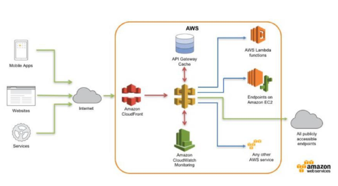

* **클라우드란?**
  
  * **IT 자원을 인터넷 연결을 통해 빌려 쓴다는 개념**❗
  
  * 프로그래밍 방식으로 인프라를 관리
  
  * 유연한 인프라
  
  * 사용하는 만큼 비용을 내는 구조
  
  * 필요한 인프라를 빠르게 구매
  
  * 글로벌 인프라 이용

* **AWS 를 사용하는 방법 3가지**
  
  * **Management Console**
    
    * 사용이 간편
    
    * GUI라 보기가 쉬움
    
    * 사용자 지정 비밀번호로 로그인 가능
  
  * **AWS CLI**
    
    * Linux, macOS 또는 Windows 명령 프로그램에서 실행될 수 있는 유틸리티 묶음을 제공
  
  * **AWS SDK**
    
    * 선호하는 개발 언어 또는 플랫폼으로 AWS 서비스에 액세스하고 관리

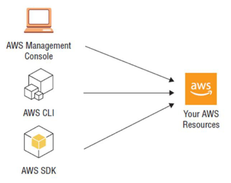

* **AWS 리전**
  
  * **최소 3개의 가용영역으로 구성**되어 있는 AWS 인프라 단위
  
  * 현재 29개의 리전 보유
    
    

* **AWS 가용영역**
  
  * AWS의 데이터센터 모음
  
  * 다른 가용영역 간의 장애로부터 자유로움

* **AWS 엣지 로케이션**
  
  * 리전과 비교했을 때 최종 사용자와 더 가까이 존재하는 글로벌 인프라
  
  * **보안, 가용성, 비용 효율성, 속도 면에서 향상된 성능**
    
    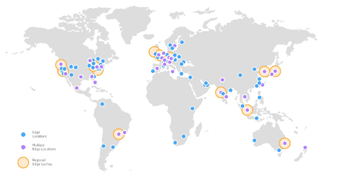

# AWS 기초서비스

* **Amazon Elastic Compute Cloud (EC2)**

* **Virtual Private Cloud (VPC)**
  
  * 실습: 첫 VPC 생성하기 및 웹 서버 배포하기

* **Simple Storage Service (S3)**

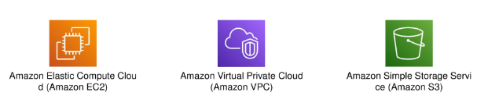

# AWS 네트워크

* **IP 주소:** 인터넷에서 서로 통신하기 위해 부여하는 고유한 주소
  
  * 두 가지 종류: IPv4, IPv6
  
  * 두 가지 종류: 사설 IP, 공인 IP

* **IPv4**
  
  * 총 32 비트로 구성: `2**32 = 4,294,967,296 개`
  
  * 약 6억 개는 예약되어 있음
  
  * *인터넷의 폭발적인 성장으로 인해 가용한 IP 주소가 거의 고갈*
  
  * 128 비트를 사용하는 IPv6가 새로운 표준으로 제안

## ▶ CIDR (Classless Inter Domain Routing)

* VLSM (Variable Length Subnet Mask)

* Network prefix와 Host id 로 구성

* 서브넷 마스크를 `/X` 노테이션을 사용해 표현
  
  * X: 마스크 비트 수
  
  * 예) 255.255.0.0 => /16,255.255.255.0 => /24

* 한 블록 안에서 첫 번째, 마지막 IP는 예약되어 있어 사용 불가
  
  * 첫 번째 IP는 네트워크 자체를 가리키는 IP (호스트 id 비트가 모두 0)
  
  * 마지막 IP는 Broadcast IP

* AWS에서는 총 5개의 Address 를 예약
  
  * **`0: 네트워크 어드레스`, `1: VPC Router`, `2: DNS`, `3: Future use`, `마지막: Broadcast`**

## ▶ VPC (Virtual Private Cloud)

* AWS 클라우드 안의 사용자가 정의한 가상의 네트워크

* VPC 안에서 내 리소스를 생성 가능

* 한 리전 안에 5개까지 생성 가능

* 네트워크를 IP 주소 범위로 격리시킴

* VPC 안에서 서브넷 (프라이빗, 퍼블릭)
  
  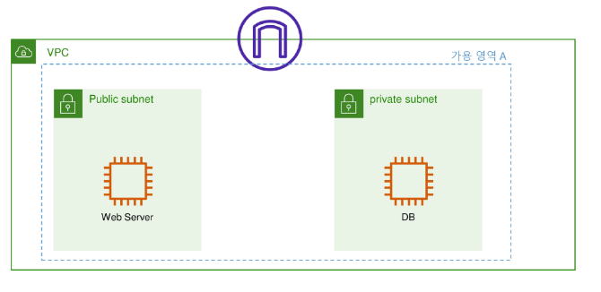

* 서브넷과 가용영역

* VPC 안에서의 보안

* 인터넷 액세스를 허용 여부 (인터넷 게이트웨이)

* **Route table**❓
  
  * 서브넷 또는 게이트웨이의 네트워크 트래픽이 전송되는 위치를 결정하는 라우팅이라는 규칙세트가 포함되어 있음
  
  * 서브넷 단위로 연결 가능. 여러 개의 서브넷에서 동시에 한 개의 라우팅 테이블에 연결 가능
    
    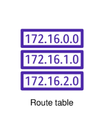

* **Internet Gateway**❓
  
  * 수평 확장되고 가용성이 높은 중복 VPC 구성 요소로, VPC와 인터넷 간에 통신을 하게 해준다.
  
  * 인터넷 게이트웨이를 생성하는 경우 비용이 별도로 발생하지는 않으나, 외부와 인터넷 통신을 원하지 않는 경우 사용하지 않을 수 있다.

* **보안 그룹**❓
  
  * **<u>EC2 혹은 다른 AWS 리소스에 도달하고 나갈 수 있는 트래픽을 제어</u>**
  
  * 포트넘버/프로토콜/소스IP 주소 등을 활용해 트래픽을 제어
    
    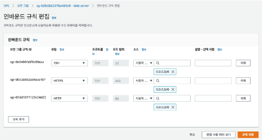

* **NACL**❓
  
  * **네트워크 ACL은 1개 이상의 <u>서브넷 내부와 외부의 트래픽을 제어</u>하기위한 방화벽**
    
    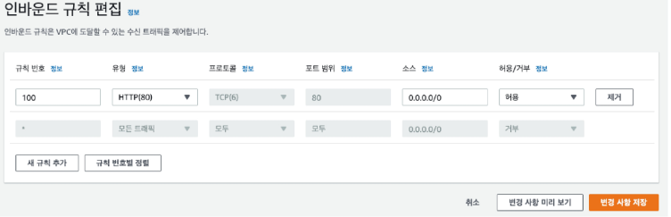

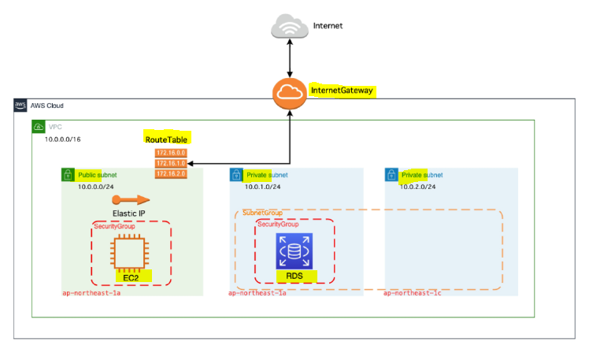

## ▶ AWS EC2

* 컴퓨팅 파워의 규모를 자유자재로 변경할 수 있는 컴퓨팅 서비스

* 새로운 서버 인스턴스 확보 및 부팅 시간을 단축

* Virtual Machine

* Linux 또는 Windows, Ubuntu 등 다양한 OS 지원

* 사용하는 용량만큼 비용 지불

## ▶ AWS EC2 인스턴스 사용 방법

* **인스턴스 시작 → 인스턴스 연결 → 인스턴스 사용**

* **리눅스 (Linux)**
  
  * 컴퓨터 운영 체제의 하나
  
  * 자유 소프트웨어와 오픈 소스 개발의 가장 유명한 표본
  
  * 다중 사용자, 다중 작업(멀티 태스킹), 다중 스레드를 지원하는 네트워크 운영 체제(NOS)이다.

* **리눅스 종류**
  
  * RedHat 계열
    
    * RHEL, CentOS, Fedora ...
  
  * Debian 계열
    
    * Debian, Ubuntu, Mint, Rasbian ...

* **AMI**
  
  * 인스턴스를 시작하는데 필요한 정보를 제공하는 AWS에서 유지/관리되는 이미지 (운영체제, 애플리케이션, 라이브러리 등을 포함)
  
  * AWS 계정을 제어하는 시작 권한
  
  * 시작될 때 연결할 볼륨을 지정하는 블록 디바이스 매핑
  
  * 똑같은 이미지로 수백 수천 개의 인스턴스를 생성

* **EC2가 만들어지는 과정**
  
  * AMI 선택 → OS, 애플리케이션 구성
  
  * VM 실행
  
  * AWS 가용영역에 생성

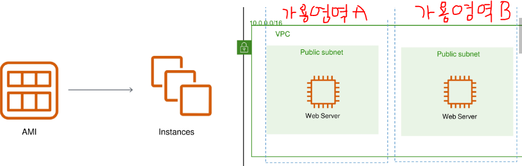

* **Instance Type**
  
  * 인스턴스 패밀리
  
  * 인스턴스 세대
  
  * 인스턴스 속성
  
  * 인스턴스 크기
  
  * t2.micro type 무료 제공
    
    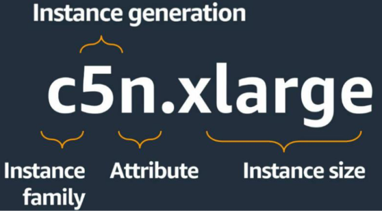

* **같은 인스턴스 패밀리지만, 크기에 따라 <u>vCPU의 크기, 메모리의 크기, 가격</u>이 달라지는 모습**

## ▶ AWS EC2 수명 주기

* `Pending`: 준비중인 상태, 비용이 발생하지 않음. Running 준비 중

* `Running`: 인스턴스가 실행중인 상태로 인스턴스 과금 시작

* `Stopped`: 인스턴스가 중지중인 상태, 비용 과금 X

* `Terminated`: 인스턴스가 영구적으로 삭제된 상태로 다시 시작할 수 없음

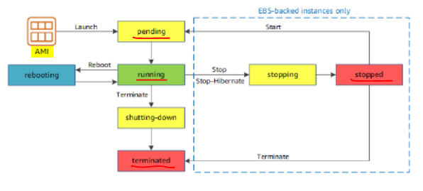

## ▶ Linux 명령어

* `ls` = 현재 폴더 내용

* `pwd` = 현재 폴더 확인

* `cd` = 해당 폴더로 이동

* `cp` = 복사

* `mv` = 이동

* `cat` = 내용 출력

## ▶ vi (text 편집기)

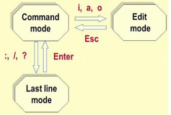

* `:wq` = 저장 후 나가기

* `:q!` = 저장 안하고 나가기

