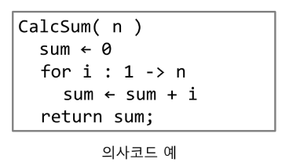
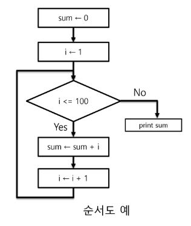
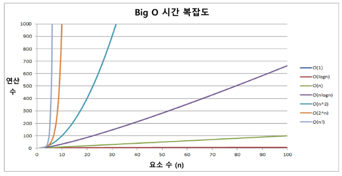
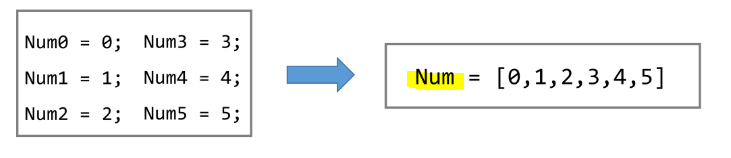

# 알고리즘

> 컴퓨터가 어떤 일을 수행하기 위한 단계적 방법
> 
> **어떤 문제를 해결하기 위한 절차**

## ✅ 알고리즘 표현 방법

1️⃣ **의사코드(Pseudo code)**



2️⃣ **순서도**



## ✅ 좋은 알고리즘이란?

* **정확성 - 얼마나 정확하게 동작하는가?**

* 작업량 - 얼마나 적은 연산으로 원하는 결과를 얻는가? (실행시간과 연관)

* 메모리 사용량 - 얼마나 적은 메모리를 사용하는가?

* 단순성 - 얼마나 단순한가?

* 최적성 - 더 이상 개선할 여지없이 최적화되었는가?

## ✅ 알고리즘의 성능은 어떻게 측정?

* 알고리즘의 작업량은 **시간복잡도(빅-오 표기법)로 표현**한다!

* **시간 복잡도 (Time Complexity)**
  
  * 실제 걸리는 시간을 측정
  
  * 실행되는 명령문의 개수를 계산

* **빅-오(O) 표기법**
  
  * 시간 복잡도 함수 중에서 가장 큰 영향력을 주는 n만 표시
  
  * 계수는 생략하여 표시

* n 이 증가함에 따라 각기 다른 시간복잡도의 알고리즘



# 배열 (Array)

> 일정한 자료형의 변수들을 하나의 이름으로 열거하여 사용하는 자료구조

## ✅ 배열의 필요성

* 프로그램 내에서 여려 개의 변수가 필요할 때, 서로 다른 변수명을 이용하고 접근하는 것은 매우 비효율적

* **배열을 사용하면 하나의 선언을 통해서 둘 이상의 변수를 선언할 수 있다.**
  
  

* 단순히 다수의 변수 선언을 의미하는 것이 아니라, 다수의 변수로 하기 힘든 작업을 배열을 통해 쉽게 할 수 있다.

## ✅ 1차원 배열

* 선언
  
  `Arr = [1, 2, 3]`  `Arr = [0] * 10`

* 접근 - **index를 통해 원하는 값을 저장**
  
  `Arr[idx] = 20` / `Arr[idx]` 는 변수의 역할도 한다.

# 정렬 (sort)

> 2개 이상의 자료를 특정 기준에 의해 오름차순 혹은 내림차순으로 재배열하는 것

* 키 - 자료를 정렬하는 기준이 되는 특정 값

## ✅ Bubble Sort

> 인접한 두 개의 원소를 비교하며 자리를 계속 교환하는 방식

* 정렬 과정
  
  * 첫 번째 원소부터 인접한 원소끼리 계속 자리를 교환하면서 맨 마지막 자리까지 이동
  
  * 한 단계가 끝나면 가장 큰 원소가 마지막 자리로 정렬된다. (반대의 경우 가장 작은 원소가 맨 앞자리로 정렬된다.)

* **시간복잡도 = O(n\*\*2)**

* 배열을 활용한 bubble sort

```python
def BubbleSort(a, N):            # 정렬할 List, N 원소 수
    for i in range(N-1, 0, -1):  # 범위의 끝
        for j in range(0, i):
            if a[j] > a[j+1]:
                a[j], a[j+1] = a[j+1], a[j]
```

## ✅ Counting Sort

> 항목들의 순서를 결정하기 위해 집합에 각 항목이 몇 개씩 있는지 세는 작업
> 
> **선형 시간에 정렬하는 효율적인 알고리즘**

* 제한 사항
  
  * <mark>**정수나 정수로 표현할 수 있는 자료에 대해서만 적용 가능**</mark>
  
  * 카운트들을 위한 충분한 공간을 할당하려면 **집합 내의 가장 큰 정수를 알아야 한다.**

* **시간 복잡도 = O(n + k)**
  
  * n은 리스트의 길이, k는 정수의 최대값

* 정렬 과정
  
  * data에서 각 항목들의 발생 회수를 세고, 정수 항목들로 직접 인덱스되는 카운트 배열 counts에 저장한다.
  
  * 정렬된 집합에서 각 항목의 앞에 위치할 항목의 개수를 반영하기 위해 counts의 원소를 조정 = **이전의 합을 현재 값과 더하여 누적 합으로 적용**
  
  * data에 맨 마지막 값을 감소시키고 Temp(원본과 같은 크기)에 삽입한다.

```python
def Counting_Sort(A, B, k):

    C = [0] * (k+1)                # 원소의 최대값까지를 인덱스로 사용하기 위
    for i in range(0, len(A)):
        C[A[i]] += 1               # C 에 숫자별 개수가 저장

    for i in range(1, len(C)):     # 누적합 값으로 갱신하기 위함
        C[i] += C[i-1]

    for i in range(len(B)-1, -1, -1):
        C[A[i]] -= 1               # 누적합 배열에서 해당 숫자를 -1
        B[C[A[i]]] = A[i]          # B는 C의 값을 인덱스로 A의 값을 넣으면 정렬됨!
```

#### 📌 비교

| 알고리즘          | 평균 수행시간 | 최악 수행시간 | 알고리즘 기법 | 비고        |
|:-------------:|:-------:|:-------:|:-------:|:---------:|
| bubble sort   | O(n**2) | O(n**2) | 비교와 교환  | 코딩이 가장 쉽다 |
| counting sort | O(n+k)  | O(n+k)  | 비교환 방식  | n이 작을 때만  |

# Exaustive Search (완전 검색)

> 문제의 해법으로 생각할 수 있는 **모든 경우의 수를 나열해보고 확인하는 기법**
> 
> **Brute-force or generate-and-test 기법**이라고도 불린다.

* 모든 경우의 수를 테스트한 후, 최종 해법을 도출한다.

* **경우의 수가 상대적으로 작을 때 유용**

* **수행 속도는 느리지만 해답을 찾아내지 못할 확률은 작다.**

* 문제를 풀 때, 우선 완전 검색으로 접근하여 해답을 도출한 후 성능 개선을 위해 다른 알고리즘을 사용하고 해답을 확인하는 것이 바람직

## ✅ 순열 (Permutation)

* 서로 다른 것들 중 몇 개를 뽑아서 한 줄로 나열하는 것

* nPr = 서로 다른 n개 중 r개를 택하는 순열
  
  * nPr = n * (n-1) * (n-2) * ... * (n-r+1)
  
  * nPn = n! = n * (n-1) * (n-2) * ... * 2 * 1

* 순열 생성법

```python
for i1 in range(1, 4):
    for i2 in range(1, 4):
        if i2 != i1:
            for i3 in range(1, 4):
                if i3 != i1 and i3 != i2:
                    print(i1, i2, i3)
```

# Greedy Algorithm (탐욕 알고리즘)

> 최적해를 구하는 데 사용되는 근시안적인 방법

* **여러 경우 중 하나를 결정해야 할 때마다 그 순간에 최적이락 생각되는 것을 선택해 나가는 방식을 진행하여 최종적인 해답에 도달**

* **각 선택의 시점에서 이루어지는 결정은 지역적으로 최적이지만, 그 선택들을 계속 수집하여 최종적인 해답을 만들었다고 하여, 그것이 최적이라는 보장은 없다.**

* 동작 과정
  
  * 1️⃣ **해 선택 - 현재 상태에서 부분 문제의 최적 해를 구한다. (이를 부분해 집합에 추가)**
  
  * 2️⃣ **실행 가능성 검사 - 새로운 부분해 집합이 실행 가능한지 확인**
  
  * 3️⃣ **해 검사 - 새로운 부분해 집합이 문제의 해가 되는지 확인 (전체 문제의 해가 완성되지 않았다면 1의 해 선택부터 다시 진행)**
