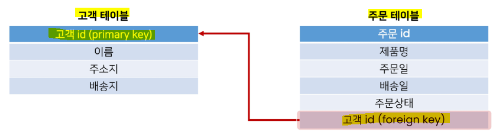
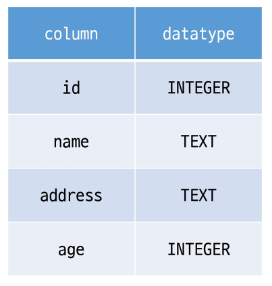
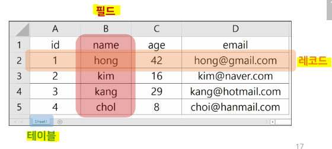
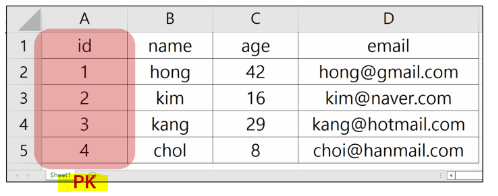
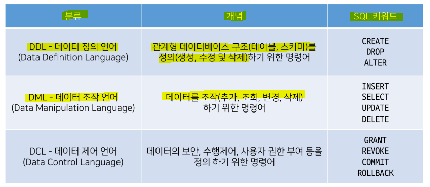
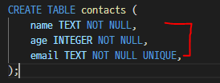
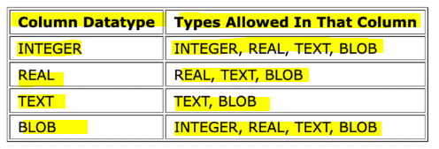
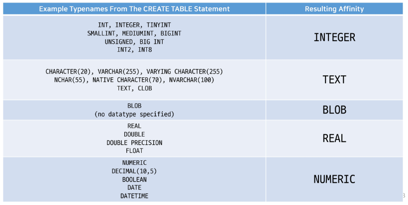
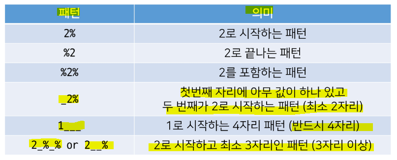

# Database

## ▶ 데이터베이스의 등장

### ✔ 파일을 이용한 데이터 관리

> **일반적으로 데이터를 파일에 저장함**

* **장점**
  
  * **운영체제에 관계없이 어디에서나 쉽게 사용 가능**
  
  * 이메일이나 메신저를 이용해 간편하게 전송 가능

* **단점**
  
  * 성능과 보안적 측면에서 한계가 명확
  
  * **대용량 데이터를 다루기에 부적합**
  
  * **데이터를 구조적으로 정리하기 어려움**
  
  * 확장이 불가능한 구조

### ✔ 스프레드 시트를 이용한 데이터 관리

> **스프레드 시트(엑셀 시트)를 사용**

* 스프레드 시트는 **컬럼(열)을 통해 데이터의 유형을 지정하고 레코드(행)을 통해 구체적인 데이터 값을 포함**

* 스프레드 시트 자체를 데이터베이스라고 부를 수는 없음

### ✔ 데이터베이스

> **스프레드 시트와 달리 프로그래밍 언어를 사용해 작동시킴**

* 가장 많이 쓰이는 유형은 `RDB(Relational Database)`라고 부르는 **관계형 데이터베이스**

* **RDB는 각각의 데이터를 테이블에 기입함(스프레드 시트에 작성하는 것과 동일)**

* 스프레드시트 파일 모음을 관계형 RDB라고 생각할 수 있음

## ▶ Database 정의

> 체계화된 데이터의 모임

* **여러 사람이 공유하고 사용할 목적으로 통합 관리되는 정보의 집합**

* 검색, 구조화 같은 작업을 보다 쉽게 하기 위해 조직화된 데이터를 수집하는 저장 시스템
  
  * 내용을 고도로 구조화 함으로써 **검색과 갱신의 효율화를 꾀한 것**
  
  * 즉, 자료 파일을 조직적으로 통합하여 **자료 항목의 중복을 없애고 구조화하여 기억시켜 놓은 자료의 집합체**

* Database를 조작하는 프로그램 = `DBMS(Database Management System)`
  
  * Oracle, MySQL, SQLite 등이 모두 DBMS
  
  * **DMBS에서 database를 조작하기 위해 사용하는 언어를 SQL이라 함**

# RDB (Relational Databse)

> 관계형 데이터베이스

* **데이터를 테이블, 행, 열 등으로 나누어 구조화 하는 방식**

* **자료를 여러 테이블로 나누어서 관리하고, 이 테이블간 관계를 설정해 여러 데이터를 쉽게 조작할 수 있다는 장점**

* SQL을 사용하여 데이터를 조회하고 조작

### 📌 테이블간 관계 설정 예시

* 고객 테이블에서 고객 ID는 고객이 관계형 데이터베이스에서 고유하게 식별되는 기본 키

* **주문 테이블에서 특정 주문을 식별하는 기본 키는 주문 ID**
  
  * <mark>**외래 키를 사용하여 고객 테이블의 고객 ID를 연결하여 고객을 주문과 연결 가능**</mark>

* **이 관계를 통해 특정 날짜에 구매한 모든 고객에 관한 정보를 조회하거나 지난 달에 배송일이 지연된 주문을 받은 고객을 파악할 수 있음**

## ▶ RDB 기본 구조

* **스키마**
  
  * **테이블의 구조**
  
  * 데이터베이스에서 자료의 구조, 표현 방법, 관계 등 전반적인 명세를 기술
    
    

* **테이블** - 필드와 레코드를 사용해 조직된 데이터 요소들의 집합 (관계라고도 부름)
  
  
  
  * **필드 - 속성, 컬럼**
  
  * **레코드 - 튜플, 행**
  
  * **기본 키(PK, Primary Key)**
    
    * **각 레코드의 고유한 값 (각각의 데이터를 구분할 수 있음)**
    
    * 기술적으로 다른 항목과 절대로 중복될 수 없는 단일 값(unique)

## ▶ 관계형 데이터베이스의 이점

* **데이터를 직관적으로 표현할 수 있음**

* **관련한 각 데이터에 쉽게 접근할 수 있음**

* **대량의 데이터도 효율적으로 관리 가능**

## ▶ RDBMS

> Relational Database Management System, 관계형 데이터베이스 관리 시스템

* 관계형 데이터베이스를 만들고 업데이트하고 관리하는 데 사용하는 프로그램

### 📌 SQLite

> 응용 프로그램에 파일 형식으로 넣어 사용하는 비교적 가벼운 데이터베이스

* 안드로이드, iOS, macOS에 기본적으로 탑재되어 있으며 임베디드 소프트웨어에서도 많이 활용됨

* 오픈 소스 프로젝트이기 때문에 자유롭게 사용 가능

* 단점
  
  * **대규모 동시 처리 작업에는 적합하지 않음**
  
  * 다른 RDBMS에서 지원하는 SQL 기능을 지원하지 않을 수 있음

# SQL

> Structured Query Language
> 
> 데이터베이스와 상호작용하는 방법

* RDBMS의 데이터를 관리하기 위해 설계된 특수 목적의 프로그래밍 언어

* **RDBMS에서 데이터베이스 스키마를 생성 및 수정할 수 있으며, 테이블에서의 자료 검색 및 관리도 할 수 있음**

* **데이터베이스 객체에 대한 처리를 관리하거나 접근 권한을 설정하여 허가된 사용자만 RDBMS를 관리할 수 있도록 할 수 있음**

## ▶ SQL commands 종류

* 1️⃣ **DDL (Data Definition Language)**

* 2️⃣ **DML (Data Manipulation Language)**

* 3️⃣ **DCL (Data Control Language)**

📍 **SQLite는 파일로 관리되는 DB**이기 때문에 SQL을 이용한 접근 제한이 아닌 운영 체제의 파일 접근 권한으로만 제어 가능 = 즉, SQLite에서 GRANT, REVOKE는 지원하지 않음❗

## ▶ SQL Syntax

* 모든 SQL 문은 `SELECT`, `INSERT`, `UPDATE` 등과 같은 키워드로 시작하고 하나의 statement는 **세미콜론(`;`)으로 끝남**

* **SQL 키워드는 대소문자를 구분하지 않음**
  
  * 대문자로 작성하는 것을 권장

### 📌 Statement & Clause

* **Statement (문)**
  
  * **독립적으로 실행할 수 있는 완전한 코드**
  
  * **statement는 clause로 구성**

* **Clause (절)**
  
  * statement 의 하위 단위
    
    * ① SELECT column_name
    
    * ② FROM table_name

`SELECT column_name FROM table_name;`

# DDL

> 테이블 구조를 관리

* `CREATE`, `ALTER`, `DROP`

## ▶ CREATE TABLE

> **데이터베이스에 새 테이블을 만든다**

* 구문 - `CREATE TABLE <table's name>`
  
  * **테이블 생성 및 컬럼 정의(스키마)**
    
    

* **Query 실행하기**
  
  * 실행하고자 하는 명령문에 커서를 두고 마우스 우측 버튼
    
    * `Run Selected Query` 선택

* **쿼리 실행 후 테이블 및 스키마 확인**
  
  * id 컬럼은 직접 기본키 컬럼을 정의하지 않으면 **<mark>자동으로 rowid라는 컬럼 생성</mark>**

# SQLite Data Types

## ▶ Data Types 종류

* 1️⃣ `NULL`
  
  * **NULL value**
  
  * 정보가 없거나 알 수 없음을 의미

* 2️⃣ `INTEGER`
  
  * **정수**
  
  * 크기에 따라 0, 1, 2, 3, 4, 6 또는 8바이트와 같은 가변 크기를 가짐

* 3️⃣ `REAL`
  
  * **실수**
  
  * 8바이트 부동 소수점을 사용하는 10진수 값이 있는 실수

* 4️⃣ `TEXT`
  
  * **문자 데이터**

* 5️⃣ `BLOB` (Binary Large Object)
  
  * 입력된 그대로 저장된 데이터 덩어리 (대용 타입 없음)
  
  * 바이너리 등 **멀티미디어 파일**
  
  * **예) 이미지 데이터**

### 📌 Boolean type

* **SQLite 에는 별도의 Boolean 타입이 없음**

* **대신 Boolean 값은 정수 0(False)과 1(True)로 저장됨**

### 📌 Date & Time Datatype

* **SQLite에는 날짜 및 시간을 저장하기 위한 타입이 없음**

* 대신 SQLite의 built-in "`Date And Time Functions`"으로 `TEXT`, `REAL` 또는 `INTEGER` 값으로 저장할 수 있음

### 📌 Binary Data

* **데이터의 저장과 처리를 목적으로 0과 1의 이진 형식으로 인코딩된 파일**

* 기본적으로 컴퓨터의 모든 데이터는 binary data
  
  * **필요에 따라서 텍스트 타입으로 변형해서 사용하는 것**

## ▶ 데이터 타입을 결정하는 SQLite 규칙

* **값에 둘러싸는 따옴표와 소수점 또는 지수가 없으면 - `INTEGER`**

* **값이 작은 따옴표나 큰따옴표로 묶이면 - `TEXT`**

* **값에 따옴표나 소수점, 지수가 없으면 - `REAL`**

* **값이 따옴표 없이 NULL 이면 - `NULL`**

## ▶ SQLite Datatypes 특징

* SQLite 는 다른 모든 SQL 데이터베이스 엔진(MySQL, PostgreSQL 등)의 정적이고 엄격한 타입(static, rigid)이 아닌 **<mark>동적 타입 시스템(dynamic type system)을 사용</mark>**
  
  * 컬럼에 선언된 데이터 타입에 의해서가 아니라 **<mark>컬럼에 저장된 값에 따라 데이터 타입이 결정됨</mark>**

* 테이블을 생성할 때 컬럼에 대해 특정 데이터 타입을 선언하지 않아도 됨
  
  * 예) 동일한 컬럼에 정수 1을 넣을 경우, `INTEGER`로 타입이 지정되고 문자 '1'을 넣을 경우에는 `TEXT` 타입으로 지정

* 동적 타입 시스템을 사용하기에 기존의 엄격하게 타입이 지정된 데이터베이스에서는 불가능한 작업을 유연하게 수행할 수 있음

* **다른 데이터베이스와의 호환성 문제가 있기 때문에 <mark>테이블 생성 시 데이터 타입을 지정하는 것을 권장</mark>**

* 데이터 타입을 지정하게 되면 SQLite는 입력된 데이터의 타입을 지정된 데이터 타입으로 변환
  
  * 허용 가능한 타입 변환(자동 형변환)

### 📌 "static, rigid typing" 데이터베이스

* **저장되는 값의 데이터 타입은 컬럼에 선언된 데이터 타입에 의해 결정**

* 예)
  
  * `CREATE TABLE my_table (a INTEGER NOT NULL, b TEXT NOT NULL);`
  
  * 만약 a 컬럼에 '123', b 컬럼에 456 데이터를 삽입하려는 경우 **삽입을 수행하기 전에 문자열 '123'을 정수 123으로 변환하고, 정수 456을 문자열 '456'으로 변환**

## ▶ Type Affinity

> 타입 선호도

* **특정 컬럼에 저장된 데이터에 권장되는 타입**

* SQLite의 5가지 데이터 타입이 아닌 다른 데이터 타입을 선언한다면, 내부적으로 각 타입의 지정된 선호도에 따라 5가지 선호도로 인식됨

* 타입 선호도 존재 이유❓
  
  * **<mark>다른 데이터베이스 엔진 간의 호환성 최대화</mark>**
  
  * 정적이고 엄격한 타입을 사용하는 데이터베이스의 SQL문을 SQLite에서도 작동하도록 하기 위함

## ▶ Constraints - 제약조건

> 입력하는 자료에 대해 제약을 정함

* 제약이 맞지 않다면 입력이 거부된다.

* 사용자가 원하는 조건의 데이터만 유지하기 위한 즉, 데이터의 무결성을 유지하기 위한 보편적인 방법으로 테이블의 특정 컬럼에 설정하는 제약

* **데이터 무결성**
  
  * **데이터베이스 내의 데이터에 대한 정확성, 일관성을 보장하기 위해 데이터 변경 혹은 수정 시 여러 제한을 두어 데이터의 정확성을 보증**
  
  * 무결성이란 데이터의 정확성, 일관성을 나타낸다.
  
  * 데이터 베이스에 저장된 데이터의 무결성을 보장하고 데이터베이스의 상태를 일관되게 유지하는 것이 목적

## ▶ Constraints 종류

* 1️⃣ `NOT NULL`
  
  * 컬럼이 NULL 값을 허용하지 않도록 지정

* 2️⃣ `UNIQUE`
  
  * 컬럼의 모든 값이 서로 구별되거나 고유한 값이 되도록 함

* 3️⃣ `PRIMARY KEY`
  
  * 테이블에서 행의 고유성을 식별하는 데 사용되는 컬럼
  
  * **각 테이블에는 하나의 기본 키만 존재**
  
  * 암시적으로 `NOT NULL` 제약 조건이 포함
  
  * **INTEGER 타입에만 사용 가능**❗

* 4️⃣ `AUTOINCREMENT`
  
  * **사용되지 않은 값이나 이전에 삭제된 행의 값을 재사용하는 것을 방지**
  
  * INTEGER PRIMARY KEY 다음에 작성하면 해당 rowid를 재사용하지 못함❗

## ▶ rowid의 특징

> **테이블을 생성할 때마다 rowid 라는 암시적 자동 증가 컬럼이 자동으로 생성됨**

* **테이블에 새 행을 삽입할 때마다 정수 값을 자동으로 할당**
  
  * **값은 1에서 시작**
  
  * 데이터 삽입 시에 INTEGER PRIMARY KEY 컬럼에 명시적으로 값이 지정되지 않는 경우, SQLite는 테이블에서 가장 큰 rowid보다 하나 큰 다음 순차 정수를 자동으로 할당 (AUTOINCREMENT와 관계없음)

* **만약 INTEGER PRIMARY KEY 키워드를 가진 컬럼을 직접 만들면 이 컬럼은 rowid 컬럼의 별칭이 됨**
  
  * **새 컬럼 이름으로 rowid에 액세스 가능하며, rowid 이름으로도 여전히 액세스 가능**

* **데이터가 최대값에 도달하고 새 행을 삽입하려고 하면 SQLite는 사용되지 않는 정수를 찾아서 사용**

* 만약 SQLite가 사용되지 않은 정수를 찾을 수 없으면 `SQLITE_FULL` 에러 발생
  
  * 일부 행을 삭제하고 새 행을 삽입하면 SQLite는 삭제된 행에서 rowid 값을 재사용하려고 시도

# ALTER TABLE

> 기존 테이블의 구조를 수정(변경)

* 변경 가능한 사항
  
  * **Rename a table - <mark>테이블명 변경</mark>**
    
    * **`ALTER TABLE <table_name> RENAME TO <new_table_name>;`**
  
  * **Rename a column - <mark>컬럼명 변경</mark>**
    
    * **`ALTER TABLE <table_name> RENAME COLUMN <column_name> TO <new_column_name>;`**
  
  * **Add a new column to a table - <mark>테이블 내 새로운 컬럼 생성</mark>**
    
    * **`ALTER TABLE <table_name> ADD COLUMN <column_definition>;`**
  
  * **Delete a column - <mark>컬럼 삭제</mark>**
    
    * **`ALTER TABLE <table_name> DROP COLUMN <column_name>;`**

* **만약 테이블에 기존 데이터가 있을 경우 다음과 같은 에러가 발생!**
  
  `Cannot add NOT NULL column with default value NULL`
  
  * **이전에 이미 저장된 데이터들은 새롭게 추가되는 컬럼에 값이 없기 때문에 NULL 이 작성됨**
  
  * 새로 추가되는 컬럼에 NOT NULL 제약 조건이 있기 때문에 기본값 없이는 추가될 수 없다는 에러가 발생한 것
  
  * **DEFAULT 제약 조건을 사용하여 해결 가능**

* **삭제하지 못하는 경우 있음**❗
  
  * **컬럼이 다른 부분에서 참조(관계)되는 경우**
    
    * **외래 키(FOREIGN KEY) 제약 조건에서 사용되는 경우**
  
  * **PRIMARY KEY인 경우**
  
  * **UNIQUE 제약 조건이 있는 경우**

### 📌 DEFAULT 제약 조건

* column 제약 조건 중 하나

* 데이터를 추가할 때 값을 생략할 경우 기본 값으로 설정함

# DROP TABLE

> **데이터베이스에서 테이블을 제거**

* **`DROP TABLE new_contacts;`**

* **존재하지 않는 테이블을 제거하면 SQLite 에서 오류가 발생**

## ▶ 특징

* **한 번에 하나의 테이블만 삭제할 수 있음**
  
  * **여러 테이블을 제거하려면 여러 DROP TABLE 문을 실행해야 함**

* DROP TABLE 문은 실행 취소하거나 복구할 수 없음❗

# DML

> DML을 통해 데이터를 조작하기 (CRUD)

* `INSERT`(Create), `SELECT`(Read), `UPDATE`, `DELETE`

### 📌 sqlite3 사용하기

* 데이터베이스 파일 열기
  
  * `.open <file_name.splite3>`

* sqlite3 종료하기
  
  * `.exit`

* import 명령어를 사용하여 csv 데이터를 테이블로 가져오기
  
  * `.import <file_name.csv> <table_name>`

# Simple Query

> **SELECT 문을 사용하여 간단하게 단일 테이블에서 데이터를 조회**

## ▶ SELECT statement

* 특정 테이블에서 데이터를 조회하기 위해 사용

* **`SELECT column1, column2 FROM <table_name>;`**

* 문법 규칙
  
  * 1️⃣ **SELECT 절에서 컬럼 또는 쉼표로 구분된 컬럼 목록을 지정**
  
  * 2️⃣ **FROM 절에서 데이터를 가져올 테이블을 지정**

## ▶ Sorting rows

> **ORDER BY 절을 사용하여 쿼리의 결과를 정렬**

* SELECT 문에 추가하여 결과를 정렬

* **`SELECT select_list FROM table_name ORDER BY column_1 ASC, column_2 DESC;`**

* **<mark>ORDER BY 절은 FROM 절 뒤에 위치</mark>**

* 두 개 이상의 컬럼을 정렬할 때는 먼저 나오는 열 먼저, 기준에 따라 정렬한 다음 다른 열 기준으로 정렬한다.

* 하나 이상의 컬럼을 기준으로 결과를 오름차순, 내림차순으로 정렬 가능
  
  * `ASC` - 오름차순 (기본값)
  
  * **`DESC` - 내림차순**

### 📌 Sorting NULLs

> **NULL 의 정렬 방식**

* **정렬과 관련하여 SQLite는 <mark>NULL 을 다른 값보다 작은 것으로 간주</mark>**

* 즉, `ASC`를 사용하는 경우 결과의 시작 부분에 NULL 이 표시되고, `DESC`를 사용하는 경우 결과의 끝에 NULL 이 표시

## ▶ Filtering data

> **데이터를 필터링하여 중복 제거, 조건 설정 등 쿼리를 제어**

### ✔ DISTINCT

> **조회 결과에서 중복된 행을 제거**

* **`SELECT DISTINCT select_list FROM table_naem;`**

* DISTINCT 절은 SELECT 에서 선택적으로 사용할 수 있는 절

* 문법 규칙
  
  * 1️⃣ **DISTINCT 절은 SELECT 키워드 바로 뒤에서 사용**
  
  - 2️⃣ DISTINCT 키워드 뒤에 컬럼 또는 컬럼 목록을 작성

### 📌 NULL with DISTINCT

* SQLite는 **<mark>NULL 값을 중복으로 간주</mark>**

* NULL 값이 있는 컬럼에 DISTINCT 절을 사용하면 SQLite 는 NULL 값의 한 행을 유지

### ✔ WHERE

> **조회 시 특정 검색 조건을 지정**

* **`SELECT column_list FROM table_name WHERE search_condition;`**

* WHERE 절은 SELECT 문에서 선택적으로 사용할 수 있음

* **FROM 절 뒤에 작성**

* SQLite 는 **Boolean 데이터 타입을 제공하지 않으므로 1은 TRUE, 0은 FALSE 를 의미**

### ✔ LIKE

> **패턴 일치를 기반으로 데이터를 조회**

* SELECT, DELETE, UPDATE 문의 WHERE 절에서 사용

* **기본적으로 대소문자를 구분하지 않음**
  
  * 'A' LIKE 'a' 는 True

* **두 개의 와일드카드 제공**
  
  * 1️⃣ `%` (percent) - **0개 이상의 문자가 올 수 있음을 의미**
    
    * `영%` - 영, 영미, 영미리 등 **영으로 시작하는 모든 문자열과 일치**
    
    * `%도` - 도, 수도, 경기도 등
    
    * `%강원%` - 강원, 강원도, 강원도에 살아요 등
  
  * 2️⃣ `_` (underscore) - **단일(1개) 문자가 있음을 의미**
    
    * `영_` - 영미, 영수, 영호 등 **영으로 시작하고 총 2자리인 문자열과 일치**
    
    * `_도` - 수도, 과도 등 **도로 끝나고 총 2자리인 문자열과 일치**

### 📌 wildcards character

> 파일을 지정할 때 구체적인 이름 대신에 **여러 파일을 동시에 지정할 목적으로 사용하는 특수 기호**

* `*`, `?`, `%`, `_` 등

* 주로 특정한 패턴이 있는 문자열 혹은 파일을 찾거나 긴 이름을 생략할 때 쓰임

* **<mark>유사하지만 동일한 데이터가 아닌 여러 항목을 찾기에 매우 편리한 문자</mark>**

### ✔ IN

> **찾고자 하는 값이 목록 결과에 있는 값과 일치하는지 확인**

* **일치하는지 여부에 따라 true / false 를 반환**

* 반대로 `NOT IN` 연산자도 사용 가능

### ✔ BETWEEN

> **값이 해당 범위에 있는지 확인**

* **지정된 범위에 값이 있으면 true 반환**

* SELECT, DELETE, UPDATE 문의 WHERE 절에서 사용

* `NOT BETWEEN` 연산자도 사용 가능

### ✔ LIMIT

> **쿼리에서 반환되는 행 수를 제한**

* SELECT 문에서 선택적으로 사용 가능

### ✔ OFFSET keyword

* **`LIMIT` 절은 첫 번째 데이터부터 지정한 수 만큼의 데이터를 받아옴**

* **`OFFSET` 과 함께 사용하면 특정 지정된 위치에서부터 데이터를 조회할 수 있음**

* **`SELECT rowid, name FROM users LIMIT 10 OFFSET 10;`** - 11~20 까지 조회

## ▶ Grouping data

### ✔ GROUP BY

> **특정 그룹으로 묶인 결과를 생성**

* **선택된 컬럼 값을 기준으로 데이터(행)들의 공통 값을 묶어서 결과로 나타냄**

* SELECT 문에서 선택적으로 사용 가능

* **SELECT 문의 FROM 절 뒤에 작성**
  
  * **<mark>WHERE 절이 포함된 경우 WHERE 절 뒤에 작성해야 함</mark>**

* 각 그룹에 대해 MIN, MAX, SUM, COUNT, AVG 등과 같은 **집계 함수를 적용 가능**

### 📌 Aggregate function

> 집계 함수 - 최대값, 최소값, 평균, 합계, 개수 등을 계산

* 제공하는 함수 목록 - `AVG()`, `COUNT()`, `MAX()`, `MIN()`, `SUM()`

* 숫자를 기준으로 계산이 되어져야 하기 때문에 반드시 컬럼의 데이터 타입이 숫자(INTEGER)일 때만 사용 가능

* `COUNT()` 는 어떤 칼럼을 넣어도 결과가 같음 = 전체 개수는 동일하기 때문❗

## ▶ Changing data

> 데이터를 삽입, 수정, 삭제하기

### ✔ INSERT

* **새 행을 테이블에 삽입**

* **`INSERT INTO <table_name> (column1, column2...) VALUES (value1, value2...);`**

* **`INSERT INTO <table_name> VALUES (value1, value2...);`**

* 문법 규칙
  
  * 1️⃣ 먼저 INSERT INTO 키워드 뒤에 데이터를 삽입할 테이블의 이름을 지정
  
  * 2️⃣ 테이블 이름 뒤에 쉼표로 구분된 컬럼 목록을 추가
  
  * 3️⃣ VALUES 키워드 뒤에 쉼표로 구분된 값 목록을 추가
    
    * **만약 컬럼 목록을 생략하는 경우 값 목록의 모든 컬럼에 대한 값을 지정해야 함**❗
    
    * **값 목록의 값 개수는 컬럼 목록의 컬럼 개수와 동일해야 함**

### ✔ UPDATE

> **테이블에 있는 기존 행의 데이터를 업데이트**

* 문법 규칙
  
  * 1️⃣ UPDATE 절 이후에 업데이트할 테이블을 지정
  
  * 2️⃣ **SET 절에서 테이블의 각 컬럼에 대해 새 값을 설정**
  
  * 3️⃣ WHERE 절의 조건을 사용하여 업데이트할 행을 지정
    
    * **WHERE 절은 선택 사항이지만, 생략하면 UPDATE 문은 테이블의 모든 행에 있는 데이터를 업데이트 함**❗
  
  * 4️⃣ `ORDER BY` 및 `LIMIT` 절을 사용하여 업데이트할 행 수를 지정할 수도 있음

* **`UPDATE <table_name> SET <column_1> = new_value_1, ... WHERE search_condition;`**

### ✔ DELETE

> **테이블에서 행을 제거**

* **테이블의 한 행, 여러 행 및 모든 행을 삭제할 수 있음**

* **`DELETE FROM <table_name> WHERE search_condition;`**

* 문법 규칙
  
  * 1️⃣ DELETE FROM 키워드 뒤에 행을 제거하려는 테이블의 이름을 지정
  
  * 2️⃣ WHERE 절에 검색 조건을 추가하여 제거할 행을 식별
    
    * **WHERE 절은 선택 사항이며, 생략하면 DELETE 문은 테이블의 모든 행을 삭제**❗
  
  * 3️⃣ 선택적으로 `ORDER BY` 및 `LIMIT` 절을 사용하여 삭제할 행 수를 지정할 수도 있음

