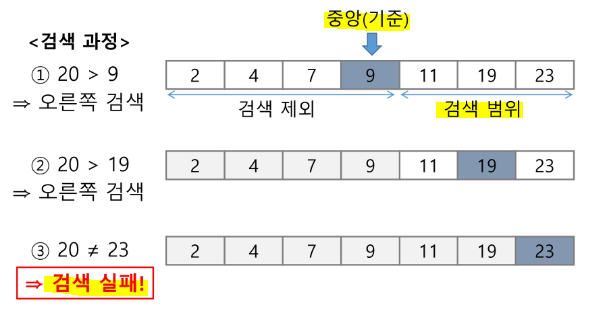

# 분할 정복(Divide & Conquer)

> 문제 제시: 가짜 동전 찾기

* n 개의 동전들 중에 가짜 동전이 하나 포함되어 있다. 가짜 동전은 진짜 동전에 비해 조금 가볍다. 양팔 저울을 최소로 사용해서 가짜 동전을 찾는 방법은?

* 예) 동전이 24개(진짜 23개, 가짜 1개)가 있다면?
  
  * 12개씩 반으로 나눠서 저울 활용

## ▶ 전략

* 분할 - 해결할 문제를 여러 개의 작은 부분으로 나눈다.

* 정복 - 나눈 작은 문제를 각각 해결한다.

* 통합 - 해결된 해답을 모은다.

* Top-down 접근


## ▶ 거듭 제곱

* 반복 알고리즘: O(n)


* 분할 정복 기반의 알고리즘: O(log N)


## ▶ 병합 정렬(Merge Sort)

> 여러 개의 정렬된 자료의 집합을 병합하여 한 개의 정렬된 집합으로 만드는 방식

* 분할 정복 알고리즘 활용
  
  * 자료를 최소 단위의 문제까지 나눈 후에 차례대로 정렬하여 최종 결과를 얻어냄
  
  * top-down 방식

* **시간 복잡도 = O(n log n)**

* **병합 정렬 과정**
  
  * {69, 10, 30, 2, 16, 8, 31, 22}를 병합 정렬
  
  * **분할 단계** - 전체 자료 집합에 대하여, **최소 크기의 부분집합이 될 때까지 분할 작업을 계속 진행함**
    
    
  
  * **병합 단계** - **2개의 부분집합을 정렬하면서 하나의 집합으로 병합**
  
  * 8개의 부분집합이 1개로 병합될 때까지 반복함
    
    

* 분할 과정

```python

```

* 병합 과정

```python

```

# 퀵 정렬

> 주어진 배열을 두 개로 분할하고, 각각을 정렬한다.

## 📌 병합 정렬과 다른점

* 병합 정렬은 그냥 두 부분으로 나누는 반면에, 퀵 정렬은 분할할 때 기준 아이템 중심으로, 그보다 작은 것은 왼편, 큰 것은 오른편에 위치시킨다.

* 각 부분 정렬이 끝난 후, 병합정렬은 '병합'이라는 후처리 작업이 필요하나, 퀵 정렬은 필요하지 않다.

* 알고리즘

```python
def quickSort(A[], l, r):
    if l < r:
        s = partition(a, l, r)    # pivot
        quickSort(A[], l, s-1)
        quickSort(A[], s+1, r)
```

```python
# Hoare-Partition 알고리
```

## ▶ 아이디어

* P(피봇) 값들 보다 큰 값은 오른쪽, 작은 값들은 왼쪽 집합에 위치


* 피봇을 두 집합의 가운데에 위치


* 피봇 선택 - 왼쪽 끝/오른쪽 끝/임의의 세 개 값 중에 중간 값 = 원하는 대로 설정 가능


* pivot 자리 정한 후 좌측과 우측 구간에 대해 quickSort 재진행!


* `Lomuto Partition` 알고리즘

```python

```

# 이진 검색 (Binary Search)

> 자료의 가운데에 있는 항목의 키 값과 비교하여 다음 검색의 위치를 결정하고 검색을 계속 진행하는 방법

* 목적 키를 찾을 때까지 이진 검색을 순환적으로 반복 수행함으로써 검색 범위를 반으로 줄여가면서 보다 빠르게 검색을 수행

* 이진 검색을 하기 위해서는 자료가 정렬된 상태여야 한다.

* 검색 과정
  
  * 1️⃣ 자료의 중앙에 있는 원소를 고른다.
  
  * 2️⃣ 중앙 원소의 값과 찾고자 하는 목표 값을 비교
  
  * 3️⃣ 목표 값이 중앙 원소의 값보다 작으면 자료의 왼쪽 반에 대해서 새로 검색을 수행하고, 크다면 자료의 오른쪽 반에 대해서 새로 검색을 수행
  
  * 4️⃣ 찾고자 하는 값을 찾을 때까지 1️⃣~3️⃣ 의 과정을 반복




* 반복구조

```python

```

* 재귀구조

```python

```

## 📌 분할 정복의 활용

* 병합 정렬은 외부 정렬의 기본이 되는 정렬 알고리즘
  
  * 멀티코어 CPU나 다수의 프로세스에서 정렬 알고리즘을 병렬화하기 위해 병합 정렬 알고리즘을 활용

* 퀵 정렬은 매우 큰 입력 데이터에 대해서 좋은 성능을 보이는 알고리즘


# 백트래킹 (Back-tracking)

> N-Queen 문제 = NxN 체스판에서 Queen들이 서로 위협하지 않도록 n개의 Queen을 배치하는 문제

## ▶ 개념

* 당첨 리프 노드 찾기
  
  * 루트에서 갈 수 있는 노드를 선택
  
  * 꽝 노드까지 도달하면 최근의 선택으로 되돌아와서 다시 시작
  
  * 더 이상의 선택지가 없다면 이전의 선택지로 돌아가서 다른 선택
  
  * 루트까지 돌아갔을 경우 더 이상 선택지가 없다면 찾는 답이 없다.


### 📌 백트래킹과 깊이 우선 탐색(DFS)와의 차이

* 어떤 노드에서 출발하는 경로가 해결책으로 이어질 것 같지 않으면 더 이상 그 경로를 따라가지 않음으로써 시도의 횟수를 줄임 = **Prunning (가지치기)**

* 깊이 우선 탐색이 모든 경로를 추적 / 백트래킹은 불필요한 경로를 조기에 차단

* 깊이 우선 탐색을 가하기에는 경우의 수가 너무나 많음. 즉 N! 가지의 경우의 수를 가진 문제에 대해 깊이 우선 탐색을 가하면 처리 불가능함

* **백트래킹 알고리즘을 적용하면 일반적으로 경우의 수가 줄어들지만 이 역시 최악의 경우에는 지수함수 시간 복잡도이므로 처리 불가능**

## ▶ 8-Queens 문제

* 후보 해의 수 = `64C8` = 4,426,165,368 개

* 실제 해 = 92개

* 4-Queens 문제로 축소해서 생각하기!
  
  * 같은 행에 위치할 수 없다.
  
  * 모든 경우의 수 = 4x4x4x4 = 256


* **백트래킹 기법**
  
  * 어떤 노드의 유망성을 점검한 후에 유망하지 않으면 그 노드의 부모로 되돌아가 다음 자식 노드로 감
  
  * 가지치기(Prunning) - 유망하지 않는 노드가 포함되는 경로는 더 이상 고려하지 않음

## ▶ 알고리즘

```python

```

* 상태 공간 트리


## ▶ {1, 2, 3}의 부분집합을 구하는 백트래킹 알고리즘

```python

```


* {1, 2, 3, 4, 5, 6, 7, 8, 9, 10}의 부분집합 중 원소의 합이 10인 부분집합을 모두 출력

```python

```


## ▶ 순열 구하기

> 접근 방법은 앞의 부분집합 구하는 방법과 유사

```python

```


