# 그래프 (Graph)

> 실생활의 문제를 그래프로 추상화해서 해결

* 그래프는 아이템(사물 또는 추상적 개념)들과 이들 사이의 연결 관계를 표현

* 그래프는 정점(Vertex)들의 집합과 이들을 연결하는 간선들의 집합으로 구성
  
  * V = 정점의 개수, E = 그래프에 포함된 간선의 개수
  
  * V 개의 정점을 가지는 그래프는 최대 `V * (V-1) / 2` 간선이 가능
    
    * 5개 정점의 그래프 = 최대 간선 수 10`(5*4 / 2)`개

* 선형 자료구조나 트리 자료구조로 표현하기 어려운 N:N 관계를 가지는 원소들을 표현하기 용이하다.

## ▶ 그래프 종류

* 무향 그래프(Undirected Graph)
  
  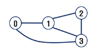

* 유향 그래프(Directed Graph)
  
  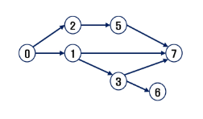

* 가중치 그래프(Weighted Graph)
  
  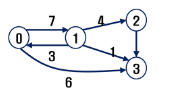

* 사이클 없는 방향 그래프(DAG, Directed Acyclic Graph)

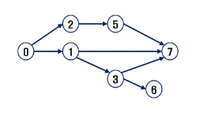

* 완전 그래프 - 정점들에 대해 가능한 모든 간선들을 가진 그래프
  
  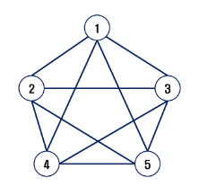

* 부분 그래프 - 원래 그래프에서 일부의 정점이나 간선을 제외한 그래프

## ▶ 인접 정점

> 두 개의 정점에 간선이 존재하면 서로 인접해 있다고 함

* 완전 그래프에 속한 임의의 두 정점들은 모두 인접해 있다.

* **경로 중 한 정점을 최대한 한 번만 지나는 경로를 단순경로라 함**

* **시작한 정점에서 끝나는 경로를 사이클이라고 함**

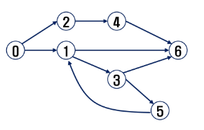

## ▶ 그래프 표현

> 간선의 정보를 저장하는 방식, 메모리나 성능을 고려해서 결정

* 인접 행렬 (Adjacent matrix)
  
  * V * V 크기의 2차원 배열을 이용해서 간선 정보를 저장
  
  * 배열의 배열(포인터 배열)

* 인접 리스트 (Adjacent List)
  
  * 각 정점마다 해당 정점으로 나가는 간선의 정보를 저장

* 간선의 배열
  
  * 간선(시작 정점, 끝 정점)을 배열에 연속적으로 저장

## ▶ 인접 행렬

> 두 정점을 연결하는 간선의 유무를 행렬로 표현

* V * V 정방 행렬

* 행 번호와 열 번호는 그래프의 정점에 대응

* 두 정점이 인접되어 있으면 1, 그렇지 않으면 0으로 표현

* 무향 그래프
  
  * i번째 행의 합 = i번째 열의 합 = Vi 의 차수
    
    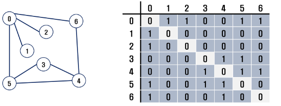

* 유향 그래프
  
  * 행 i의 합 = Vi 의 진출 차수
  
  * 열 i의 합 = Vi의 진입 차수

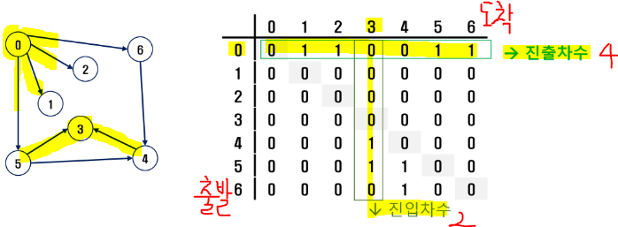

### 📌 인접행렬의 단점

* 정점이 많아질수록 2차원 배열 내 빈공간이 많아질 가능성 높다.

* 탐색하기 어려움

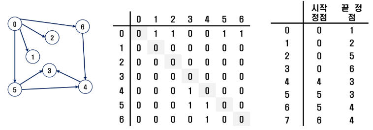

## ▶ 인접 리스트

> 각 정점에 대한 인접 정점들을 순차적으로 표현

* 하나의 정점에 대한 인접 정점들을 각각 노드로 하는 연결 리스트로 저장

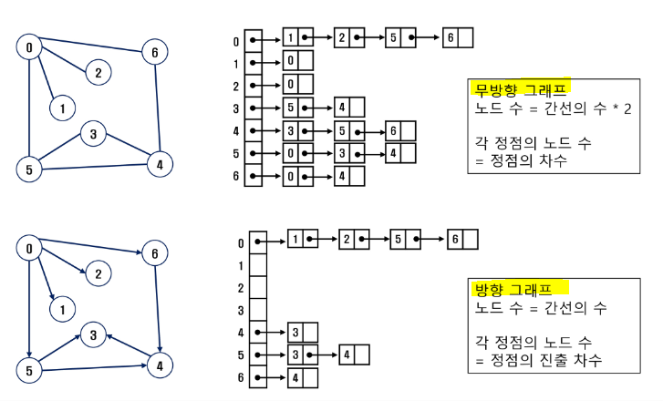

# DFS

> 친구 관계, 비상연락망 등을 그래프로 표현 가능

## ▶ 그래프 순회

> 비선형구조인 그래프로 표현된 모든 자료(정점)를 빠짐없이 탐색하는 것

* 두 가지 방법
  
  * DFS (깊이 우선 탐색)
  
  * BFS (너비 우선 탐색)

## ▶ DFS (깊이우선탐색)

> 시작 정점의 한 방향으로 갈 수 있는 경로가 있는 곳까지 깊이 탐색해 가다가 더 이상 갈 곳이 없게 되면, 가장 마지막에 만났던 갈림길 간선이 있는 정점으로 되돌아와서 다른 방향의 정점으로 탐색을 계속 반복하여 결국 모든 정점을 방문하는 순회방법

* 가장 마지막에 만났던 갈림길의 정점으로 되돌아가서 다시 깊이 우선탐색을 반복해야 하므로 **후입선출 구조의 스택 사용**❗

### 📌 stack의 특성

* **선형구조 - 자료 간의 관계가 1:1의 관계**
  
  * 비선형구조 - 자료 간의 관계가 1:N의 관계 (트리)

* **마지막에 삽입한 자료를 가장 먼저 꺼낸다 = LIFO(후입선출)**

### 📌 stack 구현

* 자료를 선형으로 저장할 저장소 - 배열 (마지막에 삽입된 원소의 위치를 `top`이라 부름)

* 연산 - `push`, `pop`, `isEmpty`, `peek`

* 삽입/삭제 과정

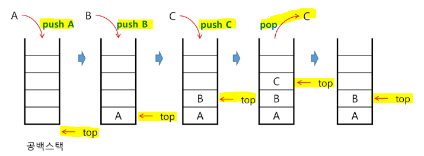

* **DFS 알고리즘 - 재귀**

```python
# 재귀호출
def dfs(v):
    visited[v] = 1

    for w in adjList[v]:
        # 방문하지 않은 w
        if visited[w] == 0:
            dfs(w)
```

* **DFS 알고리즘 - 반복**

```python
stack = []
visited = []

def dfs(v):
    stack.append(v)
    visited[v] = 1
    while stack:
        v = stack.pop()
        visited[v] = 1
        for w in adjList[v]:
            if visited[w] == 0:
                stack.append(w)
                visited[w] = 1    
                break
```

# BFS (너비우선탐색)

> 탐색 시작점의 인접한 정점들을 먼저 모두 차례로 방문한 후에 방문했던 정점을 시작점으로 하여 다시 인접한 정점들을 차례로 방문하는 방식

* 인접한 정점들에 대해 탐색을 한 후, 차례로 다시 너비우선탐색을 진행하므로 선입선출 형태의 자료구조인 큐를 활용

### 📌 Queue 의 특성

* 스택과 마찬가지로 삽입과 삭제의 위치가 제한적인 자료구조
  
  * **queue의 뒤에서는 삽입만 하고, queue의 앞에서는 삭제만 이루어지는 구조**

* **queue에 삽입한 순서대로 원소가 저장되어, 가장 먼저 삽입된 원소는 가장 먼저 삭제**
  
  * **FIFO, 선입선출 구조**

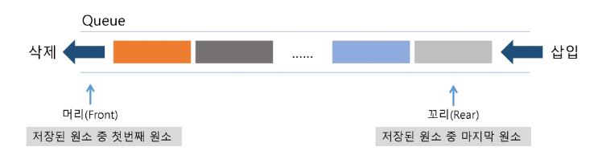

* BFS 알고리즘

```python
def bfs(v, n):
    q.append(v)
    visited[v] = 1

    while q:
        w = q.pop(0)
        print(w, end=' ')
        visited[v] = 1

        for i in adjList[w]:
            if not visited[i]:
                q.append(i)
                visited[i] = visited[n] + 1
```

# 서로소 집합들

> 서로소 또는 상호배타 집합들은 서로 중복 포함된 원소가 없는 집합 = 교집합 X

* 집합에 속한 하나의 특정 멤버를 통해 각 집합들을 구분한다. 이를 대표자라고 한다.

* 상호배타 집합을 표현하는 방법
  
  * 연결 리스트
  
  * 트리

* 연산
  
  * `Make-Set(x)` - x 가 대표원소 집합 만들어
  
  * `Find-Set(x)` - x 가 속한 집합의 대표원소를 반환 예) `return y`
  
  * `Union(x, y)` - x 가 대표원소인 집합과 y 가 대표원소인 집합을 합쳐

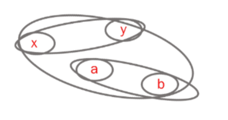

* 트리
  
  * 하나의 집합을 하나의 트리로 표현
  
  * 자식 노드가 부모 노드를 가리키며 로트 노드가 대표자가 된다.

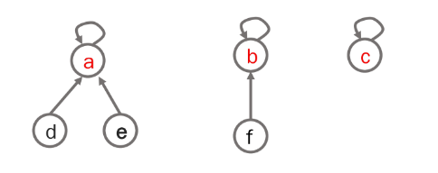

* 연산 예

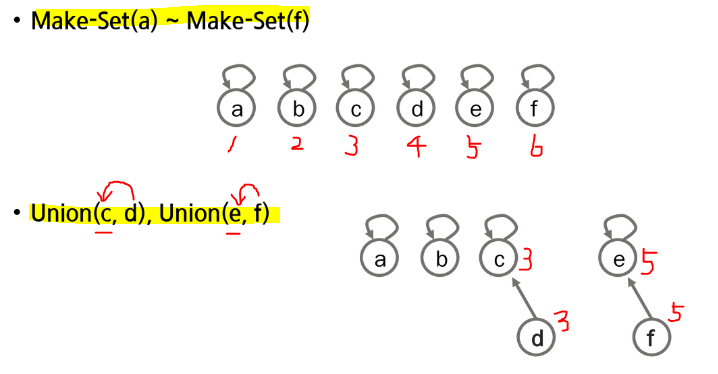

* `Union(d, f)` 
  
  * d의 대표 원소를 찾고 f의 대표원소를 찾자
  
  * f의 대표 원소를 d의 대표원소로 교체

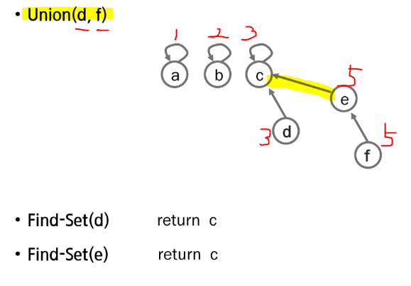

* 상호 배타 집합을 표현한 트리의 배열을 이용한 저장된 모습

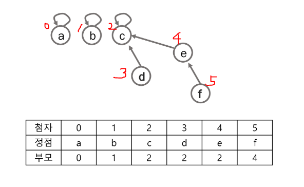

* 상호배타 집합에 대한 연산
  
  * `Make-Set(x)` - 유일한 멤버 x를 포함하는 새로운 집합을 생성
  
  * `Find-Set(x)` - x를 포함하는 집합을 찾음
  
  * `Union(x,y)` - x와 y를 포함하는 두 집합을 통합

* 연산의 효율을 높이는 방법
  
  * Rank를 이용한 Union
    
    * 각 노드는 자신을 루트로 하는 subtree의 높이를 랭크라는 이름으로 저장
    
    * 두 집합을 합칠 때 rank가 낮은 집합을 rank가 높은 집합에 붙임
  
  * Path compression
    
    * `Find-Set` 을 행하는 과정에서 만나는 모든 노드들이 직접 root를 가리키도록 포인터를 바꾸어 준다.

# 최소신장트리 (MST, Minimum Spanning Tree)

> 그래프에서 최소 비용 문제

* 1️⃣ 모든 정점을 연결하는 간선들의 가중치의 합이 최소가 되는 트리

* 2️⃣ 두 정점 사이의 최소 비용의 경로 찾기

## ▶︎ 신장 트리

> n 개의 정점으로 이루어진 무방향 그래프에서 n개의 정점과 n-1개의 간선으로 이루어진 트리

* 최소 신장 트리!
  
  * **무방향 가중치 그래프에서 신장 트리를 구성하는 간선들의 가중치의 합이 최소인 신장 트리**

## ▶︎ Prim 알고리즘

> **하나의 정점에서 연결된 간선들 중에 하나씩 선택하면서 MST를 만들어가는 방식**

* 작동 과정
  
  * 1️⃣ 임의 정점을 하나 선택해서 시작
  
  * 2️⃣ 선택한 정점과 인접하는 정점들 중의 최소 비용의 간선이 존재하는 정점을 선택
  
  * 3️⃣ 모든 정점이 선택될 때까지 1️⃣, 2️⃣ 과정을 반복

* **서로소인 2개의 집합 정보를 유지**
  
  * 트리 정점들(tree vertices) - MST를 만들기 위해 선택된 정점들
  
  * 비트리 정점들(nontree vertices) - 선택되지 않은 정점들

```python
'''
6 11
0 1 32
0 2 31
0 5 60
0 6 51
1 2 21
2 4 46
2 6 25
3 4 34
3 5 18
4 5 40
4 6 51
'''

def prim1(r, V):
    MST = [0]*(V+1)     # MST 포함여부
    key = [10000]*(V+1) # 가중치의 최대값 이상으로 초기화. key[v]는 v가 MST에 속한 정점과 연결될 때의 가중치
    key[r] = 0          # 시작정점의 key
    for _ in range(V):  # V+1개의 정점 중 V개를 선택
        # MST에 포함되지 않은 정점 중(MST[u]==0), key가 최소인 u 찾기
        u = 0
        minV = 10000
        for i in range(V+1):
            if MST[i]==0 and key[i]<minV:
                u = i
                minV = key[i]
        MST[u] = 1                  # 정점 u를 MST에 추가
        # u에 인접인 v에 대해, MST에 포함되지 않은 정점이면
        for v in range(V+1):
            if MST[v]==0 and adjM[u][v]>0:
                key[v] = min(key[v], adjM[u][v])     # u를 통해 MST에 포함되는 비용과 기존 비용을 비교, 갱신
    return sum(key)         # MST 가중치의 합


V, E = map(int, input().split())
adjM = [[0]*(V+1) for _ in range(V+1)]
adjL = [[] for _ in range(V+1)]
for _ in range(E):
    u, v, w = map(int, input().split())
    adjM[u][v] = w
    adjM[v][u] = w  # 가중치가 있는 무방향 그래프
    adjL[u].append((v, w))
    adjL[v].append((u, w))

print(prim1(0, V))
```

```python
def prim2(r, V):
    MST = [0]*(V+1)     # MST 포함여부
    MST[r] = 1.         # 시작정점 표시
    s = 0               # MST 간선의 가중치 
    for _ in range(V):
        u = 0
        minV = 10000
        for i in range(V+1):    # MST에 포함된 정점i와 인접한 정점j 중 MST에 포함되지 않고 가중치가 최소인 정점 u찾기
            if MST[i]==1:
                for j in range(V+1):
                    if adjM[i][j]>0 and MST[j]==0 and minV>adjM[i][j]:
                        u = j
                        minV = adjM[i][j]
        s += minV
        MST[u] = 1
    return s

V, E = map(int, input().split())
adjM = [[0]*(V+1) for _ in range(V+1)]
adjL = [[] for _ in range(V+1)]
for _ in range(E):
    u, v, w = map(int, input().split())
    adjM[u][v] = w
    adjM[v][u] = w  # 가중치가 있는 무방향 그래프
    adjL[u].append((v, w))
    adjL[v].append((u, w))

print(prim2(0, V))
```

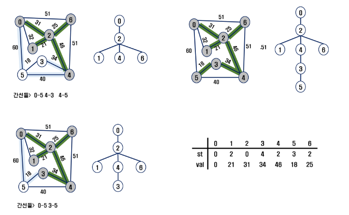

## ▶︎ KRUSKAL 알고리즘

> 간선을 하나씩 선택해서 MST를 찾는 알고리즘

* 1️⃣ **최초, 모든 간선을 가중치에 따라 오름차순으로 정렬**

* 2️⃣ **가중치가 가장 낮은 간선부터 선택하면서 트리를 증가시킴**
  
  * **사이클이 존재하면 다음으로 가중치가 낮은 간선 선택**

* 3️⃣ n-1 개의 간선이 선택될 때까지 2️⃣를 반복
  
  * 사이클이 존재할 경우 다음 간선을 선택

```python
def find_set(x):
    while x != rep[x]:  # 대표원소가 아니면
        x = rep[x]   # x가 가리키는 정점으로 이동
    return x

V, E = map(int, input().split())
edge = []
for _ in range(E):
    u, v, w = map(int, input().split())
    edge.append((w,u,v))
edge.sort()  # 가중치 기준 오름차순 정렬
rep = [i for i in range(V+1)]  # 대표원소 초기화
# N개의 정점이 있으면 사이클이 생기지 않도록 N-1개의 간선을 선택
# MST에 포함된 간선의 가중치의 합 구하기
N = V+1  # 0~V번 까지의 정점
cnt = 0  # 선택한 edge의 개
total = 0  # 가중치의 합
for w, u, v in edge:  # N-1개의 간선 선택 루프
    if find_set(u) != find_set(v):  # 사이클을 형성하지 않으면 선택
        cnt += 1
        total += w  # 가중치의 합
        # union(u, v) 와 동일
        rep[find_set(v)] = find_set(u)  # v의 대표원소를 u의 대표원소로 바꿈
        if cnt == N-1:
            break
print(total)
```

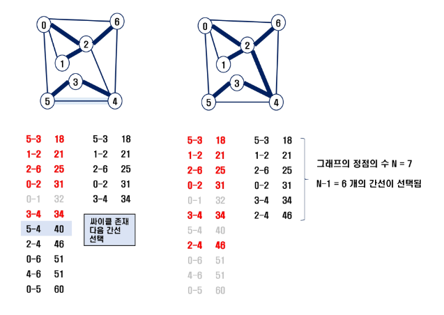

# 최단 경로

> 간선의 가중치가 있는 그래프에서 두 정점 사이의 경로들 중에 간선의 가중치의 합이 최소인 경로

* 하나의 시작 정점에서 끝 정점까지의 최단 경로
  
  * 다익스트라 알고리즘 - 음의 가중치 허용 X
  
  * 벨만-포드 알고리즘 - 음의 가중치 허용

* 모든 정점들에 대한 최단 경로: Floyd-Warshall 알고리즘

## ▶︎ Dijkstra 알고리즘

> 시작 정점에서 거리가 최소인 정점을 선택해 나가면서 최단 경로를 구하는 방식

* 시작 정점(s)에서 끝정점(t)까지의 최단 경로에 정점 x가 존재한다.

* 이 때, 최단 경로는 s에서 x까지의 최단 경로와 x에서 t까지의 최단경로를 구성

* 탐욕기법을 사용한 알고리즘으로 MST의 프림 알고리즘과 유사

```python
def dijkstra(s, V): # 시작정점 s, 마지막 정점 V
    U = [0] * (V+1)
    U[s] = 1
    for v in range(V+1):
        D[v] = adj[s][v]  # 시작 점에서 갈 수 있는 값 

    #while len(U) != V:
    for _ in range(V):  # V = 정점개수-1과 같으므로..남은 정점개수와 같음
        minV = INF
        w = 0
        for i in range(V+1):
            if U[i]==0 and minV>D[i]:
                minV = D[i]
                w = i
        U[w] = 1  # 선택된 집합에 포함

        for v in range(V+1):   # 정점 v가
            if 0 < adj[w][v] < INF:  # w에 인접이면 , 시작정점에서 w를 거쳐 v로 가능 비용과
                D[v] = min(D[v], D[w]+adj[w][v])  # 시작정점에서 v로 가는 기존 비용을 비교 후 선택


INF = 10000
V, E = map(int, input().split())
adj = [[INF]*(V+1) for _ in range(V+1)]
for i in range(V+1):
    adj[i][i] = 0
for _ in range(E):
    u, v, w = map(int, input().split())
    adj[u][v] = w  # 방향성 그래프

D = [0]*(V+1)
dijkstra(0, V)
print(D)  # 시작 정점 0에서 각 정점으로 가는 최소 비용
```

```python
def digkstra():
    while Q:
        print(Q, visited)
        now, dist = Q.pop(0)   # 정점 정보와 거리 

        if D[now] < dist:      # 주어진 거리보다 저장된 거리가 더 작으면 skip
            continue

        visited[now] = True
        # 현재 정점의 인접 정점을 선택하여 그 인접 정점을 확인
        for v in range(len(adj_list[now])):
            n_v, n_dist = adj_list[now][v]   # 연결된 정점과 그 거리
            # 현재까지의 거리와 연결된 정점의 거리를 더한 값이 
            # 저장된 값보다 작다면 갱신
            if dist + n_dist < D[n_v]:
                D[n_v] = dist + n_dist
                Q.append((n_v, D[n_v]))   # 다음 정점과 갱신된 거리를 Queue에 등록


INF = 987654321
V, E = map(int, input().split())
# 인접 리스트
adj_list = [[] for _ in range(V+1)]

for _ in range(E):
    s, v, d = map(int, input().split())
    adj_list[s].append((v, d))

D = [INF] * (V+1)
D[0] = 0
for v, d in adj_list[0]:   # 시작 정점에서 인접한 정점 거리 저장
    D[v] = d

visited = [False] * (V+1)
visited[0] = True

Q = [*adj_list[0]]  # Queue 에 시작점으로 부터 이어진 값을 넣는다.
digkstra()
print(D)

# visited 를 지우면 0 까지 체크되면서 되돌아 오는 거리를 구할 수 있음
```

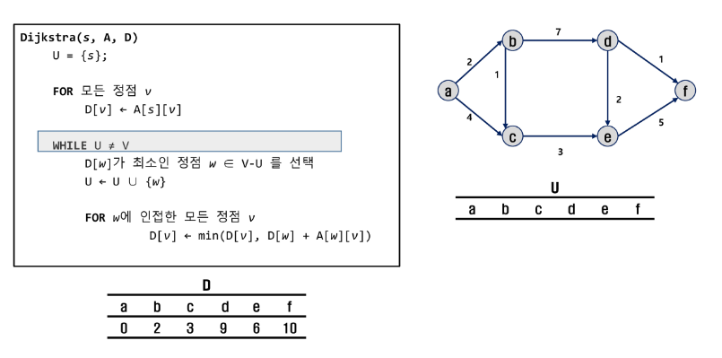
