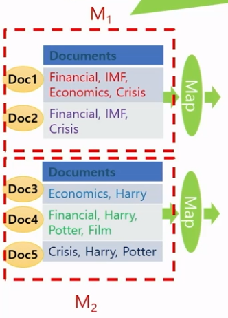

# 왜 병렬 분산 알고리즘인가?

> **용어 정리**
> 
> - `Scale-out` : 아주 많은 값싼 서버들을 이용
> 
> - `Scale-up` : 적은 수의 값비싼 서버들을 이용

* 데이터 중심 어플리케이션 분야에서는 아주 많은 값싼 서버들을 많이 이용하는 것을 선호
  
  * 고가의 서버들은 가격에 관점에서는 선형으로 성능이 증가하지 않음
  
  * 두 배 성능의 프로세서 한 개를 가진 컴퓨터의 가격이 일반적인 프로세서 한 개를 가진 컴퓨터 가격의 두 배보다 훨씬 더 비쌈

## ☑ 왜 MapReduce인가?

* **데이터 중심 프로세싱(Data-intensive processing)**
  
  * 한 대의 컴퓨터의 능력으로 처리가 어려움
  
  * 근본적으로 수 십대, 수 백대 혹은 수 천대의 컴퓨터를 묶어서 처리해야 함
  
  * 맵리듀스 프레임워크가 하는 것

* **맵리듀스는 빅데이터를 이용한 효율적인 계산이 가능한 첫 번째 프로그래밍 모델**
  
  * *기존에 존재하는 여러가지 다른 병렬 컴퓨팅 방법에서는 프로그래머가 낮은 레벨의 시스템 세부 내용까지 아주 잘 알고 많은 시간을 쏟아야 함*

## ☑ MapReduce Framework

* 값싼 컴퓨터들을 모아서 클러스터를 만들고 여기에서 빅 데이터를 처리하기 위한 스케일러블(scalable) 병렬 소프트웨어의 구현을 쉽게 할 수 있도록 도와주는 프로그래밍 모델
  
  * **`scalable` : 사용자 수가 급증하거나 데이터가 급증해도 프로그램이 멈추거나 성능이 크게 떨어지는 일이 없다는 뜻**

* 구글의 맵리듀스 또는 오픈소스 하둡은 맵리듀스 프레임워크의 우수한 구현 형태

* 드라이버에 해당하는 메인 함수가 맵 함수와 리듀스 함수를 호출해서 처리

* 맵리듀스 프레임워크에서는 각각의 레코드 또는 튜플은 키-밸류 쌍으로 표현

* 맵리듀스 프레임워크는 메인함수를 한 개의 마스터 머신에서 수행하는데 이 머신은 맵 함수를 수행하기 전에 전처리를 하거나 리듀스 함수의 결과를 후처리하는데 사용될 수 있음

* 컴퓨팅은 맵과 리듀스라는 유저가 정의한 함수 한 쌍으로 이루어진 맵리듀스 페이즈를 한 번 수행하거나 여러 번 반복해서 수행할 수 있음

* 한 번의 맵리듀스 페이즈는 맵 함수를 먼저 호출하고 그 다음에 리듀스 함수를 호출하는데, 때에 따라서는 맵 함수가 끝난 후에 컴바인 함수를 중간에 수행할 수 있음

* 드라이버에 해당하는 메인 프로그램에서 맵리듀스 페이즈를 수행시킴

## ☑ MapReduce Programming Model

> 함수형 프로그래밍 언어의 형태

* 유저는 아래 3가지 함수를 구현해서 제공해야 함
  
  * Main 함수
  
  * Map 함수: (key1, val1) → [(key2, val2)]
  
  * Reduce 함수: (ke2, [val2]) → [(key3, val3)]

## ☑ MapReduce Phase (3단계)

1️⃣ **맵 페이즈**

* 제일 먼저 수행되며 데이터의 여러 파티션에 병렬 분산으로 호출되어 수행됨

* 각 머신마다 수행된 Mapper는 맵 함수가 입력 데이터의 한 줄 마다 맵 함수를 호출

* 맵 함수는 (KEY, VALUE)쌍 형태로 결과를 출력하고 여러 머신에 나누어 보내며 같은 KEY를 가진 (KEY, VALUE) 쌍은 같은 머신으로 보내짐

2️⃣ **셔플링 페이즈**

* 모든 머신에서 맵 페이즈가 다 끝나면 시작됨

* 맵 페이즈에서 각각의 머신으로 보내진 (KEY, VALUE) 쌍을 KEY를 이용해서 정렬을 한 후에 각각의 KEY 마다 같은 KEY를 가진 (KEY, VALUE) 쌍을 모아서 밸류-리스트를 만든 다음에 (KEY, VALUE-LIST)형태로 KEY에 따라서 여러 머신에 분산해서 보냄

3️⃣ **리듀스 페이즈**

* 모든 머신에서 셔플링 페이즈가 다 끝나면 각 머신마다 리듀스 페이즈가 시작됨

* 각각의 머신에서는 셔플링 페이즈에서 해당 머신으로 보내진 각각의 (KEY, VALUE-LIST) 쌍 마다 리듀스 함수가 호출되며 하나의 리듀스 함수가 끝나면 다음 (KEY, VALUE-LIST) 쌍에 리듀스 함수가 호출됨

* 출력이 있다면 (KEY, VALUE) 쌍 형태로 출력함

## ☑ Hadoop

> Apache 프로젝트의 맵리듀스 프레임워크의 오픈 소스

* **하둡 분산 파일 시스템 (Hadoop Distributed File System - HDFS)**
  
  * 빅 데이터 파일을 여러 대의 컴퓨터에 나누어서 저장함
  
  * 각 파일은 여러 개의 순차적인 블록으로 저장함
  
  * 하나의 파일의 각각의 블록은 fault tolerance를 위해서 여러 개로 복사되어 여러 머신의 여기저기 저장됨
    
    * fault tolerance는 시스템을 구성하는 부품의 일부에서 결함 또는 고장이 발생하여도 정상적 혹은 부분적으로 기능을 수행할 수 있는 것을 말함

* 빅 데이터를 수천 대의 값싼 컴퓨터에 병렬 처리하기 위해 분산함

* **주요 구성 요소**
  
  * `MapReduce` : 소프트웨어의 수행을 분산
  
  * `Hadoop Distributed File System(HDFS)` : 데이터를 분산

* 한 개의 Namenode(master)와 여러 개의 Datanode(slaves)
  
  * `Namenode` : 파일 시스템을 관리하고 클라이언트가 화일에 접근할 수 있게 함
  
  * `Datanode` : 컴퓨터에 들어있는 데이터를 접근할 수 있게 함

* 자바 프로그래밍 언어로 맵리듀스 알고리즘을 구현

## ☑ MapReduce의 함수

* 맵 함수

* 리듀스 함수

* 컴바인(Combine) 함수

# MapReduce를 이용한 Word Counting 알고리즘

> **두 개의 머신 M1과 M2가 있고 각 문서는 라인이 한 개만 있다고 가정**
> 
> - 머신 Mi 마다 mapper가 하나씩 수행되고 mapper는 map 함수를 각 라인 하나마다 차례대로 호출함

* 텍스트 문서의 각 라인마다 map 함수가 호출되고 문서를 스캔하면서 각 단어마다 그 단어를 KEY로 하고 값 1을 VALUE로 해서 (KEY, VALUE) 쌍을 출력함

