# Queue

> 스택과 마찬가지로 **삽입과 삭제의 위치가 제한적인 자료구조**

## ▶ 특성

- **Queue 의 뒤에서는 삽입**만 하고, **Queue 의 앞에서는 삭제**만 이루어지는 구조

- **FIFO (First In First Out) - 먼저 삽입된 원소는 가장 먼저 삭제된다.**

## ▶ FIFO 구조

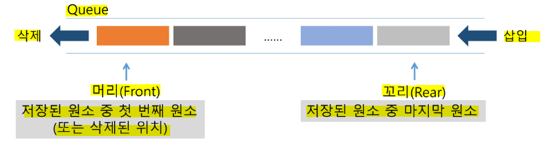

## ▶ 기본 연산

* **`enQueue` - 삽입**

* **`deQueue` - 삭제**

| 연산              | 기능                             |
| --------------- | ------------------------------ |
| `enQueue(item)` | **큐의 뒤쪽(rear 다음)에 원소를 삽입**     |
| `deQueue()`     | **큐의 앞쪽(front)에서 원소를 삭제하고 반환** |
| `createQueue()` | 공백 상태의 큐를 생성                   |
| `isEmpty()`     | 큐가 공백상태인지를 확인                  |
| `isFull()`      | 큐가 포화상태인지를 확인                  |
| `Qpeek()`       | 큐의 앞쪽(front)에서 원소를 삭제없이 반환     |

* createQueue()
  
  * `Q = []`
  
  * `Q = [0] * 100`

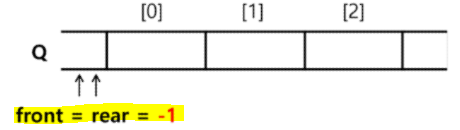

* enQueue(A)
  
  * ```python
    rear += 1
    Q[rear] = A
    ```

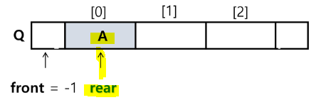

* deQueue():
  
  * **front - 마지막으로 꺼낸 자리**
  
  * **rear - 마지막으로 저장된 위치**
  
  * **`front == rear` 상태 - 큐가 비어있음을 의미**❗

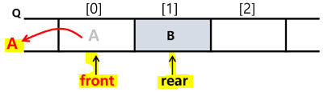

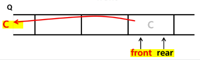

### ✔ 선형큐

* 상태 표현
  
  * 초기 상태 - front = rear = -1
  
  * **공백 상태 - front == rear**
  
  * **포화 상태 - rear == n-1 (n-1: 배열의 마지막 인덱스)**

### ✔ 구현

* 삽입 = `enQueue(item)`
  
  * **rear 값을 하나 증가**시켜 새로운 원소를 삽입할 자리를 마련
  
  * 그 인덱스에 해당하는 배열원소 **Q[rear]에 item을 저장**

```python
def enQueue(item):
    global rear
    if isFull():
        print('Queue_Full')
    else:
        rear += 1
        Q[rear] = item
```

* 삭제 = `deQueue()`
  
  * **front 값을 하나 증가**시켜 큐에 남아있게 될 첫 번째 원소 이동
  
  * 새로운 **첫 번째 원소를 리턴 함으로써 삭제와 동일한 기능**

```python
def deQueue():
    global front
    if isEmpty():
        print('Queue_Empty')
    else:
        front += 1
        return Q[front]
```

* 공백 및 포화 상태 검사 = `isEmpty()`, `isFull()`
  
  * **공백상태 - front == rear**
  
  * **포화상태 - rear == n-1** (n-1: 배열의 마지막 인덱스)

```python
def isEmpty():
    return front == rear

def isFull():
    return rear == len(Q) - 1
```

* 검색 = `Qpeek()`
  
  * 가장 앞에 있는 원소를 검색하여 반환
  
  * 현재 front의 한자리 뒤(front+1)에 있는 원소, 즉 큐의 첫 번째에 있는 원소를 반환

```python
def Qpeek():
    if isEmpty():
        print('Queue_Empty')
    else:
        return Q[front+1]
```

### 📌 선형 큐 기본

```python
N = 10
q = [0] * N
front = -1
rear = -1

# enqueue(10)
rear += 1
q[rear] = 10

# enqueue(20)
rear += 1
q[rear] = 20

# enqueue(30)
rear += 1
q[rear] = 30

# dequeue() - 10
front += 1
print(q[front])

# dequeue() - 20
front += 1
print(q[front])

# dequeue() - 30
front += 1
print(q[front])
```

### 📌 deque() 활용

```python
from collections import deque

q = deque()

q.append(10)
q.append(20)
q.append(30)

print(q.popleft())
print(q.popleft())
print(q.popleft())
```

## ▶ 선형 큐 이용 시 문제점

### ✔ 잘못된 포화상태 인식

* 원소의 삽입과 삭제를 계속한 경우, 배열의 앞부분에 활용할 수 있는 공간이 있음에도 불구하고, **rear = n-1 인 상태인 포화상태로 인식하여 더 이상의 삽입을 수행 X**

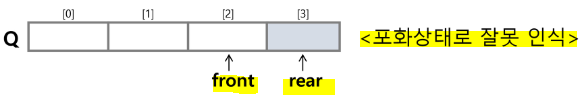

* **해결방법** 1️⃣
  
  * 연산이 이루어질 때마다 저장된 원소들을 배열의 앞부분으로 모두 이동
  
  * **원소 이동에 많은 시간이 소요 = 큐의 효율성 급락**

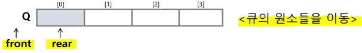

* **해결방법** 2️⃣
  
  * 1차원 배열을 사용하되, **배열의 처음과 끝이 연결되어 있는 원형 큐를 사용**

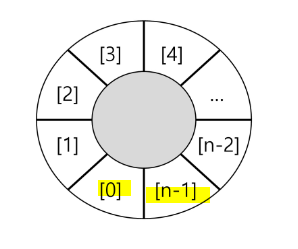

# 원형 Queue

## ▶ 구조

* **초기 공백 상태 : `front = rear = 0`**

* index의 순환: front와 rear의 위치가 **배열의 마지막 인덱스인 n-1을 가리킨 후 다음에는 배열의 처음 인덱스인 0으로 이동해야 함**
  
  * <mark>**나머지 연산자 mod를 사용!**</mark>

* front 변수
  
  * **공백 상태와 포화 상태 구분을 쉽게 하기 위해 <mark>front가 있는 자리는 사용하지 않고 항상 빈자리</mark>**

* 삽입 및 삭제 위치

|         | 삽입 위치                       | 삭제 위치                         |
|:-------:|:--------------------------- |:----------------------------- |
| 선형큐     | rear = rear + 1             | front = front +1              |
| **원형큐** | **rear = (rear + 1) mod n** | **front = (front + 1) mod n** |

## ▶ 연산

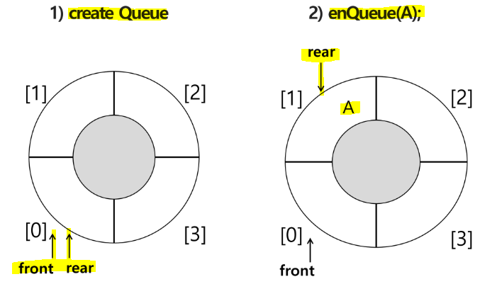

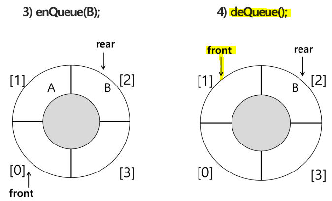

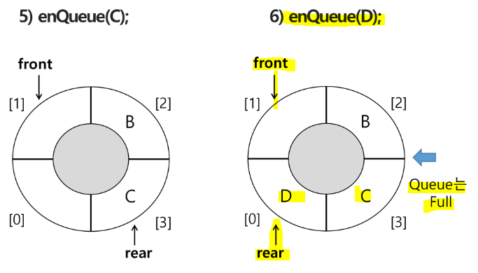

### ✔ 구현

- 삽입 = `enQueue(item)`
  
  - rear 값을 조정하여 새로운 원소를 삽입할 자리를 마련
    
    - **`rear = (rear+1) mod n`**
  
  - 그 인덱스에 해당하는 배열원소 cQ[rear]에 item을 저장

```python
def enQueue(item):
    global rear
    if isFull():
        print('Queue_Full')
    else:
        rear = (rear + 1) % len(cQ)
        cQ[rear] = item
```

- 삭제 = `deQueue()`, `delete()`
  
  - **front 값을 조정하여 삭제할 자리를 준비**
  
  - 새로운 front 원소를 리턴 함으로써 삭제와 동일한 기능

```python
def deQueue():
    global front
    if isEmpty():
        print('Queue_Empty')
    else:
        front = (front + 1) % len(cQ)
        return cQ[front]
```

- 공백 및 포화 상태 검사 = `isEmpty()`, `isFull()`
  
  - <mark>**공백상태 - front == rear**</mark>
  
  - **포화상태 - <mark>삽입할 rear의 다음 위치</mark> == 현재 front - (rear+1) mod n <mark>== front</mark>**

```python
def isEmpty():
    return front == rear

def isFull():
    return (rear+1) % len(cQ) == front
```

### 📌 원형 큐 기본

```python
N = 10
q = [0] * N
front = 0
rear = 0

# enqueue(10)
rear = (rear + 1) % N
q[rear] = 10

# enqueue(20)
rear = (rear + 1) % N
q[rear] = 20

# enqueue(30)
rear = (rear + 1) % N
q[rear] = 30

# enqueue(40)
rear = (rear + 1) % N
q[rear] = 40

# dequeue() - 10
front = (front + 1) % N
print(q[front])

# dequeue() - 20
front = (front + 1) % N
print(q[front])

# dequeue() - 30
front = (front + 1) % N
print(q[front])
```

# 우선순위 큐 (Priority Queue)

> 우선순위를 가진 항목들을 저장하는 큐
> 
> **FIFO 순서가 아니라 우선순위가 높은 순서대로 먼저 나간다.**

* 우선순위 큐의 적용 분야
  
  * 시뮬레이션 시스템
  
  * 네트워크 트래픽 제어
  
  * 운영체제의 테스크 스케쥴링

## ▶ 기본 연산

* 삽입 - `enQueue`

* 삭제 - `deQueue`

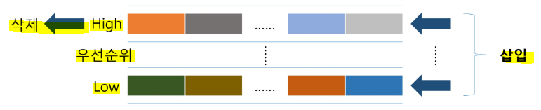

### ✔ 배열을 이용한 우선순위 큐 구현

* 원소를 삽입하는 과정에서 우선순위를 비교하여 적절한 위치에 삽입

* 가장 앞에 최고 우선순위의 원소가 위치

### ✔ 문제점

* 배열 사용으로 **삽입이나 삭제 연산이 일어날 때 원소의 재배치가 발생**
  
  * **이에 소요되는 시간이나 메모리 낭비가 큼**

# 큐의 활용

## ▶ 버퍼(Buffer)

* **데이터를 한 곳에서 다른 한 곳으로 전송하는 동안 <mark>일시적으로 그 데이터를 보관하는 메모리의 영역</mark>**

* 버퍼링 - 버퍼를 활용하는 방식 or 버퍼를 채우는 동작을 의미

### ✔ 버퍼의 자료구조

* 버퍼는 일반적으로 **입출력 및 네트워크와 관련된 기능에서 이용**된다.

* **순서대로 입력/출력/전달되어야 하므로 FIFO 방식의 자료구조인 큐를 활용**

### 1️⃣ 키보드 Buffer

* 사용자가 키보드를 입력하면 키보드를 누른 순서대로 연산이 실행된다.

### 2️⃣ 마이쮸 나눠주기

```python
p = 1       # 처음 줄 설 사람 번호
q = []
N = 1000    # 마이쮸 총 개수
m = 0       # 나눠준 개수
v = 0

while m < N:
    # input()
    q.append((p, 1, 0))     # (처음 줄 서는 사람, 몇 개 받아가?, 이전까지 나눠준 사탕수)
    # print(q)
    v, c, my = q.pop(0)
    # print(f'큐에 있는 사람수 {len(q)+1}, 받아갈 사탕 수 {c}, 나눠준 사탕 수 {m}')
    m += c
    q.append((v, c+1, my+c))    # 마이쮸를 받고 다시 서는 사람
    p += 1                  # 처음 줄 서는 사람 번호

    print(f'마지막 받은 사람: {v}')
```

# BFS (Breadth First Search)

| 그래프 탐색법        | 사용처                                                      | 구현                     |
| -------------- | -------------------------------------------------------- | ---------------------- |
| **DFS(깊이 우선)** | A에서 B로 가는 경로가 있는가?<br/>**경로의 수**<br/>**최단 거리**           | **스택**<br/>**재귀 & 반복** |
| **BFS(너비 우선)** | A에서 B로 가는 경로가 있는가?<br/>**최단 거리**<br/>**확산 문제(출발이 여러 곳)** | **큐**<br/>**반복**       |

* BFS 는 **탐색 시작점의 인접한 정점들을 먼저 모두 차례로 방문한 후에 방문했던 정점을 시작점으로 하여 다시 인접한 정점들을 차례로 방문하는 방식**

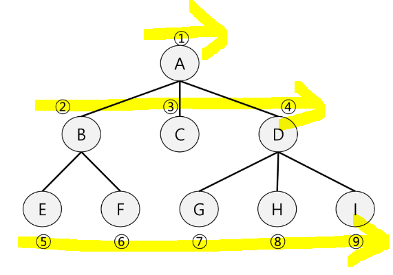

### 📌 BFS 기본 코드

* *단, queue 에 정점이 중복으로 들어갈 가능성 존재*❗

```python
def BFS(G, v):                      # 인접 그래프 G, 탐색 시작점 v
    visited = [0] * (n+1)           # n - 정점의 개수
    queue = []
    queue.append(v)                 # 시작점 v를 큐에 삽입
    while queue:                    # 큐가 빌 때까지 무한 루프
        t = queue.pop(0)            # 큐의 첫번째 원소 반환
        if not visited[t]:
            visited[t] = True
            visit(t)                # 정점 t에서 할 일
            for i in G[t]:          # t와 연결된 모든 정점 - 큐에 담기
                if not visited[i]:
                    queue.append(i)
```

* **초기 상태**
  
  * visited 배열 초기화
  
  * Q 생성
  
  * 시작점 enqueue
    
    * enqueue 후 바로 visited 표기 = queue 에 정점이  중복되지 않는다.

```python
def BFS(G, v, n)
    visited = [0] * (n+1)
    queue = []
    queue.append(v)       # 시작점을 queue에 넣고 시작
    visited[v] = 1        # 시작점을 1로 표기 = queue에 중복을 없애준다.
    while queue:
        t = queue.pop(0)
        visited[v] = 1
        for i in G[t]:
            if not visited[i]:
                queue.append(i)
                visited[i] = visited[t] + 1    # 같은 그룹끼리 번호를 지정(중복을 막기 위함)
```

* 같은 그룹끼리 번호가 같음
  
  * 처리되는 우선순위가 동일함을 의미
  
  * **출발점에서부터 최단거리를 알 수 있음**
  
  * **출발점으로부터 거리가 같은 정점은 최대 몇 개인지도 알 수 있음**

* **탐색 순서 출력**

```python
'''
0번부터 N번까지, E개의 간선
6 8
0 1
0 2
3 1
1 4
2 4
5 3
4 5
6 5
'''


def BFS(v, N):              # v - 시작 정점, N - 마지막 정점 번호
    visited = [0] * (N+1)   # visited 생성
    q = []                  # 큐 생성
    q.append(v)             # 시작점 인큐
    visited[v] = 1          # 시작점 처리 표시
    while q:                        # 큐가 비어있으면 종료
        v = q.pop(0)
        print(v)                    # visit(v) - 문제에서 주어진 일을 처리
        for w in adjList[v]:        # 인접하고 미방문한 정점 w가 있는 경우 q에 추가
            if visited[w] == 0:
                q.append(w)
                visited[w] = visited[v] + 1


V, E = map(int, input().split())
N = V + 1           # N - 정점 개수, V - 마지막 정점 번호
adjList = [[] for _ in range(N)]
for _ in range(E):
    a, b = map(int, input().split())
    adjList[a].append(b)
    adjList[b].append(a)

BFS(0, V) # 출발점, 마지막 정점 번호
```


