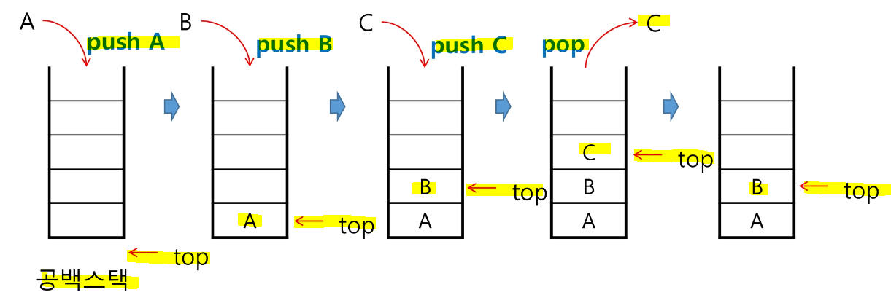
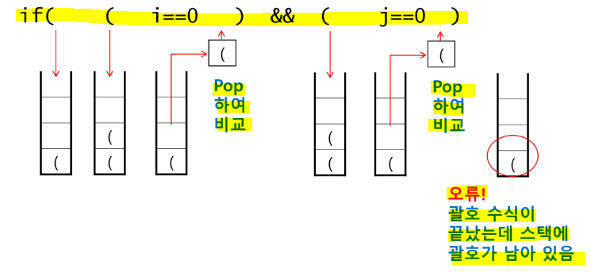
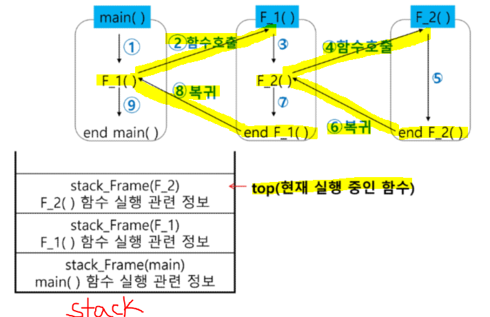
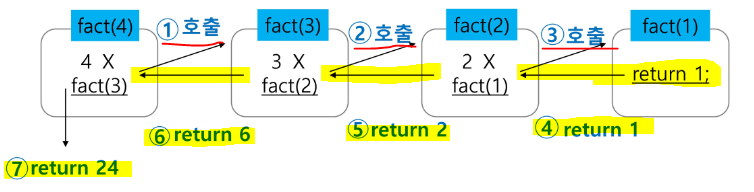
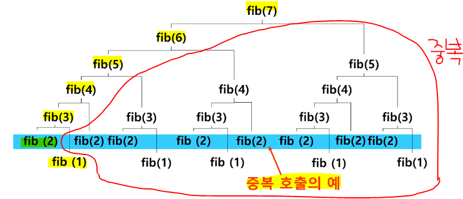

# Stack

> **물건을 쌓아 올리듯 자료를 쌓아 올린 형태의 자료 구조**

## ▶ Stack의 특성

* <mark>**스택에 저장된 자료는 선형 구조를 가진다.**</mark>
  
  * **선형구조 - 자료 간의 관계가 1대 1의 관계**
  
  * 비선형구조 - 자료 간의 관계가 1대 N의 관계
    
    * 예) Tree

* 스택에 자료를 삽입하거나 스택에서 자료를 꺼낼 수 있다.

* **<mark>LIFO(Last-In-First-Out) 구조</mark> - 마지막에 삽입한 자료를 가장 먼저 꺼낸다.**
  
  * 스택에 1, 2, 3 순으로 자료를 삽입한 후 꺼내면 역순(3, 2, 1)으로 꺼낼 수 있다.

* **제약을 갖는 데이터 구조를 사용하면 잠재적 버그를 막을 수 있다.**
  
  * 린팅 알고리즘 - 스택 위 항목을 제외하고는 삭제할 수 없음

* 문제를 해결하는 새로운 사고 모델 제공 - LIFO 적용

## ▶ Stack을 구현하기 위한 자료구조와 연산

* 자료구조 - 자료를 선형으로 저장할 저장소
  
  * <mark>**배열 사용 가능**</mark>
  
  * **저장소 자체를 stack 이라 부르기도 함**
  
  * stack에서 <mark>**마지막 삽입된 원소의 위치를 top(sp = stack pointer)이라 부름**</mark>

* 연산
  
  * **`push`(삽입)**- 저장소에 자료를 저장
  
  * **`pop`(삭제)** - 저장소에서 자료를 **삽입한 자료의 역순으로 꺼냄**
  
  * **`isEmpty`** - 스택이 공백인지 아닌지를 확인
    
    * 비어 있으면 True / 비어 있지 않으면 False
  
  * **`peek`** - **스택의 top에 있는 item(원소)을 반환**

## ▶ Stack 의 삽입/삭제 과정

* `push(A)` - **top 이 증가한 후 top이 위치한 곳에 A 삽입**

* `pop()` -  C 를 꺼내고 top을 아래로 내린다.
  
  * 스택에 데이터가 비어있는지 확인 후 실행하는 것이 좋다!



## ▶ Stack 의 push/pop 알고리즘

### ✔ push

* `append` 메소드를 통해 리스트의 마지막에 데이터를 삽입

```python
def push(item):
    s.append(item)    # s = []
```

```python
def push(item, size):
    global top
    top += 1
    if top == size:
        print('overflow!')
    else:
        stack[top] = item

size = 10
stack = [0] * size
top = -1

push(10, size)
top += 1
stack[top] = 20
```

### ✔ pop

```python
def pop():
    if len(s) == 0:
        return
    else:
        return s.pop(-1)
```

```python
def pop():
    global top
    if top == -1:
        print('underflow!')
        return 0
    else:
        top -= 1
        return stack[top+1]
print(pop())

if top > -1:
    top -= 1
    print(stack[top+1])
```

## ▶ Stack 구현 시 고려사항

* **1차원 배열을 사용하여 구현할 경우 용이함** = 알고리즘 문제풀이에서는 크기 예측 가능

* ***단, 스택의 크기를 변경하기가 어려운 단점 존재***

* 이를 해결하기 위해, **저장소를 동적으로 할당하여 스택을 구현하는 방법이 있음**
  
  * **동적 연결리스트를 이용하여 구현**하는 방법을 의미
  
  * *구현이 복잡하다는 단점 존재*
  
  * **메모리를 효율적으로 사용한다는 장점**

```python
stackSize = 10
stack = [0] * stackSize
top = -1

top += 1            # top 증가
stack[top] = 1      # stack 에 push(1)

top += 1            # push(2)
stack[top] = 2

top -= 1            # pop
temp = stack[top + 1]
print(temp)

temp = stack[top]    # pop
top -= 1
print(temp)
```

```python
stack2 = []
stack2.append(10)
stack2.append(20)
print(stack2.pop())
print(stack2.pop())
```

## ▶ Stack 의 응용

### 1️⃣ 괄호 검사

* **조건**
  
  * ① 왼쪽 괄호의 개수와 오른쪽 괄호의 개수가 같아야 한다.
  
  * ② 같은 괄호에서 왼쪽 괄호는 오른쪽 괄호보다 먼저 나와야 한다.
  
  * ③ 괄호 사이에는 포함 관계만 존재한다.



* **구현 방법**
  
  * 괄호를 차례대로 조사하면서 <mark>**열린 괄호를 만나면 스택에 push**</mark>
  
  * <mark>**닫힌 괄호를 만나면 스택에서 top 괄호를 pop한 후 닫힌 괄호와 짝이 맞는지 검사**</mark>
    
    * 이 때, **스택이 비어 있으면 조건 ① 또는 조건 ②에 위배**
    
    * **괄호의 짝이 맞지 않으면 조건 ③의 위배**
  
  * **마지막 괄호까지 조사한 후에도 스택에 괄호가 남아 있으면 조건 ①에 위배**

```python
def Linter(texts):
    stack = []

    for text in texts:
        # ( 나오면 stack에 push
        if text == '(':
            stack.append(text)
        # ) 나오면 stack에 pop
        elif text == ')':
            if len(stack) == 0:     # pop 전에 stack이 비어져 있으면 -1
                return -1
            else:
                stack.pop()
    # for 문 다 돌았는데 stack이 비어져 있지 않으면 -1
    if len(stack) != 0:
        return -1
    # 정상적으로 종료 시 1
    return 1
```

### 2️⃣ Function call (함수 호출)

* 프로그램에서의 함수 호출과 복귀에 따른 수행 순서를 관리
  
  * **가장 마지막에 호출된 함수가 가장 먼저 실행을 완료하는 LIFO 구조 = Stack 활용**
  
  * **함수 호출이 발생하면 호출한 함수 수행에 필요한 지역변수, 매개변수 및 수행 후 복귀할 주소 등의 정보를 stack frame 에 저장하여 시스템 스택에 삽입**
  
  * 함수의 실행이 끝나면 시스템 스택의 top 원소(stack frame)를 pop하면서 프레임에 저장되어 있던 복귀주소를 확인하고 복귀

#### 📌 함수 호출과 복귀에 따른 전체 프로그램의 수행 순서



### 3️⃣ 문자열 거꾸로 만들기

```python
def reverse(texts):
    stack = []

    rev_text = ""
    for i in texts:
        stack.append(i)

    while stack != 0:
        rev_text += stack.pop()

    return rev_text
```

# 재귀 호출

> 자기 자신을 호출하여 순환 수행하는 것

* 함수에서 실행해야 하는 작업의 특성에 따라 **일반적인 호출방식보다 재귀호출방식을 사용하여 함수를 만들면 프로그램의 크기를 줄이고 간단하게 작성**
  
  * ex. factorial
    
    
    
    ```python
    def f(n):       # factorial n!
        if n <= 1:
            return 1
        else:
            return n * f(n - 1)
    
    for i in range(21):
        print(i, f(i))
    ```
  * ex2. 피보나치 수열

```python
def fibo(n):        # 피보나치 수열
    if n < 2:
        return n
    else:
        return fibo(n-1) + fibo(n-2)

for i in range(21):
    print(i, fibo(i))
```

```python
# 크기가 N인 배열의 모든 원소에 접근하는 재귀함수!
def f(i, N):
    # 배열을 벗어남 = 모든 원소에 접근 완료를 의미
    if i == N:
        return
    # 남은 원소가 있는 경우
    else:
        B[i] = arr[i]
        f(i+1, N)       # 다음 원소로 이동

N = 3
arr = [1, 2, 3]
B = [0] * N
# 0번 인덱스부터 N 개의 원소에 접근!
f(0, N)
print(B) # [1, 2, 3]
```

## ▶ Memoization

> 재귀를 통한 피보나치 수를 구하는 함수의 문제점 = **엄청난 중복 호출 존재**❗

* 피보나치 수열의 Call Tree



* **Memoization은 컴퓨터 프로그램을 실행할 때 <mark>이전에 계산한 값을 메모리에 저장</mark>해서 매번 다시 계산하지 않도록 하여 전체적인 실행속도를 빠르게 하는 기술**

* <mark>**Dynamic Programming의 핵심**</mark>이 되는 기술

* **Memoization 을 적용한 fibonacci**
  
  * **memo를 위한 배열을 할당하고, 모두 0으로 초기화**
  
  * **memo[0] = 0, memo[1] = 1로 초기화**

```python
def fibo1(n):
    if n >= 2 and len(memo) <= n:    # 계산된 적 없는 경우를 의미
        memo.append(fibo(n-1) + fibo(n-2))
    return memo[n]    # 최종 호출

memo = [0, 1]
```

```python
def fibo(n):
    if memo[n] == -1:
        memon[n] = fibo(n-1) + fibo(n-2)
    return memo[n]

memo = [-1] * 101
memo[0] = 0
memo[1] = 1
for i in range(101):
    print(i, fibo(i))
```

# DP (Dynamic Programming)

> 그리디 알고리즘과 같이 **최적화 문제를 해결하는 알고리즘**

* 먼저 입력 크기가 작은 부분 문제들을 모두 해결한 후에 그 해들을 이용하여 보다 큰 크기의 부분 문제들을 해결하여, 최종적으로 원래 주어진 문제를 해결하는 알고리즘

* 피보나치 수 - DP 적용
  
  * **부분 문제의 답으로부터 본 문제의 답을 얻을 수 있다.**
    
    * 문제를 부분 문제로 분할 - Fibo(n) 은 Fibo(n-1), Fibo(n-2) ... Fibo(1), Fibo(2)의 부분집합
  
  * **부분 문제로 나눈 뒤, 가장 작은 부분 문제부터 해를 구한다.**
  
  * **그 결과를 테이블에 저장하고, 테이블에 저장된 부분 문제의 해를 이용하여 상위 문제의 해를 구한다.**

```python
def fibo2(n):
    f = [0, 1]

    for i in range(2, n+1):
        f.append(f[i-1] + f[i-2])

    return f[n]
```

```python
def fibo_dp(n):
    table[0] = 0
    table[1] = 0
    for i in range(2, n+1):
        table[i] = table[i-1] + table[i-2]
    return

table = [0] * 101
fibo_dp(100)
```

## ▶ DP의 구현 방식

* **recursive** 방식 - fibo1()

* **iterative** 방식 - fibo2()
  
  * <u>memoization 을 재귀적 구조에 사용하는 것보다</u>  **반복적 구조로 DP를 구현하는 것이 성능 면에서 보다 효율적**
  
  * **재귀적 구조는 내부에 시스템 호출 스택을 사용하는 오버헤드가 발생**하기 때문❗

# DFS (Depth-First-Search = 깊이우선탐색)

> **비선형구조인 그래프 구조는 <mark>모든 자료를 빠짐없이 검색하는 것이 중요!</mark>**

* <mark>**시작 정점의 한 방향으로 갈 수 있는 경로가 있는 곳까지 깊이 탐색**</mark>해 가다가 더 이상 갈 곳이 없게 되면, <mark>**가장 마지막에 만났던 갈림길 간선이 있는 정점으로 되돌아와서**</mark> 다른 방향의 정점으로 탐색을 계속 반복하여 **결국 모든 정점을 방문하는 순회 방법**

* **LIFO 인 Stack을 사용하는 이유❓**
  
  * **가장 마지막에 만났던 갈림길의 정점으로 되돌아가서 다시 깊이 우선 탐색을 반복**

## ▶ 탐색 과정

* ① **시작 정점 v를 결정**하여 방문

* ② **정점 v에 인접한 정점 중**
  
  * **방문하지 않은 정점 w가 있으면, 정점 v를 스택에 push 하고 정점 w를 방문!** 그리고 w를 v로 하여 다시 ②를 반복 수행
  
  * **방문하지 않은 정점이 없다면, 탐색의 방향을 바꾸기 위해서 스택을 pop**하여 받은 가장 마지막 방문 정점을 v로 하여 다시 ②를 반복 수행

* ③ **스택이 공백이 될 때까지 ②를 반복**

## ▶ 코드 구현 방법

1. **인접 리스트 생성**

2. **visited 리스트 생성**

3. **DFS 시작**
   
   1. 방문 처리
   
   2. 인접한 정점 중에서 방문 가능한 정점 찾기
   
   3. 방문 가능하면 stack에 push 후 해당 정점 방문
   
   4. 1 ~ 3번 반복
   
   5. 방문이 불가능하면 stack에서 pop

```python
V, E = map(int, input().split())
N = V + 1
adjList = [[] for _ in range(N)]
for _ in range(E):
    a, b = map(int, input().split())
    adjList[a].append(b)
    adjList[b].append(a)

def dfs(v, N):
    # N = 정점의 개수
    visited = [0] * N   # visited 생성
    stack = [0] * N     # stack의 크기도 N
    top = -1

    visited[v] = 1      # 시작점 방문
    while True:
        # v의 인접한 정점 중 방문 안한 정점 w
        for w in adjList[v]:
            if visited[w] == 0:
                # push(v)
                top += 1
                stack[top] = v
                v = w
                visited[w] = 1
                break
        # w가 갈 수 있는 곳이 없는 경우
        else:
            if top != -1:       # 스택이 비어있지 않는 경우
                v = stack[top]
                top -= 1
            else:               # 스택이 빈 경우
                break
```

```python
# 재귀호출
def dfs(v):
    print(v)
    visited[v] = 1
    for w in adjList[v]:
        # 방문하지 않은 w
        if visited[w] == 0:
            dfs(w)

V, E = map(int, input().split())
N = V + 1
adjList = [[] for _ in range(N)]
for _ in range(E):
    a, b = map(int, input().split())
    adjList[a].append(b)
    adjList[b].append(a)

visited = [0] * N   # visited 생성
dfs(0)
```
