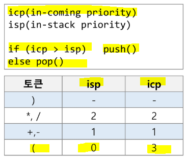
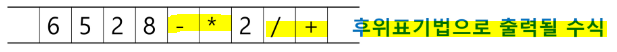
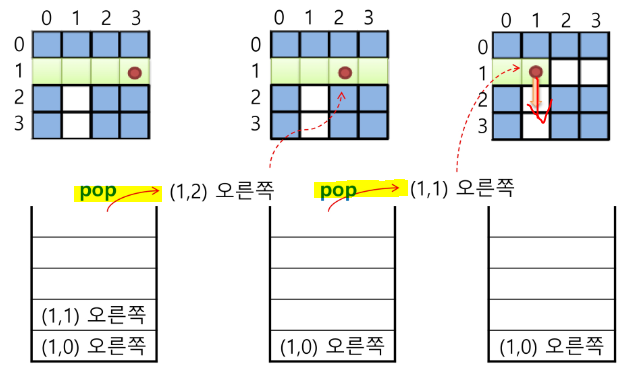
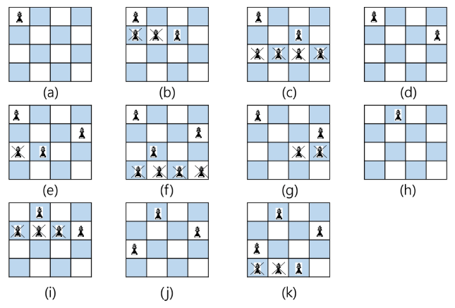
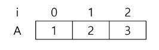
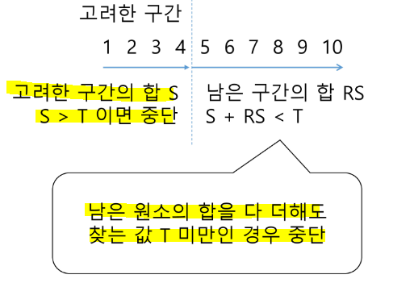

# 후위표기식

> **문자열로 된 계산식이 주어지는 경우 - 스택을 이용하여 값을 계산 가능❗**

* 문자열 수식 계산의 일반적 방법
  
  * 1️⃣ 중위 표기법의 수식을 후위 표기법으로 변경 (for stack 이용)
  
  * 2️⃣ 후위 표기법의 수식을 스택을 이용하여 계산

* 중위(infix)표기법 - 연산자를 피연산자의 가운데 표기 (A+B)

* **후위(postfix)표기법 - 연산자를 피연산자 뒤에 표기하는 방법 (AB+)**

## ▶ 중위표기식의 후위표기식 변환

### ✔ 스택 이용

* 입력 받은 중위 표기식에서 토큰(피연산자 or 연산자)을 읽는다.

* 토큰이 피연산자이면 토큰을 출력한다.

* **토큰이 연산자(괄호 포함)인 경우, 스택의 top에 저장되어 있는 연산자보다 우선순위가 높으면 스택에 push** / **그렇지 않다면 스택 top의 연산자의 우선순위가 토큰의 우선순위보다 작을 때까지 스택에서 pop한 후 토큰의 연산자를 push** / **만약 top에 연산자가 없으면 push**

* **토큰이 ')' 이면 스택 top에 '(' 가 나올 때까지 스택에 pop 연산을 수행**하고 pop 한 연산자를 출력한다. **왼쪽 괄호를 만나면 pop만 하고 출력하지는 않는다.**

* 중위 표기식에 더 읽을 것이 없다면 중지하고, 더 읽을 것이 있으면 1부터 다시 반복

* **stack 의 top 과 토큰을 비교하여 어떻게 할지 결정**!

* **스택에 남아있는 연산자를 모두 pop 하여 출력**
  
  * **스택 밖의 여는 괄호는 우선순위가 가장 높으며, 스택 안의 여는 괄호는 우선순위가 가장 낮다!**
    
    
  
  * isp = in-stack priority = 스택 안
  
  * icp = in-coming priority = 스택 밖

#### 📍 예시

* `(6 + 5 * (2-8) / 2)`



* `2 + 3 * 4 / 5`

`2 3 4 5 / * +` = `2 3 4 * 5 / +`

## ▶ 후위 표기법의 수식 계산

### ✔ 스택 이용

* **피연산자를 만나면 스택에 push**

* **연산자를 만나면 필요한 만큼의 피연산자를 스택에서 pop 하고(먼저 빼는 숫자를 연산자 뒤에 위치❗), 연산결과를 다시 스택에 push**

* **수식이 끝나면, 마지막으로 스택을 pop 하여 출력**

#### 📍 예시

* `6528-*2/+` : `-9`
* `2 + 3 * 4 / 5` : `4.4`

# 백트래킹 (Backtracking)

> **해를 찾는 도중에 막히면(해가 아니면) 되돌아가서 다시 해를 찾아가는 기법**

* **최적화(optimization) 문제와 결정(decision) 문제를 해결**할 수 있다.

## ▶ 결정 문제

* **문제의 조건을 만족하는 해가 존재하는지의 여부를 'yes' 또는 'no'로 답하는 문제**
  
  * 미로 찾기
  
  * n-Queen 문제
  
  * Map coloring
  
  * 부분 집합의 합(subset sum) 문제

### ✔ 미로 찾기 알고리즘

* **작동 원리**
  
  * 이동할 수 있는 방향은 4가지 방향으로 제한
  
  * **스택을 이용하여 더 이상 진행할 수 없을 때 지나온 경로를 역으로 되돌아감**
    
    
- <mark>**백트래킹과 DFS 와의 차이**</mark>❗❗
  
  - **해결책으로 이어지지 않을 것 같으면 더 이상 그 경로를 따라가지 않음으로써 시도의 횟수를 줄임 = <mark>Pruning (가지치기)</mark>**
  
  - **DFS는 모든 경로를 추적 / 백트래킹은 불필요한 경로를 조기에 차단**
  
  - <mark>**DFS 는 경우의 수가 너무 많아 N! 가지의 경우의 수를 가진 문제에 대해 처리 불가**</mark>
  
  - **단, 백트래킹도 최악의 경우에는 지수함수 시간을 필요**로 하여 처리 불가

- **기법**
  
  - **어떤 노드의 유망성을 체크하여 유망하지 않다고 결정되면 그 노드의 부모로 되돌아가 다음 자식 노드로 감 = if 조건문이 추가된다**❗
  
  - 어떤 노드를 방문했을 때 그 노드를 포함한 경로가 해답이 될 수 없으면 그 노드는 유망하지 않다고 하며, 반대로 해답의 가능성이 있으면 유망하다고 함
  
  - **가지치기(pruning) - 유망하지 않는 노드가 포함되는 경로는 더 이상 고려하지 않음**
* **절차**
  
  * **상태 공간 트리의 깊이 우선 검색(DFS)을 실시**
  
  * **각 노드가 유망한지 체크 = if 조건문 추가**
  
  * **노드가 유망하지 않으면 그 노드의 부모 노드로 돌아가서 검색을 계속**

### ✔ N-Queen 문제

```python
# 의사코드
def checknode(v):
    if promising(v):
        if there is a solution at v:
            write the solution
        else:
            for u in each child of v:
                checkcnode(u)
```



### ✔ 부분집합 구하기

> 어떤 집합의 원소 개수가 n 일 경우 = **부분집합의 개수는 2\*\*n**

* loop 를 이용한 부분집합 생성

```python
bit = [0, 0, 0, 0]              # 비트 생성
for i in range(2):
    bit[0] = i
    for j in range(2):
        bit[1] = j
        for k in range(2):
            bit[2] = k
            for l in range(2):
                bit[3] = l
                print(bit)
```

* **powerset(부분집합) 을 구하는 백트래킹 알고리즘**

```python
def backtrack(a, k, input): # a - 선택된 자리를 나타낸 리스트, k - 현재 자리수, input - 개
    global MAXCANDIDATES
    c = [0] * MAXCANDIDATES

    if k == input:
        process_solution(a, k)    # 답이면 원하는 작업을 진행
    else:
        k += 1
        ncandidates = construct_candidates(a, k, input, c)
        for i in range(ncandidates):
            a[k] = c[i]
            backtrack(a, k, input)

def construct_candidates(a, k, input, c):
    c[0] = True    # 사용하는 경우
    c[1] = False   # 사용안하는 경우
    return 2

MAXCANDIDATES = 2
NMAX = 4
a = [0] * NMAX
backtrack(a, 0, 3)numbers = list(range(1, 6))          # 숫자
selected = [False] * len(numbers)    # 사용 유무
result = []

def powerset(idx):                  # 몇 번째 idx가 선택/선택되지 않았는지 판단
    if idx < len(numbers):          # 사용되는 숫자를 정할 수 있음
         selected[idx] = True       # 해당 인덱스가 사용되었을 때
         powerset(idx+1)            # 다음 자리 확인
         selected[idx] = False      # 사용되지 않았을 때
         powerset(idx+1)
    else:
        # 부분집합을 뽑아내는 부분
        res = []
        for i in range(len(numbers)):
            if selected[i]:         # 사용된 경우
                res.append(numbers[i])
        result.append(res)          # 선택된 부분집합을 저장

powerset(0)                         # 모든 부분집합 호출
print(result)
```

### ✔ 부분집합 중 원소의 합이 주어진 부분집합 구하기



```python
# 부분 집합 전체를 출력하는 방법 = 비트로 표
def f(i, N):
    if i == N:        # i (index)가 모든 칸을 채운 경우 출력
        print(bit)
    else:
        bit[i] = 1    # A[i]가 부분집합에 포함되는 경우
        f(i+1, N)
        bit [i] = 0   # A[i]가 부분집합에 포함 안되는 경우
        f(i+1, N)

A = [1, 2, 3]
bit = [0] * 3
f(0, 3)


# 부분 집합의 원소로만 나타내기
def f(i, N):
    if i == N:
        for i in range(N):    # 10개 만큼 순회
            if bit[i]:        # bit[i] == 1인 경우
                print(A[i], end= ' ')
        print()               # 공집합
    else:
        bit[i] = 1          # A[i]가 부분집합에 포함되는 경우
        f(i+1, N)
        bit [i] = 0         # A[i]가 부분지합에 포함 안되는 경우
        f(i+1, N)


A = [1, 2, 3, 4, 5, 6, 7, 8, 9, 10]
bit = [0] * 10
f(0, 10)


# 부분 집합의 합이 10인 경우의 수는?
def f(i, N):
    global answer
    if i == N:
        s = 0                               # 부분집합의 합
        for i in range(N):
            if bit[i]:
                s += A[i]
        if s == 10:
            answer += 1                     # 부분집합의 합이 10 인 경우의 수
            for i in range(N):              # 부분집합의 합이 10인 모든 부분집합 출력
                if bit[i]:
                    print(A[i], end=' ')
            print()
    else:
        bit[i] = 1          # A[i]가 부분집합에 포함되는 경우
        f(i+1, N)
        bit [i] = 0         # A[i]가 부분지합에 포함 안되는 경우
        f(i+1, N)


A = [1, 2, 3, 4, 5, 6, 7, 8, 9, 10]
bit = [0] * 10
answer = 0
f(0, 10)
print(answer)
```

### 📌 부분집합의 합 - 가지치기 ver.

* **i 원소의 포함 여부를 결정하면 i까지의 부분 집합의 합 Si를 결정할 수 있음**

* **Si-1 이 찾고자 하는 부분집합의 합보다 크면 남은 원소를 고려할 필요 없음**

```python
def f(i, N, s, t):              # s - 이전까지 원소들의 합, t - 찾고자하는 값
    global answer
    global cnt
    cnt += 1                    # 총 호출 횟수
    if i == N:                  # 모든 원소가 고려된 경우
        if s == t:              # 부분집합의 합이 t 인 경우
            answer += 1         # 합이 10인 경우의 수
        return
    elif s > t:                 # 지금까지의 원소 합이 찾고자하는 t 보다 크면 돌아가!
        return
    else:
        f(i+1, N, s+A[i], t)    # A[i] 가 포함된 경우
        f(i+1, N, s, t)         # A[i] 가 포함되지 않은 경우

A = [1, 2, 3, 4, 5, 6, 7, 8, 9, 10]
bit = [0] * 10
answer = 0
cnt = 0
f(0, 10, 0, 10)
print(answer, cnt)
```

* 추가 고려 사항
  
  * 고려한 구간(1, 2, 3, 4)의 합 S: **S > T 이면 중단**
  
  * 남은 구간(5, 6, 7, 8, 9, 10)의 합 RS: **S + RS < T 이면 중단**
    
    

### ✔ 순열

```python
# 순열을 만드는 코드
def Permutation(i, N):
    if i == N:      # 순열이 완성된 경우
        print(P)
    else:
        for j in range(i, N):       # P[i]에 들어갈 숫자 P[j] 결정
            P[i], P[j] = P[j], P[i]
            f(i+1, N)               # 다음 자리 만들기
            P[i], P[j] = P[j], P[i] # 원상 복구

P = [1, 2, 3]
Permutation(0, 3)
```
