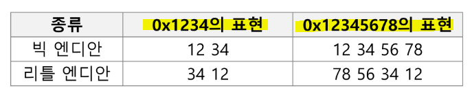
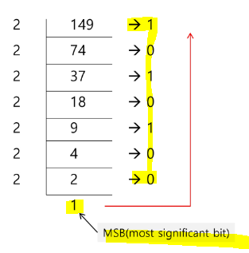
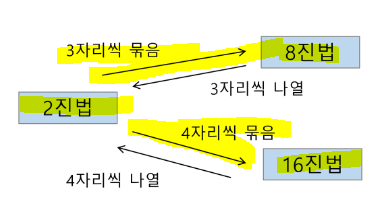
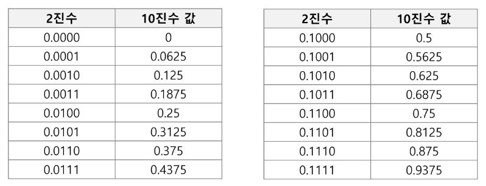
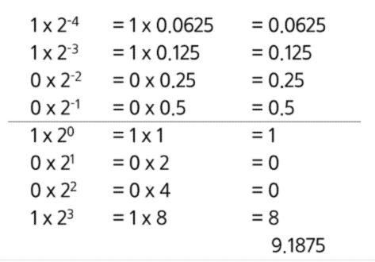
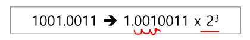

# SW 문제 해결 과정

① 문제를 읽고 이해한다.

② 문제를 익숙한 용어로 재정의한다.

③ 어떻게 해결할지 계획을 세운다.

④ 계획을 검증한다.

⑤ 프로그램으로 구현한다.

⑥ 어떻게 풀었는지 돌아보고, 개선할 방법이 있는지 찾아본다.

# 복잡도 분석

## ▶ 알고리즘?

* 유한한 단계를 통해 문제를 해결하기 위한 절차(방법)
  
  * 컴퓨터가 어떤 일을 수행하기 위한 단계적 방법을 말함

## ▶ 알고리즘의 효율

* **공간적 효율성: 연산량 대비 얼마나 적은 메모리 공간을 필요로 하는가?**

* **시간적 효율성: 연상량 대비 얼마나 적은 시간이 걸리는가?**

* 효율성 `<->` 복잡도

### 📌 복잡도 표기법

* 1️⃣ **O(Big-Oh) 표기**
  
  * 복잡도의 점근적 상한을 나타냄 = **최악의 경우**
  
  * 임의의 상수 c를 곱한 cn**2 은 n이 증가함에 따라 f(n)의 상한이 된다.

* 2️⃣ **Ω(Big-Omega) 표기**
  
  * 복잡도의 점근적 하한을 의미 = **최적의 경우 (최소한 이만한 시간은 걸린다❗)**
  
  * 복잡도 다항식의 최고차항만 계수 없이 취하면 된다.

* 3️⃣ **θ(Big-Theta) 표기**
  
  * O 표기와 Ω 표기가 같은 경우에 사용
  
  * n**2 과 동일한 증가율을 가진다.

# 표준 입출력 방식

## ▶ 입력

* Raw 값의 입력: `input()`
  
  * 받은 입력값을 문자열로 취급

* Evaluated된 값 입력: eval(input())
  
  * 받은 입력값을 평가된 데이터 형으로 취급

* 파일의 내용을 표준 입력으로 읽어오는 법
  
  ```python
  import sys
  sys.stdin = open('input.txt', 'r')
  sys.stdout = open('input.txt', 'w)
  
  text = input()
  print(text)
  ```

## ▶ 출력

* `print()` - 표준 출력 함수. 출력값의 마지막에 개행 문자 포함

* `print('text', end='')` - 출력 시 마지막에 개행문자 제외

* `print('%d' % number)` - Formatting 출력

# 비트 연산

| 연산자  | 기능                                                                                                                |
|:----:|:----------------------------------------------------------------------------------------------------------------- |
| `&`  | 비트 단위로 AND 연산을 함<br>`bit & 1` = 원래 bit 유지<br>특정 bit를 0으로 만들 때 or 비트 검사 시 사용                                       |
| `\|` | 비트 단위로 OR 연산을 함<br>`bit \| 0` = 원래 bit 유지<br>특정 bit를 1로 만들 때는 `bit \| 1` 로 표현 가능                                  |
| `^`  | 비트단위로 XOR 연산을 함 (같으면 0 다르면 1)<br>특정 bit를 반전시킬 때 사용<br>ex) `bit = 0 if bit else 1`<br>`bit = bit ^ 1` = `bit ^= 1` |
| `~`  | 단항 연사자로서 피연산자의 모든 비트를 반전시킴<br>ex) `~num`                                                                          |
| `<<` | 피연산자의 비트 열을 왼쪽으로 이동시킴<br>ex) num << 2                                                                             |
| `>>` | 피연산자의 비트 열을 오른쪽으로 이동시킴<br>ex) num>>#                                                                              |

* **`1<<n`**
  
  * 2**n 의 값을 가진다.
  
  * **원소가 n개일 경우의 모든 부분집합의 수를 의미**
  
  * Power set (모든 부분집합)
    
    * 공집합과 자기 자신을 포함한 모든 부분집합
    
    * **각 원소가 포함되거나 포함되지 않는 2가지 경우의 수를 계산**

* **`i & (1<<j)`**
  
  * 계산 결과는 **i의 j번째 비트가 1인지 아닌지를 검사하는 것을 의미**

```python
def Bbit_pring(i):
    output = ""
    for j in range(7, -1, -1):
        output += "1" if i & (1 << j) else "0"
    print(output)

for i in range(-5, 6):
    print("%3d = " % i, end='')
    Bbit_print(i)
```

## ▶ 엔디안(Endianness)

### 1️⃣ 빅 엔디안(Big-endian)

* 보통 큰 단위가 앞에 나옴. 네트워크

### 2️⃣ 리틀 엔디안(Little-endian)

* 작은 단위가 앞에 나옴. 대다수 데스크탑 컴퓨터



```python
import sys
print(sys.byteorder)
```


# 진수

> 2진수, 8진수, 10진수, 16진수

## ▶ 10진수를 타 진수로 변환

* 원하는 타진법의 수로 나눈 뒤 나머지를 거꾸로 읽는다.
  
  

## ▶ 타 진수를 10진수로 변환

* 2진수, 8진수, 16진수간 변환



* 컴퓨터에서의 음의 정수 표현
  
  * 1의 보수: 부호와 절대값으로 표현된 값을 부호 비트를 제외한 나머지 비트들을 

은 1로, 1은 0으로 변환한다.


# 실수

* 소수점 이하 4자리를 10진수로 표현



* 2진 실수를 10진수로 변환하는 방법 
  
  * 예) `1001.0011`



## ▶ 실수의 표현

* 컴퓨터는 실수를 표현하기 위해 부동 소수점 표기법을 사용

* 부동 소수점 표기 방법은 소수점의 위치를 고정시켜 표현하는 방식
  
  * 소수점의 위치를 왼쪽의 가장 유효한 숫자 다음으로 고정시키고 밑수의 지수승으로 표현



## ▶ 실수를 저장하기 위한 형식

* 단정도 실수(32비트)

* 배정도 실수(64비트)


