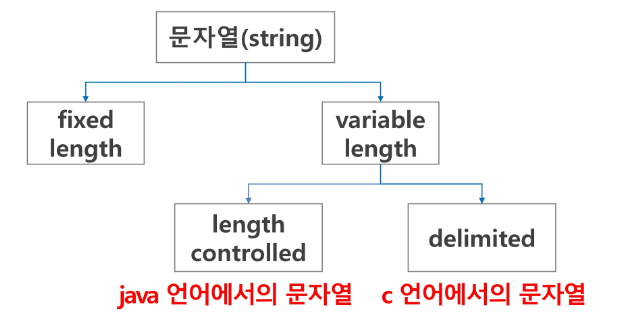
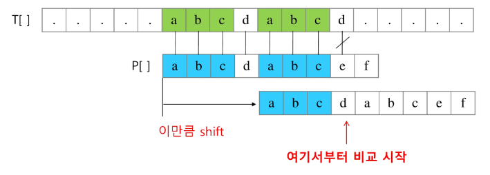
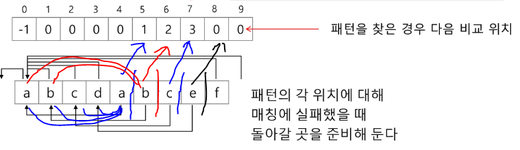
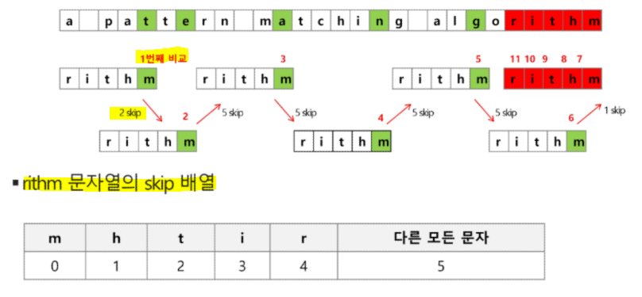
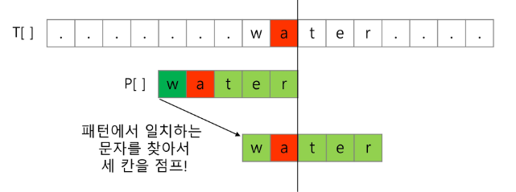

# 문자열

## ✅ 컴퓨터에서의 문자 표현

* 글자 A는 메모리에서 어떻게 저장되나❓

* **메모리는 숫자만을 저장할 수 있기 때문에 A 라는 글자의 대응되는 숫자를 정해 놓고 이것을 메모리에 저장한다.**

* **영어가 대소문자 합쳐서 52개 이므로 6비트(2\*\*6 = 64가지)면 모두 표현 가능**하다. 이를 **코드 체계**라고 부른다.

* 처음에는 각 지역 별로 코드체계를 정해놓고 사용 - **네트워크(인터넷)가 발전하면서 서로 간에 정보를 주고 받을 때 정보를 달리 해석한다는 문제가 발생**
  
  * ASCII(아스키코드)라는 문자 인코딩 표준이 제정됨
  
  * **7비트 인코딩으로 128문자를 표현 & 33개의 출력 불가능한 제어 문자들과 공백을 비롯한 95개의 출력 가능한 문자**로 구성
  
  * **아스키 문자 (32~126번으로 구성)**
    
    * 32번 = ` ` (공백)
    
    * 65번 = `A`
    
    * 97번 = `a`
  
  * 확장 아스키 - 악센트, 도형, 특수 문자 등 부가적인 문자 128개를 추가한 부호
    
    * 1B 내의 8bit를 모두 사용함으로써 추가적인 문자 표현 가능

* 그런 다음, 인터넷이 계속 발전하면서 **국가간에 정보를 주고 받을 때 문제가 발생**
  
  * **유니코드 - 다국어 처리를 위해 표준 마련**
    
    * UCS-2 & UCS-4 로 구분
    
    * 바이트 순서에 대해서 표준화하지 못함 = 유니코드의 외부 인코딩 필요
      
      * 예) big-endian, little-endian
  
  * **유니코드 인코딩**
    
    * **UTF-8 (in web)**
      
      * **MIN - 8bit / MAX - 32bit (1 Byte * 4)**
    
    * UTF-16 (in windows, java)
      
      * MIN - 16bit / MAX - 32bit (2 Byte * 2)
    
    * UTF-32 (in unix)
      
      - MIN - 32bit / MAX - 32bit (4 Byte * 1)
  - Python 인코딩 - 3.x 버전에서는 유니코드 UTF-8 (생략 가능)


## ✅ 문자열의 분류



### ✔ Python에서의 문자열 처리

* char 타입 없음 = 텍스트 데이터 취급법이 통일

* 문자열 기호
  
  * `', ", ''', """` : 문자열 저장 방법
  
  * `+` = 문자열 + 문자열: 이어 붙여주는 역할
  
  * `*` = 문자열 * 수* : 수만큼 문자열이 반복

* **시퀀스 자료형 - 인덱싱, 슬라이싱 연산 가능**

* 메소드
  
  * `replace(), split(), isalpha(), find()`

* **튜플과 같이 요소값을 변경할 수 없는 immutable**

* C, Java와 차이점
  
  * C는 아스키 코드로 저장
  
  * java는 유니코드(UTF16, 2byte)로 저장
  
  * python은 유니코드(UTF8)로 저장

### ✔ 문자열 뒤집기

* 자기 문자열에서 뒤집는 방법 & 새로운 빈 문자열을 만들어 소스의 뒤에서부터 읽어서 타켓에 쓰는 방법

* 자기 문자열 뒤집기 - swap을 위한 임시 변수가 필요 & 반복수행을 문자열 길이의 반만을 수행

* `s[::-1], list(s), ''.join(s)` 등의 방법이 있음

### ✔ 문자열 비교

* `==`, `is` 연산자 차이점 확인

```python
s1 = 'abc'
s2 = 'abc'
s3 = 'def'
s4 = s1
s5 = s1[:2] + 'c'


# == 비교
print(s1 == s2) # True
print(s1 == s3) # False
print(s1 == s4) # True
print(s1 == s5) # True

print('--------------')

print(s2 == s3) # False
print(s2 == s4) # True
print(s2 == s5) # True

print('--------------')

print(s4 == s5) # True

print('--------------------------------------')
print(s1 is s2) # True
print(s1 is s3) # False
print(s1 is s4) # True
print(s1 is s5) # False - 두 개의 조합으로 이뤄져있으므로 값은 같지만 메모리는 새로운 곳에 별도로 저장

print('--------------')
print(s2 is s3) # False
print(s2 is s4) # True
print(s2 is s5) # False - 두 개의 조합으로 이뤄져있으므로 값은 같지만 메모리는 새로운 곳에 별도로 저장

print('--------------')
print(s4 is s5) # False - 두 개의 조합으로 이뤄져있으므로 값은 같지만 메모리는 새로운 곳에 별도로 저장
```

# 패턴 매칭

## ✅ Brute Force 알고리즘

> 본문 문자열을 **처음부터 끝까지 차례대로 순회하면서 패턴 내의 문자들을 일일이 비교**하는 방식

```python
p = 'is'    # 찾을 패턴
t = 'This is a book~!'    # 전체 텍스트
M = len(p)
N = len(t)

def BruteForce(p, t):
    i = 0    # t의 인덱스 (비교)
    j = 0    # p의 인덱스 (비교)
    while j < M and i < N:    # 비교 범위를 넘어서면 탐색할 필요 X
        if t[i] != p[j]:      # 비교하는 값이 다른 경우
            i = i - j
            j = -1
        i = i + 1             # 다음 값과 비교하기 위해 인덱스 이동
        j = j + 1
    if j == M:                # 검색 성공
        return i - M
    else:                     # 검색 실패
        return -1
```

### ▶ 시간 복잡도 = O(MN)

* 최악의 경우 - 텍스트의 모든 위치에서 패턴을 비교해야 함


## ✅ KMP 알고리즘

> **불일치가 발생한 텍스트 스트링의 앞 부분에 어떤 문자가 있는지를 미리 알고 있으므로, 불일치가 발생한 앞 부분에 대하여 다시 비교하지 않고 매칭을 수행**

* 패턴을 전처리하여 배열 next[M]을 구해서 잘못된 시작을 최소화함
  
  * next[M] - 불일치가 발생한 경우 이동할 다음 위치



### ✔ 전처리 - 매칭이 실패했을 때 돌아갈 곳을 미리 계산

* **접두사와 접미사의 일치하는 최대 길이를 찾아 비교 횟수를 줄이는 방법❗**

* **매 단계 i += 1**
  
  * **일치하는 경우에는 j 도 +1**
    
    * **연속으로 일치하지 않으면 j -1, i +1**
    
    * **연속으로 일치하면 j +1, i +1**
  
  * 일치하지 않으면 i만 +1



```python
def pre_process(pattern):
    # 전처리를 위한 테이블을 작성(LPS Table: Longest prefix suffix)
    lps = [0] * len(pattern)
    j = 0                               # lps를 만들기 위한 prefix index

    for i in range(1, len(pattern)):    # 0번째 자리는 pattern 확인 필요 X
        # prefix index 위치에 있는 문자와 비교
        if pattern[i] == pattern[j]:    # 같은 문자 있는 경우
            lps[i] = j + 1              # i 의 앞에 중복되는 패턴이 존재
            j += 1                      # j 는 중복된 글자의 자리수
        else:                           # 같은 문자 없는 경우
            j = 0                       # j 초기화 / lps는 어차피 처음부터 돌아감
            # 0으로 이동한 다음 prefix idx 비교를 한 번 더 진행
            if pattern[i] == pattern[j]:
                lps[i] = j + 1
                j += 1

    return lps
```

### ✔ 기존 문자열과 비교

```python
def KMP(text, pattern):
    lps = pre_process(pattern)          # 전처리로 lps table 생성

    i = 0                               # text index
    j = 0                               # pattern
    while i < len(text):
        if pattern[j] == text[i]:       # 서로 같은 문자라면 다음 문자 비교
            i += 1
            j += 1
        else:                           # 같은 문자가 아니라면
            if j != 0:                  # j 가 0이 아닌 경우
                j = lps[j - 1]          # j 는 lps의 값으로 변경됨
            else:
                i += 1

        if j == len(pattern):           # pattern이 전부 일치할 때
            return i - j                # text의 위치
    
    return -1                           # 일치하는 문장이 없는 경우

text = 'ABC ABCDAB ABCDABCDABDE'
pattern='ABCDABC'
```

### ▶ 시간 복잡도 = O(M + N)


## ✅ 보이어-무어 알고리즘

> 오른쪽에서 왼쪽으로 비교
> 
> 대부분의 상용 소프트웨어에서 채택하고 있음

 

### ▶ 시간 복잡도 = O(mn)

* **찾고자 하는 문자열 패턴의 길이 m, 총 문자열 길이 n**

* 텍스트 문자를 다 보지 않아도 된다.

* **최악의 경우 - O(mn)**

* **평균 - O(n) 보다 시간이 덜 든다.**


* **패턴에 오른쪽 끝에 있는 문자가 불일치 하고, 이 문자가 패턴 내에 존재하지 않는 경우 이동 거리는 패턴의 길이만큼 된다.**


* **오른쪽 끝에 있는 문자가 불일치 하고, 이 문자가 패턴 내에 존재할 경우 패턴에서 일치하는 문자를 찾아서 이동한다.**



### ✔ 전처리

```python
def pre_process(pattern):
    M = len(pattern)           # 패턴의 길이

    skip_table = dict()
    for i in range(M-1):
        skip_table[pattern[i]] = M - i - 1      # 패턴의 길이 - 인덱스 - 1 해야 원하는 위치

    return skip_table

```

### ✔ 기존 문자열과 비교

```python
def boyer_moore(text, pattern):
    skip_table = pre_process(pattern)
    M = len(pattern)

    i = 0       # text index
    while i <= len(text) - M:                   # 비교할 전체 길이 = text 개수 - pattern의 개수
        j = M - 1                               # pattern index = 뒤에서 비교해야하므로 j를 끝에 index로 설정!
        k = i + (M - 1)                         # 비교를 시작할 위치 = 현재 위치 + M번째 인덱스

        # 비교할 j가 남아있고, text와 pattern이 일치하면 그 다음 앞에 글자를 비교하기 위해 index 감소
        while j >= 0 and pattern[j] == text[k]:
            j -= 1
            k -= 1

        if j == -1:                             # 일치함을 의미
            return i
        # 일치하지 않는 경우
        else:
            # i를 비교할 시작 위치를 skip_table에서 가져온다.
            i += skip_table.get(text[i+M-1], M)

    return -1                                   # 일치되는 패턴이 없음을 의미

text = 'ABC ABCDAB ABCDABCDABDE'
pattern='ABCDABC'
```


