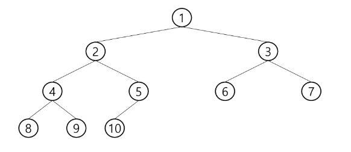

# 트리 - Tree

## ▶ 개념

* **비선형 구조**

* 원소들 간에 `1:n`(하나의 노드 : 여러 개의 노드) 관계를 가지는 자료구조

* 원소들 간에 계층관계를 가지는 계층형 자료구조

* **상위 원소에서 하위 원소로 내려가면서 확장되는 트리(나무) 모양의 구조**

## ▶ 정의

* 한 개 이상의 노드로 이루어진 유한 집합
  
  * **노드 중 최상위 노드를 루트(root)라고 한다.**
  
  * 나머지 노드들은 n(>= 0)개의 분리 집합 T1, ..., TN 으로 분리될 수 있다.

* **T1, ..., TN 은 각각 하나의 트리가 되며(재귀적 정의) 루트의 부트리(subtree)라 한다.**


### 📌 용어 정리

* **노드(node) - 트리의 원소**
  
  * 트리 T의 노드 = A, B, C, D, E, F, G, H, I, J

* **간선(edge) - 노드를 연결하는 선 <mark>(부모 노드와 자식 노드를 연결)</mark>**

* **루트 노드(root node) - 트리의 시작 노드**
  
  * 트리 T의 루트 노드 = A

* **형제 노드(sibling node) - 같은 부모 노드의 자식 노드들**
  
  * B, C, D = 형제 노드

* **조상 노드 - 간선을 따라 루트 노드까지 이르는 경로에 있는 모든 노드들**
  
  * K 의 조상 노드 = F, B, A

* **서브 트리(subtree) - 부모 노드와 연결된 간선을 끊었을 때 생성되는 트리**

* **자손 노드 - 부트리에 있는 하위 레벨의 노드들**
  
  * B 의 자손 노드 = E, F, K

* <mark>**차수(degree)**</mark>
  
  
  
  * **노드의 차수 - <mark>노드에 연결된 자식 노드의 수</mark>**
    
    * B 의 차수 = 2, C 의 차수 = 1
  
  * **트리의 차수 - 트리에 있는 <mark>노드의 차수 중에서 가장 큰 값</mark>**
    
    * 트리 T의 차수 = 3
  
  * **단말 노드(리프 노드) - 차수가 0인 노드 = 자식 노드가 없는 노드**

* <mark>**높이**</mark>
  
  
  
  * **노드의 높이 - <mark>루트에서 노드에 이르는 간선의 수</mark> = 노드의 레벨**
    
    * B 의 높이 = 1, F 의 높이 = 2
  
  * **트리의 높이 - 트리에 있는 <mark>노드의 높이 중에서 가장 큰 값</mark> = 최대 레벨**
    
    * 트리 T 의 높이 = 3

# 이진 트리

> **모든 노드들이 2개의 부트리를 갖는 특별한 형태의 트리**

* **각 노드가 자식 노드를 최대한 2개까지만 가질 수 있는 트리**
  
  * 왼쪽 자식 노드 (left child node)
  
  * 오른쪽 자식 노드 (right child node)


## ▶ 특성

* **레벨 i 에서의 노드의 최대 개수**는 `2**i` 개

* **높이가 h 인 이진 트리가 가질 수 있는 노드의 최소 개수**는 `(h+1)` 개가 되며, **최대 개수**는 `(2**(h+1) - 1)` 개가 된다.


## ▶ 종류

### ✔ 포화 이진 트리(Full Binary Tree)

* **모든 레벨에 노드가 포화상태로 차있는 이진 트리**

* **높이가 h 일 때, 최대의 노드 개수**인 `(2**(h+1) - 1)`의 노드를 가진 이진 트리
  
  * 높이가 3일 때 15개의 노드를 가짐

* <mark>**루트를 1번**</mark>으로 하여 `(2**(h+1) - 1)`까지 <mark>**정해진 위치에 대한 노드 번호를 가짐**</mark>


### ✔ 완전 이진 트리(Complete Binary Tree)

* * **높이가 h이고 노드 수가 n개일 때**(단, `h+1 <= n < 2**(h+1) - 1`), <mark>**포화 이진 트리의 노드 번호 1번부터 n번까지 빈 자리가 없는 이진 트리**</mark>
  
  * ex. 노드가 10개인 완전 이진 트리



### ✔ 편향 이진 트리(Skewed Binary Tree)

* **높이 h에 대한 최소 개수의 노드를 가지면서 <mark>한쪽 방향의 자식 노드만을 가진</mark> 이진 트리**
  
  * 왼쪽 편향 이진 트리
  
  * 오른쪽 편향 이진 트리

* 선형 구조로서 효율이 떨어진다고 볼 수 있음 = 트리 구조 중 최악의 시간 구조


## ▶ 순회(traversal)

> **트리의 각 노드를 중복되지 않게 전부 방문**하는 것을 의미

* **트리는 비선형 구조이기 때문에 선형구조에서와 같이 선후 연결을 알 수 없다.**

### 📍 이진트리의 순회 - 3가지 방법❗❗

* 1️⃣ **전위순회(preorder traversal)** = `VLR`
  
  * **부모 노드 방문 후 자식노드를 좌/우 순서로 방문**

* 2️⃣ **중위순회(inorder traversal)** = `LVR`
  
  * **왼쪽 자식노드, 부모노드, 오른쪽 자식노드 순으로 방문**

* 3️⃣ **후위순회(postorder traversal)** = `LRV`
  
  * **자식노드를 좌우 순서로 방문한 후, 부모노드 방문**


## ▶ 전위 순회 (preorder traversal)

> **먼저 만나는 노드를 방문 처리**한 후 왼쪽, 오른쪽 순서로 방문 처리

* 수행 방법
  
  * ① 현재 노드 n을 방문하여 처리 = V
  
  * ② 현재 노드 n의 왼쪽 서브트리로 이동 = L
  
  * ③ 현재 노드 n의 오른쪽 서브트리로 이동 = R

* 전위 순회 알고리즘

```python
def preorder_traverse(T):
    if T:    # T is not None
        visit(T)    # print(T.item)
        preorder_traverse(T.left)
        preorder_traverse(T.right)
```

* ex.
  
  * 순서 1 : T0 => T1 => T2
  
  * 순서 2 : A => B, D, T3 => C F G
  
  * 총 순서 : A B D E H I C F G 


## ▶ 중위 순회 (inorder traversal)

> 맨 왼쪽으로 이동하여 **왼쪽에서 되돌아 올 때** 방문처리 후 중간-오른쪽 방문

* 수행 방법
  
  * ① 현재 노드 n의 왼쪽 서브트리로 이동 = L
  - ② 현재 노드 n을 방문하여 처리 = V
  
  - ③ 현재 노드 n의 오른쪽 서브트리로 이동 = R

* 중위 순회 알고리즘

```python
def inorder_traverse(T):
    if T:
        inorder_traverse(T.left)
        visit(T)
        inorder_traverse(T.right)
```

* ex.
  
  * 순서 1 : T1 => T0 => T2
  - 순서 2 : D B T3 => A => F C G
  
  - 총 순서 : D B H E I A F C G


## ▶ 후위 순회 (postorder traversal)

> **맨 왼쪽으로 이동하여 왼쪽, 오른쪽에서 되돌아** 온 후 방문 처리

- 수행 방법
  
  * ① 현재 노드 n의 왼쪽 서브트리로 이동 = L
  - ② 현재 노드 n의 오른쪽 서브트리로 이동 = R
  
  - ③ 현재 노드 n을 방문하여 처리 = V

- 중위 순회 알고리즘

```python
def postorder_traverse(T):
    if T:
        postorder_traverse(T.left)
        postorder_traverse(T.right)
        visit(T)
```

* ex.
  
  * 순서 1 : T1 => T2 => T0
  - 순서 2 : D T3 B => F G C => A
  
  - 총 순서 : D H I E B F G C A


## ▶ 예시


* 전위 순회(파랑) - A B D H I E J C F K G L M

* 중위 순회(빨강) - H D I B J E A F K C L G M

* 후위 순회(검정) - H I D J E B K F L M G C A

## ▶ 이진트리의 표현

### ✔ 배열을 이용한 이진 트리의 표현 (포화 및 완전 이진 트리)

* **루트의 번호를 1로 함**

* **레벨 n에 있는 노드에 대하여 왼쪽부터 오른쪽으로** `2**n` 부터 `2**(n+1) - 1` 까지 번호를 **차례로 부여**


* **노드 번호의 성질 (포화 및 완전 이진 트리인 경우)** ❗❗
  
  * **노드 번호가 i인 노드의 부모 노드 번호**❓ `i//2`
  
  * **노드 번호가 i인 노드의 왼쪽 자식 노드 번호**❓ `2*i`
  
  * **노드 번호가 i인 노드의 오른쪽 자식 노드 번호**❓ `2*i + 1`
  
  * **레벨 n의 노드 번호 시작 번호는**❓ `2**n`


* **노드 번호를 배열의 인덱스로 사용**

* 높이가 h 인 이진 트리를 위한 배열의 크기는❓
  
  * **레벨 i의 최대 노드 수는?** `2**i`
  
  * 따라서 1 + 2 + 4 + 8 ... + 2**i = `2**(h+1) - 1`


* 편향 트리의 경우에도 배열의 크기는 동일하게 생성 = 메모리 공간 낭비


### 📌 이진 트리의 저장

* 트리에서 `정점의 개수 = 간선의 개수 + 1`

* 1️⃣ **부모 번호를 인덱스로 자식 번호를 저장하는 방법**
  
  * ex. 간선의 개수 N = 4 / 1 2 1 3 3 4 3 5 = 부모 자식 순
    
    
    
    ```python
    E = int(input())
    V = E + 1
    arr = list(map(int, input().split()))
    # root = 1
    
    # 부모를 인덱스로 자식 번호를 저장
    ch1 = [0] * (V + 1)
    ch2 = [0] * (V + 1)
    # 자식을 인덱스로 부모 번호를 저장
    par = [0] * (V + 1)
    
    for i in range(E):
        p, c = arr[i*2], arr[i*2+1]
    # for j in range(0, E*2, 2):
    #     p, c = arr[j], arr[j+1]
    
        if ch1[p] == 0:     # 아직 자식이 없으면
            ch1[p] = c      # 자식1로 저장
        else:
            ch2[p] = c
        par[c] = p
    ```

* 2️⃣ **자식 번호를 인덱스로 부모 번호를 저장하는 방법**
  
  * ex. 간선의 개수 N = 4 / 1 2 1 3 3 4 3 5 = 부모 자식 순
    
    
    
    

* **루트 찾기, 조상 찾기**
  
  * ex. 5번 노드의 조상 찾기
    
    
    
    ```python
    # root 찾는 방법
    def find_root(V):
        for i in range(1, V + 1):
            if par[i] == 0:  # 부모가 없으면 root
                return i
    
    # 자식 번호을 인덱스로 부모 번호를 저장
    par = [0] * (V + 1)
    
    # 루트 찾기
    root = find_root(V)
    print(root)
    ```

* **배열을 이용한 이진 트리 표현의 단점**
  
  * **편향 이진 트리의 경우에 사용하지 않는 배열 원소에 대한 메모리 공간 낭비 발생**
  
  * 트리의 중간에 새로운 노드를 삽입하거나 기존의 노드를 삭제할 경우 배열의 크기 변경 어려워 비효율적

* 배열을 이용한 이진 트리 표현의 단점을 보완할 순 없을까❓
  
  * 연결리스트를 이용하여 트리를 표현

## ▶ 연결 자료구조를 이용한 이진트리의 표현

* **이진 트리의 모든 노드는 최대 2개의 자식 노드를 가지므로 일정한 구조의 단순 연결 리스트 노드를 사용하여 구현**


* 이진 트리 표현에 대하여 전위 순회하여 정점의 번호를 출력

```python
'''
정점의 개수
간선은 항상 부모 자식 순서로 표기
전위 순회하여 정점의 번호를 출력
13
1 2 1 3 2 4 3 5 3 6 4 7 5 8 5 9 6 10 6 11 7 12 11 13
'''
# root 찾는 방법
def find_root(V):
    for i in range(1, V + 1):
        if par[i] == 0:  # 부모가 없으면 root
            return i


def preorder(n):        # 전위순회
    if n:
        print(n, end=' ')        # visit(n)
        preorder(ch1[n])
        preorder(ch2[n])


def inorder(n):         # 중위 순회
    if n:
        inorder(ch1[n])
        print(n, end=' ')  # visit(n)
        inorder(ch2[n])


def postorder(n):       # 후위순회
    if n:
        postorder(ch1[n])
        postorder(ch2[n])
        print(n, end=' ')        # visit(n)


V = int(input())        # 정점의 개수 = 마지막 정점 번호
E = V - 1
arr = list(map(int, input().split()))

# 부모를 인덱스로 자식 번호를 저장
ch1 = [0] * (V + 1)
ch2 = [0] * (V + 1)
# 자식을 인덱스로 부모 번호를 저장
par = [0] * (V + 1)

for i in range(E):
    p, c = arr[i*2], arr[i*2+1]
# for j in range(0, E*2, 2):
#     p, c = arr[j], arr[j+1]

    if ch1[p] == 0:     # 아직 자식이 없으면
        ch1[p] = c      # 자식1로 저장
    else:
        ch2[p] = c
    par[c] = p

# 루트 찾기
root = find_root(V)
# print(root)

preorder(root)
print()
# inorder(root)
print()
# postorder(root)
print()
```

# 수식 트리

> 수식을 표현하는 이진 트리 = 수식 이진 트리

* 연산자는 루트 노드이거나 가지 노드

* 피연산자는 모두 잎 노드
  
  * (L * R) + (L - R)


## ▶ 수식 트리의 순회

* 중위 순회 : A / B * C * D + E (=식의 중위 표기법)

* 후위 순회 : A B / C * D * E + (=식의 후위 표기법)

* 전위 순회 : + * * / A B C D E (=식의 전위 표기법)


# 이진 탐색 트리

> 탐색 작업을 효율적으로 하기 위한 자료구조


* 모든 원소는 서로 다른 유일한 키를 갖는다.

* key(왼쪽 서브트리) < key(루트 노드) < key(오른쪽 서브트리)

* 왼쪽 서브트리와 오른쪽 서브트리도 이진 탐색 트리다.

* **중위 순회하면 오름차순으로 정렬된 값을 얻을 수 있다.**
  
  * 루트 값을 잘 정해야 균형 잡힌 트리를 만들 수 있다.


## ▶ 이진 탐색 트리 연산

* 루트에서 시작한다.

* 탐색할 키 값 x를 루트 노드의 키 값과 비교한다.
  
  * 키 값 x = 루트 노드의 키 값 : 원하는 원소를 찾았으므로 탐색 연산 성공
  
  * 키 값 x < 루트 노드의 키 값 : 루트 노드의 왼쪽 서브트리에 대해서 탐색 연산 수행
  
  * 키 값 x > 루트 노드의 키 값 : 루트 노드의 오른쪽 서브트리에 대해서 탐색 연산 수행

* 서브트리에 대해서 순환적으로 탐색 연산을 반복


### ✔ 삽입 연산

* ① 먼저 탐색 연산을 수행
  
  * 삽입할 원소와 같은 원소가 트리에 있으면 삽입할 수 없으므로, 같은 원소가 트리에 있는지 탐색하여 확인
  
  * 탐색에서 탐색 실패가 결정되는 위치가 삽입 위치가 된다.

* ② 탐색 실패한 위치에 원소를 삽입


## ▶ 성능

* 탐색, 삽입, 삭제 시간은 트리의 높이 만큼 시간이 걸림
  
  * O(h), h는 height

* 평균의 경우
  
  * 이진 트리가 균형적으로 생성된 경우
  
  * O(log n)

* 최악의 경우
  
  * 한 쪽으로 치우친 이진트리의 경우, 순차 탐색과 시간복잡도 동일
  
  * O(n)

* 검색 알고리즘의 비교
  
  * 배열에서의 순차 검색 - O(n)
  
  * 정렬된 배열에서의 순차 검색 - O(n)
  
  * 정렬된 배열에서의 이진 탐색 - O(log N)
    
    * 고정 배열 크기와 삽입, 삭제 시 추가 연산 필요
  
  * 이진 탐색트리에서의 평균 - O(log N)
    
    * 최악의 경우 - O(N)
    
    * 완전 이진 트리 or 균형트리로 바꿀 수 있으면 최악의 경우는 무시
      
      * 새로운 원소를 삽입할 때 삽입 시간을 줄인다.
      
      * 평균과 최악의 시간이 같아진다. O(log N)
  
  * 해시 검색 - O(1)
    
    * 추가 저장 공간이 필요

# 힙(heap)

> **완전 이진 트리에 있는 노드 중에서 키값이 가장 큰 노드나 키값이 가장 작은 노드를 찾기 위해서 만든 자료구조**

* **최대 힙(max heap)**
  
  * 키값이 가장 큰 노드를 찾기 위한 완전 이진 트리
  
  * `부모 노드의 키값 > 자식 노드의 키값`
  
  * **루트 노드 : 키값이 가장 큰 노드**
    
    

* **최소 힙(min heap)**
  
  * 키값이 가장 작은 노드를 찾기 위한 완전 이진 트리
  
  * `부모 노드의 키값 < 자식 노드의 키값`
  
  * **루트 노드 : 키값이 가장 작은 노드**
    
    

* 힙의 키를 우선순위로 활용하여 우선순위 큐를 구현할 수 있다.

## ▶ 힙 연산 - 삽입

* 최대 힙
  
  * ① 완전 이진 트리 유지 : `last += 1`
  
  * ② `부모 노드의 키값 > 자식 노드의 키값` : 키값 비교


* 부모 노드의 키값이 더 작은 경우
  
  * 부모 노드와 자식 노드 자리 바꾸기
    
    * 조건을 만족할 때까지 or 부모가 없을 때까지 자리 교환


```python
# 최대 힙
'''
2 5 7 3 4 6
'''
def enq(n):
    global last
    last += 1       # 마지막 정점 추가
    heap[last] = n  # 마지막 정점에 key 추가
    # 부모 < 자식 인 경우 자리 교환
    c = last        # 자식 정점 번호
    p = c // 2      # 부모 정점 번호 - 완전이진트리이기 때문
    # 1. 부모가 없거나
    # 2. 부모 > 자식 조건을 만족할 때까지
    while p and heap[p] < heap[c]:      # p = 0 이면 부모가 없다는 뜻
        heap[p], heap[c] = heap[c], heap[p]
        c = p       # 자식, 부모 정점 번호 업데이트
        p = c // 2


heap = [0] * 100
last = 0            # 하나도 안들어온 상태
```

## ▶ 힙 연산 - 삭제

* 힙에서는 루트 노드의 원소만을 삭제할 수 있다.

* 루트 노드의 원소를 삭제하여 반환

* 힙의 종류에 따라 최대값 또는 최소값을 구할 수 있다.
  
  * 완전 이진 트리
  
  * 최대힙 or 최소힙


```python
def deq():
    global last
    tmp = heap[1]       # 루트 백업
    # 삭제할 노드의 키를 루트에 복사
    heap[1] = heap[last]
    last -= 1           # 마지막 노드 삭제
    # 루트와 자식 노드의 값들 비교
    p = 1
    c = p * 2           # 왼쪽 자식

    while c <= last:    # 자식이 하나라도 있는 경우
        if c+1 <= last and heap[c] < heap[c+1]:     # 오른쪽 자식도 있고, 오른쪽 자식이 더 크면
            c += 1      # 비교 대상을 오른쪽 자식으로 선정
        if heap[p] < heap[c]:   # 자식이 더 크면 최대힙 규칙에 어긋나므로 교환
            heap[p], heap[c] = heap[c], heap[p]
            p = c       # 부모와 자식 정점을 업데이트
            c = p * 2   # 왼쪽 자식 정점 번호
        else:           # 부모가 더 크면 비교 중단
            break
    return tmp


heap = [0] * 100
last = 0            # 하나도 안들어온 상태

enq(2)
enq(5)
enq(7)
enq(3)
enq(4)
enq(6)
while last:         # last가 0보다 크면
    print(deq())
```
