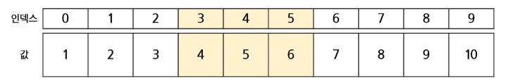
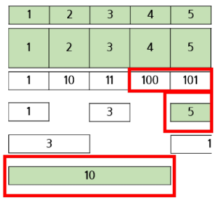

# Tree

## ▶ Tree 란?

> **노드 간 계층과 1:N 관계를 갖는 자료구조**

* 루트 노드, 단말 노드, 간선으로 구성

* **차수 (Degree)**
  
  * 노드에 연결된 자식 노드의 개수
  
  * 리프 노드 = 차수가 0

* **Level, Height, Depth**
  
  * 일반적으로 루트 노드부터 가장 높은 레벨을 의미

## ▶ Binary Tree (이진 트리)

> **모든 노드가 최대 2개의 자식 노드를 가질 수 있는 트리**

* 부분집합, 조합 = 2진 트리

* 순열 = N진 트리

* **노드의 개수 구하기**
  
  * 특정 레벨에서의 최대 노드의 개수는? `2**노드의 level`
  
  * 전체 노드의 개수는? `2**트리의 level의 개수 - 1`
  
  * 리프 노드의 개수가 전체 노드 개수의 반 = 리프와 리프가 아닌 것으로 구분

## ▶ Full Binary Tree (포화 이진 트리)

> **모든 노드가 2개의 노드를 가지고 있는 트리**

* Full Binary Tree의 노드 개수
  
  * `2**H - 1`

## ▶ Complete Binary Tree (완전 이진 트리)

> **높이가 H, 노드의 개수가 N일 때, 빈 자리 없이 채워지는 트리**

* 단, `H + 1 <= N < 2**(H+1) - 1`

## ▶ Skewed Binary Tree (편향 이진 트리)

> **높이가 H일 때, 최소 노드 개수를 가지면서 한 쪽 방향으로 노드는 가지는 트리**

## ▶ Traversal (순회)

> **트리의 각 노드를 중복되지 않게 전부 방문하는 것**

* 비 선형구조로, 선형구조처럼 선후 연결 관계를 알 수 없다.

* **트리의 순회 방법**
  
  * 1️⃣ 전위 순회: 부모 노드 방문 후 좌/우 순서로 방문
  
  * 2️⃣ 중위 순회: 왼쪽 자식 노드 방문 후 부모 노드/오른쪽 자식 노드 방문
  
  * 3️⃣ 후위 순회: 좌/우 자식 노드를 방문하고 부모 노드 방문

* **전위 순회 방법**
  
  * 현재 노드 n 을 방문하여 처리 = V (노드 번호 = `L//2`, `R//2`)
  
  * 현재 노드 n의 왼쪽 서브 트리로 이동 = L (노드 번호 = `나*2`)
  
  * 현재 노드 n의 오른쪽 서브 트리로 이동 = R (노드 번호 = `나*2 + 1`)

```python
preorder_traverse(T) {
    if (T is exist?) {
        visit(T)
        preorder_traverse(T.left)
        preorder_traverser(T.right)
    }
}
```

* **함수 호출 시 호출 스택에는 매개변수, 지역변수, 종료 후 돌아갈 곳이 표시된다!**

# Segment Tree

> **어떤 데이터가 존재할 때, 특정 구간의 결과값(구간 합)을 구하는데 사용하는 자료구조**

* Q. 아래와 같이 주어진 배열이 존재할 때, 3~5번째 구간의 합을 구하시오.



**A. 배열을 돌면서 3~5번째인 경우에 더해주면 된다**❗

* <mark>**배열의 크기가 커지면 어떻게 해야할까**❓</mark>

* <mark>**구간별 합을 구해 저장해두면 빠르게 찾을 수 있다**❗</mark>
  
  * 구간 별 합 = [1, 3, 6, 10, 15, 21, 28, 36, 45, 55]
  
  * *단, 값이 변경된 경우 변경된 숫자 뒤로는 모두 수정해야 하는 단점*

* Segment Tree는 Binary Tree(이진 트리) 구조를 가지고 있다.


* **Q. 5~8번째 수의 누적 합은?**

**A. 5번 + 18번을 하면 정답이 나온다.**

* **답을 찾는 과정 및 수정 시 변경 사항 등도 `log N`으로 처리 가능**❗

```python
from math import log2, ceil, gcd


class SegmentTree:
    def __init__(self, input_list, calculation_method='sum'):
        self.level = 0
        self.length = 0
        self.input_list = input_list
        self.input_list_length = len(self.input_list)
        self.input_start_index = 0
        self.tree_index = 1
        self.input_end_index = self.input_list_length - 1
        self.calculation_method = calculation_method
        self.result_list = []

    def method(self, left_result, right_result):
        if self.calculation_method == 'sum':
            return left_result + right_result
        elif self.calculation_method == 'max':
            return max(left_result, right_result)
        elif self.calculation_method == 'gcd':
            return gcd(left_result, right_result)

    def update_process(self, input_start_index, input_end_index, tree_index, update_index, update_value):
        # 구간에 영향을 미치지 않는 경우. 그냥 리턴
        if update_index < input_start_index or update_index > input_end_index:
            return self.result_list[tree_index]

        # 업데이트하고자하는 위치에 도달한 경우. 그냥 바꿔
        if input_start_index == input_end_index:
            self.result_list[tree_index] = update_value
            return self.result_list[tree_index]

        input_mid_index = (input_start_index + input_end_index) // 2

        left_result = self.update_process(input_start_index, input_mid_index, tree_index * 2, update_index, update_value)

        right_result = self.update_process(input_mid_index + 1, input_end_index, tree_index * 2 + 1, update_index, update_value)

        self.result_list[tree_index] = self.method(left_result, right_result)

        return self.result_list[tree_index]

    def update(self, update_index, update_value):
        self.tree_index = 1
        self.input_list[update_index] = update_value

        self.update_process(self.input_start_index, self.input_end_index, self.tree_index, update_index, update_value)

    def get_range_process(self, input_start_index, input_end_index, tree_index, range_start_index, range_end_index):
        # 완전하게 벗어난 위치는 무효
        if input_end_index < range_start_index or input_start_index > range_end_index:
            return 0
        # 구간에 완전히 들어감 (리프, 아닐수도...)
        # 그냥 값 가져와 밑에 내려가지마.
        if input_start_index >= range_start_index and input_end_index <= range_end_index:
            return self.result_list[tree_index]

        input_mid_index = (input_start_index + input_end_index) // 2

        left_result = self.get_range_process(input_start_index, input_mid_index, tree_index * 2, range_start_index, range_end_index)

        right_result = self.get_range_process(input_mid_index + 1, input_end_index, tree_index * 2 + 1, range_start_index, range_end_index)

        return self.method(left_result, right_result)

    def get_range(self, range_start_index, range_end_index):
        self.tree_index = 1
        return self.get_range_process(self.input_start_index, self.input_end_index, self.tree_index, range_start_index, range_end_index)

    def process(self, input_start_index, input_end_index, tree_index):
        # 1. 리프 노드라면 tree_index에 현재 값을 채우고 값을 가지고 올라온다.
        if input_start_index == input_end_index:
            self.result_list[tree_index] = self.input_list[input_start_index]
            return self.result_list[tree_index]
        # 2. 다음 왼/오를 구분하기 위해 중간값을 찾는다.
        input_mid_index = (input_start_index + input_end_index) // 2
        # 3. 왼쪽 값과 오른쪽 값을 가져온다.
        left_result = self.process(input_start_index, input_mid_index, tree_index * 2)
        right_result = self.process(input_mid_index + 1, input_end_index, tree_index * 2 + 1)
        # 4. 두 값의 연산결과를 현위치에 저장하고 해당 값을 리턴
        self.result_list[tree_index] = self.method(left_result, right_result)
        return self.result_list[tree_index]

    def make(self):
        self.level = ceil(log2(self.input_list_length)) + 1
        self.length = pow(2, self.level)
        self.result_list = [0] * self.length
        self.process(0, self.input_list_length-1, 1)


def main():
    #number_list = [1, 2, 3, 4, 5, 6, 7, 8, 9, 10]
    number_list = [1, 2, 5, 5, 5, 5, 5, 5, 9, 10]

    segment_tree_sum = SegmentTree(number_list, 'sum')
    segment_tree_sum.make()
    print(segment_tree_sum.result_list)
    print(segment_tree_sum.get_range(3, 5))
    segment_tree_sum.update(4, 7)
    print(segment_tree_sum.result_list)
    print(segment_tree_sum.get_range(3, 5))

    segment_tree_max = SegmentTree(number_list, 'max')
    segment_tree_max.make()
    print(segment_tree_max.result_list)
    print(segment_tree_max.get_range(3, 5))
    segment_tree_max.update(4, 7)
    print(segment_tree_max.result_list)
    print(segment_tree_max.get_range(3, 5))

    segment_tree_gcd = SegmentTree(number_list, 'gcd')
    segment_tree_gcd.make()
    print(segment_tree_gcd.result_list)
    print(segment_tree_gcd.get_range(3, 5))
    segment_tree_gcd.update(4, 7)
    print(segment_tree_gcd.result_list)
    print(segment_tree_gcd.get_range(3, 5))


if __name__ == '__main__':
    main()
```

# Fenwick Tree

> **Segment Tree처럼 구간에 대한 연산을 저장하는 트리**

* Segment Tree 보다 적은 메모리로 사용 가능하다.

* 비트를 이용한 구간 연산을 진행
  
  * **비트는 0과 1만 사용되는 만큼 1의 의미가 중요**❗


* 3~5번째 인덱스 구간 합은 어떻게 구할까❓
  
  * 두 구간의 차를 구하면 된다.
    
    

* 5번 인덱스까지의 값을 구하려면 2진수 101 인덱스 값과 100 인덱스 값을 더하면 된다.
  
  * **101 인덱스에서 마지막 1의 값을 제거해주면 100이 된다.**

* 마지막 2진수 1의 값을 제거하는 방법은❓
  
  * `N = N - (N&-N)`
    
    * 5 - (5&-5) = 4
    
    * 4 - (4&-4) = 0



* **Segment Tree & Fenwick Tree 는 구간 합, 구간 최댓값, 구간 최대공약수 구할 때 사용**

```python
class FenwickTree:
    def __init__(self, input_list):
        self.input_list = input_list
        self.input_list_length = len(self.input_list)
        self.result_list = [0] * (self.input_list_length + 1)

    def update(self, input_index, input_value):
        while input_index < len(self.result_list):
            self.result_list[input_index] += input_value
            input_index += (input_index & -input_index)

    def get_index_range(self, index):
        result = 0

        while index > 0:
            result += self.result_list[index]
            index -= (index & -index)

        return result

    def get_range(self, range_start_index, range_end_index):
        left_result = self.get_index_range(range_start_index-1)
        right_result = self.get_index_range(range_end_index)

        return right_result - left_result

    def make(self):
        input_index = 1
        for input_value in self.input_list:
            self.update(input_index, input_value)
            input_index += 1


def main():
    number_list = [1, 2, 3, 4, 5, 6, 7, 8, 9, 10]

    fenwick_tree_sum = FenwickTree(number_list)
    fenwick_tree_sum.make()
    print(fenwick_tree_sum.result_list)
    print(fenwick_tree_sum.get_range(3, 5))

    fenwick_tree_sum.update(4, 3)
    print(fenwick_tree_sum.result_list)
    print(fenwick_tree_sum.get_range(3, 5))


if __name__ == '__main__':
    main()
```
