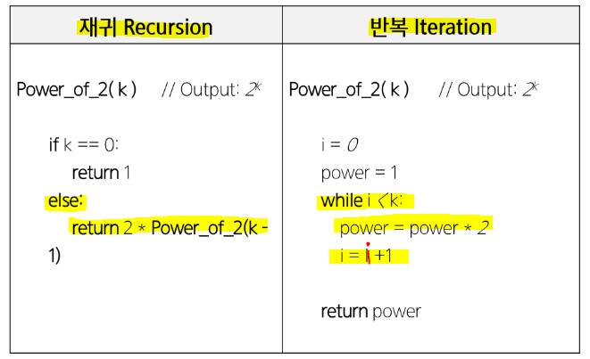

# 반복과 재귀

> 반복과 재귀는 유사한 작업을 수행

* 반복은 수행하는 작업이 완료될 때 까지 계속 반복
  
  * 루프 : `for`, `while` 구조

* 재귀는 주어진 문제의 해를 구하기 위해 동일하면서 더 작은 문제의 해를 이용하는 방법
  
  * 하나의 큰 문제를 해결할 수 있는 작은 문제로 쪼개도 결과를 결합
  
  * 재귀 함수로 구현

## ▶ 반복구조

* 초기화
  
  * 반복되는 명령문을 실행하기 전에 한 번만 조건 검사에 사용할 변수의 초기값 설정

* 조건 검사

* 반복할 명령문 실행

* 업데이트
  
  * 무한 루프가 되지 않게 조건이 거짓이 되게 함


* **반복을 이용한 선택정렬**

```python
def SelectionSort(A):
    n = len(A)
    for i in range(0, n-1):
        minI = i
        for j in range(i+1, n):
            if A[j] < A[minI]:
                minI = j
        A[minI], A[i] = A[i], A[minI]
```

## ▶ 재귀적 알고리즘

> 재귀적 정의는 두 부분으로 나뉜다.

* 하나 또는 그 이상의 기본 경우
  
  * 집합에 포함되어 있는 원소로 induction을 생성하기 위한 seed 역할

* 하나 또는 그 이상의 유도된 경우
  
  * 새로운 집합의 원소를 생성하기 위해 결합되어지는 방법

### 📌 재귀 함수

> 함수 내부에서 직접 혹은 간접적으로 자기 자신을 호출하는 함수

* 일반적으로 재귀적 정의를 이용해서 재귀 함수를 구현

* 기본 부분과 유도 부분으로 구성

* 반복 구조에 비해 간결하고 이해하기 쉽다.
  
  * 그러나 재귀에 익숙하지 않은 개발자들은 재귀적 프로그램이 어렵다고 느껴짐

* 함수 호출을 프로그램 메모리 구조에서 스택을 사용
  
  * 재귀 호출은 반복적인 스택의 사용을 의미하며 메모리 및 속도에서 성능저하 발생

* **팩토리얼 재귀 함수**
  
  * 재귀적 정의
    
    * basic rule : N <= 1 경우, n = 1
    
    * Inductivve rule : N > 1, n! = n x (n-1)!

```python
def fact(n):
    if n <= 1:
        return 1
    else:
        return n * fact(n-1)
```


## ▶ 반복과 재귀 중 선택 방법?

> 해결할 문제를 고려해서 반복이나 재귀의 방법을 선택

* 재귀는 문제 해결을 위한 알고리즘 설계가 간단하고 자연스러움
  
  * 추상 자료형(list, tree 등)의 알고리즘은 재귀적 구현이 간단하고 자연스러운 경우가 많음

* 일반적으로 재귀적 알고리즘은 반복 알고리즘보다 더 많은 메모리와 연산을 필요로 함

* **입력 값 n이 커질수록 재귀 알고리즘은 반복에 비해 비효율적일 수 있다.**


* **2^k 연산에 대한 재귀와 반복**



# 완전 검색 기법

> brute-force 방법은 대부분의 문제에 적용 가능

* 상대적으로 빠른 시간에 문제 해결(알고리즘 설계)을 할 수 있음

* **문제에 포함된 자료의 크기가 작다면 유용함**

```python
# 리스트 안에 k 찾기
SequentialSearch(A, k)
    A[n] = k
    i = 0
    while A[i] != k:
        i += 1
    if i < n:
        return i
    else:
        return -1
```

* 모든 경우의 수를 생성하고 테스트하기 때문에 수행 속도는 느리지만, 해답을 찾아내지 못할 확률이 작다.

* **이를 기반으로 그리디 기법이나 동적 계획법을 이용해서 효율적인 알고리즘을 찾을 수 있다.**

* **우선 완전 검색으로 접근하여 해답을 도출한 후, 성능 개선을 위해 다른 알고리즘을 사용하고 해답을 확인하는 것이 바람직**

# 순열

> 서로 다른 것들 중 몇 개를 뽑아서 한 줄로 나열하는 것

* `nPr` - 서로 다른 n개 중 r개를 택하는 순열
  
  * `nPr` =  n * (n-1) * (n-2) * ... * (n-r+1) = `n! / (n-r)!`
  
  * `nPn` = n!

* 다수의 알고리즘 문제들은 순서화된 요소들의 집합에서 최선의 방법을 찾는 것과 연관
  
  * TSP(Traveling Salesman Problem)

* **N 개의 요소들에 대해서 n! 개의 순열들이 존재**
  
  * n 이 커질수록 시간 복잡도는 폭발적으로 늘어난다.

## ▶ 단순한 순열 생성법

> 동일한 숫자가 포함되지 않았을 때, 각 자리 수 별로 loop를 이용

```python
# {1, 2, 3}을 포함하는 모든 순열을 생성하는 법
for i1 in range(1, 4):
    for i2 in range(1, 4):
        if i2 != i1:
            for i3 in range(1, 4):
                if i3 != i1 and i3 != i2:
                    print(i1, i2, i3)
```

## ▶ 재귀 호출을 통한 순열 생성

* **1, 2, 3으로 구성된 순열**


```python
def f(i, k):
    # 인덱스 i == 원소의 개수
    if i == k:
        print(p)        # 원하는 작업 실행
    else:
        for j in range(i, k):
            p[i], p[j] = p[j], p[i]     # 자리 교환
            f(i+1, k)                   # 그 다음 인덱스 확인
            p[i], p[j] = p[j], p[i]     # 원상 복구


p = [1, 2, 3, 4, 5]
f(0, 5)

```

## ▶ [참고] used 배열을 사용한 순열 구하는 방법

* 5개 중에 3개의 수로 이뤄진 순열 구하기

```python
def f(i, k, r):
    if i == r:
        print(p)
    else:
        for j in range(k):
            if used[j] == 0:        # a[j] 가 아직 사용되지 않았으면
                used[j] = 1         # a[j] 사용됨으로 표시
                p[i] = a[j]         # p[i]는 a[j]로 결정
                f(i+1, k, r)           # p[i+1] 값을 결정하러 이동
                used[j] = 0         # a[j] 를 다른 자리에서 쓸 수 있도록 해제


N = 5
R = 3
a = [i for i in range(1, N+1)]
used = [0] * N
p = [0] * R
f(0, N, R)
```

```python
# used 배열 생성
def f(i, k):
    if i == k:
        print(p)
    else:
        for j in range(k):
            # a[j]가 아직 사용되지 않았으면
            if used[j] == 0:
                used[j] = 1     # a[j]가 사용됨으로 표시
                p[i] = arr[j]   # p[i]는 a[j]로 결정
                f(i+1, k)       # p[i+1] 값을 결정하러 이동
                used[j] = 0     # 원상 복구 = a[j]를 다른 자리에서 사용 가능하도록 함


N = 3
arr = [i for i in range(1, N+1)]
used = [0] * N
p = [0] * N     # p 라는 배열에 숫자를 채우기
f(0, N)
```

# 부분 집합

> 집합에 포함된 원소들을 선택하는 것

* 다수의 중요 알고리즘들이 원소들의 그룹에서 최적의 부분 집합을 찾는 것
  
  * 배낭 짐싸기

* **N 개의 원소를 포함한 집합**
  
  * 자기 자신과 공집합을 포함한 모든 부분집합의 개수는 `2**n` 개
  
  * 원소의 수가 증가하면 부분집합의 개수는 지수적으로 증가

* 이차원 배열에서 각 행의 최소 합을 구하는 방법

```python
def perm(i, k):
    global minV
    if i == k:          # 인덱스 i == 원소의 개수
        # print(p)
        s = 0           # 모든 l 행에서 p[l] 열을 골랐을 때의 합
        for l in range(k):
            s += arr[l][p[l]]
        if s < minV:
            minV = s
    else:
        for j in range(i, k):
            p[i], p[j] = p[j], p[i]
            perm(i+1, k)
            p[i], p[j] = p[j], p[i]


T = int(input())
for tc in range(1, T+1):
    N = int(input())
    arr = [list(map(int, input().split())) for _ in range(N)]
    # p[i] : i 행에서 선택한 열 번호가 저장되어 있음
    p = [i for i in range(N)]
    minV = N*10     # 나올 수 있는 가장 큰 수라고 가정

    perm(0, N)
    print(f'#{tc} {minV}')
```

## ▶ 바이너리 카운팅(Binary Counting)

> 사전적 순서로 생성하기 위한 가장 간단한 방법

* 부분집합을 생성하기 위한 가장 자연스러운 방법

* **원소 수에 해당하는 N 개의 비트열을 이용**

* **n번째 비트값이 1이면 n번째 원소가 포함되었음을 의미**


```python
arr = [3, 6, 7, 1, 5, 4]
n = len(arr)

for i in range(1<<n):       # 1, 1<<n 으로 범위를 정하면 공집합은 제외
    for j in range(n):
        # j 번 비트가 0이 아니면 arr[j] 부분집합의 원소
        if i & (1<<j):
            print(arr[j], end=' ')
    print()
```

```python
def f(i, k):
    if i == k:
        # print(bit)
        for j in range(k):
            if bit[j]:
                print(arr[j], end=' ')
        print()
    else:
        bit[i] = 0
        f(i+1, k)
        bit[i] = 1
        f(i+1, k)


arr = [3, 6, 7, 1, 5, 4]
n = len(arr)

# bit[i] 는 arr[i] 가 부분집합의 원소인지 표시
bit = [0] * n
f(0, n)
```

# 조합 (Combination)

> 서로 다른 n개의 원소 중 r개를 순서 없이 골라낸 것으로 조합

* 조합의 수식


* **재귀 호출을 이용한 조합 생성 알고리즘**

```python

```

* **10 개의 원소 중 3개를 고르는 조합**

```python
N = 10
for i in range(N-2):
    for j in range(i+1, N-1):
        for k in range(j+1, N):
            print(i, j, k)
```

* **n 개에서 r 개를 고르는 조합 (재귀)**

```python
def nCr(n, r, s):
    if r == 0:
        print(*comb)
    else:
        for i in range(s, n-r+1):
            comb[r-1] = A[i]
            nCr(n, r-1, i+1)


A = [1, 2, 3, 4, 5]
n = len(A)
r = 3
comb = [0] * r
nCr(n, r, 0)
```

* 부분 집합 합 문제 구현
  
  * 10개의 정수 집합에 대한 모든 부분 집합 중 원소의 합이 0 이 되는 부분 집합을 모두 출력

```python

```

# 탐욕 알고리즘

> 손님이 지불한 금액에서 물건값을 제한 차액(거스름돈)을 지불하는 문제

* 탐욕 알고리즘은 최적해를 구하는데 사용되는 근시안적인 방법

* **여러 경우 중 하나를 선택할 때마다 그 순간에 최적이라고 생각되는 것을 선택해 나가는 방식으로 진행하여 최종적인 해답에 도달**

* **각 선택 시점에서 이루어지는 결정은 지역적으로는 최적이지만, 그 선택들을 계속 수집하여 최종적인 해답을 만들었다고 하여, 그것이 최적이라는 보장은 없다.**

* 한 번 선택된 것은 번복하지 않는다. 그렇기 때문에 단순하며 제한적인 문제들에 적용

* 최적화 문제란 가능한 해들 중에서 가장 좋은 해를 찾는 문제

## ▶ 동작 과정

* 1️⃣ 해 선택

* 2️⃣ 실행 가능성 검사

* 3️⃣ 해 검사

## ▶ 거스름돈 줄이기

- 1️⃣ 해 선택

- 2️⃣ 실행 가능성 검사

- 3️⃣ 해 검사

## ▶ 배낭 짐싸기

# 활동 선택 문제

## ▶ 회의실 배정하기


* 탐욕 기법의 적용
  
  * 종료 시간이 빠른 순서로 정렬
  
  * 첫 번째 활동 선택
  
  * 선택한 활동의 종료시간보다 빠른 시작 시간을 가지는 활동을 모두 제거
  
  * 남은 활동에 대해 앞의 과정을 반복

* 재귀 알고리즘
