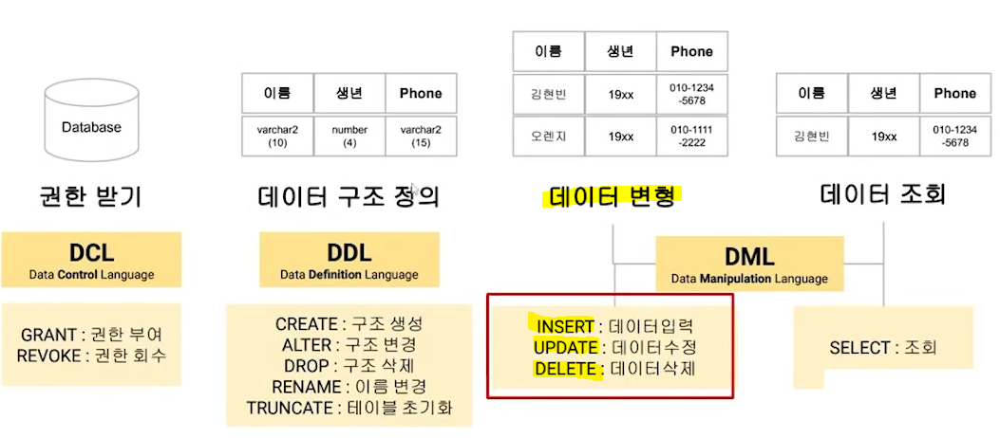
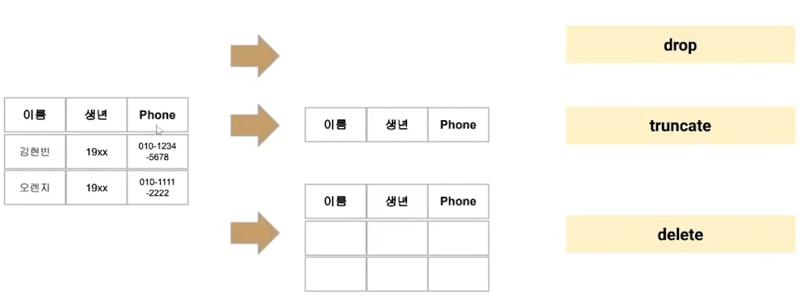

# DML (Data Manipulation Language)

> 정의된 데이터베이스에 레코드를 입력하거나, 수정, 삭제 및 조회하기 위한 명령어



* **`INSERT INTO <table_name> <column_name> VALUES <value>;`**

* **`UPDATE menu SET discount_rate=10 (WHERE name='연어스시');`**

* **`DELETE FROM menu (WHERE name='연어스시');`**

### 📍 문제

Q. 다음의 SQL을 통해 MENU 테이블을 생성했다. 보기의 SQL 문장 중 오류가 발생하는 것을 모두 고르시오

```sql
CREATE TABLE menu(
    메뉴코드 varchar2(10) PRIMARY KEY,
    메뉴명 varchar2(10) NOT NULL,
    가격 number(10) NOT NULL,
    할인율 number(100) DEFAULT 0,
);
```

A. 3번 - `INSERT INTO menu (메뉴코드, 가격) VALUES ('101', 50000)`

  **why❓ <mark>NOT NULL 컬럼에는 데이터가 꼭 있어야 함</mark>**

A. 4번 - `INSERT INTO menu values('102', 와규, 30000)`

  **why❓ <mark>컬럼명 지정이 이뤄지지 않은 상태에서는 전체 값을 넣어줘야 함</mark>**

* **<mark>숫자는 varchar2 와 char 에 입력 가능</mark>**

* **<mark>DELETE 에서 FROM 생략 가능</mark>**

### 📍 문제

Q. DELETE 에 관한 설명 중 틀린 것은?

A. 특정 행은 지울 수 없다.

  **why❓ WHERE 를 통해 특정 행 지울 수 있다.**

* **삭제된 데이터에 대해 로그를 남길 수 있는 방법이다 = 👌**

* **삭제된 데이터를 다시 되돌릴 수 있다 (DB에 반영되기 전까지는!) = 👌**

* **데이터는 삭제되지만 용량이 줄어들지 않는다. = 👌**

* **DROP, TRUNCATE, DELETE 차이점❗**



# TCL (Transaction Control Language)

> 트랜잭션을 제어하기 위한 언어
> 
> **트랜잭션? 데이터베이스의 상태를 변화시키기 위해 수행하는 작업의 단위**

* **`COMMIT`** - 데이터에 대한 변화를 DB에 반영하기 위한 명령어

* **`SAVEPOINT`** - 코드를 분할하기 위한 저장 포인트 지정

* **`ROLLBACK`** - 트랜잭션이 시작되기 이전의 상태로 되돌리기 위한 언어. 최신 COMMIT 이나 특수한 SAVEPOINT 로 되돌릴 수 있는 명령어

### 📍 문제

Q. 다음의 SQL문을 수행했을 때 결과를 구하시오.

```sql
CREATE TABLE T1 (
    col1 varchar2(10)
    col2 number(10)
);
INSERT INTO T1 VALUES(10, 100);
INSERT INTO T1 VALUES(20, 200);
INSERT INTO T1 VALUES(25, 250);
SAVEPOINT S1;
DELETE T1 WHERE col1=10;
UPDATE T1 SET col1=40 WHERE col2=200;
SAVEPOINT S1;
INSERT INTO T1 VALUES(50, 500);
ROLLBACK TO SAVEPOINT S1;
SELECT MAX(col2) FROM T1;
```

A. 300

### 📍 문제

Q. 다음의 SQL문을 수행했을 때 영구적으로 반영되는 col1의 값을 모두 쓰시오.

```sql
INSERT INTO T2 VALUES(10);
INSERT INTO T2 VALUES(20);
INSERT INTO T2 VALUES(30);
SAVEPOINT S1;
UPDATE T2 SET col1=50 WHERE col1=20;
SAVEPOINT S2;
DELETE T2 WHERE col1=30;
SAVEPOINT S3;
INSERT INTO T2 VALUES(70);
ROLLBACK S2;
COMMIT;
```

A. 10, 50, 30

* **DML 은 자동 commit(반영) 되지 않는다**❗

* ROLLBACK, DROP 은 되돌릴 수 없다는 말

* COMMIT 과 ROLLBACK 효과
  
  * 데이터 무결성을 보장할 수 있다.
  
  * 영구적인 변경 전 데이터에 대한 변동사항을 확인할 수 있다.
  
  * 논리적 연관성 있는 작업을 그룹화하여 처리할 수 있다.

### 📍 문제

Q. 다음의 SQL 문을 수행했을 때 영구적으로 반영되는 col1의 값을 모두 쓰시오.

```sql
INSERT INTO T2 VALUES(10);
INSERT INTO T2 VALUES(20);
INSERT INTO T2 VALUES(30);
COMMIT;
UPDATE T2 SET col1=50 WHERE col1=20;
DELETE T2 WHERE col1=30;
INSERT INTO T2 VALUES(70);
ROLLBACK;
COMMIT;
```

A. 10, 20, 30

  **why❓ SAVEPOINT 가 없을 경우 가장 최신의 COMMIT 상태로 복원된다❗**

### 📍 문제

Q. 다음 중 데이터베이스 시스템 언어의 종류와 해당하는 명령어가 바르게 연결되지 않은 것을 모두 고르시오

1. DDL - RENAME

2. TCL - REVOKE

3. DML - UPDATE

4. DCL - ROLLBACK

5. DDL - DELETE

6. TCL - COMMIT

7. DML - DROP

8. DCL - GRANT

A. `2, 4, 5, 7` 

`REVOKE (DCL), ROLLBACK (TCL), DELETE (DML), DROP (DDL)`
