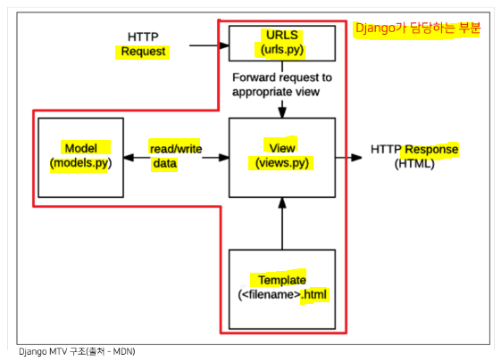

# Django 시작하기

## ▶ Framework 이해하기

* 누군가 개발해 놓은 코드를 재사용하는 것! (=개발 문화에서는 익숙한 것)

* **<mark>서비스 개발에 필요한 기능들을 미리 구현해서 모아 놓은 것 = Framework</mark>**

* 웹 서비스 개발에 있어서 모든 것들을 직접 개발할 필요없이, **내가 만들고자 하는 본질(로직)에 집중해 개발할 수 있음**

* 소프트웨어의 생산성과 품질을 높임

## ▶ Django를 배워야 하는 이유

* Python 으로 작성된 프레임워크
  
  * Python의 강력함과 거대한 커뮤니티(도움받기 편함)

* 검증된 웹 프레임워크
  
  * 화해, Toss, 두나무, 당근마켓, 요기요 등에서 사용

# Web 이해하기

## ✅ WWW(World Wide Web)

* **구글에 접속할 수 있는 이유는 구글 본사 컴퓨터와 개인 컴퓨터 간의 통신이 연결되어 있기 때문 (=해저 케이블로 연결됨)**

* 전세계가 유선으로 연결되어 있으며, 전봇대를 거쳐 우리집 인터넷으로 연결됨

* **유선 연결의 한계**
  
  * 히말라야 정상이나, 아마존 밀리까지 케이블을 모두 까는 것은 어려운 일
  
  * **개도국처럼 인프라 기반이 갖춰지지 않으면 정보의 불균형 존재**

* **스타링크**
  
  * **전 세계를 무선으로 연결 시도 중 - 유선 연결의 한계를 극복하기 위함**
  
  * 문제점 - Starlink Train 현상으로 천체 사진 찍기 어려움, 우주 쓰레기 발생

# 클라이언트와 서버

## ▶ 구조

* **클라이언트와 서버 역시 하나의 컴퓨터이다.**

* **<mark>기본적으로 클라이언트의 요청이 있어야만 서버의 응답이 있다.</mark>**

* **클라이언트**
  
  * 웹 사용자의 **인터넷에 연결된 장치** (ex. wi-fi에 연결된 컴퓨터 or 모바일)
  
  * Chrome 과 같은 **웹 브라우저를 통해❗**
  
  * **서비스를 요청하는 주체**

* **서버**
  
  * **<mark>웹 페이지, 사이트 또는 앱을 저장하고 있는 컴퓨터</mark>**
  
  * **클라이언트가 웹 페이지에 접근하려고 할 때 서버에서 클라이언트 컴퓨터로 웹 페이지 데이터를 응답해 사용자의 웹 브라우저에 표시됨**
  
  * **요청에 대해 서비스를 응답하는 주체**

* 정리
  
  * 우리가 사용하는 웹은 클라이언트-서버 구조로 구성
  
  * 그렇기 때문에 클라이언트-서버 구조를 만드는 방법을 배워야 함
  
  * **Django는 서버를 구현하는 웹 프레임워크**

# Web browser 와 Web page

## ▶ 웹 브라우저란?

> 웹에서 페이지를 찾아 보여주고, 사용자가 하이퍼링크를 통해 다른 페이지로 이동할 수 있도록 하는 프로그램

* **웹 페이지 파일을 우리가 보는 화면으로 바꿔주는 것을 렌더링(rendering)이라고 함**

* 웹 페이지 코드를 받으면 우리가 보는 화면처럼 바꿔주는 것이 바로 웹 브라우저

## ▶ 웹 페이지란?

* 웹에 있는 문서
  
  * 우리가 보는 **화면 각각의 한 장 한 장이 웹 페이지**

* 웹 페이지 종류
  
  * 1️⃣ **정적 웹 페이지 (Static Web page)**
    
    * **있는 그대로를 제공한다는 의미 = served as-is**
    
    * 한 번 작성된 HTML 파일의 내용이 변하지 않고 **모든 사용자에게 동일한 모습으로 전달**
    
    * 서버에 미리 저장된 HTML 파일 그대로 전달 = 같은 상황에서 모든 사용자에게 동일한 정보를 표시
  
  * 2️⃣ **동적 웹 페이지 (Dynamic Web page)**
    
    * **사용자의 요청에 따라 웹 페이지에 추가적인 수정이 되어 클라이언트에게 전달되는 웹 페이지** (ex. 회원별 장바구니)
    
    * **웹 페이지의 내용을 바꿔주는 주체 = 서버**
      
      * 서버에서 동작하고 있는 프로그램이 웹 페이지를 변경해줌
      
      * 사용자의 요청을 받아서 적절한 응답을 만들어주는 프로그램을 만드는 프레임워크가 Django
    
    * 다양한 서버 사이드 프로그래밍 언어(python, java, c++ 등) 사용 가능

# Django 구조 이해하기 <mark>(MTV Design Pattern)</mark>

## ▶ Design Pattern

* 각기 다른 기능을 가진 다양한 응용 소프트웨어를 개발할 때 공통적인 설계 문제가 존재하며, 이를 처리하는 해결책 사이에도 공통점이 있음 = 유사한 것을 패턴이라고 부름

* 클라이언트-서버 구조도 소프트웨어 디자인 패턴 중 하나

* 소프트웨어의 구조를 소수의 뛰어난 엔지니어가 **일반적인 구조화를 한 것**

* 공통적으로 발생하는 문제에 대해 재사용 가능한 해결책을 제시

### ✔ 장점

* 디자인 패턴을 알고 있으면 커뮤니케이션이 매우 간단해짐
  
  * 예) "우리 클라이언트-서버 구조로 구현하자."

* 다수의 엔지니어들이 일반화된 패턴으로 소프트웨어 개발을 할 수 있도록 한 규칙

## ▶ Djanago's Design Pattern

> MTV 패턴은 MVC 디자인 패턴을 기반으로 변형된 패턴

### ✔ MVC (Model - View - Controller)

* 하나의 큰 프로그램을 세가지 역할로 구분한 개발 방법론

* 1️⃣ **Model - 데이터와 관련된 로직을 관리 (DB)**

* 2️⃣ **View - 레이아웃과 화면을 처리 (화면을 보여주는 Html)**

* 3️⃣ **Controller - 명령을 model과 view 부분으로 연결**

### ✔ MVC의 목적

* 더 나은 업무의 분리와 향상된 관리를 제공 = '관심사 분리'

* **각 부분을 독립적으로 개발 가능하며, 하나를 수정할 때 모두 건들지 않아도 된다.**
  
  * **개발 효율성 및 유지보수가 쉬움**
  
  * **다수의 멤버로 개발하기 용이**

### ✔ Django

| MVC        | <mark>MTV</mark>          |
|:----------:|:-------------------------:|
| Model      | Model                     |
| View       | <mark>**Template**</mark> |
| Controller | **<mark>View</mark>**     |

* 1️⃣ **<mark>Model</mark>**
  
  * **데이터와 관련된 로직을 관리**
  
  * 응용프로그램의 **<mark>데이터 구조를 정의하고 데이터베이스의 기록을 관리</mark>**

* 2️⃣ **<mark>Template</mark>**
  
  * **<mark>레이아웃과 화면을 처리</mark>**
  
  * 화면상의 사용자 인터페이스 구조와 레이아웃을 정의
  
  * MVC 패턴에서 View의 역할에 해당

* 3️⃣ **<mark>View</mark>**
  
  * **<mark>Model & Template 과 관련한 로직을 처리해서 응답을 반환</mark>**
  
  * **클라이언트의 요청에 대해 처리를 분기하는 역할**
  
  * 예
    
    * **<mark>데이터가 필요하다면 model에 접근</mark>해서 데이터를 가져오고 <mark>가져온 데이터를 template로 보내 화면을 구성</mark>하고 <mark>구성된 화면을 응답으로 만들어 클라이언트에게 반환</mark>**
  
  * MVC 패턴에서 Controller의 역할에 해당

* **<mark>URLS(urls.py)</mark>** - **사용자가 요청하는 내용이 어떤 것인지 URL로 파악** (ex. 로그인 /login, 회원가입 /sign-up 등)

* **<mark>View(views.py)</mark>** - **파악된 요청을 처리 (필요한 데이터 요청)** & **데이터와 Template 을 받아와서 사용자에게 응답** 

* **<mark>Model(models.py)</mark>** - **필요한 데이터 전달**

* **<mark>Template(<filename>.html)</mark>** - **사용자에게 화면을 어떻게 구성할지 View로 전달**

# Django 시작하기

* 설치 전 가상환경 설정 및 활성화를 마치고 진행❗

`__init__.py`

- 장고에서는 반드시 필요함

`asgi.py` - Asynchronous Server Gateway Interface

* 비동기식 웹 서버와 연결 및 배포 시에 사용

**`settings.py`**

* Django 프로젝트의 설정을 관리

**`urls.py`**

* 사이트의 url 과 적절한 views의 연결을 지정

* **클라이언트(user)의 요청 url을 판단하는 곳**

`wsgi.py`

* Django 애플리케이션이 웹 서버와 연결 및 배포 시에 사용

**`manage.py`**

* Django 프로젝트와 다양한 방법으로 상호작용하는 커맨드라인 유틸리티

* 명령어 - **<mark>`python manage.py <command> [options]`</mark>**

## ▶ Django Application

* **애플리케이션(앱) 생성**
  
  * 명령어 - **<mark>`python manage.py startapp <app's name>`</mark>**
  
  * 일반적으로 **애플리케이션 이름은 '복수형'으로 작성하는 것을 권장**

### ✔ Application 구조

`admin.py`

* 관리자용 페이지를 설정하는 곳

`apps.py`

* 앱의 정보가 작성된 곳

**`models.py`**

* **애플리케이션에서 사용하는 Model을 정의하는 곳**

* **MTV 패턴의 M에 해당**

`tests.py`

* 프로젝트의 테스트 코드를 작성하는 곳

* 개발 시간이 오래 걸림

**`views.py`**

* **view 함수들이 정의되는 곳**

* **MTV 패턴의 V에 해당**

### ✔ Application 등록‼

* **프로젝트에서 앱을 사용하기 위해서는 <mark>`settings.py` 내 `INSTALLED_APPS 리스트`에 반드시 추가해야 함‼</mark>**

* `INSTALLED_APPS`
  
  * Django installation 에 활성화된 모든 앱을 지정하는 문자열 목록

### ✔ Project & Application

* Project
  
  * 앱의 집합 - 프로젝트 내 여러 앱이 포함될 수 있음

* Application
  
  * 앱은 실제 요청을 처리하고 페이지를 보여주는 등의 역할
  
  * 앱은 하나의 역할 및 기능 단위로 작성하는 것을 권장

# 요청과 응답

> **<mark>URL > VIEW > TEMPLATE 순의 작성 순서로 코드를 작성</mark>해보고 데이터의 흐름을 이해하기**

## ▶ URLs

* **`Page not Found (404)`**
  
  
  
  * 페이지를 찾을 수 없음 = **요청한 url 주소가 존재하지 않음을 의미**
  
  * **`404`** - HTTP status code 이며, **Client가 잘못 요청했다는 것을 의미**

* **url 패턴 뒤에는 항상 `/` 를 붙여야 한다!**
  
  
  
  * **`path('index/', views.index)`** - **사용자가 index 라는 주소로 요청을 보내면 articles에 있는 views 파일에서 index 함수를 실행하겠다는 의미**. 함수를 호출하는 것이 아니기 때문에 **함수명만 작성 (= 함수를 인자로 전달)**
  
  * **python은 1급 객체다.**
    
    * 1️⃣ 함수를 변수에 저장할 수 있다.
    
    * 2️⃣ 함수를 리턴으로 전달할 수 있다.
    
    * 3️⃣ 함수를 인자로 전달할 수 있다.

## ▶ View

* **HTTP 요청을 수신하고 HTTP 응답을 반환하는 함수 작성**

* **Template에게 HTTP 응답 서식을 맡김**
  
  * template 폴더는 application 폴더 하위에 반드시 생성해야 한다❗

### ✔ render()

* **`render(request, template_name, context)`**
  
  * 주어진 템플릿을 주어진 컨텍스트 데이터와 결합하고 렌더링 된 텍스트와 함께 HttpResponse(응답) 객체를 반환하는 함수
  
  * 1️⃣ request - 응답을 생성하는 데 사용되는 요청 객체
  
  * 2️⃣ template_name - 템플릿의 전체 이름 또는 템플릿 이름의 경로
  
  * 3️⃣ **context - 템플릿에서 사용할 데이터 (dictionary 타입으로 작성)**
    
    
    
    * **DTL (Django Template Language)**
      
      * **Template에서 딕셔너리의 키를 통해 값을 불러와 출력 가능**❗
      
      * ex. `{{ lunch }}` - 중괄호(`{}`) 사용

## ▶ Templates

* 실제 내용을 보여주는데 사용되는 파일 = 파일 구조나 레이아웃을 정의

* 기본 경로
  
  * **app 폴더 내의 templates 폴더**
  
  * **폴더 이름은 반드시 templates 라고 지정해야 한다❗**

## ▶ 코드 작성 순서

* **URL > View > Template 순으로 작성‼**

* **<mark>데이터의 흐름 순서</mark>**

## ▶ 참고 (setting.py 내에서 수정 가능)

* LANGUAGE_CODE
  
  * 모든 사용자에게 제공되는 번역을 결정
  
  * 이 설정이 적용되려면 USE_I18N이 활성화(True)되어야 함

* TIME_ZONE
  
  * 데이터베이스 연결의 시간대를 나타내는 문자열 지정
  
  * USE_TZ가 True이고 이 옵션이 설정된 경우 데이터베이스에서 날짜 시간을 읽으면 UTC 대신 새로 설정한 시간대의 인식 날짜&시간이 반환됨
  
  * USE_TZ이 False인 상태로 이 값을 설정하는 것은 error가 발생하므로 주의

* USE_I18N - Django의 번역 시스템을 활성화해야 하는지 여부를 지정

* USE_L10N
  
  * 데이터의 지역화된 형식을 기본적으로 활성화할지 여부를 지정
  
  * True - Django는 현재 locale의 형식을 사용하여 숫자와 날짜를 표시

* USE_TZ
  
  * datetimes가 기본적으로 시간대를 인식하는지 여부를 지정
  
  * True - Django는 내부적으로 시간대 인식 날짜/시간을 사용

# Django Template

* **데이터 표현을 제어하는 도구이자 표현에 관련된 로직**

* Django Template을 이용한 HTML 정적 부분과 동적 콘텐츠 삽입

## ▶ Django Template Language (DTL)

* Django template에서 사용하는 built-in template system

* **조건, 반복, 변수 치환, 필터 등의 기능을 제공**
  
  * python처럼 일부 프로그래밍 구조(if, for 등)를 사용할 수 있지만 **python 코드로 실행되는 것은 아니다.**
  
  * **Django 템플릿 시스템은 단순히 python 이 HTML에 포함된 것이 아니므로 주의**❗

* 프로그래밍적 로직이 이나리 프레젠테이션을 표현하기 위한 것

## ▶ DTL Syntax

### ✔ Variable

**`{{ variable }}` - `{{ }} ` 값을 표현할 때 사용**

* 변수명은 영어, 숫자와 밑줄(_)의 조합으로 구성 가능하나, 밑줄로는 시작 불가
  
  * 공백이나 구두점 문자 또한 사용 불가

* **`.`을 사용하여 변수 속성에 접근할 수 있음**

* **render() 의 세번째 인자로 딕셔너리 형태(`{'key': value}`)로 넘겨주며, 여기서 정의한 key에 해당하는 문자열이 template에서 사용 가능한 변수명이 된다.**
  
  * context 데이터가 많아질 경우에는 별도로 dictionary 로 작성하는 것이 바람직

### ✔ Filters

**`{{ variable|filter }}`**

* **표시할 변수를 수정할 때 사용**
  
  * ex. name 변수를 모두 소문자로 출력 - `{{ name|lower }}`

* 60개의 built-in template filters를 제공

* chained가 가능하며 일부 필터는 인자를 받기도 함 - `{{ name|truncatewords: 30 }}`

* **기본적으로는 파이썬에서 수정 완료한 후 template에서는 변수만 사용하는 것을 권장**
  
  * 데이터량이 많아지면 시간이 오래 걸린다.

### ✔ Tags

**`` - tag를 사용할 때 `%` 가 포함된다.**

* 출력 텍스트를 만들거나, 반복 또는 논리를 수행하여 제어 흐름을 만드는 등 변수보다 복잡한 일들을 수행

* **일부 태그는 시작과 종료 태그가 필요** - **``**

* 약 24개의 built-in template tags를 제공

### ✔ Comments

**`{# #}`**

* Django template 에서 라인의 주석을 표현하기 위해 사용

* 아래처럼 유효하지 않은 템플릿 코드가 포함될 수 있음
  
  * `{#  text  #}`

* 한 줄 주석에만 사용할 수 있음 (줄바꿈이 허용되지 않음)

* **여러줄 주석은 <mark> 와  사이에 입력</mark>**
  
  

* **HTML 주석 태그는 DTL 에 적용되지 않는다 = 무용지물**

# Template inheritance (상속)

> **<mark>코드의 재사용성</mark>에 초점을 맞춤!**

* 템플릿 상속을 사용하면 사이트의 모든 공통 요소를 포함하고, 하위 템플릿이 재정의(override) 할 수 있는 블록을 정의하는 기본 'skeleton' 템플릿을 만들 수 있음

* 모든 템플릿에 부트스트랩 CDN을 작성해야 할까? 🙅‍♂️

* **``** - **적용할 html에 작성**
  
  * 하위(자식) 템플릿이 부모 템플릿을 확장한다는 것을 알림
  
  * **<mark>반드시 템플릿 최상단에 작성되어야 함‼ (즉, 2개 이상 사용 불가❗)</mark>**

* **` `** - **base.html & 적용할 html에 작성**
  
  * **하위 템플릿에서 재지정(override)할 수 있는 블록을 정의**
  
  * 즉, 하위 템플릿이 채울 수 있는 공간

## ▶ 추가 템플릿 경로 추가하기

# Sending and Retrieving form data

* 데이터를 보내고 가져오기

* HTML form element를 통해 사용자와 애플리케이션 간의 상호작용 이해하기

## ▶ Client & Server architecture

* 웹은 다음과 같이 가장 기본적으로 클라이언트-서버 아키텍처 사용
  
  * 클라이언트가 서버에 요청을 보내고, 서버는 클라이언트의 요청에 응답

* 클라이언트 측에서 HTML form은 HTTP 요청을 서버에 보내는 가장 편리한 방법

* 사용자는 HTTP 요청에서 전달할 정보를 제공할 수 있음

## ▶ Sending form data (Client)

* 데이터가 전송되는 방법을 정의

* 웹에서 **사용자 정보를 입력하는 여러 방식 (text, button, submit 등)을 제공하고 사용자로부터 할당된 데이터를 서버로 전송하는 역할을 담당**

* 핵심 속성
  
  * action - 데이터를 어디로?
    
    * 입력 데이터가 전송될 URL을 지정 = 목적지 주소
    
    * 데이터를 어디로 보낼지 지정하는 것이며 반드시 유효한 URL이어야 함
    
    * 이 속성을 지정하지 않으면 데이터는 현재 form이 있는 페이지의 URL로 보내짐
  
  * method - 어떤 방식으로 보낼지?
    
    * 데이터를 어떻게 보낼 것인지 정의 = 방식
    
    * HTML form 데이터는 오직 2가지 방법으로 전송 - GET 방식과 POST 방식

* 사용자가 data를 입력하려면 입력 page가 필요하다.
  
  * 사용자가 요청하면 입력 page는 서버가 제공하는 것이다. (ex. 로그인 버튼 클릭)

# variable routing

템플릿의 많은 부분이 중복되고, 일부분만 변경되는 상황에서도 계속 새로 만들어야 해?

query string parameter - 사용자의 입력이 반드시 필요

variable routing - 주소 이동할 때 path 의 일부분을 변수로 사용 (사용자 입력 X)

사용 예) 인스타그램 - 해당 ID 마다 프로필 페이지가 필요

변수는 `<>` 에 정의하며 view 함수의 인자로 할당함

사용 시 주의점

1. 변수명과 views.py의 함수 내 매개변수의 이름이 같아야 한다.

2. variable routing이 설정되면 반드시 매개변수로 받아야 한다.

3. varialbe routing이 적용된 주소에는 반드시 값이 들어가 있어야 한다.
