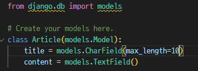
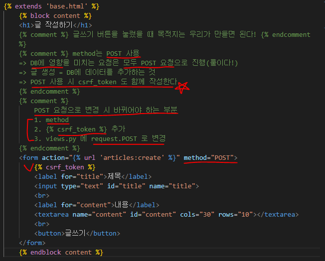
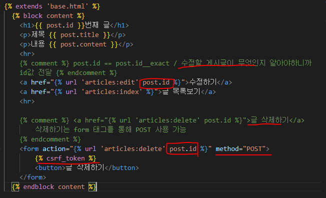

# Namespace

> 개체를 구분할 수 있는 범위를 나타내는 이름 공간에 대한 이해
> 
> 같은 이름의 url 을 가질 때 문제 발생

## ▶ Namespace 의 필요성

### ✔ 2가지 문제 발생

* 1️⃣ **URL namespace**
  
  * articles app index 페이지에 작성한 두 번째 앱 index로 이동하는 하이퍼링크를 클릭 시 현재 페이지로 다시 이동

* 2️⃣ **Template namespace**
  
  * pages app의 index url(~/pages/index)로 직접 이동해도 articles app의 index 페이지가 출력됨

## ▶ URL Namespace

* URL namespace를 사용하면 서로 다른 앱에서 동일한 URL 이름을 사용하는 경우에도 이름이 지정된 URL을 고유하게 사용할 수 있다.

* <mark>**`app_name` 속성을 작성해 URL namespace를 설정!**</mark>
  
  * urls.py 내부에 **`app_name = 'articles'`, `app_name = 'pages'`** 설정
  
  * **``** 형태로 수정
  
  * **app_name을 지정한 이후에는 url 태그에서 반드시 app_name:url_name 형태로만 사용해야 한다**❗ 그렇지 않으면  **`NoReverseMatch`(url 태그 수정)** 에러 발생❗

## ▶ Template namespace

* Django는 기본적으로 <mark>**`app_name/templates/`**</mark> 경로에 있는 templates 파일들만 찾을 수 있으며, <mark>**settings.py의 INSTALLED_APPS 에 작성한 app 순서로 template을 검색 후 렌더링**</mark>

* Django template의 기본 경로 자체를 변경할 수 없기 때문에 물리적으로 이름 공간을 만들어야 한다.
  
  * 폴더 구조를 <mark>**`app_name/template/app_name/`**</mark> 형태로 변경
  
  * 
  
  * 템플릿 경로를 모두 변경해주어야 한다!
    
    * `articles/index.html`
    
    * `pages/index.html`

# Database

> 체계화된 데이터의 모임
> 
> 검색 및 구조화 같은 작업을 쉽게 하기 위해 조직화된 데이터를 수집하는 저장 시스템

## ▶ 기본 구조

### 1️⃣ 스키마(Schema)

* 데이터베이스에서 자료의 구조, 표현 방법, 관계 등을 정의한 구조 (=Structure)


### 2️⃣ 테이블(Table)

* 필드와 레코드를 사용해 조직된 데이터 요소들의 집합

* 관계(Relation)라고도 부름
  
  

* **필드(field) = 컬럼**
  
  * 각 필드에는 고유한 데이터 형식이 지정됨
    
    * INT, TEXT 등

* **레코드(record) = 행**
  
  * 테이블의 데이터는 레코드에 저장됨

* **PK (Primary Key) = 기본키**
  
  * 각 레코드의 고유한 값(식별자로 사용)
  
  * 기술적으로 <mark>**다른 항목과 절대로 중복되어 나타날 수 없는 단일값(unique)을 가짐**</mark>
  
  * **데이터베이스 관리 및 테이블 간 관계 설정 시 주요하게 활용**


### ✔ 쿼리(Query)

* 데이터를 조회하기 위한 명령어를 의미

* **조건에 맞는 데이터를 추출하거나 조작하는 명령어** (주로 테이블형 자료구조에서)

* Query를 날린다 = 데이터베이스를 조작한다.

# Model

> **Django는 웹 애플리케이션의 데이터를 구조화하고 조작하기 위한 추상적인 모델을 제공**


* Model을 통해 데이터에 접속하고 관리

* **사용하는 데이터들의 필수적인 필드(column)들과 동작(인스턴스와 메서드)들을 포함**

* 저장된 데이터베이스의 구조

* **일반적으로 각각의 모델은 하나의 데이터베이스 테이블에 mapping**
  
  * <mark>**모델 클래스 1개 == 데이터베이스 테이블 1개**</mark>

## ▶ Model 작성하기

* models.py 작성
  
  * 모델 클래스를 작성하는 것은 데이터베이스 <mark>**테이블의 스키마를 정의하는 것**</mark>
  
  * "모델 클래스 == 테이블 스키마"
    
    
  
  * <mark>**id 컬럼은 테이블 생성 시 Django가 자동으로 생성**</mark>

## ▶ Model 이해하기

* **`models.Model`** 상속
  
  * 각 모델은 django.db.models 모듈의 Model 클래스를 상속받아 구성됨
  
  * <mark>**클래스 상속 기반 형태의 Django 프레임워크 개발**</mark>

* **`title = models.CharField(max_length=10)`**

* **`content = models.TextField()`**
  
  * models 모듈을 통해 어떠한 타입의 DB 필드를 정의할 것인지 정의
  - 클래스 변수명 = DB 필드의 이름
  - 클래스 변수 값(models 모듈의 Field 클래스) = DB 필드의 데이터 타입

* **데이터베이스 스키마 생성**
  
  

### ✔ Model Field

* **데이터 유형에 따라 다양한 모델 필드를 제공**
  
  * `DataField(),, CharField(), IntegerField()` 등
  
  * https://docs.djangoproject.com/en/3.2/ref/models/fields/

* <mark>**`CharField(max_length=None, **options)`**</mark>
  
  * 길이의 제한이 있는 문자열을 넣을 때 사용
  
  * **<mark>`max_length`</mark>**
    
    * 필드의 최대 길이(문자, 255자)
    
    * **CharField의 필수 인자**
    
    * **데이터베이스의 Django의 유효성 검사(값을 검증하는 것)에서 활용됨**

* <mark>`TextField(**options)`</mark>
  
  * 글자 수가 많을 때 사용

## ▶ Migrations

> **Django가 모델에 생긴 변화(필드 추가, 모델 삭제 등)를 DB에 반영하는 방법**

### ✔ 주요 명령어

#### 1️⃣ `python manage.py makemigrations`

* 모델을 작성 혹은 변경한 것에 기반한 새로운 migration(설계도)을 만들 때 사용

* **테이블을 만들기 위한 설계도를 생성하는 것**

#### 2️⃣ `python manage.py migrate`

* **makemigration 으로 만든 설계도를 실제 db.splite3 DB 파일에 반영하는 과정**

* 결과적으로 **모델에서의 변경사항들과 DB의 스키마가 동기화를 이룸**
  
  * <mark>**모델과 DB의 동기화**</mark>


#### 3️⃣ `python manage.py showmigrations`

* migrations 파일들이 migrate  완료 여부를 확인하는 용도

* `[X]` 표시가 있으면 migrate 가 완료되었음을 의미

#### 4️⃣ `python manage.py sqlmigrate articles 001`

* 해당 migrations 파일이 SQL문으로 어떻게 해석될지 미리 확인 가능

### ✔ 추가 필드 정의 - Model 변경사항 반영하기

* 기존에 id, title, content 컬럼을 가진 테이블에 2개의 컬럼을 추가(변경)하는 상황
  
  * **`python manage.py makemigrations`**

* Django 입장에서는 **기존 테이블에 새로운 컬럼을 추가하라는 요구 사항인데 이 컬럼들은 기본적으로 빈 값으로 추가될 수 없음❗**
  
  * **그래서 추가되는 컬럼에 기본값을 설정하라는 것임**


* **각 보기 번호의 의미**
  
  1. 다음 화면으로 넘어가서 새 컬럼의 기본 값을 Django가 알아서 입력하는 방법
  
  2. 현재 과정에서 나가고 모델 필드에 default 속성을 직접 작성하는 방법


* 1번 선택 후 그냥 Enter 입력하면 Django에서 기본적으로 timezone 모듈의 now 메서드 반환 값을 사용한다.

* **새로운 설계도를 생성했기 때문에 DB와 동기화를 진행해야 함**
  
  * **`python manage.py migrate`**

* **DateTimeField()**
  
  * datetime.datetime 인스턴스로 표시되는 날짜 및 시간을 값으로 사용하는 필드
  
  * **선택인자**‼
    
    * 1️⃣ **`auto_now_add`**
      
      * **최초 생성 일자** = 최초 insert 시에만 현재 날짜와 시간으로 갱신
    
    * 2️⃣ **`auto_now`**
      
      * **최종 수정 일자** = ORM이 save를 할 때마다 현재 날짜와 시간으로 갱신

# ORM

> Object-Relational-Mapping
> 
> 객체 지향 프로그래밍 언어를 사용하여 **호환되지 않는 유형(Django <-> SQL)의 시스템 간에 데이터를 변환하는 프로그래밍 기술**


* **장점**
  
  * **SQL을 잘 알지 못해도 객체지향 언어로 DB 조작 가능**
  
  * 생산성이 높음 = 빠르게 개발할 수 있음

* **단점**
  
  * **ORM 만으로는 완전한 서비스를 구현하기 어렵다.**
  * 결국엔 SQL 도 공부해야 함

## ▶ QuerySet API

* Django shell 실행
  
  * `python manage.py shell_plus`

* **Database API**
  
  * Model을 정의하면 데이터를 만들고 읽고 수정하고 지울 수 있는 API를 제공
  
  * **구문**
    
    

* **objects manager**
  
  * 데이터베이스 쿼리 작업을 가능하게 하는 인터페이스
  
  * 이 manager(objects)를 통해 특정 데이터를 조작(메서드)할 수 있음
  
  * **DB를 Python class로 조작할 수 있도록 여러 메서드를 제공하는 manager**

* **Query**
  
  * 데이터베이스에 특정한 데이터를 보여달라는 요청
  
  * 쿼리문을 작성한다 = 원하는 데이터를 얻기 위해 데이터베이스에 요청할 코드 작성
  
  * **ORM에 의해 SQL로 변환되어 DB에 전달 & DB의 응답 데이터를 ORM이 QuerySet이라는 자료 형태로 변환하여 우리에게 전달**

* **QuerySet❗**
  
  * **DB에게 받은 데이터를 담고있는 유사 리스트 - 음수 인덱스 사용 불가**
  
  * 데이터베이스에게서 전달 받은 객체 목록(데이터 모음) - **순회 및 인덱스 접근 가능**
  
  * 필터를 걸거나 정렬 등으로 수행 가능 - by QuerySet API
  
  * **단, DB가 단일객체를 반환할 때는 QuerySet이 아닌 모델(Class)의 인스턴스로 반환❗** - `.get()` : 하나의 데이터만 받음

* **QuerySet API**
  
  * QuerySet 과 상호작용하기 위해 사용하는 도구 (메서드, 연산자 등)
    
    

### ✔ CRUD

> 컴퓨터 소프트웨어가 가지는 기본적인 데이터 처리 기능 4가지

* Create / Read / Update / Delete = 생성 / 조회 / 수정 / 삭제

### ✔ Create - 생성

> 데이터 객체를 만드는 3가지 방법

#### 1️⃣ 클래스를 통한 인스턴스 생성

```python
# 클래스를 통한 인스턴스 생성
article = Article()
# 클래스 변수명과 같은 이름의 인스턴스 변수를 생성 후 값 할당
article.title = 'first'
article.content = 'django'
# 인스턴스로 save 메서드 호출
article.save()
```

* save를 하지 않으면 아직 DB에 값이 저장되지 않는다❗

#### 2️⃣ 인스턴스 생성 시 초기 값을 함께 작성하여 생성

```python
article = Article(title='second', content='django!')
article.save()
```

* 마찬가지로 save를 호출해야 저장된다‼

#### 3️⃣ QuerySet API 중 create() 메서드 활용

```python
Article.objects.create(title='third', content='django!')
```

* save 호출없이 한 번에 저장되며 바로 생성된 데이터도 반환해준다.

* **`.save()`**
  
  * 객체를 데이터베이스에 저장함
  
  * **데이터 생성 시 save를 호출하기 전에는 객체의 id값이 None**
    
    * id값은 Django가 아니라 DB에서 계산하기 때문
  
  * 단순히 모델 클래스를 통해 인스턴스를 생성하는 것은 DB에 영향을 미치지 않기 때문에 **반드시 save를 호출해야 테이블에 레코드가 생성됨**‼

### ✔ Read - 조회

> QuerySet API method를 사용해 데이터를 다양한 방법으로 조회

* **데이터를 목록(set)으로 받거나 단일 데이터로 받는 것에 따라 다르다.**

* `all()`
  
  * 전체 데이터 조회 - QuerySet 으로 반환 = 반복문, 인덱스 조회 가능
  
  * `Article.objects.all()`

* **`get()`**
  
  * <mark>**단일 데이터만 조회 - 데이터를 찾을 수 없거나, 둘 이상을 찾으면 에러가 발생**</mark>
    
    * DoesNotExist 예외, MultipleObjectsReturned 예외
  
  * <mark>**pk 와 같이 고유성을 보장하는 조회에서만 사용 가능‼**</mark>
  
  * `Article.objects.get(pk=1)`, `Post.objects.get(필드명=해당값)`

* `filter()`
  
  * 지정된 조회 매개 변수와 일치하는 객체를 포함하는 새 QuerySet을 반환
  
  * **조회된 객체가 없거나 1개여도 QuerySet을 반환❗**
  
  * `Article.objects.filter(title='first')`

* `Field lookups`
  
  * **특정 레코드에 대한 조건을 설정**
  
  * filter(), exclude(), get() 에 대한 키워드 인자로 지정
  
  * https://docs.djangoproject.com/en/3.2/ref/models/querysets/#field-lookups
  
  * content 칼럼에 'dj'가 포함된 모든 데이터 조회해줘.
    
    * 사용법: `__field-lookups`
    
    * **`Article.objects.filter(content__contains='dj')`**

### ✔ Update - 수정

> 수정 전에는 항상 인스턴스 객체에 먼저 조회해야 한다.

* 객체 조회 후 반환 값을 저장한 후 새로운 값으로 할당

* `save()` 인스턴스 메서드 호출

```python
article = Article.objects.get(pk=1)
# 인스턴스 변수를 변경 후 저장
article.title = 'byebye'
article.save()
```

* 수정하게되면 수정일자가 변경된다.

### ✔ Delete - 삭제

* 삭제하고자 하는 인스턴스 객체를 조회 후 반환값을 저장

* `delete()` 인스턴스 메서드 호출

```python
article = Article.objects.get(pk=1)
article.delete()
```

* 삭제한 후 데이터를 생성하면 id 값은 여전히 그 다음 순번부터 시작한다.

# 실제 적용해보기

## ▶ Read

> 전체 게시글 조회

* **views.py**
  
  

* **index.html**
  
  

## ▶ Create - 게시글 생성

> Create 로직을 구현하기 위해서는 2개의 view 함수가 필요하다.

* 1️⃣ **사용자의 입력을 받을 페이지를 렌더링하는 함수** = 'new'

* 2️⃣ **사용자가 입력한 데이터를 전송받아 DB에 저장하는 함수** = 'create'

* **urls.py**
  
  

* **views.py**
  
  
  
  
  
  * **새로운 글 생성 후 기존의 만들어 둔 `detail` or `index` 페이지로 전환**
    
    * `return redirect('articles:index'`)
  
  ### ✔ HTTP respone status code
  
  * **클라이언트에게 특정 HTTP 요청이 성공적으로 완료되었는지 여부 확인**
    
    * 100번 대 = Informational responses
    
    * 200번 대 = Successful responses
    
    * **300번 대 = Redirection messages**
    
    * **400번 대 = Client error responses**
    
    * **500번 대 = Server error responses**

* **new.html**
  
  

* `label의 for`과 `input의 id` 를 통해 연결된다.

* **`input의 name` 속성: input의 값을 조회할 때 key값이 name이다.**

### ✔ HTTP request method

> HTTP 는 request method 를 정의하여, 주어진 리소스에 수행하길 원하는 행동을 나타냄

* **GET**
  
  * 특정 리소스를 가져오도록 요청할 때 사용
  
  * **반드시 데이터를 조회(Read)할 때만 사용 = DB에 변화를 주지 않음**
  
  * Ex. 네이버 - 검색 (검색은 서버에 영향 X, 특정 데이터를 조회만)

* **POST**
  
  * **서버로 데이터를 전송할 때 사용**
  
  * **서버에 변경사항을 만든다 = Create/Update/Delete 역할**
  
  * 리소스를 생성/변경하기 위해 데이터를 HTTP body에 담아 전송
  
  * GET 의 쿼리 스트링 파라미터와 다르게 URL로 보내지지 않음❗

### ✔ CSRF (Cross-Site-Request-Forgery)

> 사이트 간 요청 위조

* 사용자가 자신의 의지와 무관하게 공격자가 의도한 행동을 하여 특정 웹페이지를 보안에 취약하게 하거나 수정, 삭제 등의 작업을 하게 만드는 공격 방법

* **CSRF Token 사용❗ (for 방어)**
  
  * 사용자의 데이터에 임의의 난수 값(token)을 부여해 매 요청마다 해당 난수 값을 포함시켜 전송시킴
  
  * **이후 서버에서 요청을 받을 때마다 전달된 token 값이 유효한지 검증**
  
  * Django 는 DTL에서 csrf_token 템플릿 태그를 제공

* <mark>**``**</mark>
  
  * 해당 태그가 없으면 403 forbidden 으로 응답
  
  * 내부 URL로 향하는 POST form을 사용하는 경우에 사용
    
    * **외부 URL로 향하는 POST form에 대해서는 CSRF 토큰이 유출되어 취약성을 유발할 수 있기 때문에 사용해서는 안됨**
  
  * 해당 POST 요청이 내가 보낸 것인지를 검증하는 것

## ▶ Detail - 개별 상세 페이지

> 개별 게시글 상세 페이지 제작

* 모든 게시글마다 view 함수와 template 파일을 만들 수 없다.
  
  * 글의 번호(pk)를 활용해서 하나의 뷰 함수와 템플릿 파일로 대응
  
  * Variable Routing

* **urls.py**


* **views.py**


* **index.html**, **detail.html**




## ▶ Update - 게시글 수정

* **urls.py**


* **views.py**


* **edit.py**


## ▶ Delete - 게시글 삭제

* **urls.py**


* **views.py**


# Admin site

> Django 의 가장 강력한 기능 중 하나

* 관리자 페이지
  
  * 사용자가 아닌 서버의 관리자가 활용하기 위한 페이지
  
  * 모델 class를 admin.py 에 등록하고 관리
  
  * 레코드 생성 여부 확인에 매우 유용하여 직접 레코드를 삽입 가능

* **admin 계정 생성**
  
  * **`python manage.py createsuperuser`**
    
    * username, password 를 입력해 관리자 계정 생성
    
    * email은 선택사항

* **admin에 모델 class 등록**
  
  * ```python
    # articles/admin.py
    
    from django.contrib import admin
    from .models import Post
    
    admin.site.register(Post)
    ```
