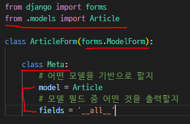
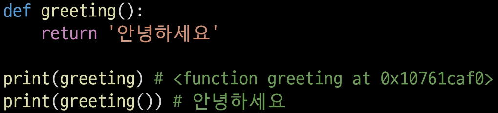

# Form

> Django 서버는 들어오는 요청을 모두 수용하고 있는데, 이렇게 되면 비정상적인 혹은 악의적인 요청도 들어올 수 있다.

* 사용자가 입력한 데이터가 우리가 원하는 데이터 형식이 맞는지에 대한 <mark>**유효성 검증이 반드시 필요**</mark>‼

* Django Form은 반복 코드를 줄여주면서 쉽게 유효성 검증을 진행할 수 있게 함

## ▶ Django의 역할

* **Form 은 유효성 검사 도구 중 하나로 오부의 악의적 공격 및 데이터 손상에 대한 중요한 방어 수단**

* Django는 Form과 관련한 <mark>**유효성 검사를 단순화하고 자동화할 수 있는 기능을 제공**</mark>
  
  * 개발자는 안전하고 빠르게 코드 작성 가능 & 필요한 핵심만 집중할 수 있음

### 📍 3가지 처리가 필요

* 1️⃣ 렌더링을 위한 데이터 준비 및 재구성

* 2️⃣ 데이터에 대한 HTML forms 생성

* 3️⃣ 클라이언트로부터 받은 데이터 수신 및 처리

# Form Class

> Django form 관리 시스템의 핵심❗

## ▶ Form Class 선언

* Model Class 를 선언하는 것과 비슷
  
  * 비슷한 이름의 필드 타입을 많이 가지고 있음
  
  * 다만, 이름만 같을 뿐 같은 필드는 아님

* Model 과 마찬가지로 상속을 통해 선언
  
  * **forms 라이브러리의 Form 클래스를 상속받음**

* **앱 폴더에 `forms.py` 를 생성한 후 `ArticleForm` Class 선언❗**
  
  

* `new` view 함수 업데이트
  
  

* `new` template 업데이트
  
  

### 📌 Form rendering options

> **`<label>` & `<input>` 쌍에 대한 3가지 출력 옵션**

* 1️⃣ **`as_p()`**
  
  * **각 필드가 `
` 태그로 감싸져서 렌더링**
    
    
    
    

* 2️⃣ **`as_ul()`**
  
  * 각 필드가 `<li>` 태그로 감싸져서 렌더링
  
  * `<ul>` 태그는 직접 작성해야 함

* 3️⃣ **`as_table()`**
  
  * 각 필드가 `<tr>` 태그(행)로 감싸져서 렌더링

### 📍 2가지 HTML input 요소 표현

* 1️⃣ **Form fields**
  
  * **입력에 대한 유효성 검사 로직을 처리**
  
  * 템플릿에서 직접 사용됨

* 2️⃣ **Widgets**
  
  * 웹 페이지의 HTML input 요소 렌더링을 담당
    
    * **input 요소의 <mark>단순한 출력 부분을 담당</mark>**
  
  * **<mark>Widgets 은 반드시 form fields에 할당됨</mark>**

# Widgets

> Django 의 HTML input 요소의 **표현을 담당**

* **<mark>단순히 HTML 렌더링을 처리</mark>하는 것이며 유효성 검증과 아무런 관계가 없음**
  
  * 즉, 웹페이지에서 input 요소의 **단순 raw한 렌더링만을 처리**하는 것❗

## ▶ Textarea 위젯 적용

* [참고] 다양한 built-in 위젯 (Django 공식 문서)
  
  * https://docs.djangoproject.com/ko/3.2/ref/forms/widgets/#built-in-widgets

## ▶ Form fields & Widget 응용

# ModelForm

> **Model이랑 중복되는 부분이 많음 (Form Class에 필드 재정의)**

* ModelForm 사용 시, Form을 더 쉽게 작성 가능

* Model 을 통해 Form Class 를 만들 수 있는 **`helper class`**

* **ModelForm 은 Form 과 똑같은 방식으로 View 함수에서 사용**

## ▶ ModelForm 선언

* **forms 라이브러리에서 파생된 ModelForm 클래스를 상속받음**

* 정의한 ModelForm 클래스 안에 Meta 클래스를 선언

* **어떤 모델을 기반으로 form을 작성할 것인지에 대한 정보를 Meta 클래스에 지정**
  
  

### 📌 ModelForm에서의 Meta Class

* **ModelForm의 정보를 작성하는 곳**

* **ModelForm을 사용할 경우, 참조할 모델이 있어야 하는데 Meta class 의 model 속성이 이를 구현함**
  
  * 참조하는 모델에 정의된 field 정보를 Form에 적용함

* **`fields` 속성에 `'__all__'` 를 사용하여 모델의 모든 필드를 포함할 수 있음**

* **`exclude` 속성을 사용하여 모델에서 포함하지 않을 필드를 지정할 수 있음**

* `fields`와 `exclude`를 함께 작성할 순 있으나, 권장하지는 않음‼

### 📍 Meta data

> **데이터를 표현하기 위한 데이터**

* 예) 사진 데이터의 데이터 = 촬영 시각, 렌즈, 조리개 값 등

### 📍 참조값과 반환값

* **참조값 = class를 호출하지 않고 이름만 작성하는 방식**
  
  

* [비교] 함수의 경우 - 함수의 이름을 그대로 출력하는 경우 & 호출 후의 출력하는 경우
  
  
  
  * **첫 번째 결과 = 함수의 <mark>참조값</mark>을 출력**
  
  * **두 번재 결과 = 함수의 <mark>반환값</mark>을 출력**

* **언제 참조값을 사용할까?** 🤷‍♂️
  
  * **함수를 호출하지 않고 함수 자체를 그대로 전달하여, <mark>다른 함수에서 필요한 시점에 호출</mark>하는 경우**‼
    
    
  
  * **view 함수의 참조값을 그대로 넘김으로써, <mark>path 함수가 내부적으로 해당 view 함수를 필요한 시점에 사용</mark>**‼

* **클래스도 마찬가지**‼
  
  * Article 이라는 클래스를 호출하지 않고 작성한 이유는 **ArticleForm이 해당 클래스를 필요한 시점에 사용하기 위함**‼
  
  * 더불어 이 경우에는 인스턴스가 필요한 것이 아닌, **실제 Article 모델의 참조값을 통해 해당 클래스의 필드나 속성 등을 내부적으로 참조하기 위한 이유도 있음**❗

#### 📌 주의사항

* Meta 클래스는 왜 여기에 작성? 클래스 안에 클래스?(Inner class or Nested class)
  
  * 문법적으로 너무 파고들지 말고 **`ModelForm`의 역할과 사용법을 숙지**하자

# ModelForm with view functions

## ▶ Create

* 유효성 검사를 통과 후
  
  * 데이터 저장 후 상세 페이지로 리다이렉트

* 유효성 검사 통과 못하면
  
  * 작성 페이지로 리다이렉트

### ✔ `is_valid()` method

* 유효성 검사를 실행하고, 데이터가 유효한지 여부를 boolean으로 반환

### ✔ `save()` method

* **form 인스턴스에 바인딩(데이터가 들어감)된 데이터를 통해 데이터베이스 객체를 만들고 저장**

* **ModelForm의 하위 클래스는 키워드 인자 instance 여부를 통해 생성할 지, 수정할 지를 결정**❗
  
  * **제공되지 않은 경우 `save()` 는 지정된 모델의 새 인스턴스를 만듦 (CREATE)**
  
  * **제공되면 `save()` 는 해당 인스턴스를 수정 (UPDATE)**

### ✔ form 인스턴스의 `errors` 속성

* `is_valid()` 의 반환값이 False인 경우, form 인스턴스의 errors 속성에 값을 작성
  
  * 유효성 검증을 실패한 원인이 dictionary 형태로 저장됨
    
    
    
    

## ▶ UPDATE

> ModelForm 의 **인자 instance는 수정 대상이 되는 객체(기존 객체)를 지정**

* 1️⃣ **`request.POST`**
  
  * 사용자가 form을 통해 전송한 데이터 (새로운 데이터)

* 2️⃣ **`instance`**
  
  * 수정이 되는 대상

## 📌 Form & ModelForm 차이점

* ModelForm 이 Form 보다 더 좋은 것이 아니라 **<mark>각자 역할이 다른 것</mark>**

* **`Form`**
  
  * 사용자로부터 받는 데이터가 DB와 연관되어 있는 않는 경우에 사용
  
  * **<mark>DB에 영향을 미치지 않고 단순 데이터만 사용되는 경우</mark>**
    
    * **ex. 로그인 - 사용자의 데이터를 받아 인증 과정에서만 사용 후 별도로 DB에 저장하지 않음**

* **`ModelForm`**
  
  * **<mark>사용자로부터 받는 데이터가 DB와 연관되어 있는 경우에 사용</mark>**
  
  * **데이터의 유효성 검사가 끝나면 데이터를 각각 어떤 레코드에 맵핑해야 할 지 이미 알고 있기 때문에 곧바로 `save()` 호출이 가능**

# Widgets 활용하기

* indent 유의하자!

# Handling HTTP requests‼

> HTTP requests 처리에 따른 view 함수 구조 변화

### 📌 new - create, edit - update의 view 함수

* **공통점**
  
  * new-create는 모두 CREATE 로직을 구현하기 위한 공통 목적
  
  * edit-update는 모두 UPDATE 로직을 구현하기 위한 공통 목적

* **차이점**
  
  * **`new`와 `edit`는 GET 요청에 대한 처리만을 진행** = 페이지 렌더링
  
  * **`create`와 `update`는 POST 요청에 대한 처리만을 진행** = DB 조작

* 공통점과 차이점을 통해, **<mark>하나의 view 함수에서 method에 따라 로직이 분리</mark>되도록 변경**

## ▶ Create

> new와 create view 함수를 합침

* **각각의 역할은 `request.method` 값을 기준으로 나뉨**

* 이제는 **불필요해진 new의 view 함수와 url path 삭제**

* `new.html` 을 `create.html` 로 **이름 변경 및 action 속성 값 변경**

* 템플릿 경로 및 관련 링크 모두 수정

* **context의 들여쓰기 위치**⁉
  
  * **역할 1️⃣ - 기존의 new 함수처럼 <mark>form 페이지 제공</mark>**
  
  * **역할 2️⃣ - 위에서 유효성 검사를 통과 못한 경우 <mark>오류 메시지를 반환</mark>해야 함**

## ▶ Update

> edit 과 update view 함수를 합침

* 불필요해진 edit 의 view 함수와 url path 를 삭제

* `edit.html` 을 `update.html` 로 이름 변경 및 관련 정보 수정

## ▶ Delete

> POST 요청에 대해서만 삭제가 가능하도록 수정

# View decorators

> 기존에 작성된 함수에 기능을 추가하고 싶을 때 사용

## ▶ Allowed HTTP methods

> django.views.decorators.http 의 데코레이터를 사용하여 요청 메서드를 기반으로 접근을 제한할 수 있음

* 일치하지 않는 메서드 요청이라면 **`405 Method Not Allowed`**(요청 방법이 서버에게 전달되었으나 사용 불가능한 상태 = 특정 방식으로만 허용하겠다는 의미❗) 를 반환

* **메서드 목록**
  
  * 1️⃣ **`require_http_methods()`**
    
    * View 함수가 **특정한 요청 method만 허용**하도록 하는 데코레이터
  
  * 2️⃣ **`require_POST()`**
    
    * View 함수가 <mark>**POST 요청 method만 허용**</mark>하도록 하는 데코레이터
      
      * **url로 delete 불가**
  
  * 3️⃣ **`require_safe()`**
    
    * View 함수가 <mark>**GET 요청 method만 허용**</mark>하도록 하는 데코레이터
