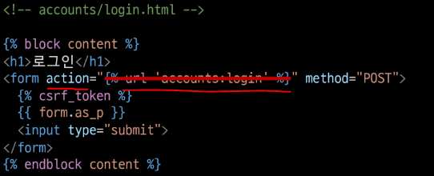

# Authentication system

> Django는 인증(Authentication)과 권한(Authorization)부여를 함께 제공

* 필수 구성은 `setting.py` 에 이미 포함되어 있으며 `INSTALLED_APPS` 에서 확인 가능
  
  * `django.contrib.auth`

* 1️⃣ **Authentication - 인증**
  
  * 신원 확인
  
  * 사용자가 자신이 누구인지 확인하는 것

* 2️⃣ **Authorization - 권한, 허가**
  
  * 권한 부여
  
  * 인증된 사용자가 수행할 수 있는 작업을 결정

# Substituting a custom User model

> Custom User Model로 대체하기

* Django는 기본적인 인증 시스템과 여러 가지 필드가 포함된 **User Model을 제공**하지만 대부분은 <mark>**기본 User Model을 Custom User Model로 대체하고 시작**</mark>한다.

* **왜 그럴까**⁉
  
  * 일부 프로젝트에서는 django에서 제공하는 built-in User model의 기본 인증 요구사항이 적절하지 않을 수 있음
    
    * ex. 회원가입 시 username 대신 email을 식별 값으로 사용하고 싶은 경우

* Django는 현재 프로젝트에서 사용할 User Model을 결정하는 **`AUTH_USER_MODEL`** 설정값으로 **<mark>Default User Model을 재정의(override)</mark>할 수 있도록 한다.**

### ✔ AUTH_USER_MODEL

> 프로젝트에서 User를 나타낼 때 사용하는 모델

* 프로젝트가 진행되는 동안(모델을 만들고 마이그레이션 후) 변경 불가능❗

* 프로젝트 시작 시 설정해야 하며, 참조하는 모델은 첫 번째 마이그레이션에서 사용할 수 있어야 함
  
  * 첫 번째 마이그레이션 전에 미리 확정지어야 하는 값

* 기본값
  
  
  
  * **`AUTH_USER_MODEL`** 이 setting.py에 안적혀 있는 이유는 작성하고 있는 settings.py 가 **`global_settings.py`** 를 상속받아 재정의하는 파일이기 때문

## ▶ How to substituting a custom User model

> 공식문서를 보며 순서대로 진행하는 것을 권장

📌 https://docs.djangoproject.com/en/3.2/topics/auth/customizing/#substituting-a-custom-user-model

### 1️⃣ AbstractUser를 상속받는 커스텀 User 클래스 작성

* 기존 User 클래스도 AbstractUser를 상속받기 때문에 Custom User 클래스도 완전히 같은 모습
  
  

### 2️⃣ settings.py 에서 `AUTH_USER_MODEL` 업데이트

* **Django 프로젝트에서 User를 나타내는데 사용하는 모델을 위에서 생성한 커스텀 User 모델로 지정**
  
  

### 3️⃣ admin.py 에 custom User 모델을 등록 (선택 사항)

* admin.py 에 커스텀 User 모델을 등록
  
  * 기본 User 모델이 아니기 때문에 등록해야만 admin site에서 사용 가능
  
  

### 📍 User 모델 상속 관계

* **`AbstractUser`**
  
  * **관리자 권한과 함께 완전한 기능을 가지고 있는 User model을 구현하는 추상 기본클래스**

* **`Abstract base classes(추상 기본 클래스)`**
  
  * 몇 가지 공통 정보를 여러 다른 모델에 넣을 때 사용하는 클래스
  
  * 데이터베이스 테이블을 만드는 데 사용되지 않으며, **대신 다른 모델의 기본 클래스로 사용되는 경우, 해당 필드가 하위 클래스의 필드에 추가됨**
  
  * https://docs.python.org/3/library/abc.html

### 📍 프로젝트 중간에 `AUTH_USER_MODEL` 변경하기❓

* 모델 관계에 영향을 미치기 때문에 훨씬 더 어려운 작업이 필요
  
  * ex. 변경사항이 자동으로 수행될 수 없기 때문에 DB 스키마를 직접 수정하고, 이전 사용자 테이블에서 데이터를 이동하고, 일부 마이그레이션을 수동으로 다시 적용해야 하는 등의 불편함이 매우 큼
  
  * <mark>**무조건**</mark>‼ **프로젝트 처음에 진행하기**‼

## ▶ 데이터베이스 초기화 방법

> 프로젝트 중간일 경우 데이터베이스 초기화 후 마이그레이션

### 1️⃣ migrations 파일 삭제

* migrations 폴더 및 `__init__.py` 는 삭제 ❌

* **번호가 붙은 파일만 삭제** ⭕

### 2️⃣ db.sqlite3 파일 삭제

### 3️⃣ migrations 진행

* `python manage.py makemigrations`

* `python manage.py migrate`

## ▶ 반드시 Custom User 모델을 사용해야 하나❓

> Django에서 **강력하게 권장**하고 있음

* Custom User 모델은 **기본 User 모델과 동일하게 작동하면서도 필요한 경우 나중에라도 맞춤 설정**할 수 있다‼

# HTTP Cookies

## ▶ HTTP

> Hyper Text Transfer Protocol / 클라이언트 - 서버 프로토콜이라고도 부름

* **HTML 문서와 같은 리소스들을 가져올 수 있도록 해주는 프로토콜(규칙, 규약)**

* 웹(WWW)에서 이루어지는 모든 데이터 교환의 기초

## ▶ HTTP 특징

### 1️⃣ 비연결 지향 (connectionless)

* <mark>**서버는 요청에 대한 응답을 보낸 후 연결을 끊음**</mark>
  
  * ex. 네이버 메인 페이지를 보고 있다고 해서 네이버 서버와 연결되어 있는 것은 아님
    
    * 네이버 서버는 우리에게 메인 페이지를 응답하고 연결을 끊은 것

### 2️⃣ 무상태 (stateless)

* **연결을 끊는 순간 클라이언트와 서버 간의 통신이 끝나며 상태 정보가 유지되지 않음**

* **클라이언트와 서버가 주고받는 메시지들은 서로 완전히 독립적**

### 📍 그럼 어떻게 로그인 상태를 유지할까❓

* **로그인을 하고 웹 사이트를 사용할 때 페이지를 이동해도 로그인 상태가 유지**

* 서버와 클라이언트 간 지속적인 상태 유지를 위해 <mark>**쿠키와 세션이 존재**</mark>

## ▶ 쿠키(Cookie)

> HTTP 쿠키는 <mark>**상태가 있는 세션**</mark>을 만들도록 함

### ✔ 개념

* **<mark>서버가 사용자의 웹 브라우저에 전송</mark>하는 작은 데이터 조각**

* 사용자가 웹사이트를 방문할 경우, 해당 웹사이트의 **서버를 통해 사용자의 컴퓨터에 설치되는 작은 기록 정보 파일**
  
  * 1️⃣ **브라우저(클라이언트)는 쿠키를 로컬에 <mark>KEY-VALUE의 데이터 형식으로 저장</mark>**
  
  * 2️⃣ 쿠키를 저장해놓았다가, <mark>**동일한 서버에 재요청 시 저장된 쿠키를 함께 전송**</mark>

* **쿠키는 두 요청이 <mark>동일한 브라우저에서 들어왔는지 아닌지를 판단할 때 주로 사용</mark>**
  
  * 쿠키를 이용하여 사용자의 로그인 상태를 유지할 수 있음
  
  * **상태가 없는(stateless) HTTP 프로토콜에서 상태 정보를 기억시켜 주기 때문**

* 즉, 웹 페이지에 접속하면 웹 페이지를 응답한 <mark>**서버로부터 쿠키를 받아 브라우저에 저장**</mark>하고, <mark>**클라이언트가 같은 서버에 재요청 시마다 요청과 함께 저장해 두었던 쿠키도 함께 전송**</mark>

### ✔ 쿠키 사용 예시

### ✔ 쿠키 사용 목적

* 1️⃣ <mark>**세션 관리 (Session management)**</mark>
  
  * **로그인, 아이디 자동완성, 공지 하루동안 안 보기, 팝업 체크, 장바구니 등의 사용자 정보를 관리**
    
    * 개발자 도구 - Network 에서 확인 가능
    
    * 서버는 응답과 함께 `Set-Cookie` 응답 헤더를 브라우저에게 전송
    
    * `Set-Cookie` 헤더가 클라이언트에게 쿠키를 저장하라고 전달 **(이전에 저장했던 <mark>모든 쿠키들을 매 요청마다 서버에 함께 전달)</mark>**

* 2️⃣ **개인화 (Personalization)**
  
  * 사용자 선호, 테마 등의 설정

* 3️⃣ **트래킹 (Tracking)**
  
  * 사용자 행동을 기록 및 분석

### ✔ 세션 (Session)

> **사이트와 특정 브라우저 사이의 "state(상태)"를 유지시키는 것**

* **클라이언트가 서버에 접속하면 서버가 특정 `session id`(key)를 발급하고, 클라이언트는 `session id`(key)를 쿠키에 저장**
  
  * **클라이언트가 다시 동일한 서버에 접속하면 요청과 함께 쿠키(session id가 저장된)를 서버에 전달 = 중요한 데이터는 서버에 저장되어 있음**
  
  * **쿠키는 요청 때마다 서버에 함께 전송되므로 <mark>서버에서 session id(key)를 확인해 알맞은 로직을 처리</mark>**

* `session id` 는 세션을 구별하기 위해 필요하며, **쿠키에는 `session id` 만 저장**

### ✔ 쿠키의 수명(Life-time)

* 1️⃣ **<mark>Session cookie</mark>**
  
  * **현재 세션이 종료되면 삭제**
  
  * **세션이 종료되는 시점은 보통, 브라우저 종료와 함께 세션이 삭제**

* 2️⃣ **Persistent cookies**
  
  * Expires 속성에 지정된 날짜 혹은 Max-Age 속성에 지정된 기간이 지나면 삭제

### ✔ Session in Django

* Django는 <mark>**database-backed sessions 저장 방식을 기본값**</mark>으로 사용
  
  * session 정보는 **<mark>Django DB의 django_session 테이블에 저장</mark>**
  
  * 설정을 통해 다른 저장방식으로 변경 가능

* Django 는 특정 `session id`를 포함하는 쿠키를 사용해서 각각의 브라우저와 사이트가 연결된 session 을 알아냄

* Django 는 우리가 session 메커니즘에 대부분을 생각하지 않고 사용할 수 있게 도와줌

# Authentication in Web requests

> Django가 제공하는 인증 관련 built-in forms
> 
>  https://docs.djangoproject.com/en/3.2/topics/auth/default/#module-django.contrib.auth.forms

## ▶ Login

* **로그인은 <mark>Session 을 Create</mark>하는 과정**

### ✔ AuthenticationForm

* **로그인을 위한 built-in form**
  
  * 로그인 하고자 하는 사용자의 정보를 입력 받음
  
  * **일반 Form 중에 하나 - 사용할 때 유의**‼
  
  * **기본적으로 username과 password를 받아 <mark>데이터가 유효한지 검증</mark>**

* **`AuthenticationForm(request)`**

### ✔ login() as auth_login()

* **`login(request, user(유저정보), backend=None)`**

* <mark>**인증된 사용자를 로그인 시키는 로직으로 view 함수에서 사용됨**</mark>

* **현재 세션에서 연결하려는 인증된 사용자가 있는 경우 사용**
  
  * `session` 을 만들어냄 = login 완료

* HttpRequest 객체와 User 객체가 필요

* view 함수 login과의 충돌 방지
  
  * import한 login 함수 이름을 **`auth_login`** 으로 변경해서 사용

### ✔ get_user()

* **`AuthenticationForm`** 의 인스턴스 메서드

* **유효성 검사를 통과했을 경우, 로그인 한 사용자 객체를 반환**

# Authentication with User

> 템플릿에서 인증 관련 데이터를 출력하는 방법

## ▶ 현재 로그인 되어있는 유저 정보를 출력하기

* 템플릿에서 **context 데이터 없이 user 변수를 사용할 수 있는데 왜**❓
  
  * settings.py 의 **`context processors` 설정 값 때문**

### 📍 context processors

* 템플릿이 렌더링 될 때 호출 가능한 컨텍스트 데이터 목록

* 작성된 컨텍스트 데이터는 **기본적으로 템플릿에서 사용 가능한 변수로 포함됨**

* **Django에서 자주 사용하는 데이터 목록을 미리 템플릿에 로드해 둔 것**
  
  

* **현재 로그인한 사용자를 나타내는 User 클래스의 인스턴스가 템플릿 변수 `{{ user }}` 에 저장됨**
  
  * 클라이언트가 로그인하지 않은 경우 AnonymousUser 클래스의 인스턴스로 생성
    
    

## ▶ Logout

* 로그아웃은 **<mark>Session 을 Delete하는 과정</mark>**
  * 로그인 했다는 것은 session이 클라이언트와 서버 양쪽에 위치함을 의미

### ✔ logout() as auth_logout()

* **`logout(request)`**

* HttpRequest 객체를 인자로 받고 반환 값이 없음

* **사용자가 로그인하지 않은 경우 오류를 발생시키지 않음**

* 2가지 일 처리
  
  * 1️⃣ **현재 요청에 대한 session data를 DB에서 삭제**
  
  * 2️⃣ **클라이언트의 쿠키에서도 sessionid를 삭제**
  
  * 모두 삭제하는 이유는 다른 사람이 동일한 웹 브라우저를 사용하여 로그인하고, **이전 사용자의 세션 데이터에 액세스하는 것을 방지하기 위함**

## ▶ 회원가입

* 회원가입은 <mark>**User를 Create하는 것**이며 **`UserCreationForm`** </mark>buil-in form을 사용

### ✔ UserCreationForm

* 주어진 username과 password로 권한이 없는 새 user를 생성하는 **ModelForm**

* 3개의 필드를 가짐
  
  * 1️⃣ username  (from the user model)
  
  * 2️⃣ password1
  
  * 3️⃣ password2

* **위와 같이 작성 시 Error 발생**‼
  
  * 회원가입에 사용하는 **`UserCreationForm`이 우리가 대체한 커스텀 user 모델이 아닌 <mark>기존 user 모델로 인해 작성된 클래스이기 때문에 상속을 통한 변경이 필요</mark>하다**❗
  
  * 실제 UserCreationForm 코드
    
    

# Custom user & Built-in auth forms

> Custom user로 인한 Built-in auth forms 변경

## ▶ AbstractBaseUser의 모든 subclass와 호환되는 forms

* 커스텀하지 않아도 사용 가능한 일반 Form 클래스 = 기존 User 모델을 참조하는 Form이 아니기 때문❗
  
  * `AuthenticationForm`
  
  * `SetPasswordForm`
  
  * `PasswordChangeForm`
  
  * `AdminPasswordChangeForm`

## ▶ 커스텀 유저 모델을 사용할 때 다시 작성해야하는 forms

* 모두 **`class Meta: model = User` 가 등록된 form**이기 때문에 반드시 커스텀해야 함‼
  
  * **<mark>`UserCreationForm`</mark>** - 회원가입
  
  * **<mark>`UserChangeForm`</mark>** - 회원정보수정

### ✔ UserCreationForm, UserChangeForm 커스텀

#### 📌 `get_user_model()`

* **<mark>현재 프로젝트에서 활성화된 사용자 모델(active user model)</mark>을 반환**

* **직접 참조하지 않는 이유는**❓
  
  * ex. 기존 User 모델이 아닌 User 모델을 커스텀 한 상황에서는 커스텀 User 모델을 자동으로 반환해주기 때문이다.

* Django는 User 클래스를 직접 참조하는 대신 **`get_user_model()` 을 사용해 참조해야 한다고 강조**

## ▶ 회원가입 후 곧바로 로그인 진행

* 회원가입 후 **바로 로그인 상태로 유지시키려면 `auth_logint()` 을 통해 가능함**

### 📍 `UserCreationForm`의 save 메서드

* user를 반환하는 것을 공식 문서에서 확인할 수 있다.
  
  

## ▶ 회원 탈퇴

* 회원 탈퇴하는 것은 DB에서 유저를 Delete하는 것과 같음

### 📍 탈퇴하면서 해당 유저의 세션 정보도 함께 지우고 싶은 경우

* **<mark>탈퇴 후 로그아웃의 순서</mark>를 꼭 지켜야 함**❗
  
  * **로그아웃을 먼저하면 해당 요청의 객체 정보가 없어지기 때문에 탈퇴에 필요한 정보 또한 사라지기 때문**

## ▶ 회원정보 수정

> 회원정보 수정은 User를 Update 하는 것이며 **UserChagneForm** built-in form 사용

### ✔ UserChangeForm

* 사용자의 정보 및 권한을 변경하기 위해 **admin 인터페이스에서 사용되는 ModelForm**

* UserChangeForm 또한 **ModelForm**이기 때문에 **instance 인자로 기존 user 데이터 정보를 받는 구조 또한 동일하다.**

* CustomUserChangeForm으로 사용해야 함❗

### ✔ UserChangeForm 의 문제점

* **일반 사용자가 접근해서는 안될 정보들(fields)까지 모두 수정이 가능함**
  
  * <mark>**admin 인터페이스에서 사용되는 ModelForm이기 때문**</mark>

* CustomUserChangeForm에서 접근 가능한 fields를 조정해줘야 한다❗

### ✔ CustomUserChangeForm fields 재정의

* 수정하고자 하는 필드 작성‼
  
  

# 비밀번호 변경

## ▶ PasswordChangeForm

> 사용자가 비밀번호를 변경할 수 있도록 하는 Form

* **이전 비밀번호를 입력하여 비밀번호를 변경할 수 있도록 함**

* 이전 비밀번호를 입력하지 않고 비밀번호를 설정할 수 있는 SetPasswordForm을 상속받는 서브 클래스
  
  * **user 인자를 필수적으로 하나 받아야 함**

* **PasswordChangeForm 은 <mark>인자를 받는 순서가 다름</mark>에 유의**‼

* 비밀번호 변경 후 로그인 상태가 지속되지 못하는 문제 발생
  
  * 기존의 세션과의 회원 인증 정보가 일치하지 않기 때문❗

### ✔ update_session_auth_hash()

* **`update_session_auth_hash(request, user)`**

* 현재 요청과 새 session data가 파생될 업데이트 된 사용자 객체를 가져오고, session data를 적절하게 업데이트해줌

* **암호가 변경되어도 로그아웃되지 않도록 새로운 password의 session data로 session을 업데이트**

# Limiting access to logged-in users

> 로그인 사용자에 대한 접근 제한하기

* 로그인 사용자에 대한 접근을 제한하는 2가지 방법
  
  * 1️⃣ The raw way
    
    * **`is_authenticated`** attribute
  
  * 2️⃣ The **`login_required`** decorator

## ▶ is_authenticated

> User model의 속성 중 하나

* 사용자가 인증되었는지 여부를 알 수 있는 방법

* **모든 User 인스턴스에 대해 항상 True인 읽기 전용 속성**
  
  * **AnonymousUser에 대해서는 항상 False**

* 일반적으로 `reqeust.user`에서 이 속성을 사용 <mark>**(`request.user.is_authenticated`)**</mark>

* **권한(permission)과는 관련이 없으며, 사용자가 활성화 상태(active)이거나 유효한 세션을 가지고 있는지도 확인하지 않음**‼

* **로그인과 비로그인 상태에서 출력되는 링크를 다르게 설정**‼

* 단, 아직 비로그인 상태로도 URL을 직접 입력하면 게시글 작성 페이지로 갈 수 있음

* 인증된 사용자라면 로그인 페이지를 수행할 수 없도록 처리 가능

## ▶ login_required

> login_required decorator

* 사용자가 로그인 되어 있으면 정상적으로 view 함수를 실행

* **로그인 하지 않은 경우 setting.py 의 LOGIN_URL 문자열 주소로 redirect**
  
  * **기본값은 /accounts/login/**
  
  * 두 번째 앱이름을 accounts로 한 이유 중 하나

* **로그인 상태에서만 글을 작성/수정/삭제할 수 있도록 변경**❗

* /articles/create/ 로 강제 접속 시도하여 로그인 페이지로 리다이렉트 하면
  
  * /accounts/login/?next=/articles/create/ 로 url 을 확인

* 로그인 성공 시 사용자가 redirect 되어야 하는 경로는 **next 라는 쿼리 문자열 매개 변수에 저장됨**‼
  
  * ex. /accounts/login/**<mark>?next=/articles/create/</mark>**

### ✔ 'next' query string parameter

* 로그인이 정상적으로 진행되면 이전에 요청했던 주소록 redirect 하기 위해 Django가 제공해주는 쿼리 스트링 파라미터
  
  * `/articles/create/` 로 강제 접속 시도
  
  * 로그인 페이지로 리다이렉트 되면 url 에는 **`/accounts/login/?next=/articles/create/`** 로 확인

* **해당 값을 처리할지 말지는 자유이며 별도로 처리 해주지 않으면 view에 설정한 redirect 경로로 이동하게 된다.**

* **단축평가를 통해 위와 같이 표현 가능함**‼
  
  * **앞이 True 면 뒤는 확인 ❌ / 앞이 False 면 뒤를 확인❗**
  
  * 단, login 템플릿에서 form action이 작성되어 있다면 동작하지 않음‼
  
  * 해당 action 주소 next 파라미터가 작성되어있는 현재 url이 아닌 /accounts/login/으로 요청을 보냈기 때문이다. = **사용하려면 비워두면 된다**❗

### ✔ 두 개의 데코레이터로 인해 발생하는 구조적 문제

* 1️⃣ **먼저 비로그인 상태로 detail 페이지에서 게시글 삭제 시도**

* 2️⃣ **delete view 함수의 `@login_required` 로 인해 로그인 페이지로 리다이렉트**

* 3️⃣ **redirect로 이동한 로그인 페이지에서 로그인 진행**
  
  * 로그인 성공 이후 GET method로 next 파라미터 주소에 리다이렉트 되기 때문

* 4️⃣ **delete view 함수의 `@require_POST` 로 인해 405 상태 코드를 받게 됨**
  
  * 405(Method Not Allowed) status code 확인

#### 📌 두 가지 문제가 발생

* 1️⃣ redirect 과정에서 POST 요청 데이터의 손실

* 2️⃣ redirect 로 인한 요청은 GET 요청 메서드로만 요청됨

#### 📌 해결 방안

* **`@login_required`는 GET request method 를 처리할 수 있는 View 함수에서만 사용해야 한다.**

* POST method만 허용하는 delete 같은 함수는 내부에서 `is_authenticated` 속성 값을 사용해서 처리
  
  
