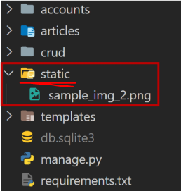
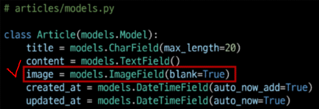
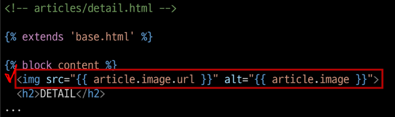

# Managing static files

> **<mark>개발자가 서버에 미리 준비</mark>하거나 <mark>사용자가 업로드한 정적파일</mark>을 클라이언트에게 제공하는 방법**

## ▶ Static files - 서버가 제공하는 정적 파일

* 응답할 때 별도의 처리 없이 파일 내용을 그대로 보여주면 되는 파일
  
  * 사용자의 요청에 따라 내용이 바뀌는 것이 아니라 **요청한 것을 그대로 보여주는 파일**

* **<mark>파일 자체가 고정</mark>되어 있고, 서비스 중에도 추가되거나 <mark>변경되지 않고 고정</mark> 되어있음**
  
  * **예를 들어, 웹 사이트는 <mark>일반적으로 이미지, 자바 스크립트 또는 CSS</mark>와 같은 미리 준비된 추가 파일(움직이지 않는)을 제공해야 함**

* Django 에서는 이러한 파일들을 "static file" 이라 함
  
  * Django 는 staticfiles 라는 내장앱을 통해 정적 파일과 관련된 기능을 제공

## ▶ Media File - 사용자가 업로드한 정적 파일

* 미디어 파일

* **사용자가 웹에서 업로드하는 정적 파일 (user-uploaded)**

* **<mark>유저가 업로드 한 모든 정적 파일</mark>**

## ▶ 웹 서버와 정적 파일


* **웹 서버의 기본 동작**
  
  * 특정 위치(URL)에 있는 자원을 요청(HTTP request)을 받아서
  
  * 응답(HTTP response)을 처리하고 제공(serving)하는 것

* **"자원과 자원에 접근 가능한 주소가 있다"는 의미**
  
  * 예) **사진 파일은 자원이고 <mark>해당 사진 파일을 얻기 위한 경로인 웹 주소(URL)가 존재함</mark>**

* **즉, <mark>웹 서버는 요청 받은 URL로 서버에 존재하는 정적 자원을 제공함</mark>**

# Static files 구성하기

## ▶ Django 에서 정적파일을 구성하고 사용하기 위한 단계

* 1️⃣ **`INSTALLED_APPS` 에 `django.contrib.staticfiles` 가 포함되어 있는지 확인**

* 2️⃣ **`settings.py` 에서 <mark>`STATIC_URL` 을 정의</mark>**

* 3️⃣ **<mark>앱의 static 폴더에 정적 파일을 위치하기</mark>** - templates와 유사
  
  * 예) **`my_app/static/sample_img.jpg`**

* 4️⃣ **템플릿에서 <mark>static 템플릿 태그를 사용</mark>하여 지정된 경로에 있는 정적 파일의 URL 만들기**
  
  ```python
  
  
  
  ```

## ▶ Django template tag

* **``**
  
  * 특정 라이브러리, 패키지에 등록된 모든 **템플릿 태그와 필터를 로드** (import와 유사)
  * html 상단에 작성한 후 사용 가능

* **``**
  
  * **`STATIC_ROOT`에 저장된 정적 파일에 연결** (정적 파일의 경로를 지정)

## ▶ Static files 관련 Core settings

### 1️⃣ `STATIC_ROOT`

> **Django <mark>프로젝트에서 사용하는 모든 정적 파일을 한 곳에 모아 넣는 경로</mark>**

* Default: None

* `collectstatic`이 배포를 위해 정적 파일을 수집하는 디렉토리의 **절대 경로**

* **개발 과정에서 `settings.py`의 DEBUG 값이 True 로 설정되어 있으면 해당 값은 작용 ❌**

* **<mark>실 서비스 환경(배포 환경)에서 Django의 모든 정적 파일을 다른 웹 서버가 직접 제공</mark>하기 위해 사용**

* **배포 환경에서는 Django를 직접 실행하는 것이 아니라, 다른 서버에 의해 실행되기 때문에 실행하는 <mark>다른 서버는 Django에 내장되어 있는 정적 파일들을 인식하지 못함</mark>❗ (내장되어 있는 정적 파일들을 밖으로 꺼내는 이유)**


### 📌 [참고] 소프트웨어 배포 (Deploy)

- 프로그램 및 애플리케이션을 서버와 같은 기기에 설치하여 서비스를 제공하는 것

- 클라우드 컴퓨팅 서비스(AWS, Google Cloud, MS Azure)에 프로그램 및 애플리케이션을 설치해 제공하는 것


### 📌 [참고] collectstatic

> **STATIC_ROOT에 Django 프로젝트의 모든 정적 파일을 수집** - 실 배포 시 사용

```python
# settings.py
STATIC_ROOT = BASE_DIR / 'staticfiles'
```

`python manage.py collectstatic`

* **결과만 확인하고 수집된 정적 파일은 모두 삭제하자**❗ - 개발 과정에서는 필요 없음

### 2️⃣ `STATICFILES_DIRS`

> **<mark>app/static/</mark> 디렉토리의 경로를 사용하는 것(기본 경로) 외에 <mark>추가적인 정적 파일</mark> 경로 목록을 정의하는 리스트**

* **Default: [] (Empty list)**

* App 폴더 외부에 존재

* 추가 파일 디렉토리에 대한 전체 경로를 포함하는 문자열 목록으로 작성되어야 함

* 특정 app 에서만 사용하는 것이 아닌 프로젝트 전체에서 사용하는 정적 파일을 위함


### 3️⃣ `STATIC_URL`❗

> **<mark>STATIC_ROOT에 있는 정적 파일을 참조할 때 사용할 URL</mark>**

* **Default: None**

* 개발 단계에서는 실제 정적 파일들이 저장되어 있는 app/static/ 경로(기본 경로) 및 STATICFILES_DIRS에 정의된 추가 경로들을 탐색

* **<mark>실제 파일이나 디렉토리가 아니며, URL로만 존재</mark>**

* 비어 있지 않은 값으로 설정한다면 **반드시 slash(`/`)로 끝나야 함**


# Static files 사용하기

## ▶ static files 가져오기

* **Static file 을 가져오는 2가지 방법**
  
  * **① <mark>기본 경로에 있는 static file 가져오기</mark>**
    
    * **`articles/static/articles`경로에 이미지 파일 배치**
      
      
    
    * **static tag를 사용해 이미지 파일 출력하기**
      
      
  
  * **② <mark>추가 경로(App 외부)에 있는 static file 가져오기</mark>**
    
    * 추가 경로 작성
      
      ```python
      # settings.py
      
      STATICFILES_DIRS = [
          BASE_DIR / 'static',
      ]
      ```
    
    * **`static(App 외부)/경로` 에 이미지 파일 배치하기**
      
      
    
    * **static tag 를 사용해 이미지 파일 출력하기**
      
      

## ▶ STATIC_URL 확인하기

> **Django가 해당 이미지를 <mark>클라이언트에게 응답하기 위해 만든 image url 확인</mark>하기**

* 개발자 도구 - Inspect 버튼을 통해 확인 가능
  
  

* "**<mark>STATIC_URL + static file 경로</mark>**"로 설정됨
  
  * http://127.0.0.1:8000/static/articles/sample_img_1.png

* 개발자 도구 - Network에서 Request URL 확인 해보기
  
  * **<mark>클라이언트에게 이미지를 응답하기 위한 요청 URL을 만든 것</mark>**


# Image Upload

> **Django ImageField를 사용해 <mark>사용자가 업로드한 정적 파일(미디어 파일) 관리</mark>하기**

## ▶ ImageField()

> **이미지 업로드에 사용하는 모델 필드**

* `FileField` 를 상속받는 서브 클래스이기 때문에 `FileField`의 모든 속성 및 메서드 사용 가능

* 또한, **사용자에 의해 업로드 된 객체가 유효한 이미지인지 검사**

* `ImageField` 인스턴스는 <mark>**최대 길이가 100자인 문자열로 DB에 생성**</mark>되며, `max_length` 인자를 사용하여 최대 길이를 변경할 수 있음
  
  * **문자열이 들어가는 이유❓**
    * **이미지 파일의 경로가 들어감**

## ▶ FileField()

* **`FileField(upload_to='', storage=None, max_length=100, **options)`**

* 파일 업로드에 사용하는 모델 필드

* 2개의 선택 인자를 가지고 있음
  
  * ① **`upload_to`**
  
  * ② `storage`

## ▶ FileField / ImageField 를 사용하는 방법

* ① `settings.py` 에 <mark>**`MEDIA_ROOT`**, **`MEDIA_URL`** </mark>설정

* ② <mark>**`upload_to`**</mark> 속성을 정의하여 업로드된 파일에 사용할 `MEDIA_ROOT`의 하위 경로를 지정 (선택 사항)

### 1️⃣ MEDIA_ROOT

> **사용자가 업로드한 파일(미디어 파일)들을 보관할 디렉토리의 <mark>절대 경로</mark>**

* Default: '' (Empty string)

* **Django는 성능을 위해 업로드 파일은 데이터베이스에 저장하지 않음**
  
  * **데이터베이스에 저장되는 것은 "<mark>파일 경로</mark>"**

* MEDIA_ROOT 는 STATIC_ROOT와 반드시 다른 경로로 지정해야 함

```python
# settings.py

MEDIA_ROOT = BASE_DIR / 'media'
```

### 2️⃣ MEDIA_URL

> **<mark>MEDIA_ROOT에서 제공되는 미디어 파일을 처리하는 URL</mark>**

* Default: '' (Empty string)

* **<mark>업로드된 파일의 주소(URL)를 만들어 주는 역할</mark>**
  
  * 웹 서버 사용자가 사용하는 public URL

* 비어 있지 않은 값으로 설정한다면 **반드시 slash(`/`)로 끝나야 함**

* MEDIA_URL 은 STATIC_URL 과 반드시 다른 경로로 지정해야 함

```python
# settings.py

MEDIA_URL = '/media/'
```

## ▶ 개발 단계에서 사용자가 업로드한 미디어 파일 제공하기


* 사용자로부터 업로드 된 파일이 프로젝트에 업로드 되고나서, **<mark>실제로 사용자에게 제공하기 위해서는 업로드 된 파일의 URL이 필요</mark>함**
  
  * **업로드된 파일의 URL == `settings.MEDIA_URL`**
  
  * **위 URL을 통해 참조하는 파일의 실제 위치 == `settings.MEDIA_ROOT`**

# CREATE

## ▶ ImageField 작성



* *기존 컬럼 사이에 작성해도 실제 테이블에 추가 될 때는 맨 뒤(우측)에 추가됨*

## ▶ Model field option

* Model field option 중 아래 2가지 사항 알아보기
  
  * **① blank**
    
    * **Default: False**
    
    * **<mark>True인 경우 필드를 비워둘 수 있음</mark>**
      
      * ㄴ**이럴 경우 <mark>DB에는 ''(빈 문자열)이 저장</mark>됨**
    
    * **유효성 검사에서 사용됨(is_valid)**
      
      * "Validation-related"
      
      * **필드에 blank=True 가 있으면 form 유효성 검사에서 빈 값을 입력할 수 있음**
  
  * **② null**
    
    * **Default: False**
    
    * **True 인 경우 Django는 <mark>빈 값을 DB에 NULL로 저장</mark>함(문자열 제외)**
      
      * Database-related

### 📌 null 관련 주의사항

* **"<mark>CharField, TextField와 같은 문자열 기반 필드에는 null 옵션 사용을 피해야 함</mark>"**
  
  * **문자열 기반 필드에 null=True 로 설정 시 <mark>데이터 없음에 대한 표현에 "빈 문자열"과 "NULL"</mark> 2가지 모두 가능하게 됨**
  
  * *"데이터 없음"에 대한 표현에 두 개의 가능한 값을 갖는 것은 좋지 않음*
  
  * Django는 **<mark>문자열 기반 필드에서 NULL이 아닌 빈 문자열을 사용하는 것이 규칙</mark>**

## ▶ Mirgrations

* **`ImageField` 를 사용하려면 반드시 `Pillow` 라이브러리가 필요**
  
  * Pillow 설치 없이는 makemigrations 실행 불가
    
    `pip install Pillow`, `pip freeze > requirements.txt`

### 📌 [참고] Pillow

* 광범위한 파일 형식 지원, 효율적이고 강력한 이미지 처리 기능을 제공하는 라이브러리

* 이미지 처리 도구를 위한 견고한 기반을 제공

## ▶ ArticleForm 에서 image 필드 출력 확인

* 확인 후 이미지를 첨부하여 게시글 작성 시도


* *하지만 이미지가 업로드 되지 않음*

* **<mark>파일 또는 이미지 업로드 시에는 `form` 태그에 `enctype` 속성</mark>을 다음과 같이 변경**해야 함❗


### 📌 [참고] form 태그의 enctype(인코딩) 속성 값

* 1️⃣ `aplication/x-www-form-urlencoded`
  
  * 기본 값
  
  * 모든 문자 인코딩

* 2️⃣ **`multipart/form-data`**
  
  * **파일/이미지 업로드 시에 반드시 사용해야 함**
  
  * 전송되는 데이터의 형식을 지정
  
  * **`<input type="file">`을 사용할 경우 사용**

* 3️⃣ text/plain

## ▶ request.FILES

* **파일 및 이미지는 request의 POST 속성 값으로 넘어가지 않고 <mark>FILES 속성 값</mark>에 담겨 넘어간다.**


### 📌 [참고] request.FILES 가 두 번째 인자인 이유

* BaseModelForm Class의 생성자 함수


## ▶ 이미지 첨부하기

* **이미지를 첨부해서 한 번, 첨부하지 않고 한 번** 게시글 작성해보기

* <mark>**이미지를 첨부하지 않으면 blank=True 속성으로 인해 빈 문자열이 저장**</mark>되고, **이미지를 <mark>첨부한 경우는 MEDIA_ROOT 경로에 이미지가 업로드</mark> 됨**
  
  * 파일 자체가 아닌 **"경로"가 저장된다**❗
    
    


* **만약 같은 이름의 파일을 업로드 한다면 Django는 파일 이름 끝에 임의의 난수 값을 붙여 저장함**

# READ

## ▶ 업로드 이미지 출력하기

* 업로드 된 파일의 상대 URL은 Django가 제공하는 url 속성을 통해 얻을 수 있음



* **`article.image.url` = <mark>업로드 파일의 경로</mark>**

* **`article.image` = <mark>업로드 파일의 파일 이름</mark>**

* 이미지를 업로드하지 않은 게시물은 detail 템플릿을 출력할 수 없는 문제를 해결해야 함
  
  * **이미지 데이터가 있는 경우에만 이미지 출력할 수 있도록 처리**


# UPDATE

> **이미지는 바이너리 데이터이기 때문에 텍스트처럼 일부만 수정하는 것은 불가능**
> 
> **= 새로운 사진으로 대체하는 방식을 사용**

## ▶ 업로드 이미지 수정하기

* **`enctype` 속성값 추가**


* **이미지 파일이 담겨있는 `request.FILES` 추가 작성**


## ▶ `upload_to` argument

> **사용자 지정 업로드 경로와 파일 이름을 설정**

* `ImageField` 는 업로드 디렉토리와 파일 이름을 설정하는 2가지 방법 제공
  
  * 1️⃣ **문자열 값이나 경로 지정 방법**
    
    * **`upload_to` 인자에 새로운 이미지 저장 경로를 추가 후 migration 진행**
      
      
    
    * **`MEDIA_ROOT` 이후 경로가 추가**
      
      
    
    * time 모듈의 strftime() 형식도 포함 가능하며, **파일 업로드 날짜/시간으로 대체**
      
      
      
      
  
  * 2️⃣ **함수 호출 방법**
    
    * `upload_to` 는 **함수처럼 호출이 가능하며 해당 함수가 호출되면서 반드시 2개의 인자를 받음**
      
      
    
    * **① `instance`** - FileField가 정의된 모델의 인스턴스
      
      * 대부분 이 객체는 아직 데이터베이스에 저장되기 전이므로 아직 PK 값이 없을 수 있으니 주의 = pk 값으로 폴더명 사용 불가
      
      * username 에 따라 폴더가 생기고 업로드 한 이미지 확인 가능
    
    * **② `filename`** - 기존 파일 이름

# Image Resizing

> **실제 원본 이미지를 서버에 그대로 로드하는 것은 여러가지 이유로 부담이 큼**

* HTML `` 태그에서 직접 사이즈를 조정할 수도 있지만, **업로드 될 때 이미지 자체를 resizing 할 수도 있다.**

* 사전 준비 = **`django-imagekit`** 모듈 설치 및 등록
  
  * `pip install django-imagekit`
  
  * `pip freeze > requirements.txt`
    
    

### 📌 [참고] django-imagekit

* 이미지 처리를 위한 Django 앱 - 썸네일, 해상도, 사이즈, 색깔 등을 조정할 수 있음

## ▶ 썸네일 만들기

> 2가지 방식으로 썸네일 만들기 가능

### 1️⃣ 원본 이미지 저장 X


* **Migration 진행 후 이미지 업로드**


### 📌 [참고] pilkit

* `processors` 에 작성하는 여러 클래스는 해당 라이브러리 문서를 별도 확인

* https://github.com/matthewwithanm/pilkit

### 2️⃣ 원본 이미지 저장 O


* **Migration 진행 후 이미지 업로드**


* **처음에는 원본만 사용하며 썸네일이 사용되었을 때만 resizing한 이미지를 생성**


* **이미지가 출력되는 다른 detail 페이지에 이동할 때마다 썸네일이 생성됨**


