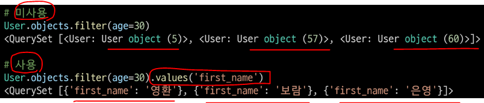
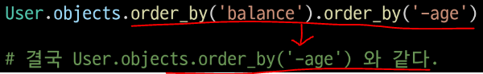
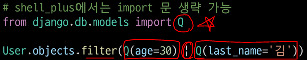
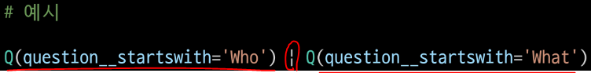
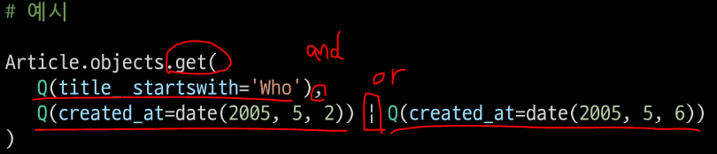

# QuerySet API Advanced

* 사전 준비
  
  * 가상환경 생성 및 활성화
  
  * 패키지 목록 설치
  
  * migrate 진행
  
  * sqlite3 에서 csv 데이터 import 하기
    
    * `sqlite3 db.sqlite3`
    
    * `sqlite > .mode csv`
    
    * `sqlite > .import users.csv users_user`
    
    * `sqlite > .exit`
  
  * shell_plus 실행
    
    * `python manage.py shell_plus`

# CRUD 기본

* 모든 user 레코드 조회
  
  * `User.objects.all()`

* user 레코드 생성
  
  * `User.objects.create(first_name='길동', last_name='홍', age=100, country='제주도', phone='010-1234-4567', balance=10000,)`

* 101번 레코드 조회
  
  * `user = User.objects.get(pk=101)`

* 101번 user 레코드의 last_name을 '김'으로 수정
  
  * `user.last_name = '김'`
    
    * `user.save()`

* 101번 user 레코드 삭제
  
  * `user = User.objects.get(pk=101)`
    
    * `user.delete()`

* 전체 인원 수 조회 (2가지 방법)
  
  * **① `User.objects.count()`**
  
  * **② `len(User.objects.all())`**

* `.count()`
  
  * QuerySet과 일치하는 데이터베이스의 개체 수를 나타내는 정수를 반환
  
  * `.all()`을 사용하지 않아도 됨

# Sorting data

* 나이가 어린 순으로 이름과 나이 조회
  
  * **`User.objects.order_by('age').value('first_name', 'age')`**

* <mark>**`.order_by(*fields)`**</mark>
  
  * QuerySet 의 정렬을 재정의
  
  * 기본적으로 오름차순 정렬, **필드명에 `-`(하이픈)을 작성하면 내림차순으로 정렬**
  
  * **인자로 `?`를 입력하면 랜덤으로 정렬**

* <mark>**`.values(*fields, **expressions)`**</mark>
  
  * **모델 인스턴스가 아닌 딕셔너리 요소들을 가진 QuerySet을 반환**
  
  * *fields 는 선택인자이며 조회하고자 하는 필드명을 가변인자로 입력 받음
    
    * 필드를 지정하면 각 딕셔너리에는 지정한 필드에 대한 key와 value 만을 출력
    
    * 입력하지 않을 경우 각 딕셔너리에는 레코드의 모든 필드에 대한 key와 value를 출력
  
  * values 사용 여부에 따른 출력 비교
    
    

* 이름과 나이를 나이가 많은 순서대로 조회
  
  * **`User.objects.order_by('-age').value('first_name', 'age')`**

* 이름, 나이, 계좌 잔고를 나이가 어린순으로, 만약 같은 나이라면 계좌 잔고가 많은 순으로 정렬해서 조회
  
  * **`User.objects.order_by('age', '-balance').values('first_name', 'age', 'balance')`**

### 📌 [참고] order_by 주의사항

* 다음과 같이 작성할 경우 앞에 호출은 모두 지워지고 마지막 호출만 적용됨



# Filtering data

* 중복없이 모든 지역 조회
  
  * **`User.objects.distinct().values('country')`**

* 지역 순으로 오름차순 정렬하여 중복없이 모든 지역 조회
  
  * **`User.objects.distinct().values('country').order_by('country')`**

* 이름과 지역이 중복없이 모든 이름과 지역 조회
  
  * **`User.objects.distinct().values('first_name', 'country')`**

* 이름과 지역 중복없이 지역 순으로 오름차순 정렬하여 모든 이름과 지역 조회****
  
  * **`User.objects.distinct().vlaues('first_name', 'country').order_by('country')`**

* 나이가 30인 사람들의 이름 조회
  
  * **`User.objects.filter(age=30).values('first_name')`**

* 나이가 30살 이상인 사람들의 이름과 나이 조회
  
  * **`User.objects.filter(age__gte=30).values('first_name', 'age')`**

* **Field lookups**
  
  * SQL WHERE 절의 상세한 조건을 지정하는 방법
  
  * QuerySet 메서드 filter(), exclude() 및 get()에 대한 키워드 인자로 사용됨
  
  * **문법 규칙**
    
    * **필드명 뒤에 "`__`"(double-underscore) 이후 작성함**
    
    * **`field__lookuptype=value`**

* 나이가 30살 이상이고 계좌 잔고가 50만원 초과인 사람들의 이름, 나이, 계좌 잔고 조회
  
  * **`User.objects.filter(age__gte=30, balance__gt=500000).values('first_name', 'age', 'balance')`**

* 이름에 '호'가 포함되는 사람들의 이름과 성 조회
  
  * **`Users.objects.filter(first_name__contains='호').values('first_name', 'last_name')`**

* 핸드폰 번호가 011로 시작하는 사람들의 이름과 핸드폰 번호 조회
  
  * **`Users.objects.filter(phone__startswith='011-').values('first_name', 'phone')`**
    
    * SQL에서의 `%` 와일드 카드와 같음
    
    * `_`(underscore) 는 별도로 정규 표현식을 사용해야 함

* 이름이 '준'으로 끝나는 사람들의 이름 조회
  
  * **`User.objects.filter(first_name__endswith='준').values('first_name')`**

* 경기도 혹은 강원도에 사는 사람들의 이름과 지역 조회
  
  * **`User.objects.filter(country__in=['경기도', '강원도']).values('first_name', 'country')`**

* 경기도 혹은 강원도에 살지 않는 사람들의 이름과 지역 조회
  
  * **`User.objects.exclude(country__in=['경기도', '강원도']).values('first_name', 'country')`**

* <mark>`exclude(**kwargs)`</mark>
  
  * 주어진 매개변수와 일치하지 않는 객체를 포함하는 QuerySet 반환

* 나이가 가장 어린 10명의 이름과 나이 조회
  
  * **`User.objects.order_by('age').values('first_name', 'age')[:10]`**

* 나이가 30이거나 성이 김씨인 사람들 조회
  
  

* **<mark>'Q' object</mark>**
  
  * 기본적으로 filter()와 같은 메서드의 키워드 인자는 AND statement를 따름
  
  * **만약 더 복잡한 쿼리를 실행해야 하는 경우가 있다면 Q 객체가 필요**
    
    * 예) **OR statement 의 경우**
      
      
  
  * **`&` 및 `|`를 사용하여 Q 객체를 결합할 수 있음**
    
    
  
  * **조회를 하면서 여러 Q 객체를 제공할 수도 있음**
    
    

# Aggregation (Grouping data)

> 일반적으로 import 후에 사용 가능
> 
> `from django.db.models import Avg, Max, Sum, `

## ▶️ aggregate()

* 전체 queryset에 대한 값을 계산

* 특정 필드 전체의 합, 평균, 개수 등을 계산할 때 사용

* **딕셔너리를 반환 - key를 통해 값을 추출해서 사용**

* `aggregation functions`
  
  * `Avg`, `Count`, `Max`, `Min`, `Sum`

* 나이가 30이상인 사람들의 평균 나이 조회
  
  * `User.objects.filter(age__gte=30).aggregate(Avg('age'))`
  
  * 결과에 대한 필드명(key) 변경을 원하는 경우
    
    * `User.objects.filter(age__gte=30).aggregate(age=Avg('age'))`

* 가장 높은 계좌 잔액 조회
  
  * `User.objects.aggregate(Max('balance'))`

* 모든 계좌 잔액 총액 조회
  
  * `User.objects.aggregate(Sum('balance'))`

## ▶️ annotate()

* 쿼리의 각 항목에 대한 요약 값을 계산

* SQL의 `GROUP BY`에 해당

* '주석을 달다'라는 사전적 의미를 지님

* 각 지역별로 몇 명씩 살고 있는지 조회
  
  * `User.objects.values('country').annotate(Count('country'))`

* 각 지역별로 몇 명씩 살고 있는지 + 지역별 계좌 잔액 평균 조회
  
  * `User.objects.values('country').annotate(Count('country'), avg_balance=Avg('balance'))`

* 각 성씨가 몇 명씩 있는지 조회
  
  * `User.objects.values('last_name').annotate(Count('last_name'))`

## ▶️ N:1 인 경우

```python
# Comment - Article 관계가 N:1인 경
Article.objects.annotate(
    number_of_comment=Count('comment')
    pub_date=Count('comment', filter=Q(comment_created_at__lte='2000-01-01'))
)
```

* 전체 게시글을 조회하면서 `annotate`로 각 게시글의 댓글 개수와 2000-01-01보다 나중에 작성된 댓글의 개수를 함께 조회하는 것


