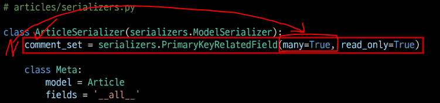

# HTTP

> HyperText Transfer Protocol, 클라이언트-서버 프로토콜

* **HTML 문서와 같은 리소스(자원)들을 가져올 수 있도록 하는 프로토콜(규칙, 약속)**

* 웹 상에서 컨텐츠를 전송하기 위한 약속

* 웹에서 이루어지는 모든 데이터 교환의 기초

## ▶ HTTP 특징

* **Stateless (무상태)**
  
  * 동일한 연결에서 연속적으로 수행되는 두 요청 사이에 링크가 없음
  
  * **응답을 마치고 연결을 끊는 순간 클라이언트와 서버 간의 통신이 끝나며 상태 정보가 유지되지 않음**

* **<mark>특정 페이지와 일관되게 상호작용하려는 사용자에게 문제가 될 수 있음</mark>**
  
  * **예) 장바구니에 데이터 유지를 못함**

* 이를 해결하기 위해, **쿠키와 세션을 사용해 서버 상태를 요청과 연결하도록 함**

## ▶ HTTP Request Methods

> 리소스에 대한 행위(수행하고자 하는 동작)를 정의

* 리소스에 대해 수행할 원하는 작업을 나타내는 메서드 모음을 정의

* **`GET`(READ), `POST`(CREATE), `PUT`(UPDATE), `DELETE`(DELETE)**

### 📍 [참고] 리소스

* HTTP 요청의 대상을 리소스라고 한다.

## 1️⃣ GET

* 서버에 리소스의 표현을 요청

* **GET을 사용하는 요청은 데이터만 검색해야 함**

## 2️⃣ POST

* **데이터를 지정된 리소스에 제출(submit)**

* **서버의 상태를 변경**

## 3️⃣ PUT

* **요청한 주소의 리소스를 수정**

## 4️⃣ DELETE

* **지정된 리소스를 삭제**

## ▶ HTTP Response status codes

> **특정 HTTP 요청이 성공적으로 완료되었는지 여부를 나타냄**

1. Informational responses (100-199)

2. Successful responses (200-299)

3. **Redirection messages** (300-399)

4. **Client error responses** (400-499)

5. **Server error responses** (500-599)

# Identifying resources on the Web

> **웹에서 리소를 식별하는 방법**

* HTTP 요청의 대상을 리소스(자원)라 함

* 리소스는 문서, 사진 또는 기타 어떤 것이든 가능

* **각 리소스는 식별을 위해 `URI`로 식별됨**

## ▶ URI (Uniform Resource Identifier)

> **통합 자원 식별자 - 인터넷에서 하나의 리소스를 가리키는 문자열**

* 가장 일반적인 URI는 **웹 주소로 알려진 `URL`**

* **특정 이름공간에서 이름으로 리소스를 식별**하는 URI는 **`URN`**
  
  * 예) ISBN에서 식별되는 "로미오와 줄리엣" 도서 = `urn:isbn:9788937461736`

## ▶ URL (Uniform Resource Locator)

> **통합 자원 위치 - 웹에서 주어진 리소스의 주소**

* 네트워크 상에 리소스가 어디 있는지(주소)를 알려주기 위한 약속
  
  * 리소소는 HTML, CSS, 이미지 등

* URL은 다음과 같이 여러 부분으로 구성되며 일부는 필수이고 나머지는 선택사항

* **자원의 위치로 자원을 식별!**


## ▶ URL 구조

* **Scheme(or <mark>protocol</mark>)**
  
  * 브라우저가 리소스를 요청하는 데 사용해야 하는 프로토콜
  
  * URL의 첫 부분은 브라우저가 어떤 규약을 사용하는지를 나타냄
  
  * 기본적으로 웹은 HTTP(S)를 요구하며 메일을 열기 위한 `mailto`:, 파일을 전송하기 위한 `ftp:` 등 다른 프로토콜도 존재
  
  <mark>**https**</mark>

* **Authority**
  
  * Scheme 다음은 문자 패턴 `://`으로 구분된 authority(권한)
    
    1. **Domain Name**
       
       * 요청 중인 웹 서버를 나타냄
       
       * 직접 IP 주소를 사용하는 것도 가능하지만, 사람이 외우기 어렵기 때문에 **Domain Name 으로 사용함**
       
       * 예) google.com 의 IP 주소는 `142.251.42.142`
    
    2* **Port**
    
    * 웹 서버의 리소스에 접근하는데 사용되는 기술적인 문(Gate)
    
    * HTTP 프로토콜의 표준 포트는 다음과 같고 생략이 가능 (나머지는 생략 불가)
      
      * HTTP - 80
      
      * HTTPS - 443
    
    * Django의 경우 `8000(80+00)`이 기본 포트로 설정되어 있음
    
    **<mark>www.example.com</mark>:<mark>80</mark>**

* **Path**
  
  * **웹 서버의 리소스 경로**
  
  * *초기에는 실페 파일이 위치한 물리적 위치*를 나타냈지만, **요즘은 추상화된 형태의 구조를 표현**
  
  * 예) `/articles/create/` 가 실제 articles 폴더 안에 create 폴더 안을 의미하는 것은 아님
  
  <mark>**/path/to/myfile.html**</mark>

* **Parameters**
  
  * 웹 서버에 제공하는 추가적인 데이터
  
  * **`?` 시작하는 파라미터는 `&` 기호로 구분되는 key-value 쌍 목록**
  
  * 서버는 리소스를 응답하기 전에 이러한 파라미터를 사용하여 추가 작업을 수행
  
  * GET 요청일 때 전달하는 값
  
  **<mark>`?key=value`</mark>**

* **Anchor**
  
  * 리소스의 다른 부분에 대한 앵커
  
  * 하이퍼링크와 비슷한 기능을 하는 인터넷상의 다른 문서와 연결된 문자 혹은 그림
  
  * **리소스 내부 일종의 "북마크"를 나타내며 브라우저에 해당 북마크 지점에 있는 콘텐츠를 표시**
    
    * 예) HTML 문서에서 **<mark>브라우저는 앵커가 정의한 지점으로 스크롤</mark>**
  
  * fragment identifier(부분 식별자)라고 부르는 **`#` 이후 부분은 <mark>서버에 전송되지 않음</mark>**
  
  **<mark>`#quick-start`</mark>**

### 📌 [참고] URN

> 통합 자원 이름 - **고유한 이름으로 자원을 식별**

* URL과 달리 자원의 위치에 영향을 받지 않는 유일한 이름 역할을 함 (독립적 이름)

* URL의 단점을 극복하기 위해 등장했으며 자원이 어디에 위치한지 여부와 관계없이 이름만으로 자원을 식별

* ***하지만 이름만으로 실제 리소스를 찾는 방법은 보편화 되어있지 않아 현재는 URL을 대부분 사용***

* 예) ISBN(국제표준 도서번호), ISAN(국제표준 시청각 자료번호)

# REST API

## ▶ API (Application Programming Interface)

> 애플리케이션과 프로그래밍으로 소통하는 방법
> 
> **개발자가 복잡한 기능을 보다 쉽게 만들 수 있도록 프로그래밍 언어로 제공되는 구성**

* API를 제공하는 애플리케이션과 다른 소프트웨어 및 하드웨어 등의 것들 사이의 간단한 계약(인터페이스)이라고 볼 수 있음

* **<mark>서로 다른 환경에서 프로그램을 개발하기 위한 인터페이스</mark>**

* API는 복잡한 코드를 추상화하여 대신 사용할 수 있는 몇 가지 더 쉬운 구문을 제공

## ▶ Web API

> **웹 서버 또는 웹 브라우저를 위한 API**

* 현재 웹 개발은 모든 것을 하나부터 열까지 직접 개발하기보다 **여러 Open API를 활용**

* API는 다양한 타입의 데이터를 응답
  
  * `HTML`, `XML`, `JSON` 등

### 📌 [참고] Open API

* 개발자라면 누구나 사용할 수 있도록 공개된 API

* 개발자에게 사유 응용 소프트웨어나 웹 서비스의 프로그래밍적 권한을 제공

## ▶ REST

> Respresentational State Transfer

* REST 원리를 따르는 시스템을 **`RESTful`** 하다고 부름

* **REST의 기본 아이디어는 리소스(자원)**
  
  * **<mark>자원을 정의하고 자원에 대한 주소를 지정하는 전반적인 방법을 서술</mark>**

## ▶ REST 에서 자원을 정의하고 주소를 지정하는 방법

1. **자원의 식별 - <mark>URI</mark>**

2. **자원의 행위 - <mark>HTTP Method(`GET`, `POST`, `PUT`, `DELETE`)</mark>**

3. **자원의 표현**
   
   * 자원과 행위를 통해 궁극적으로 표현되는 (추상화된) 결과물
   
   * **<mark>JSON으로 표현</mark>된 데이터를 제공**

## ▶ JSON

> JSON is a lightweight data-interchange format
> 
> **JavaScript의 표기법을 따른 단순 문자열**

* 파이썬의 dictionary, 자바스크립트의 object처럼 C 계열의 언어가 갖고 있는 자료구조로 쉽게 변환할 수 있는 <mark>**key-value 형태의 구조**</mark>를 갖고 있음

* 사람이 읽고 쓰기 쉽고 기계가 파싱(해석&분석)하고 만들어내기 쉽기 때문에 현재 API에서 가장 많이 사용하는 데이터 타입


## ▶ REST 정리

> **자원을 정의하고 자원에 대한 주소를 지정하는 방법의 모음**

1. 자원을 식별 = `URI`

2. 자원에 대한 행위 = `HTTP Methods`

3. 자원을 표현 = `JSON`
* **설계 방법론은 지키지 않았을 때 잃는 것보다 지켰을 때 얻는 것이 훨씬 많음**
  
  * 단, 설계 방법론을 지키지 않더라도 동작 여부에 큰 영향을 미치지는 않음
  
  * 말 그대로 방법론일 뿐이며 규칙이나 규약은 아님

# Response JSON

> JSON 형태로의 서버 응답 변화
> 
> 다양한 방법의 JSON 응답

## ▶ 서버가 응답하는 것

> **지금까지 Django로 작성한 서버는 사용자에게 페이지(html)만 응답**

* **하지만 사실 서버가 응답할 수 있는 것은 페이지 뿐만 아니라 다양한 데이터 타입을 응답할 수 있음**

* 페이지(html), JSON 데이터 등을 응답


* **이제는 <mark>JSON 데이터를 응답하는 서버로의 전환</mark>**
  
  * JSON 데이터를 받아 화면을 구성하여 사용자에게 보여주는 것은 Front-end Framework가 담당할 예정


* **Django는 더이상 Template 부분에 대한 역할을 담당하지 않으며** Front-end 와 Back-end가 분리되어 구성❗
  
  * 실시간 데이터들을 받아오기에는 Django로 구현하기 어렵다.
  
  * Django는 페이지를 구성할 수 있도록 JSON 데이터를 만들어서 Front-end에 전달
  
  * JSON 데이터를 읽어와 Front-end 작업을 통해 페이지를 꾸며서 출력해준다.

## ▶ Response

* JSON 데이터를 응답하는 방법
  
  1️⃣ HTML 응답
  
  * 문서(HTML) 한 장을 응답하는 서버 확인
  
  * 지금까지 Django로 응답 해오던 방식
  
  ### 📍 [참고] 'Content-Type'  entity header
  
  * 리소스의 media type(MIME type, content type)을 나타내기 위해 사용
  
  * **응답 내에 있는 컨텐츠의 컨텐츠 유형(HTML, JSON 등)이 실제로 무엇인지 클라이언트에게 알려줌**
  
  2️⃣ `JsonResponse()`를 사용한 JSON 응답
  
  * 문서(HTML) 한 장을 응답하는 것이 아닌 JSON 데이터를 응답해보기
  
  * Django가 기본적으로 제공하는 `JsonResponse` 객체를 활용하여 Python 데이터 타입을 손쉽게 JSON으로 변환하여 응답 가능
  
  ### 📌 JsonResponse()
  
  * JSON-encoded response 를 만드는 클래스
  
  * **`'safe'`** parameter
    
    * **기본값 True**
    
    * 데이터 타입이 dictionary 가 아니면 모두 `safe=False`를 사용해야 함
    
    * **<mark>False로 설정 시 모든 타입의 객체를 serialization 할 수 있음</mark>**
      
      **(그렇지 않으면 dict 인스턴스만 허용됨)**
  
  3️⃣ Django Serializer를 사용한 JSON 응답
  
  * Django의 내장 **`HttpResponse()` 를 활용한 JSON 응답**
  
  * 전에는 JSON의 모든 필드를 작성해야 했지만 이제는 모든 필드를 작성할 필요없음
  
  4️⃣ **<mark>Django REST framework를 사용한 JSON 응답</mark>**
  
  * **<mark>Django REST Framework (DRF)</mark>**
    
    * Django에서 **Restful API 서버를 쉽게 구축할 수 있도록 도와주는 오픈소스 라이브러리**
    
    * Web API 구축을 위한 강력한 toolkit 제공
    
    * REST Framework를 작성하기 위한 여러 기능을 제공
    
    * **DRF의 `serializer`는 Django의 `Form` /`ModelForm` 클래스와 매우 유사**❗
  
  * DRF가 설치되어 있는 것을 확인
    
    * settings.py 내 INSTALLED_APPS 에 `'rest_framework',`를 추가❗
  
  * ModelForm과 유사한 ModelSerializer 구조
    
    ```python
    # articles/serializers.py
    from rest_framework import serializers
    from .models import Article
    
    
    class ArticleSerializer(serializers.ModelSerializer):
    
        class Meta:
            model = Article
            fields = '__all__'
    ```


## ▶ Serialization

> 직렬화

* 데이터 구조나 객체 상태를 동일 혹은 다른 컴퓨터 환경에 저장하고, 나중에 재구성할 수 있는 포맷으로 변환하는 과정
  
  * **어떠한 언어나 환경에서도<mark> 나중에 다시 쉽게 사용할 수 있는 포맷으로 변환하는 과정</mark>**

* **변환 포맷은 대표적으로 json, xml, yaml 이 있음**


* **데이터 구조나 객체 상태를 재구성할 수 있는 포맷으로 변환하는 과정**

* Django의 **`serialize()`는 Queryset 및 Model Instance와 같은 복잡한 데이터를 JSON, XML 등의 유형으로 쉽게 변환할 수 있는 Python 데이터 타입으로 만들어 줌**

# Django REST Framework - Single Model

> 단일 모델의 data를 Serialization하여 JSON으로 변환하는 방법에 대한 학습

* 준비된 fixtures 데이터 load
  
  * `python manage.py loaddata articles.json`

* DRF 설치, 등록
  
  * `pip install djangorestframework`
    
    ```python
    # settings.py
    INSTALLED_APPS = [
        'articles',
        'rest_framework',
        ...
    ]
    ```

## ▶ ModelSerializer

* `articles/serializers.py` 생성
  
  * serializers.py 의 위치나 파일명은 자유롭게 작성 가능

* ModelSerializer 작성

```python
# articles/serializers.py
from rest_framework import serializers
from .models import Article


class ArticleListSerializer(serializers.ModelSerializer):

    class Meta:
        model = Article
        fields = ('id', 'title', 'content',)
```

* ModelSerializer 클래스는 **모델 필드에 해당하는 필드가 있는 Serializer 클래스를 자동으로 만들 수 있는 shortcut을 제공**
  
  1. **Model 정보에 맞춰 자동으로 필드를 생성**
  
  2. serializer에 대한 **유효성 검사기를 자동으로 생성** = `is_valid()`
  
  3. **`.create()` 및 `.update()`의 간단한 기본 구현이 포함됨**

## ▶ Serializer 연습

* shell_plus 실행 및 `ArticleListSerializer` import
  
  * `python manage.py shell_plus`
  
  * `from articles.serializers import ArticleListSerializer`

* 인스턴스 구조 확인
  
  ```python
  serializer = ArticleListSerializer()
  serializer
  ```

* Model instance 객체 serialize

```python
article = Article.objects.get(pk=1)
serializer = ArticleListSerializer(article)

# serialized data 조회
serializer.data
```

* QuerySet 객체 serialize

```python
# 단일 인스턴스 객체가 아닌 경우, many=True 옵션을 사용
articles = Article.objects.all()
serializer = ArticleListSerializer(articles, many=True)
serializer.data
```

## ▶ ModelSerializer 의 `many` option

* 단일 객체 인스턴스 대신 **QuerySet 또는 객체 목록을 serialize 하려면 `many=True`를 작성해야 함**

```python
# many 예시
queryset = Book.objects.all()
serializer = BookSerializer(queryset, many=True)
serializer.data
```

# Build RESTful API - Article

* URL과 HTTP requests methods 설계 (2개의 URL로 7개의 기능)

| URL         | GET     | POST | PUT     | DELETE  |
|:-----------:|:-------:|:----:|:-------:|:-------:|
| articles/   | 전체 글 조회 | 글 작성 | 전체 글 수정 | 전체 글 삭제 |
| articles/1/ | 1번 글 조회 | -    | 1번 글 수정 | 1번 글 삭제 |

## ▶ GET - List

> **게시글 데이터 목록 조회하기**

* **DRF에서 `@api_view` <mark>데코레이터 작성은 필수</mark>**

```python
# articles/urls.py
urlpatterns = [
    path('articles/', views.article_list),
]
```

```python
# articles/views.py
from rest_framework.response import Response
from rest_framework.decorators import api_view
from .models import Article
from .serializers import ArticleListSerializer


@api_view(['GET'])
def article_list(request):
    articles = Article.objects.all()
    serializer ArticleListSerializer(articles, many=True)
    return Response(serializer.data)
```

## ▶ api_view decorator

> DRF view 함수가 응답해야 하는 HTTP 메서드 목록을 받음

* **<mark>기본적으로 GET 메서드만 허용</mark>되며 다른 메서드 요청에 대해서는 `405 Method Not Allowed`로 응답**

## ▶ GET - Detail

```python
# articles/urls.py
urlpatterns = [
    ...
    path('articles/<int:article_pk>/', views.article_detail),
]
```

```python
# articles/views.py
from .serializers import ArticleListSerializer, ArticleSerializer


@api_view(['GET'])
def article_detail(request, article_pk):
    article = Article.objects.get(pk=article_pk)
    serializer = ArticleSerializer(article)
    return Response(serializer.data)
```

## ▶ POST

> **게시글 데이터 생성하기**

* **요청에 대한 데이터 생성이 성공했을 경우는 `201 Created` 상태 코드를 응답**하고 **실패했을 경우에는` 400 Bad request` 응답**

```python
from rest_framework import status

@api_view(['GET', 'POST'])
def article_list(request):
    if request.method == 'GET':
        articles = Article.objects.all()
        serializer = ArticleListSerializer(articles, many=True)
        return Response(serializer.data)

    elif request.method == 'POST':
        serializer = ArticleSerializer(data=request.data)
        if serializer.is_valid():
            serializer.save()
            return Response(serializer.data, status=status.HTTP_201_CREATED)
        return Response(serializer.errors, status=status.HTTP_400_BAD_REQUEST)
```

## ▶ Raising an exception on invalid data

> **유효하지 않은 데이터에 대해 예외 발생시키기**

* `is_valid()` 는 유효성 검사 오류가 있는 경우 **ValidationError 예외를 발생시키는 선택적 `raise_exception` 인자를 사용할 수 있음**

* **DRF에서 제공하는 기본 예외 처리기에 의해 자동으로 처리되며 기본적으로 HTTP 400 응답을 반환** = 최종 return 값 표기 안해도 된다!

* view 함수 코드 변경❗

```python
@api_view(['GET', 'POST'])
def article_list(request):
    if request.method == 'GET':
        articles = Article.objects.all()
        serializer = ArticleListSerializer(articles, many=True)
        return Response(serializer.data)

    elif request.method == 'POST':
        serializer = ArticleSerializer(data=request.data)
        if serializer.is_valid(rasie_exception=True):
            serializer.save()
            return Response(serializer.data, status=status.HTTP_201_CREATED)
```

## ▶ DELETE

> **게시글 데이터 삭제하기**

* **요청에 대한 데이터 삭제가 성공했을 경우는 204 No Content 상태 코드 응답**(명령을 수행했고 더 이상 제공할 정보가 없는 경우)

```python
@api_view(['GET', 'DELETE'])
def article_detail(request, article_pk):
    article = Article.objects.get(pk=article_pk)
    if request.method == 'GET':
        serializer = ArticleSerializer(article)
        return Response(serializer.data)

    elif request.method == 'DELETE':
        article.delete()
        return Response(status=status.HTTP_204_NO_CONTENT)
```

## ▶ PUT

> **게시글 데이터 수정하기**

* **요청에 대한 데이터 수정이 성공했을 경우는 200 OK 상태 코드 응답**

```python
@api_view(['GET', 'DELETE', 'PUT'])
def article_detail(request, article_pk):
    article = Article.objects.get(pk=article_pk)
    if request.method == 'GET':
        serializer = ArticleSerializer(article)
        return Response(serializer.data)

    elif request.method == 'DELETE':
        article.delete()
        return Response(status=status.HTTP_204_NO_CONTENT)

    elif request.method == 'PUT':
        serializer = ArticleSerializer(article, data=request.data)
      # serializer = ArticleSerializer(instance=article, data=request.data)
        if serializer.is_vaild(raise_exception=True):
            serializer.save()
            return Response(serailizer.data)
```

# Django REST framework - N:1 Relation

> **N:1 관계에서의 모델 data를 Serialization하여 JSON으로 변환하는 방법 학습**

## ▶ GET - List

> **댓글 데이터 목록 조회하기**

* Article List와 비교하며 작성해보기

```python
# articles/serializers.py
from .models import Article, Comment

class CommentSerializer(serializers.ModelSerializer):

    class Meta:
        model = Comment
        fields = '__all__'
```

```python
urlpatterns = [
    ...,
    path('comments/', views.comment_list),
]
```

```python
from .models import Article, Comment
from .serializers import ArticleListSerializer, ArticleSerializer, CommentSerializer


@api_view(['GET'])
def comment_list(request):
    comments = Comment.objects.all()
    serializer = CommentSerializer(comments, many=True)
    return Response(serializer.data)
```

## ▶ GET - Detail

> **단일 댓글 데이터 조회하기**

* Article과 달리 같은 serializer 사용하기

```python
urlpatterns = [
    ...,
    path('comments/<int:comment_pk>/', views.comment_detail),
]
```

```python
@api_view(['GET'])
def comment_detail(request, comment_pk):
    comment = Comment.objects.get(pk=comment_pk)
    serializer = CommentSerializer(comment)
    return Response(serializer.data)
```

## ▶ POST

> **단일 댓글 데이터 생성하기**

```python
urlpatterns = [
    ...,
    path('articles/<int:article_pk>/comments/', views.comment_create),
]
```

```python
@api_view(['POST'])
def comment_create(request, article_pk):
    article = Article.objects.get(pk=article_pk)
    serializer = CommentSerializer(data=request.data)
    if serializer.is_valid(raise_exception=True):
        serializer.save()
        return Response(serializer.data, status=status.HTTP_201_CREATED)
```

## ▶ Passing Additional attributes to .save()

* **`save()` 메서드는 특정 Serializer 인스턴스를 저장하는 과정에서 추가적인 데이터를 받을 수 있음**

* `CommentSerializer` 를 통해 Serilalize 되는 과정에서 Parameter로 넘어온 `article_pk` 에 해당하는 **article 객체를 추가적인 데이터를 넘겨 저장**

```python
@api_view(['POST'])
def comment_create(request, article_pk):
    article = Article.objects.get(pk=article_pk)
    serializer = CommentSerializer(data=request.data)
    if serializer.is_valid(raise_exception=True):
        serializer.save(article=article)
        return Response(serializer.data, status=status.HTTP_201_CREATED)
```

* **에러 발생**❓
  
  * `CommentSerializer`에서 article field 데이터 또한 사용자로부터 입력 받도록 설정되어 있기 때문 = 유효성 검사에서 aritcle 외래키가 없기 때문❗

## ▶ 읽기 전용 필드 설정

* **`read_only_fields`를 사용해 외래 키 필드를 <mark>'읽기 전용 필드'로 설정</mark>**

* 읽기 전용 필드는 데이터를 전송하는 시점에 **<mark>해당 필드를 유효성 검사에서 제외</mark>시키고 데이터 조회 시에는 출력**하도록 함

## ▶ DELETE & PUT

> **댓글 데이터 삭제 및 수정 구현하기**

```python
@api_view(['GET', 'DELETE', 'PUT'])
def comment_detail(request, comment_pk):
    comment = Comment.objects.get(pk=comment_pk)
    if request.method == 'GET':
        serializer = CommentSerializer(comment)
        return Response(serializer.data)

    elif request.method == 'DELETE':
        comment.delete()
        return Response(status=status.HTTP_204_NO_CONTENT)

    elif request.method == 'PUT':
        serializer = CommentSerializer(comment, data=request.data)
        if serializer.is_valid(raise_exception=True):
            serializer.save()
            return Response(serializer.data)
```

# N:1 - 역참조 데이터 조회

## 1️⃣ **특정 게시글에 작성된 댓글 목록 출력하기**

* 기존 필드 override

* **게시글 조회 시 해당 게시글의 댓글 목록까지 함께 출력하기**

* **`Serializer`는 기존 필드를 override 하거나 추가적인 필드를 구성할 수 있음**
1. **`PrimaryKeyRelatedField()`**



* **역참조 이름은 `models.py`에서 related_name을 통해 변경 가능**


2. **Nested relationships**


* 모델 관계 상으로 참조된 대상은 참조하는 대상의 표현에 **포함되거나 중첩될 수 있음**

* **중첩된 관계는 `serializers`를 필드로 사용하여 표현 가능**

## 2️⃣ **특정 게시글에 작성된 댓글의 개수 출력하기**

* 새로운 필드 추가 - Article Detail
  
  * 게시글 조회 시 해당 게시글의 댓글 개수까지 함께 출력하기
    
    

* **<mark>`source`</mark>**
  
  * **필드를 채우는 데 사용할 속성의 이름**
  
  * 점 표기법을 사용하여 속성을 탐색할 수 있음

### 📌 [주의] 읽기 전용 필드 지정 이슈

> **특정 필드를 override 혹은 추가한 경우, `read_only_fields`가 동작하지 않음**❗


# Django shortcuts functions

> django.shortcuts 패키지는 개발에 도움될 수 있는 여러 함수와 클래스를 제공

* 제공되는 shortcuts 목록
  
  * **`render(), redirect(), get_object_or_404(), get_list_or_404()`**

## ▶ get_object_or_404

* **모델 manager objects 에서 `get()`을 호출하지만, 해당 객체가 없을 땐 기존 `DoesNotExist` 예외 대신 Http404를 raise 함**


## ▶ get_list_or_404()

* 모델 manager objects에서 **`filter()`의 결과를 반환하고 해당 객체 목록이 없을 땐 Http404를 raise 함** - 결과가 없으면 원래 빈쿼리셋을 반환하지만 404 예외를 준다!

### 📌 왜 사용하는 걸까?

* 클라이언트 입장에서 "서버에 오류가 발생하여 요청을 수행할 수 없다(500)"라는 원인이 정확하지 않은 에러를 마주하기 보다는 서버가 적절한 예외 처리를 하고 클라이언트에게 올바른 에러를 전달하는 것 또한 중요한 요소 = 서버가 잘못한 것이 아니므로 적절한 오류를 보내주어야 한다❗
