# many-to-one relationship

> 관계형 데이터베이스에서의 외래 키 속성을 사용한 모델간 N:1 관계

## ▶ RDB (관계형 데이터베이스)

* 데이터를 테이블, 행, 열 등으로 나누어 구조화하는 방식

* RDB의 모든 테이블에는 행에서 고유하게 식별 가능한 기본 키라는 속성이 존재

* **<mark>외래 키를 사용</mark>하여 각 행에서 <mark>서로 다른 테이블 간의 관계</mark>를 만드는 데 사용할 수 있음**

## ▶ 테이블 간 관계 예시

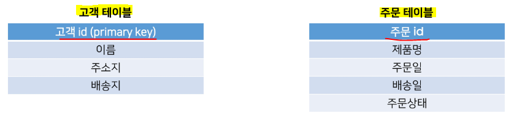

* 고객들이 특정 제품을 주문한다면 주문 테이블에 레코드가 생성

* 단, 해당 주문이 올바르게 배송되기 위해서는 어떤 고객이 주문 했는지 알아야 함❗
  
  * 배송지 주소를 가지고 있는 고객 테이블의 정보를 포함해야 함❗

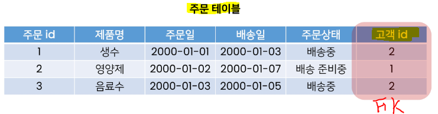

* **고객 정보의 기본 키인 고객 id 정보를 저장할 수 있음 (중복이 없기 때문❗)**
  
  * 관계형 데이터베이스에서 **한 테이블의 필드 중 다른 테이블의 행을 식별할 수 있는 키를 외래 키(foreign key, FK)라 함**❗

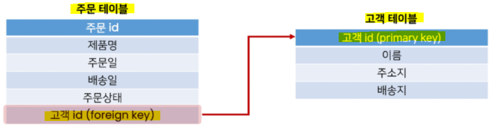

* **<mark>두 테이블은 공유된 고객 id를 기반으로 연결되며 다양한 명령 처리 가능</mark>**
  
  * **특정 날짜에 구매한 모든 고객 정보 확인**
  
  * **지난 달에 배송이 지연된 주문을 받은 고객 처리**
  
  * **특정 고객이 주문한 모든 주문 정보 조회**

* **RDB는 데이터 간의 매우 복잡한 관계를 보여주고 처리하는 데 탁월한 방식**❗

## ▶ RDB 에서의 관계

* 1️⃣ 1:1 (one-to-one relationships)
  
  * 한 테이블의 레코드 하나가 다른 테이블의 레코드 단 한 개와 관련된 경우

* 2️⃣ **<mark>N:1 (many-to-one relationships)</mark>**
  
  * **한 테이블의 0개 이상의 레코드가 다른 테이블의 레코드 한 개와 관련된 경우**
  
  * 기준 테이블에 따라 `1:N` 이라고도 함

* 3️⃣ **<mark>M:N (many-to-many relationships)</mark>**
  
  * **한 테이블의 0개 이상의 레코드가 다른 테이블의 0개 이상의 레코드와 관련된 경우**
  
  * 양쪽 모두에서 `N:1` 관계를 가짐

## ▶ N:1 관계 예시

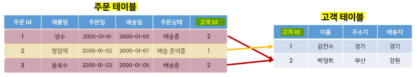

* 여러 개의 주문에서 각각 어떤 주문에 속해 있는지 표현해야 하므로 **고객 테이블의 PK를 주문 테이블에 FK로 집어 넣어 관계를 표현**

* **고객(`1`)은 여러 주문(`N`)을 진행할 수 있음**
  
  * 고객이 단 한 개의 주문만 생성할 수 있으면 두 테이블은 `1:1` 관계

# Foreign Key

> **관계형 데이터베이스에서 한 테이블의 필드(주문) 중 다른 테이블(고객)의 행을 식별할 수 있는 키 = 외래 키(외부 키)**

* 참조하는 테이블에서 1개의 키에 해당하고, 이는 **참조되는 측 테이블의 <mark>기본 키(PK)</mark>를 가리킨다.**

* **참조하는 테이블의 행 1개의 값은 참조되는 측 테이블의 행 값에 대응**
  
  * 참조하는 테이블의 행에는, 참조되는 테이블에 나타나지 않는 값을 포함할 수 없음

* **참조하는 테이블 행 여러 개가, 참조되는 테이블의 동일한 행을 참조할 수 있음**

## ▶ 특징

* 키를 사용하여 부모 테이블의 유일한 값을 참조 **(by 참조 무결성)**

* **외래 키의 값이 반드시 부모 테이블의 기본 키일 필요는 없지만 유일한 값이어야 함**❗

### 📌 참조 무결성

* 데이터베이스 관계 모델에서 **관련된 2개의 테이블 간의 일관성**을 말함

* 외래 키가 선언된 테이블의 외래 키 속성(열)의 값은 그 테이블의 부모가 되는 테이블의 기본 키 값으로 존재해야 함

# N:1 (Comment-Article)

> **댓글(N)과 게시글(1)의 관계 설정**

* 0개 이상의 댓글은 1개의 게시글에 작성될 수 있음

## ▶ 모델 관계 설정

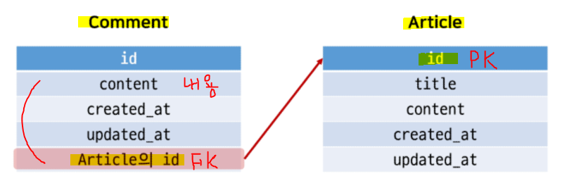

* 댓글 데이터의 예시

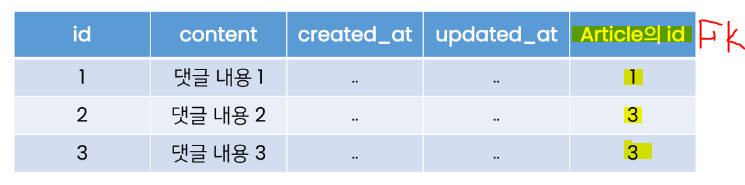

* 1번 게시글에는 1개의 댓글, 3번 게시글에는 2개의 댓글이 작성됐음을 의미

## ▶ Comment 모델 정의

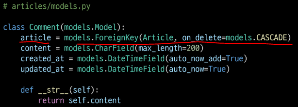

* 외래 키 필드는 `ForeignKey` 클래스를 **작성하는 위치와 관계없이 필드의 마지막에 작성**

* `ForeignKey()` **클래스의 인스턴스 이름은 참조하는 모델 클래스 이름의 단수형(소문자)으로 작성하는 것을 권장**❗

### ✔ 모델 생성 후 Migration 과정 진행

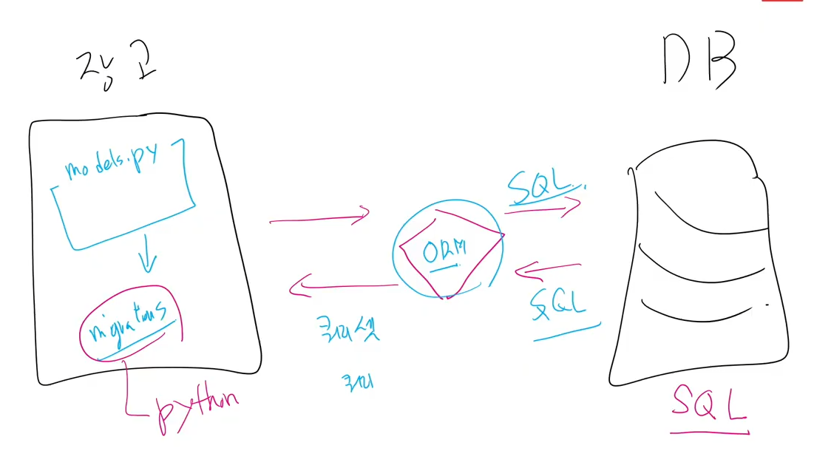

- `python manage.py makemigrations`

- `python manage.py migrate`
  
  - 생성된 테이블 확인 가능
* **<mark>ForeignKey 모델 필드로 인해 작성된 컬럼의 이름이 `article_id` 인 것을 확인</mark>**

* 만약 ForeignKey 인스턴스를 article이 아닌 abcd로 생성하면 `abcd_id`로 만들어짐
  
  * **명시적인 모델 관계 파악을 위해 참조하는 클래스 이름의 단수형(소문자)로 작성하는 것이 권장되는 이유**❗

### ✔ 댓글 생성

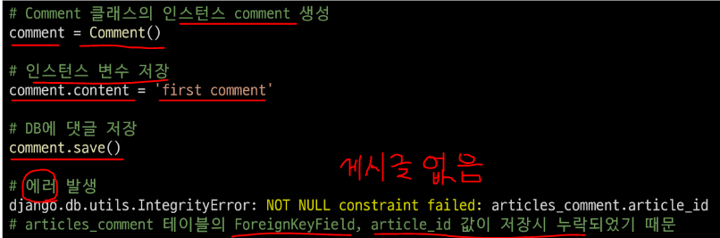

* 게시글 생성

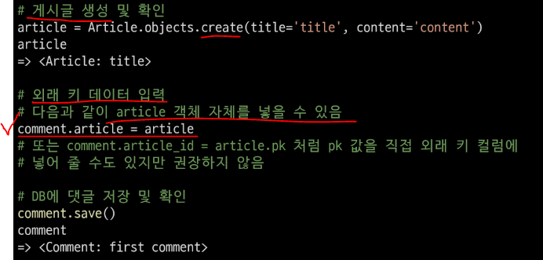

* 댓글 속성 값 확인

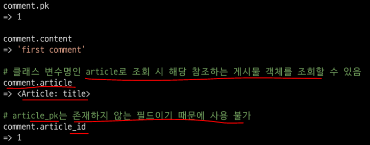

* comment 인스턴스를 통한 article 값 접근❗

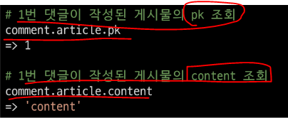

* 두 번째 댓글 작성

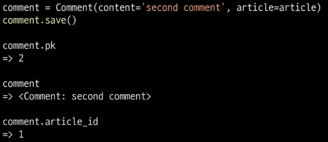

# Django Relationship fields

* 1️⃣ `OneToOneField()` = `1:1`

* 2️⃣ **`ForeignKey()` = `N:1`**
  
  * Django 의 모델 필드 클래스
  
  * **Django 모델에서 관계형 데이터베이스의 <mark>외래 키 속성을 담당</mark>**
  
  * 사용법 - **`ForeignKey(to, on_delete, **options)`**
  
  * **2개의 필수 위치 인자가 필요**
    
    * ① **참조하는 <mark>model class</mark>**
    
    * ② **<mark>`on_delete` 옵션</mark>**
  
  * **`on_delete`**
    
    * **외래 키가 참조하는 객체가 사라졌을 때, <mark>외래 키를 가진 객체를 어떻게 처리</mark>할 지를 정의** = 게시글 삭제 시 댓글은 어떻게 처리❓
    
    * 데이터 무결성을 위해서 매우 중요한 설정
    
    * **`on_delete` 옵션 값**
      
      * **`CASCADE`** - **부모 객체가 삭제 됐을 때 이를 참조하는 객체도 삭제**
      
      * `PROTECT`, `SET_NULL`, `SET_DEFAULT` ... 등 여러 옵션 값들이 존재

* 3️⃣ **`ManyToManyField()` = `M:N`**

### 📌 데이터 무결성 (Data Integrity)

* 데이터의 정확성과 일관성을 유지하고 보증하는 것

* 데이터베이스나 RDBMS의 중요한 기능

* 무결성 제한의 유형
  
  * 개체 무결성 (Entity integrity)
  
  * 참조 무결성 (Referential integrity)
  
  * 범위 무결성 (Domain integrity)

# 관계 모델 참조

## ▶ Related manager

> N:1 혹은 M:N 관계에서 사용 가능한 문맥(context)

* Django 는 모델 간 N:1 혹은 M:N 관계가 설정되면 **<mark>역참조할 때에 사용</mark>할 수 있는 manager를 생성**❗
  
  * 이전에 모델 생성 시 **<mark>objects</mark> 라는 매니저를 통해 queryset api 를 사용했던 것처럼** **related manager를 통해 queryset api를 사용**할 수 있게 됨

* 1번 게시글 조회 : `article = Article.objects.get(pk=1)`

* 클래스가 객체가 사용할 수 있는 메서드 확인 : `dir(article)`

* 1번 게시글에 작성된 모든 댓글 조회(역참조) : `article.comment_set.all()`

* 1번 게시글에 작성된 모든 댓글 출력(역참조)
  
  * ```sql
    comments = article.comment_set.all()
    
    for comment in comments:
        print(comment.content)
    ```

### ✔ 역참조

* 나를 참조하는 테이블(나를 외래 키로 지정한)을 참조하는 것
  
  * 본인을 외래 키로 참조 중인 다른 테이블에 접근하는 것

* **N:1 관계에서는 1이 N을 참조하는 상황**
  
  * **외래 키를 가지지 않은 1이 외래 키를 가진 N을 참조**

### ✔ article.comment`_set.method()`

* Article 모델이 Comment 모델을 참조(=역참조)할 때 사용하는 매니저

* article.comment 형식으로는 댓글 객체를 참조할 수 없음
  
  * 실제로 Article 클래스에는 Comment와의 어떠한 관계도 작성되어 있지 않음

* Django가 **<mark>역참조 할 수 있는 comment_set</mark> manager를 자동으로 생성**해 `article.comment_set` 형태로 댓글 객체를 참조할 수 있음❗
  
  * N:1 관계에서 생성되는 Related manager의 이름 - **참조하는 `모델명_set` 이름 규칙**

* **반대로 참조 상황 (Comment —> Article)**
  
  * `comment.article` 형태로 작성 가능

### ✔ related_name (ForeignKey arguments)

> ForeignKey 클래스의 선택 옵션

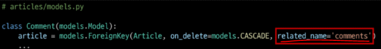

* 역참조 시 사용하는 매니저 이름(model_set manager)을 변경할 수 있음

* 작성 후에는 반드시 migration 과정이 필요❗

* 선택 옵션이지만 상황에 따라 반드시 작성해야 하는 경우가 생기도 한다❗

* 작성 후 다시 원래 코드로 복구
  
  * 위와 같이 변경 시 **`article.comment_set` 은 사용할 수 없고, `article.comments`로 대체**❗

### ✔ admin site 등록

> 새로 작성한 Comment 모델을 admin site에 등록하기

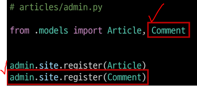

# Comment 구현

> 모델폼(사용자의 데이터를 저장하기 위함)을 활용!

## ▶ CREATE

* **사용자로부터 댓글 데이터를 입력 받기 위한 CommentForm 작성**

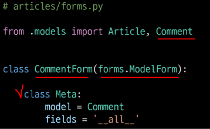

* **detail 페이지에서 CommentForm 출력 (view 함수)**

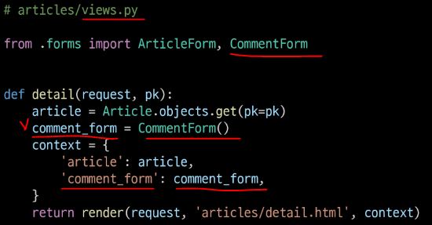

* **detail 페이지에서 CommentForm 출력 (Template)**

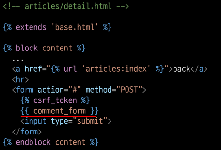

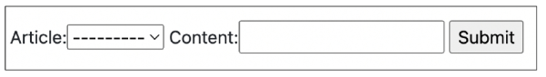

* 실 서비스에서는 댓글을 작성할 때 댓글을 어떤 게시글에 작성하는지 직접 게시글 번호를 선택하지 않음

* **<mark>실제로는 해당 게시글에 댓글을 작성하면 자연스럽게 그 게시글에 댓글이 작성되어야 함</mark>**

* 다음과 같이 출력되는 이유❓
  
  * **Comment 클래스의 외래 키 필드 article 또한 데이터 입력이 필요하기 때문에 출력되고 있는 것**

* **하지만, 외래 키 필드는 <mark>사용자의 입력으로 받는 것이 아니라 view 함수 내에서 받아 별도로 처리되어 저장</mark>되어야 함**❗

* **외래 키 필드를 출력에서 제외 후 확인**

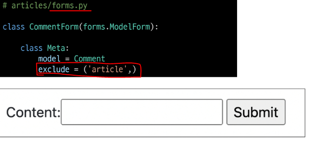

* **출력에서 제외된 외래 키 데이터는 어디서 받아와야 할까**❓
  
  * **detail 페이지의 url을 보면 path(`'<int:pk>/', views.detail, name='detail`) url에 해당 게시글의 pk 값이 사용되고 있음**
  
  * **댓글의 외래 키 데이터에 필요한 정보가 바로 게시글의 pk 값**
  
  * url을 통해 변수를 넘기는 <mark>**variable routing을 사용**</mark>❗

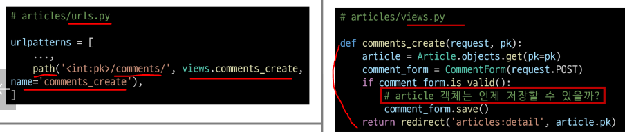

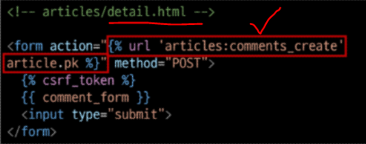

* 단, 이렇게 해도 아래와 같이 오류 발생함
  
  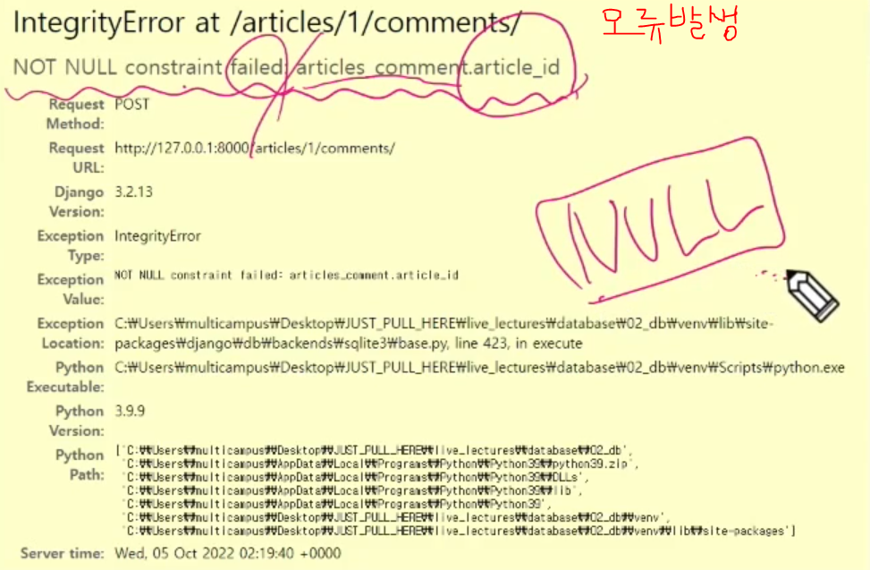

* 사용자 입력 데이터는 `request.POST` 에 들어있으나, `article.pk` 값은 넣은 적 없다.
  
  * article 객체가 들어갈 위치가 마땅치 않음(저장이 이루어지지 않음)
  
  * `comment = Comment()` 처럼 comment 인스턴스가 필요함❗
    
    * <mark>**if 문 안쪽에 들어있어야 저장이 가능**</mark>❗

* **그래서 `save()` 메서드는 데이터베이스에 저장하기 전에 객체에 대한 추가적인 작업을 진행할 수 있도록 인스턴스만을 반환해주는 옵션 값을 제공**

* **<mark>save 메서드의 commit 옵션을 사용해 DB에 저장되기 전 article 객체 저장하기</mark>**

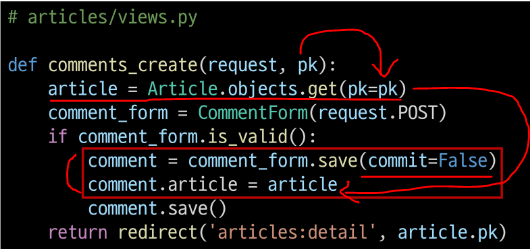

### ✔ save() method

* **`save(commit=False)`**
  
  * **아직 데이터베이스에 저장되지 않은 인스턴스를 반환**
    
    * 마지막에 `.save()` 해줘야 함
    * 저장하기 전에 객체에 대한 사용자 지정 처리를 수행할 때 유용하게 사용

## ▶ READ

> **작성한 댓글 목록 출력하기**

* **특정 article에 있는 모든 댓글을 가져온 후 context에 추가**

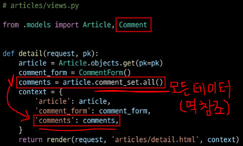

* **detail 템플릿에서 댓글의 내용을 출력하기**

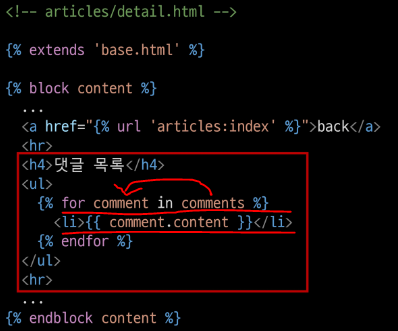

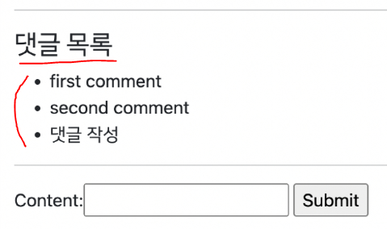

## ▶ DELETE

> 댓글 삭제 구현하기 (url, view)

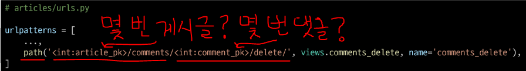

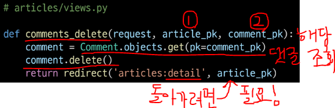

* **댓글을 삭제할 수 있는 버튼을 각각의 댓글 옆에 출력될 수 있도록 함**

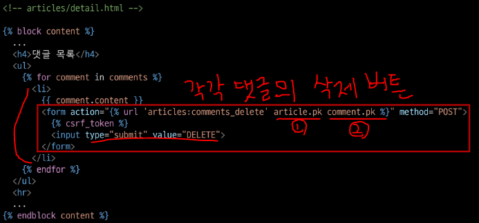

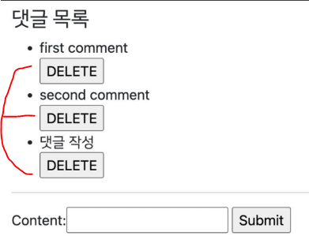

* **댓글 수정을 구현하지 않는 이유는**❓
  
  * 댓글 수정도 게시글 수정과 마찬가지로 구현 가능
    
    * 게시글 수정 페이지가 필요했던 것처럼 댓글 수정 페이지가 필요함
  
  * **하지만 일반적으로 댓글 수정은 수정 페이지로 이동없이 현재 페이지가 유지된 상태로 댓글 작성 Form 부분만 변경되어 수정할 수 있음**
  
  * **이처럼 페이지의 일부 내용만 업데이트하는 것은 JavaScript의 영역임**

# Comment 추가 사항

> 댓글에 관련된 아래 2가지 사항을 작성해보기

* **댓글 개수 출력하기**
  
  * 1️⃣ **DTL filter - `length` 사용**
    
    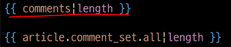
    
    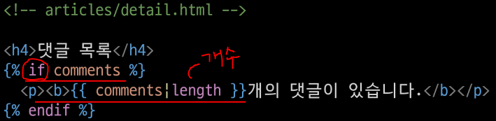
    
    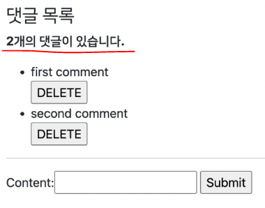
  
  * 2️⃣ **Queryset API - `count()` 사용**
    
    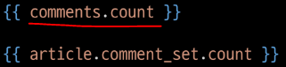

* **댓글이 없는 경우 대체 컨텐츠 출력**
  
  * **DTL - `  `**
    
    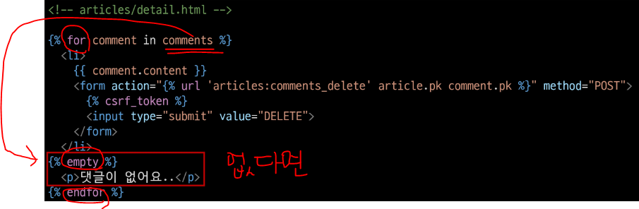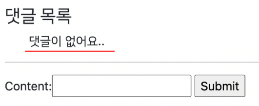

# N:1 (Article - User)

> **Article 모델(N)과 User 모델(1) 간 관계 설정**

* 0개 이상의 게시글은 1개의 회원에 의해 작성될 수 있다❗

## ▶ Referencing the User model

### ✔ Django 에서 User 모델을 참조하는 방법

* 1️⃣ **settings.AUTH_USER_MODEL**
  
  * **반환 값 : `accounts.User` (문자열)**
  
  * User 모델에 대한 외래 키 또는 M:N 관계를 정의할 때 사용
  
  * **models.py 의 모델 필드에서 User 모델을 참조할 때 사용**

* 2️⃣ **`get_user_model()`**
  
  * **반환 값 : User Object (객체)**
  
  * **현재 활성화된 User 모델을 반환**
  
  * 커스터마이징한 User 모델이 있을 경우는 Custom User 모델, 그렇지 않으면 User를 반환
  
  * **models.py 가 아닌 다른 모든 곳에서 유저 모델을 참조할 때 사용**

### ✔ Django에서 User 모델을 참조하는 방법 정리

* 문자열과 객체를 반환하는 특징과 Django의 내부적인 실행 원리에 관련된 것이므로 아래와 같이 단순 암기하자❗

* **User 모델을 참조할 때**
  
  * **<mark>models.py</mark> 에서는 `settings.AUTH_USER_MODEL`**
  
  * **<mark>다른 모든 곳</mark>에서는 `get_user_model()`**

## ▶ 모델 관계 설정

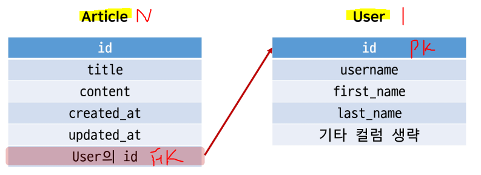

* Article 모델에 User 모델을 참조하는 외래 키 작성

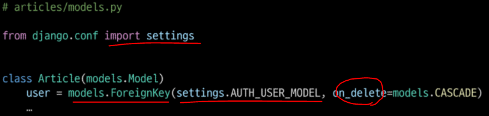

### ✔ Migration 진행

* `python manage.py makemigrations`
  
  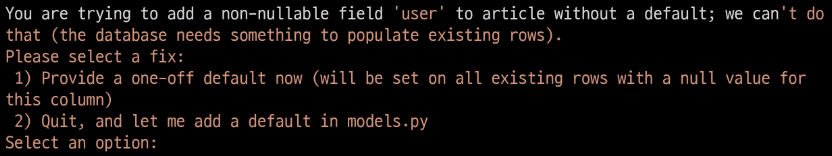
  
  * 첫 번째 화면
    
    * 기본적으로 모든 컬럼은 NOT NULL 제약조건이 있기 때문에 데이터 없이 새로 추가되는 외래 키 필드 user_id 가 생성되지 않음
    
    * 그래서 기본 값을 어떻게 작성할 것인지 선택해야 함 = 1을 입력 후 Enter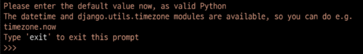
  
  * 두 번째 화면
    
    * article의 user_id에 어떤 데이터를 넣을 것인지 직접 입력해야 함
    
    * 마찬가지로 1 입력하고 Enter
      
      * **기존에 작성된 게시글이 있다면 모두 1번 회원이 작성한 것으로 처리**

* `python manage.py migrate`

## ▶ CREATE

> **인증된 회원의 게시글 작성 구현하기**

* 작성하기 전 로그인을 먼저 진행한 상태로 진행

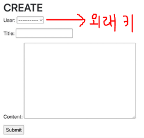

* **불필요한 필드(user)가 출력되므로 정리가 필요**
  
  * user 필드도 마찬가지로 사용자로부터 받는 것이 아님
  
  * **request 객체를 통해 user 정보를 가져올 수 있다.**

* **ArticleForm 의 출력 필드 수정**

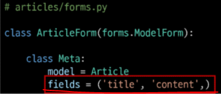

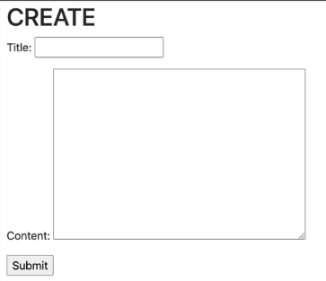

### ✔ 외래 키 데이터 누락

* **게시글 작성 시 댓글과 마찬가지로 에러 발생**
  
  * 게시글 작성 시 외래 키에 저장되어야 할 작성자 정보가 누락되었기 때문

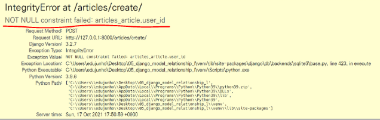

* **게시글 작성 시 작성자 정보가 함께 저장될 수 있도록 save의 commit 옵션을 활용**❗

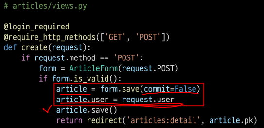

## ▶ DELETE

> **게시글 삭제 시 작성자 확인**

* 게시글에는 작성자 정보가 함께 들어있기 때문에 현재 **삭제를 요청하려는 사람과 게시글을 작성한 사람을 비교하여 본인의 게시글만 삭제할 수 있도록 함**

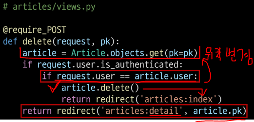

## ▶ UPDATE

> **수정을 요청하려는 사람과 게시글을 작성한 사람을 비교하여 본인의 게시글만 수정할 수 있도록 함**

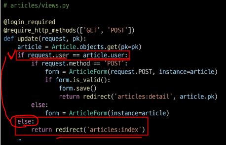

* **추가로 해당 게시글의 작성자가 아니라면 수정/삭제 버튼을 출력하지 않도록 함**

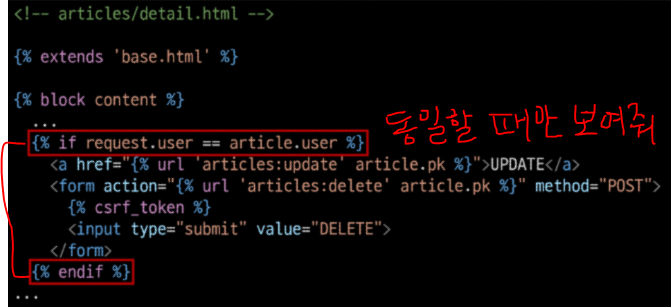

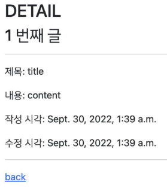

## ▶ READ

* **index 템플릿과 detail 템플릿에서 각 게시글의 작성자를 출력**


# N:1 (Comment - User)

> **Comment 모델(N)과 User 모델(1) 간 관계 설정**

* 0개 이상의 댓글은 1개의 회원에 의해 작성될 수 있음

### ✔ 모델 관계 설정 - 댓글은 외래 키가 2개


* Comment 모델에 User 모델을 참조하는 외래 키 작성❗


### ✔ Migration 진행

- `python manage.py makemigrations`
  
  
  
  - 첫 번째 화면
    
    - 기본적으로 모든 컬럼은 NOT NULL 제약조건이 있기 때문에 데이터 없이 새로 추가되는 외래 키 필드 user_id 가 생성되지 않음
    
    - 그래서 기본 값을 어떻게 작성할 것인지 선택해야 함 = 1을 입력 후 Enter
      
      
  
  - 두 번째 화면 = 직접 기본값 입력 화면
    
    - article의 user_id에 어떤 데이터를 넣을 것인지 직접 입력해야 함
    
    - 마찬가지로 1 입력하고 Enter
      
      - **기존에 작성된 게시글이 있다면 모두 1번 회원이 작성한 것으로 처리**

- `python manage.py migrate`

## ▶ CREATE

* `CommentForm`


* **불필요한 정보 출력되므로 없애고, request 를 통해 user 정보를 가져온다**❗
  
  * `CommentForm` 의 출력 필드 수정
    
    
    
    

### ✔ 외래 키 데이터 누락

- **댓글 작성 시 댓글과 마찬가지로 에러 발생**
  
  - **댓글 작성 시 외래 키에 저장되어야 할 작성자 정보가 누락되었기 때문**


* **댓글 작성 시 작성자 정보가 함께 저장될 수 있도록 save의 commit 옵션 활용**❗


## ▶ READ

* **댓글 작성자 출력** - 각 댓글의 앞에 작성자 출력


## ▶ DELETE

* **댓글 삭제 시 작성자 확인 - 본인이 작성한 댓글만 삭제 가능**


* **추가로 해당 댓글의 작성자가 아니라면 삭제 버튼을 보이지 않도록 함**


# 인증된 사용자에 대한 접근 제한하기

> **is_authenticated & View decorator 활용**

## ▶ 인증된 사용자인 경우에만 댓글 작성 및 삭제


## ▶ 비인증 사용자는 CommentForm을 볼 수 없게 하기


### 📌 get_object_or_404

> DB에서 사용자가 요청한 데이터를 찾기 위해 사용

* 기본 문법
  
  * `get_object_or_404(찾으려는 모델 클래스, 찾는 조건)`
  
  * `찾는 조건` - 유니크한 값으로 검색해야 함!

* 데이터가 있으면 get_object 로 실행되며 없으면 404 page Error 가 나옴

```python
@ require_POST
def comment_create(request, article_pk):
    # 로그인 안된 유저 = 로그인 page로 보내기
    if not request.user.is_authenticated:
        return redirect('accounts:login')

    # pk 를 불러오는 이유?
    # DB에서 사용자가 요청한 게시글 정보를 찾기 위해 (어떤 게시글의 댓글을 달 것인지 확인하기 위해)
    # 데이터가 있으면 get_object / 없으면 404 page 보여줌
    article = get_object_or_404(Article, pk=article_pk)
    # 댓글을 생성하는 폼 (request.POST 가 있다는 건 사용자가 데이터를 입력하고 글 생성 버튼을 누른 경우를 의미)
    comment_form = CommentForm(request.POST)
    if comment_form.is_valid():
        # commit=False 옵션이 없으면 NOT NULL constraint 오류 발생 - 외래 키에 저장되어야 할 정보가 누락되기 때문
        comment = comment_form.save(commit=False)   # 저장할 인스턴스가 comment 에 들어옴
        comment.author = request.user   # 작성자 정보(=로그인 정보가 들어 있음)
        comment.article = article       # 게시글 정보
        comment.save()                  # DB에 저장함
        # redirect 는 url name에서 page를 렌더링
        return redirect('articles:detail', article.pk)

    context = {
        'article': article,             # detail 페이지로 보내지기 위해 게시글 정보를 포함해줘야 함 (안그러면 게시글 정보 안보여진다.) 
        'comment_form': comment_form,   # 데이터가 유효성 검사를 통과하지 못했을 때 에러 정보와 함께 사용자의 입력을 다시 받기 위해서 전달되는 역할
    }
    # 여기에서 page를 렌더링을 하기 때문에 데이터 전달이 필요
    return render(request, 'articles/detail.html', context)
```
