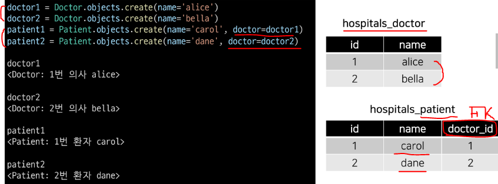
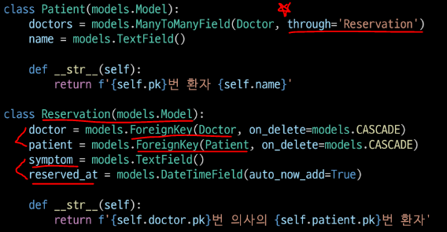
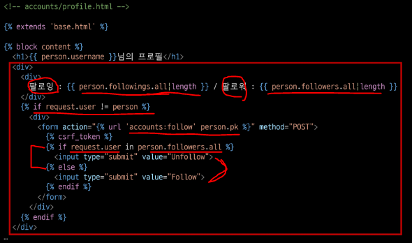

# M:N (Many-to-many Relationship)

> **한 테이블의 0개 이상의 레코드가 다른 테이블의 0개 이상의 레코드와 관련된 경우**

* **<mark>양쪽 모두에서 N:1 관계를 가짐</mark>**

* 예) 병원에 내원하는 환자와 의사의 예약 시스템을 구축
  
  * 고민해야 할 부분
    
    * 병원 시스템에서 가장 핵심이 되는 것은? 의사와 환자
    
    * 이 둘의 관계를 어떻게 표현?

### 📌 [참고] 데이터 모델링

* 주어진 개념으로부터 논리적인 데이터 모델을 구성하는 작업

* 물리적인 데이터베이스 모델로 만들어 고객의 요구에 따라 특정 정보 시스템의 데이터베이스에 반영하는 작업

### 📍 용어 정리

* **target model - 관계 필드를 가지지 않은 모델**

* **source model - 관계 필드를 가진 모델**

## ▶ N:1 의 한계

* 의사와 환자간 예약 시스템 - 한 명의 의사에게 여러 환자가 예약 가능한 모델 관계 설정

* Migration 진행 및 shell_plus 실행

* 각각 2명의 의사와 환자를 생성하고 환자는 서로 다른 의사에게 예약을 했다고 가정

* 1번 환자가 두 의사 모두에게 방문하려고 함

* **환자 테이블에 동일 인물이 id만 다르게 표현된다.❗**

* 또한, 동시에 예약 할 순 없을까❓

* **동일한 환자지만 다른 의사에게 예약하기 위해서는 객체를 하나 더 만들어서 예약을 진행해야 함**
  
  * **<mark>새로운 환자 객체를 생성할 수 밖에 없음</mark>**

* **<mark>외래 키 컬럼에 1, 2 형태로 참조하는 것은 Integer 타입이 아니기 때문에 불가능</mark>**

* **그럼 예약 테이블을 따로 만들자**❗

## ▶ 중개 모델 (예약 테이블)

* **<mark>환자 모델의 외래 키를 삭제하고 별도의 예약 모델을 새로 작성</mark>**

* **예약 모델은 의사와 환자에 각각 N:1 관계를 가짐**

* **데이터베이스 초기화** 후 Migration 진행 및 shell_plus 실행
  
  * **migration 파일 삭제 - 숫자있는 파일 (설계도)**
  
  * **데이터베이스 파일 삭제 - `db.sqlite3`**
    
    

* 의사와 환자 생성 후 예약 만들기

* **예약 정보 조회 = 역참조**❗ (**`_set()`**)

* **1번 의사에게 새로운 환자 예약이 생성 된다면**❓

* 1번 의사의 예약 정보 조회 - 2명의 환자 조회

## ▶ Django ManyToManyField

* **환자 모델에 Django ManyToManyField 작성**
  
  * **의사 모델에 작성해도 상관없음**❗
  
  * **단, 참조와 역참조 관계만 조심**❗

*  데이터베이스 초기화 후 Migration 진행

* **생성된 중개 테이블 hospitals_patient_doctors 확인**

* 의사 1명과 환자 2명 생성

* **예약 생성 (환자가 의사에게 예약)**

* **예약 생성 (의사가 환자를 예약) = `.add()`**

* 예약 현황 확인

* **예약 취소 (삭제) = `.remove()`**

* **Django는 <mark>ManyToManyField를 통해 중개 테이블을 자동으로 생성</mark>함**

## ▶ `related_name` argument

> **<mark>상황에 따라 필수적으로 사용해야 하는 경우(역참조명이 중복</mark>되는 경우)가 있다.**

* **target model이 source model을 참조할 때 사용할 manager name**

* **ForeignKey()의 related_name 과 동일**

* Migration 진행

* **related_name 설정 값 확인하기**

## ▶ `through` argument

> **중개 모델을 직접 작성하는 경우는 없는가?**

* **중개 테이블을 수동으로 지정하려는 경우 `through` 옵션을 사용**하여, 사용하려는 중개 테이블을 나타내는 Django 모델을 지정할 수 있음

* **가장 일반적인 용도는 <mark>중개 테이블에 추가 데이터를 사용</mark>해 다대다 관계와 연결하려는 경우**

* **through 설정 및 Reservation Class 수정**
  
  * 이제는 예약 정보에 **증상과 예약일이라는 추가 데이터**가 생김
    
    

* 데이터베이스 초기화 후 Migration 진행

* 의사 1명과 환자 2명 생성

* **예약 생성 ① - 예약 테이블 중심**

* **예약 생성 ② - 환자 중심 (through_defaults 값에 딕셔너리 타입으로 입력❗)**

* 예약 삭제

## ▶ 정리

* **<mark>M:N 관계로 맺어진 두 테이블에는 변화가 없음</mark>**

* Django의 **`ManyToManyField` 는 <mark>중개 테이블을 자동으로 생성</mark>함**

* Django의 **`ManyToManyField` 는 <mark>M:N 관계를 맺는 두 모델 어디에 위치해도 상관 없음</mark>**
  
  * <mark>**대신 필드 작성 위치에 따라 참조와 역참조 방향을 주의**</mark>❗

* N:1은 완전한 종속의 관계였지만 M:N은 의사에게 진찰받는 환자, 환자를 진찰하는 의사의 두 가지 형태로 모두 표현이 가능한 것

# ManyToManyField

> **`ManyToManyField(to, **options)`**

* 다대다 관계 설정 시 사용하는 모델 필드

* **<mark>하나의 필수 위치인자(M:N 관계로 설정할 모델 클래스)가 필요</mark>**

* 모델 필드의 RelatedManager를 사용하여 관련 개체를 추가, 제거 또는 만들 수 있음
  
  * `add()`, `remove()`, `create()`, `clear()`

## ▶ 데이터베이스에서의 표현

> **다대다 관계를 나타내는 중개 테이블을 만듦** (필드 생성 ❌)

* 중개 테이블 이름은 ManyToManyField 이름과 이를 포함하는 모델의 테이블 이름을 조합하여 자동 생성됨

* `db_table` arguments 를 사용하여 중개 테이블의 이름을 변경할 수도 있음

## ▶ ManyToManyField's Arguments

### 1️⃣ related_name

* **<mark>target model 이 source model 을 참조(역참조)할 때 사용할 manager name을 설정</mark>**
  
  * 역참조명이 동일한 경우, 무조건 이 옵션을 사용해야 함❗

* `ForeighKey`의 `related_name`과 동일

* 역참조명(기본) = `모델명_set`

### 2️⃣ through

* **<mark>중개 테이블을 직접 작성하는 경우</mark>, `through` 옵션을 사용하여 중개 테이블을 나타내는 Django 모델을 지정**

* 일반적으로 중개 테이블에 추가 데이터를 사용하는 **다대다 관계와 연결하려는 경우(extra data with a many-to-many relationship)에 사용됨**

### 3️⃣ symmetrical (대칭)

* **기본 값 : True**

* **<mark>ManyToManyField가 동일한 모델(on self)을 가리키는 정의에서만 사용</mark>**

* **True인 경우**
  
  * `_set` 매니저를 추가하지 않음 = **역참조 manager 사용 불가**
  
  * source 모델의 인스턴스가 target 모델의 인스턴스를 참조하면 자동으로 target 모델 인스턴스도 source 모델 인스턴스를 참조하도록 함(대칭)
  
  * **즉, 내가 당신의 친구라면 당신도 내 친구가 됨**

* **<mark>대칭을 원하지 않는 경우 False로 설정</mark>**
  
  * Follow 기능을 생각해보자❗

## ▶ Related Manager

> **N:1 혹은 M:N 관계에서 사용 가능한 문맥(context)**

* Django는 모델 간 N:1 혹은 M:N 관계가 설정되면 **역참조시에 사용할 수 있는 manager를 생성**
  
  * 우리가 이전에 모델 생성 시 objects 라는 매니저를 통해 queryset api를 사용했던 것처럼 related manager를 통해 queryset api를 사용할 수 있게 됨

* 같은 이름의 메서드여도 각 관계(N:1, M:N)에 따라 다르게 사용 및 동작됨
  
  * N:1 에서는 target 모델 객체만 사용 가능
  
  * **<mark>M:N 관계에서는 관련된 두 객체에서 모두 사용 가능</mark>**

* 메서드 종류
  
  * **`add()`, `remove()`,** `create()`, `clear()`, `set()` 등

## ▶ methods

* **`add()`**
  
  * **지정된 객체를 관련 객체 집합에 추가**
  
  * 이미 존재하는 관계에 사용하면 관계가 복제되지 않음
  
  * 모델 인스턴스, 필드 값(PK)을 인자로 허용

* **`remove()`**
  
  * **관련 객체 집합에서 지정된 모델 객체를 제거**
  
  * 내부적으로 QuerySet.delete()를 사용하여 관계가 삭제됨
  
  * 모델 인스턴스, 필드 값(PK)을 인자로 허용

## ▶ 중개 테이블 필드 생성 규칙

* 1️⃣ **소스(source model) 및 대상(target model) 모델이 다른 경우**
  
  * id
  
  * `<containing_model>_id`
  
  * `<other_model>_id`
    
    

* 2️⃣ **ManyToManyField가 동일한 모델을 가리키는 경우 = self 참조**
  
  * id
  
  * `from_<model>_id`
  
  * `to_<model>_id`

# M:N (Article - User)

> **Article 과 User의 M:N 관계 설정을 통해 좋아요 기능 구현**

## ▶ 모델 관계 설정

* ManyToManyField 작성

* Migration 진행 후 에러 확인 - **역참조 충돌**

**(기존) Article:User (N:1) = article.user / `user.article_set`**

**(변경) Article:User (M:N) = article.like_users / `user.article_set`** => **`like_articles`**

* **<mark>like_users 필드 생성 시 자동으로 역참조에는 `.article_set` 매니저가 생성됨</mark>**

* 그러나 이전 N:1 관계에서 이미 해당 매니저를 사용 중
  
  * user.article_set.all() = 해당 유저가 작성한 모든 게시글 조회
  
  * **user 가 작성한 글들(`user.article_set`)과 user가 좋아요를 누른 글(`user.article_set`)을 구분할 수 없음**❗

* user와 관계된 ForeignKey 혹은 ManyToManyField 중 하나에 related_name을 작성해야 함

* ManyToManyField 에 related_name 작성 후 Migration

* 생성된 중개 테이블 확인

* **User - Article 간 사용 가능한 related manager 정리**❗
  
  * **`article.user` = 게시글을 작성한 유저 - N:1**
  
  * **`user.article_set` = <mark>유저가 작성한 게시글(역참조)</mark> - N:1**
  
  * **`article.like_users` = 게시글을 좋아요한 유저 - M:N**
  
  * **`user.like_articles` = <mark>유저가 좋아요한 게시글(역참조)</mark> - M:N**

## ▶ LIKE 구현 - 좋아요 기능

* url.py & view.py 작성

* **index 템플릿에서 각 게시글에 좋아요 버튼 출력**

* **데코레이터 및 `is_authenticated` 추가**

### ✔ **`.exists()`**

* QuerySet에 **결과가 포함되어 있으면 True를 반환**하고 **그렇지 않으면 False를 반환**

* **특히 큰 QuerySet에 있는 특정 개체의 존재와 관련된 검색에 유용**

# M:N (User - User)

> **User 자기 자신과의 M:N 관계 설정을 통한 팔로우 기능 구현하기**

## ▶ Profile

> **자연스러운 follow 흐름을 위한 프로필 페이지를 먼저 작성**

- **url.py & view.py**

* profile 템플릿

* profile 템플릿으로 이동할 수 있는 하이퍼 링크 작성 (작성자 클릭 시 프로필로 이동)

# Follow

## ▶ 모델 관계 설정

> **ManyToManyField 작성 및 Migration 진행**

## ▶ Follow 구현

* **url.py & view.py**

* **프로필 유저의 팔로잉, 팔로워 수, 팔로우, 언팔로우 버튼 작성**

* 데코레이터 및 `is_authenticated` 추가

# 마무리

## 1️⃣ ManyToManyField()

## 2️⃣ M:N (Article - User) = Like

## 3️⃣ M:N (User - User) = Profile, Follow
