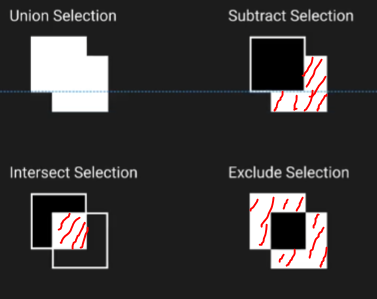
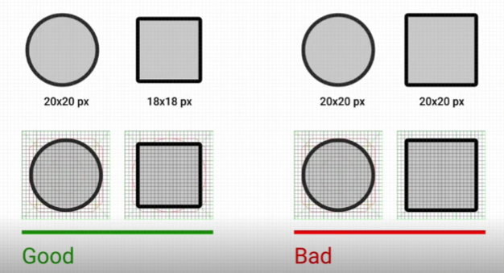
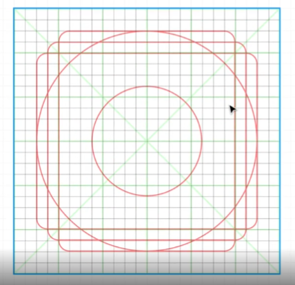
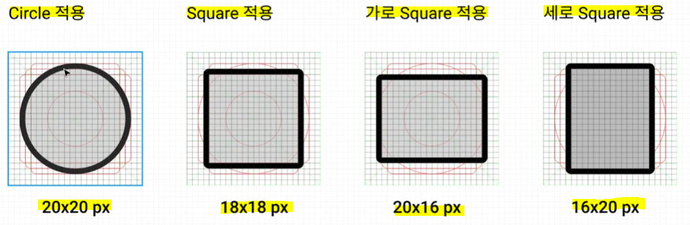

# 와이어프레임의 개념과 만드는 이유

* 목적
  
  * 내부 팀원들과의 커뮤니케이션을 원활하게 하기 위함
    
    * 색, 폰트 사이즈 등 팀원들의 피드백이 있을 때 바로바로 변경 가능
  
  * UI 단계로 넘어갔을 때는 디자인에만 집중할 수 있도록 하기 위해 기능적인 부분에만 집중하여 뼈대를 만들어 두는 것

* 구성 요소
  
  * 텍스트
  
  * 도형
  
  * 색은 최대한 단색으로 설정
  
  * 워크 플로우
    
    * 화면 간의 이동
    
    * 버튼을 눌렀을 때 그 다음 화면에 대한 플로우를 표현

# Icon 만들기

* **제작 원칙**
  
  * 1️⃣ **명확한 의미 전달**
    
    * **방법 1) 사용자 테스트**
    
    * **방법 2) 업계에서 활용되는 디자인 참고**
      
      * **Material Design(Google), iOS Guideline(Apple)**
  
  
  
  * 2️⃣ **일관된 스타일**

* Icon 제작 기능들
  
  * 1️⃣ **`Shape`**
  
  * 2️⃣ **`Boolean`** = 2 개의 오브젝트를 선택했을 때 상단 네비게이션에서 사용 가능
    
    * Union Selection
    
    * Intersect Selection
    
    * Subtract Selection
    
    * Exclude Selection
  
  
  
  * **원하는 모양의 도형을 만들어낼 수 있음!**
  
  * 3️⃣ **`Pen`**
    
    * 도형, 선 그리기 가능
      
      * 열린 도형인 경우 `Enter` 누르면 생성 완료
    
    * 도형 수정
      
      * 완성된 object를 선택한 후 `Enter` 를 누른 후 펜툴 모드(P)로 들어가 원하는 위치에 점을 선정할 수 있다.
      
      * 이후 이동 모드(V)에서 원하는대로 편집 가능

* **Keyline (출처 = Material Design) 이해하기**
  
  * 목적 = 일관된 느낌의 비율 적용

* **Keyline 적용**

* **아이콘 만들기 = 도형과 펜툴을 활용하여 제작 가능!**

* **아이콘 Export**
  
  * Frame에 적용된 Fill 값을 제거한 후 Export 해주어야만 아이콘만 사용 가능
  
  * `.SVG` 확장자명은 만들어진 크기로만 사용 가능
  
  * `.PNG` 확장자명으로 보통 많이 사용

* **아이콘의 비율이 깨지지 않고 크기 변경하는 방법 (비율 유지하면서 크기 조정)**
  
  * 아이콘 선택 후 마우스 우클릭 - `Outline Stroke` - 이후 크기 조정
