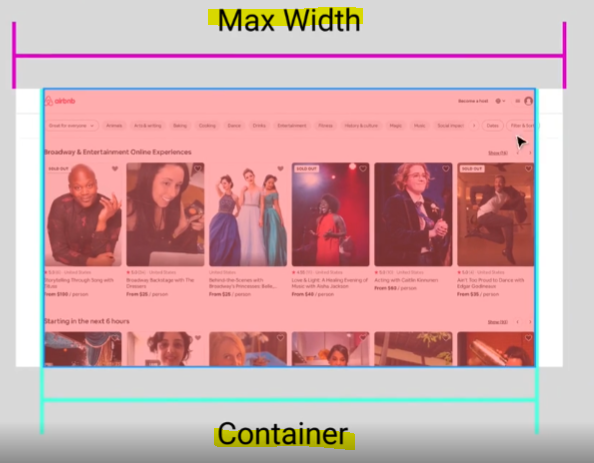
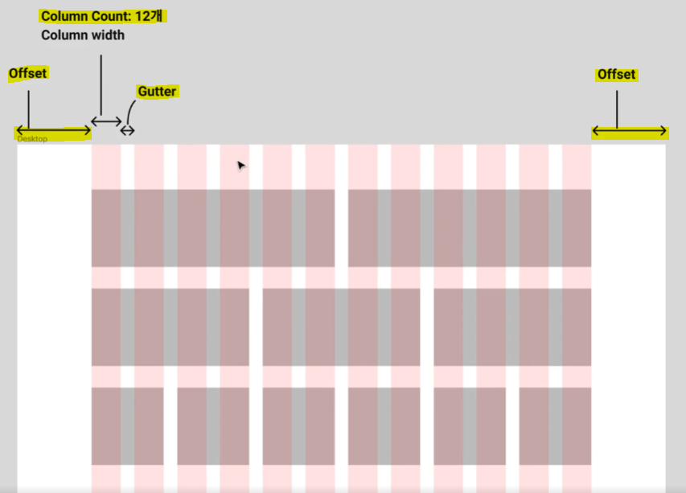
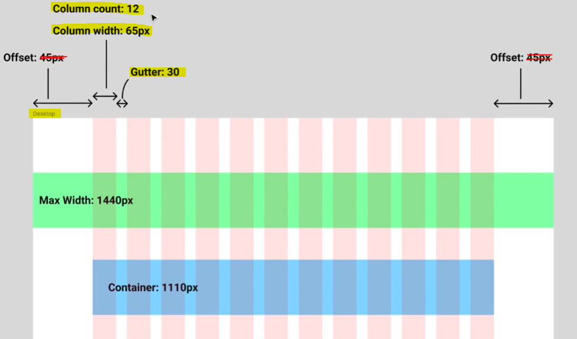
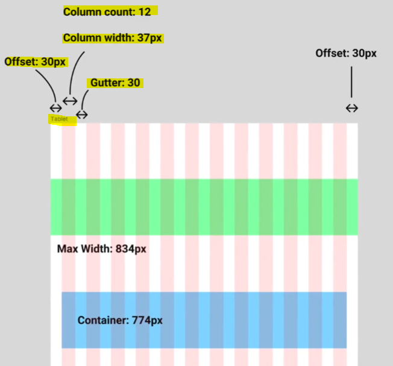
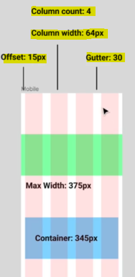

# Grid (그리드)

## ▶ 그리드를 사용하는 이유

1️⃣ **정돈된 디자인**

* **오브젝트 간 크기와 간격의 일관성 유지**

* 그리드 환경에서 오브젝트 복사 및 편집 등 변경 시 유용

2️⃣ **Responsive 디자인**

* 하나의 디자인 형식을 여러 디바이스에서 재활용 가능
  
  * 예) 스마트폰, 노트북, 데스크탑 등 사이즈가 다른 기기
  
  * 디바이스별 디자인 포맷을 별도로 작성할 필요없음

* **사용자 입장에서는 어느 디바이스에서든 동일한 디자인을 경험**
  
  * 그리드를 통해 기기별 오브젝트 구성을 편하게 변경할 수 있음
  
  * 반응형(디바이스 크기별) 웹처럼 구현 가능

3️⃣ **개발자와의 원활한 커뮤니케이션**

* 화면을 디자인할 때 디자이너 및 개발자와 커뮤니케이션하기 좋음

* **각 오브젝트의 크기와 구성 등을 그리드를 바탕으로 설명 및 이해하기 좋음**

## ▶ 그리드 만들기

* 핵심 용어
  
  * **`Max Width` = 화면 전체**
  
  * **`Container` = 컨텐츠(컴포넌트)가 담기는 영역의 가로 길이**
    
    * 예) 에어비앤비 = 1600px / 마켓컬리 = 980px

* **핵심 용어2**
  
  * **`Column Count` = 컬럼의 개수**
  
  * **`Column width` = 컬럼의 너비**
  
  * **`Gutter` = 컬럼 간의 간격**
  
  * **`Offset` = `Max Width - Container / 2`**

* 데스크탑 기준(아래)

* 태블릿 기준(=아이패드)

* 모바일 기준(아이폰 11)

* **그리드 만드는 순서**
  
  * ① 먼저, 프레임을 먼저 선정
  
  * ② 우측 패널에 `Layout Grid > Columns` 에서 Type은 Center로 설정
  
  * ③ `Count`와 `Width`, `Gutter`, `Offset` 도 본인이 원하는 대로 설정

* 그리드 숨기기/보이기 단축키 = (win) `Shift + G` / (mac) `Cmd + G`
