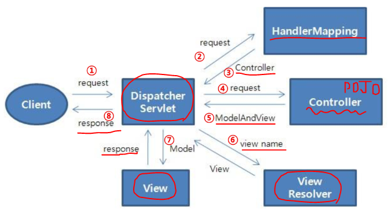

# Spring MVC

## ▶ Framework

* 웹 어플리케이션을 개발하기 위해서는 *기본 기능을 많은 기능을 설계, 작성해야 한다. (요청처리, 세션관리, 리소스 관리, 멀티 쓰레드 등)*

* **하지만 <mark>기본적인 공통 구조(framework)를 제공한다면</mark> 개발자는 웹 어플리케이션 기능 자체 개발에만 신경 쓰면 되기 때문에 생산성이 높아진다.**

* **개발자 입장에서는 <mark>완성된 구조에 자신이 맡은 코드만 개발해서 넣어주면</mark> 되기 때문에 개발 시간을 단축할 수 있다.**

## ▶ Spring Framework 의 특징

* **POJO(Plain Old Java Object) 방식의 프레임워크**
  
  * EJB가 기능 작성을 위해서 인터페이스를 구현하거나 상속하는 것에 비해 일반적인 자바 객체를 이용해서 그대로 사용할 수 있음을 의미

* **의존성 주입(Dependency Injection)을 통한 객체관계 구성**
  
  * 프레임워크 내부에서 사용되는 객체간 의존성이 존재할 경우, 개발자는 의존성에 관련한 설정만 해주면 실제 의존성 생성은 프레임워크가 담당

* **관점지향 프로그래밍(AOP, Aspect Oriented Programming) 지원**
  
  * 트랜잭션, 로깅 등 여러 모듈에서 공통적으로 사용하는 기능에 대해서 별도로 분리하여 작성, 관리할 수 있는 기능을 제공

* **제어 역전(IoC, Inversion of Control)**
  
  * 제어 역전을 통해 객체 및 프로세스의 제어를 프레임워크가 담당
  
  * 필요에 따라 개발자의 코드를 호출

* **높은 확장성과 다양한 라이브러리 지원**
  
  * 기존의 라이브러리를 스프링에서 사용할 수 있는 기능을 지원하고 있음
  
  * 특히, 영속성 관련하여 MyBatis나 Hibernate 등의 완성도 높은 데이터베이스 라이브러리와 연결가능한 인터페이스를 제공

## ▶ Spring Web MVC

* **Servlet API를 기반으로 구축된 웹프레임워크**

* Spring Framework 가 제공하는 DI, AOP 뿐 아니라, WEB 개발을 위한 기능을 제공

* **<mark>DispatcherServlet(FrontController)를 중심으로 디자인</mark> 되었으며, View Resolver, Handler Mapping, Controller 와 같은 객체와 함께 요청을 처리하도록 구성**

## ▶ Spring Web MVC - 요청 처리 흐름



① 클라이언트 요청이 들어오면 DispatcherServlet이 받는다.

② **HandlerMapping 이 어떤 Controller가 요청을 처리할지 결정한다.**

③ **DispatcherServlet은 Controller에 요청을 전달한다.**

④ Controller는 요청을 처리한다.

⑤ **결과(요청처리를 위한 data, 결과를 보여줄 view 이름)를 ModelAndView에 담아 반환**

⑥ ViewResolver에 의해서 실제 결과를 처리할 View를 결정하고 반환

⑦ 결과를 처리할 View에 ModelAndView를 전달

⑧ **DispatcherServlet은 View가 만들어낸 결과를 응답**

# Reflection

> **동적으로 클래스 정보에 접근해서 객체 생성, 메서드 실행 등을 처리**

* `java.lang.reflect` 패키지 제공

## ▶ Reflection 핵심

* **클래스 정보 접근**

* **메서드 정보 접근**

* **객체 생성 및 메서드 실행하기**

## ▶ 클래스 정보 접근

**1️⃣ Class<?>클래스이름.class**

    → `Class<?> clz = Dog.class`

**2️⃣ Class<?>Class.forName(String className)**

    → `Class<?> clz = Class.forName("com.ssafy.reflection.Dog");`

**3️⃣ Class<?>객체.getClass()**

    → `Dog dog = new Dog();`

        `Class<?> clz = dog.getClass();`

## ▶ 메서드 정보 접근

**1️⃣ Method[] Class.getDeclaredMethods()**

```java
Class<?> clz = Dog.class;
Method[] methods = clz.getDeclaredMethods();
```

**2️⃣ Method getDeclaredMethod(String name, Class<?>... param Types)**

```java
Class<?> clz = Dog.class;
Method m = clz.getDeclaredMethod("getName");
Method m = clz.getDeclaredMethod("setName", String.class);
```

## ▶ Method의 주요 메서드

**1️⃣ String getName()** = 메서드 이름

```java
Method m = clz.getDeclareMethod("setName", String.class);
String name = m.getName();
```

**2️⃣ Class<?> getReturnType()** = 반환 타입

```java
Method m = clz.getDeclareMethod("setName", String.class);
Class<?> rClz = m.getReturnType();
```

## ▶ 파라미터 정보 얻기

**1️⃣ Parameter[] getParameters();**

**2️⃣ Type Parameter.getParameterizedType();**

**3️⃣ String Type.getTypeName();**

```java
Parameter[] parameters = method.getParameters();
for (Parameter p : pArr) {
    Type t = p.getParameterizedType();
    System.out.println(t.getTypeName() + " " + p.getName());
}
```

## ▶ 객체 생성

**1️⃣ 생성자 얻기 → `Constructor<?> Class.getDeclaredConstructor(Class<?>...params)`**

```java
Class<?> clz = Dog.class;
// 기본 생성자 얻기 
Constructor<?> constructor = clz.getDeclaredConstructor();
```

**2️⃣ 객체 생성 → `Object Contructor newlnstance(Object...args)`**

```java
// 인스턴스 생성 
Object obj = constructor.newInstance();
```

## ▶ 메서드 실행

1️⃣ **메서드 실행 → `Object Method invoke(Object target, Object... args)`**

```java
Class<?> clz = Dog.class;
Constructor<?> constructor = clz.getDeclaredConstructor();
Object obj = constructor.newInstance()
Method method = clz.getDeclaredMethod("setName", String.class);
method.invoke(obj, "메리");
```

# Annotation

> **클래스, 메서드, 변수 등에 추가적인 데이터를 붙이는 방식 (Meta Data)**

* XML 을 대용하는 설정 파일로 사용

* 동적으로 클래스나 메서드에 필요한 메타 데이터를 리플렉션 API를 이용하여 사용하는 방식

* Annotation을 사용하는 대표 기술 = Spring, Mybatis

## ▶ Annotation 종류

* Built-in Annotation
  
  * 기본
    
    * Override
    
    * Deprecated
    
    * SuppressWarnings
  
  * 메타: 어노테이션을 만들 때 사용되는 어노테이션
    
    * Target
    
    * Retention 외 ...

* 사용자 정의

## ▶ 사용자 정의 Annotation

> **interface 키워드와 함께 @로 시작하고 어노테이션 이름을 명시**

* *요소에 파라미터를 선언할 수 없음*

* *요소에 throws를 선언할 수 없음*

* 요소의 반환타입으로 다음 중 하나를 선언
  
  * Primitives (기본 타입)
  
  * String
  
  * Class
  
  * Enum
  
  * Array of the above types

* default 값을 설정할 수 있음

```java
public @interface MyType {
    String value1();
    String value2() default "기본값";
    String[] value3() default {"a", "b"};
}
```

## ▶ Meta Annotation - @Target

> 어디서 쓸 수 있는지!

* Field

* TYPE(Class, interface r enum definition)

* METHOD

* PARAMETER

* CONSTRUCTOR

* LOCAL_VARIABLE

* ANNOTATION_TYPE

* PACKAGE

* Target를 설정하지 않은 경우 모든 위치에서 사용 가능

```java
public @interface MyTarget {}

@Target(value=ElementType.TYPE)
public @interface MyTarget {}

@Target({
    ElementType.TYPE,
    ElementType.FIELD,
    ElementType.METHOD,
    ElementType.LOCAL_VARIABLE,
    ElementType.PARAMETER})
public @interface MyTarget {}
```

```java
@MyTarget
public class MyTargetApply {
    @MyTarget
    private String msg;

    @MyTarget
    public void call() {}

    public void test(@MyTarget String msg) {
        @MyTarget
        int val = 100;
    }
}
```

## ▶ Meta Annotation - @Retention

* SOURCE

* CLASS: 별도로 명시하지 않으면 default 값은 CLASS

* RUNTIME

```java
@Retention(RetentionPolicy.SOURCE)
@Retention(RetentionPolicy.CLASS)
@Retention(RetentionPolicy.RUNTIME)
public @interface Anno {
    String value();
}
```

```java
@SouceAnno("소스 레벨 설정")
@ClassAnno("클래스 레벨 설정")
@RunAnno("런타임 레벨 설정")
public class AnnoApply {}
```

## ▶ Annotation Types

* **Marker**
  
  * 어노테이션 선언만 있는 형태

```java
public @interface MyAnnotation {}

@MyAnnotation
public void myMethod() {}
```

- **Single-value**
  
  - 어노테이션 선언 시 하나의 데이터만을 표현한 형태
  
  - 요소가 하나만 있고 이름이 value 일 경우 생략 가능

```java
public @interface MyAnnotation {
    String value();
}

@MyAnnotation(value="test")
public void myMethod() {
}

@MyAnnotation("test")
public void myMethod(){
}
```

* **Full-value or Multi-value**

```java
public @interface MyAnnotation {
    String value() default "";
    String name() default "";
}

@MyAnnotation("aaaa")
@MyAnnotation(value="aaaa", name="bbbb")
public void myMethod(){
}
```

## ▶ Annotation + Reflection

> **실행 시에 리플렉션을 이용해서 어노테이션 정보 가져오기**

* 실행 시 어노테이션의 정보를 얻기 위해서는 Retention이 Runtime으로 설정되어야 함

* `T Class.getAnnotation(Class<T>class)`

* `T Method.getAnnotation(Class<T>class)`

```java
@Target(ElementType.TYPE)
@Retention(RetentionPolicy.RUNTIME)
public @interface RunAnno {
    String void();
}

RunAnno anno = clz.getAnnotation(RunAnno.class);
anno.value();
```

# MVC 미니 프레임워크

* 스프링 프레임워크의 주요 클래스 및 어노테이션 등을 구현

* 
