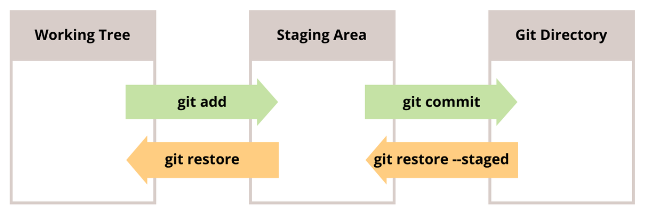
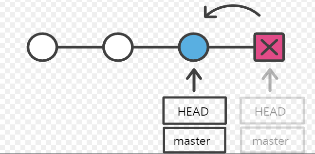
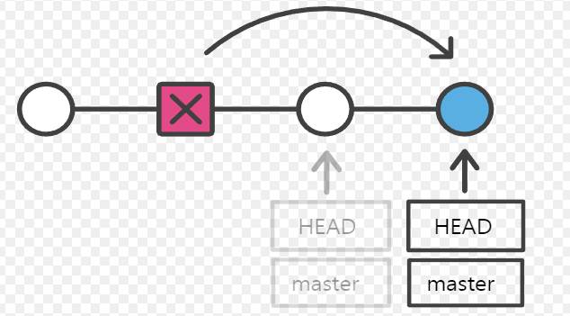
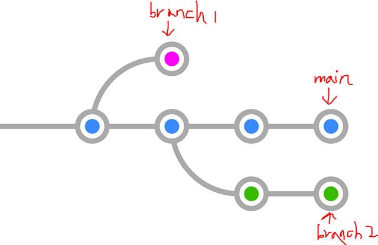

# Git undoing

> Git 작업 되돌리기

* Git에서 되돌리기는 작업 상태에 따라 크게 3가지로 분류
  
  * Working Directory 작업 단계
  
  * Staging Area 작업 단계
  
  * Respository 작업 단계

## ▶ Working directory 작업 단계

> **git add 진행하기 전 파일이 대상**

* working directory에서 수정한 파일(modified)을 수정 전(직전 커밋)으로 되돌리기

* **<mark>이미 버전 관리가 되고 있는 파일만 되돌리기 가능</mark>**

* **`git restore`를 통해 되돌리면 해당 내용을 복원할 수 없으니 주의할 것**❗
  
  * **`git restore {파일 이름}`**
  
  * [참고] git 2.23.0 버전 이전 = `git checkout -- {파일 이름}`

* **[참고] `git stash`❗**
  
  * `git restore` 와 기능은 같지만 수정한 파일을 삭제하지 않고 stash 라는 공간에 임시보관하여 나중에 다시 불러올 일이 있으면 사용할 수 있음
  
  * 다시 불러올 때는 `git stash apply` 를 통해 이전 작업했던 것이 되살아난다.

## ▶ Staging Area 작업 단계

> **git add 를 진행한 파일이 대상 (git add를 잘못한 경우)**

* root-commit 여부에 따라 2가지 명령어로 분류
  
  * root-commit 이 없는 경우: **`git rm --cached {파일명}`**
    
    * new file인 경우 **<mark>(Git 저장소가 만들어지고 한 번도 커밋을 안 한 경우)</mark>**
    
    * **<mark>git에서 더 이상 관리하고 싶지 않은 file</mark>인 경우에도 사용**
      
      * untracked file로 되돌려 준다.
  
  * root-commit 이 있는 경우: **`git restore --staged {파일명}`**
    
    * **HEAD(최근 commit된 곳)로 되돌릴 때 사용**
    
    * **Git 저장소에 한 개 이상의 커밋이 있는 경우**
    
    * [참고] git 2.23.0 버전 이전 = `git reset HEAD {파일명}`

## ▶ Repository 작업 단계

> **commit을 완료한 파일을 Staging Area로 되돌린 후 commit을 재진행(수정)**

* 상황별로 2가지 기능으로 분류
  
  * Staging Area 에 새로 올라온 내용이 없다면, **직전 commit의 메시지만 수정**
    
    * **`git commit --amend`**
      * `vim 모드`로 들어가게 됨
    * *commit 내용을 수정하지 않아도 hash 값이 변경되므로 사용 자제*❗
  
  * Staging Area 에 새로 올라온 내용이 있다면, **직전 commit을 덮어쓰기**
    
    * **동시에 같이 관리되어야 할 파일이 별도로 관리 될 때 먼저 commit된 파일을 Staging Area로 되돌린 후 함께 관리할 파일과 같이 새롭게 commit**

* **이전 commit을 완전히 고쳐서 새 commit으로 변경하므로 이전 commit은 일어나지 않은 일이 되며 <mark>히스토리에도 남지 않음을 주의</mark>할 것**❗

# Git reset & revert

> 특정 시간으로 되돌리기
> 
> 되돌아가는 것을 기록(commit)하고 안하고의 차이

## ▶ Git reset

> **프로젝트를 특정 commit(버전) 상태로 되돌림**

* 특정 commit으로 되돌아 갔을 때, **<mark>해당 commit 이후로 쌓았던 commit들은 전부 사라짐</mark>**

* `git reset [옵션] {commit ID}`
  
  * options = `soft`, `mixed`, `hard` 중 하나를 작성
  
  * commit ID는 되돌아가고 싶은 시점의 commit ID

* 3가지 옵션
  
  * 1️⃣ **`--soft`**
    
    * 되돌아간 commit 이후의 파일들은 Staging Area로 돌려놓음
    
    * commit 직전으로 넘어감
  
  * 2️⃣ **`--mixed`**
    
    * 되돌아간 commit 이후의 파일들은 Working Directory로 돌려놓음
    
    * `git reset` 옵션의 Default
  
  * 3️⃣ **`--hard`**
    
    * **되돌아간 commit 이후의 <mark>파일들은 모두 Working Directory에서 삭제</mark> (사용 시 주의할 것❗)**
      
      * 단, `git reflog` 를 통해 복구 가능함
    
    * 기존의 Untracked 파일은 사라지지 않고 Untracked로 남아있음

* **[참고] `git reflog`**
  
  * `git reflog` 명령어를 이용하면 reset 하기 전의 과거 commit 내역을 모두 조회 가능
  
  * 이**후 해당 commit으로 reset하면 hard 옵션으로 삭제된 파일도 복구 가능**
    
    * **`git reset --hard {commit ID}`**

## ▶ Git revert

> Git reset과의 차이❓
> 
> 해당 commit을 되돌리(취소)며, 취소된 것을 기록

* **과거의 일을 없었던 일처럼, 이전 commit을 취소한다는 새로운 commit(기록)을 생성**

* **`git rever {commit ID}`**
  
  * commit ID는 취소하고 싶은 ID를 작성

## ▶ Git reset vs revert

* 개념적 차이
  
  * reset은 커밋 내역을 삭제하는 반면, revert는 새로운 커밋을 생성
  
  * **revert는 협업할 때 커밋 내역의 차이로 인한 충돌 방지 가능**

* 문법적 차이
  
  * `git reset {commit ID}` = {commit ID}로 되돌린다는 뜻
  
  * `git revert {commit ID}` = {commit ID} 한 개를 취소한다는 뜻
    
    * commit이 취소되었다는 내용의 새로운 commit을 생성

# Git branch & merge

> Branch는 여러갈래로 작업 공간을 나누어 독립적으로 작업할 수 있도록 도와주는 Git의 도구

* **장점**
  
  * 1️⃣ **Branch 는 독립 공간을 형성하기 때문에 원본(master)에 대해 안전함**
    
    * 동작이 정상적으로 (서비스 가능한) 배포할 수 있도록 유지❗
  
  * 2️⃣ 하나의 작업은 하나의 브랜치로 나누어 진행되므로 체계적인 개발이 가능
  
  * 3️⃣ Git은 브랜치를 만드는 속도가 빠르고, 적은 용량을 소모함

## ▶ Git branch

* **조회**
  
  * **`git branch`** = 로컬 저장소의 브랜치 목록을 확인
  
  * **`git branch -r`** = 원격 저장소의 브랜치 목록 확인

* **생성**
  
  * **`git branch {브랜치 이름}`** = 새로운 브랜치 생성
  
  * **`git branch {브랜치 이름} {commit id}`** = 특정 커밋 기준으로 브랜치 생성

* **삭제**
  
  * **`git branch -d {브랜치 이름}`** = **<mark>병합된 브랜치만 삭제 가능</mark>**
  
  * **`git branch -D {브랜치 이름}`** = 강제 삭제

* **진행 흐름: <mark>브랜치 생성 > 새로운 기능 개발 완료 > merge 완료 > branch 삭제</mark>**

## ▶ Git switch

> 현재 브런치에서 다른 브랜치로 이동하는 명령어

* **`git switch {브랜치 이름}`** = 다른 브랜치로 이동

* **`git switch -c {브랜치 이름}`** = 브랜치를 새로 생성 및 이동

* **`git switch -c {브랜치 이름} {commit id}`** = 특정 커밋 기준으로 브랜치 생성 및 이동

* <mark>**switch하기 전에, 해당 브랜치의 변경 사항을 반드시 commit 해야함**</mark>❗
  
  * 다른 브랜치에서 파일을 만들고 *커밋하지 않은 상태에서 switch를 하면 브랜치를 이동했음에도 불구하고 해당 파일이 그대로 남아있게 됨(= master에 영향을 미침)*

* `git log` 혹은 `cat.git/HEAD` 통해서 현재 브런치가 어디있는지 확인 가능
  
  * 옵션(`--`)의 순서는 상관없음
  
  * `git log --oneline`
  
  * `git log --oneline --all`
  
  * `git log --oneline --all --graph`

# Git merge

> 서로 다른 브랜치를 합치는 방법
> 
> 병합 후에는 꼭 브랜치 삭제해주자❗

* master 브랜치가 상용이므로, 주로 master 브랜치에 병합

* **`git merge {합칠 브랜치 이름}`**
  
  * <mark>**병합하기 전에 브랜치를 합치려고 하는 즉 메인 브랜치로 switch 해야 함**</mark>❗

* 병합에는 3 가지 종류가 존재
  
  * 1️⃣ **Fast-Forward**
    
    * 빨리감기처럼 브랜치가 가리키는 commit을 앞으로 이동시키는 방법
    
    * **`git merge hotfix`**
  
  * 2️⃣ **3-way Merge**
    
    * 각 브랜치의 커밋 두 개와 공통 조상 하나를 사용하여 병합하는 방법
    
    * **`git merge hotfix`**
  
  * 3️⃣ **Merge Conflict**
    
    * 두 브랜치에서 같은 부분을 수정한 경우, Git이 어느 브랜치의 내용을 작성해야 하는지 판단하지 못하여 충돌이 발생했을 때 이를 해결하며 병합하는 방법
      
      * **Git은 사용자에게 해결 방법을 선택하라고 요청**
    
    * <mark>**보통 같은 파일의 같은 부분을 수정했을 때 자주 발생**</mark>❗

# Git workflow

> Branch와 원격 저장소를 이용해 협업하는 방법

## ▶ 1️⃣ 원격 저장소 소유권이 있는 경우

> Shared repository model

* 원격 저장소가 자신의 소유이거나 Collaborator로 등록되어 있는 경우

* **master 브랜치에 직접 개발하는 것이 아니라, <mark>기능별로 브랜치를 따로 만들어 개발</mark>**

* **`Pull Request`를 사용하여 팀원 간 변경 내용에 대한 소통 진행**

* 작업 순서
  
  * repository 를 각자 clone 받는다
  
  * 각자 branch를 생성
  
  * 기능 구현이 완료되면 본인 브랜치에 Push
    
    * 원격 저장소에 각 기능별 브랜치가 업로드 됨
  
  * `Pull Resquest`를 통해 브랜치를 master에 반영해달라는 요청을 보냄
  
  * 병합이 완료된 브랜치는 불필요하므로 원격 저장소에서 삭제
  
  * 원격 저장소에서 병합이 완료되면 사용자는 로컬에서 master 브랜치로 switch
  
  * 병합으로 인해 변경된 원격 저장소의 master 내용을 로컬에 Pull
  
  * 원격 저장소 master를 받았으므로, 기존 로컬 브랜치는 삭제 (한 사이클 종료)
  
  * 새 기능 추가를 위해 새로운 브랜치를 생성하며 지금까지의 과정을 반복

## ▶ 2️⃣ 원격 저장소 소유권이 없는 경우

> Fork & Pull model

* 오픈 소스 프로젝트와 같이, 자신의 소유가 아닌 원격 저장소인 경우

* **원본 원격 저장소를 그대로 <mark>내 원격 저장소에 복제</mark> (이러한 행위를 `Fork`)**

* **기능 완성 후 복제한 <mark>내 원격 저장소에 Push</mark>**

* **이후 <mark>Pull Reqeust를 통해 원격 저장소에 반영될 수 있도록 요청</mark>**

* **작업 순서**
  
  * 소유권이 없는 원격 저장소를 Fork를 통해 내 원격 저장소에 복제
  
  * clone을 받기
  
  * 이후에 로컬 저장소와 원본 원격 저장소를 **동기화하기 위해 연결**
    
    * `git remote add upstream [원본 URL]`
  
  * 기능 개발 진행
  
  * 기능 구현 완료 시, 원본 원격 저장소에 해당 브랜치를 Push
  
  * Pull Request를 통해 origin의 브랜치를 upstream에 반영해달라는 요청을 보냄
  
  * Upstream에 브랜치가 병합되면 내 원격 저장소에서는 지워준 후 pull 받기
  
  * 새로운 기능 추가를 위해 새로운 브랜치를 생성하며 위 과정을 반복

# [참고] git branch 전략

## ▶ git-flow

* 5개의 브랜치로 나누어 소스코드를 관리
  
  * `master`: 제품으로 출시될 수 있는 브랜치
  
  * `develop`: 다음 출시 버전을 개발하는 브랜치
  
  * `feature`: 기능을 개발하는 브랜치
  
  * `release`: 이번 출시 버전을 준비하는 브랜치
  
  * `hotfix`: 출시 버전에서 발생한 버그를 수정하는 브랜치

* 대규모 프로젝트에 적합한 브랜치 전략

* 다른 전략 = github-flow, gitlab-flow 등

* 브랜치를 자주 생성하는 것을 강력 권장❗
