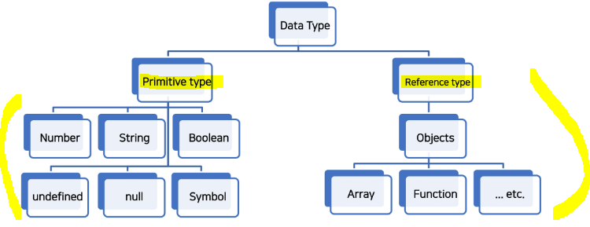
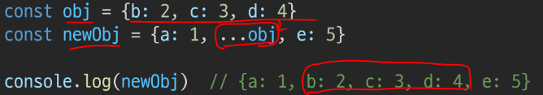

# JavaScript

## ▶ 배워야 하는 이유

1️⃣ **Web 기술의 기반이 되는 언어**

* **HTML 문서의 콘텐츠를 <mark>동적으로 변경</mark>할 수 있는 언어**

* Web 이라는 공간에서 채팅, 게임 등 다양한 동작을 할 수 있게 된 기반

2️⃣ **다양한 분야로 확장이 가능한 언어**

* Web 조작을 넘어 서버 프로그래밍, 모바일 서비스, 컴퓨터 응용프로그래밍, 게임 개발 등에 활용

3️⃣ **가장 인기있는 언어**

* 언어의 확장성이 큰 만큼 가장 많이 사용

## ▶ 실행환경 구성

1️⃣ **Web Browser로 실행**

* HTML 파일에 직접 JavaScript를 작성 후 웹 브라우저로 파일 열기
  
  ```html
  <script>
    console.log('hello, javascript')
  </script>
  ```

* `JavaScript` 확장자를 가진 파일에서 작성하고, 해당 파일을 HTML에 불러오기
  
  ```javascript
  console.log('hello, javascript');
  ```
  
  ```html
  <body>
  </body>
  <script src="hello.JavaScript"></script>
  ```

* 웹 브라우저의 console(`F12`)에서 바로 JavaScript 입력해도 괜찮음 (엔진이 있으니까!)

2️⃣ **Node.jS 로 실행**

# JavaScript 기초 문법

## ▶ 코드 작성법

* **세미콜론**
  
  * 선택적으로 사용 가능
  
  * 세미콜론이 없으면 `ASI(Automatic Semicolon Insertion)`에 의해 **자동으로 세미콜론이 삽입됨**

* **들여쓰기와 코드 블럭**
  
  * **<mark>JavaScript 는 2칸 들여쓰기</mark>를 사용**
  
  * **<mark>블럭(block)</mark>은 if, for, 함수에서 <mark>중괄호 `{}` 내부</mark>를 말함**
    
    * JavaScript는 **중괄호 `{}` 를 사용해 코드 블럭을 구분**
      
      ```javascript
      if (isClean) { // 중괄호를 사용해서 코드 블럭을 구분
        console.log('clean!')
      }
      ```

* 다양한 JavaScript 코드 스타일 가이드
  
  * **Airbnb JavaScript Style Guide**
  
  * Google JavaScript Style Guide
  
  * standardJavaScript

* 주석
  
  * 한 줄 주석 = `//`
  
  * 여러 줄 주석 = `/* */`

## ▶ 변수와 식별자

* 식별자 정의와 특징
  
  * 식별자는 변수를 구분할 수 있는 **변수명을 말함**
  
  * **식별자는 반드시 문자, 달러(`$`) 또는 밑줄(`_`)로 시작**
  
  * **<mark>대소문자를 구분하며, 클래스명 외에는 모두 소문자로 시작</mark>**
  
  * **예약어 사용 불가능**
    
    * 예: `for`, `if`, `function` 등
  
  * 변수, 객체, 함수 = `camelCase`
    
    
  
  * 클래스, 생성자 = `PascalCase`
    
    
  
  * 상수(개발자의 의도와 상관없이 변경될 가능성이 없는 값) = `SNAKE_CASE`
    
    

* <mark>**변수 선언 키워드**</mark>❗

> Python과 다르게 **JavaScript는 변수를 선언하는 키워드가 정해져 있음**

* 1️⃣ **`let`**
  
  * 블록 스코프 **지역 변수를 선언** (추가로 동시에 값을 초기화)

* 2️⃣ **`const`**
  
  * 블록 스코프 **읽기 전용 상수를 선언** (추가로 동시에 값을 초기화)

* 3️⃣ **`var`**
  
  * **변수를 선언** (추가로 동시에 값을 초기화)

* **선언**: 변수를 생성하는 행위 또는 시점

* **할당**: 선언된 변수에 값을 저장하는 행위 또는 시점

* **초기화**: 선언된 변수에 처음으로 값을 저장하는 행위 또는 시점

```javascript
let foo    // 선언
console.log(foo)

foo = 11    // 할당 
console.log(foo)

let bar = 0    // 선언 + 할당 
console.log(bar)
```

### 📌 [참고] 블록 스코프(block scope)

* if, for, 함수 등의 중괄호 내부를 가리킴

* **<mark>블록 스코프를 가지는 변수는 블록 바깥에서 접근 불가능</mark>**


## ▶ 변수 선언 키워드❗

* <mark>**`let`**</mark>
  
  * **<mark>재할당 가능 & 재선언 불가능</mark>**
    
    
  
  * 블록 스코프를 갖는 지역 변수를 선언, 선언과 동시에 원하는 값으로 초기화 가능

* <mark>**`const`**</mark>
  
  * **<mark>재할당 불가능 & 재선언 불가능</mark>**
    
    
  
  * **선언 시 반드시 초기값을 설정해야 하며, 이후 값 변경이 불가능**
  
  * 블록 스코프를 갖는 지역 변수를 선언, 선언과 동시에 원하는 값으로 초기화 가능

* **`var`**
  
  * 재할당 가능 & 재선언 가능
  
  * *"호이스팅"되는 특성으로 인해 예기치 못한 문제 발생 가능*
    
    * `var` 대신 **<mark>`const`와 `let`을 사용하는 것을 권장</mark>**
  
  * 함수 스코프를 가짐
  
  * ***변수 선언 시 키워드를 사용하지 않으면 자동으로 `var`로 선언됨***

### 📌 [참고] 함수 스코프 (fuction scope)

> **함수의 중괄호 내부**를 가리킴

* ***함수 스코프를 가지는 변수는 함수 바깥에서 접근 불가능***
  
  

### 📌 [참고] 호이스팅 (hoisting)

> **변수를 선언하기 이전에 참조할 수 있는 현상**

* `var` 로 선언된 변수는 선언 이전에 참조할 수 있으며, 이러한 현상을 호이스팅

* **<mark>변수 선언 이전의 위치에서 접근 시 `undefined`를 반환</mark>**
  
  

* **<mark>변수들이 실제 실행 시에 코드의 최상단으로 끌어 올려지게 된다.</mark>**

* 반면, **`let`, `const` 는 호이스팅이 일어나면 에러를 발생시킴**❗
  
  

## ▶ 변수 선언 키워드 정리❗


* Airbnb style = **<mark>기본적으로 `const` 사용을 권장하며 재할당해야 하는 경우만 `let`</mark>**

# 데이터 타입

> **JavaScript의 모든 값은 특정한 데이터 타입을 가짐**

* Primitive type(원시 타입) & Reference type(참조 타입)으로 분류



## ▶ Number

> **정수 또는 실수형 숫자를 표현하는 자료형**

* **`NaN`** (Not-A-Number)
  
  * 숫자가 아님을 나타냄
  
  * **`Number.isNaN()`** 의 경우
    
    * **<mark>주어진 값의 유형이 Number이고 값이 NaN이면 true</mark>, 아니면 false를 반환**
      
      
  
  * **`NaN`을 반환하는 경우**
    
    * 숫자로서 읽을 수 없음
    
    * 결과가 허수인 수학 계산식 (`Math.sqrt(-1)`)
    
    * 피연산자가 NaN (`7 ** NaN`)
    
    * 정의할 수 없는 계산식 (`0 * Infinity`)
    
    * 문자열을 포함하면서 덧셈이 아닌 계산식

## ▶ String

> **문자열을 표현하는 자료형**

* 작은 따옴표 또는 큰 따옴표 모두 가능

* **곱셈, 나눗셈, 뺄셈은 안되지만 <mark>덧셈을 통해 문자열 붙일 수 있음</mark>**
  
  ```javascript
  const firstName = 'Tony'
  const lastName = 'Stark'
  const fullName = firstName + lastName
  
  console.log(fullName)
  ```

* Quote를 사용하면 선언 시 줄 바꿈이 안됨

* 대신 escape sequence를 사용할 수 있기 때문에 `\n`를 사용해야 함
  
  ```javascript
  const word = 'hello
  please' // SyntaxError
  
  const word2 = 'hello \n please'
  console.log(word2)
  ```

* **`Template Literal` 을 사용하면 줄바꿈이 되며, 문자열 사이에 변수도 삽입 가능**
  
  * python의 'f-string' 과 동일
    
    ```javascript
    const age = 10
    const message = `홍길동은 ${age}세입니다.`
    ```

## ▶ Template literals

> 내장된 표현식을 허용하는 문자열 작성 방식

* **<mark>Backtick(````)을 이용</mark>하며, 여러 줄에 걸쳐 문자열을 정의할 수도 있고 JavaScript의 변수를 문자열 안에 바로 연결할 수 있는 이점이 생김**

* **`$`와 중괄호 (`${expression}`)로 표현식을 삽입 가능**

## ▶ Empty Value

> **값이 존재하지 않음을 표현하는 값**

* `null` 과 `undefined`가 존재

* **`null`**
  
  * **<mark>변수의 값이 없음을 의도적으로 표현할 때 사용</mark>**
  * 개발자가 의도적으로 사용

* **`undefined`**
  
  * **변수 선언 이후 <mark>직접 값을 할당하지 않으면 자동으로 할당됨</mark>**

* **둘의 차이점**❓ **`null` 이 원시 타입임에도 object로 출력됨(설계상 오류임)**
  
  

## ▶ Boolean

> 참과 거짓을 표현하는 값 = `true`/`false`

* **조건문 또는 반복문에서 유용하게 사용**
  
  * **조건문 또는 반복문에서 `boolean`이 아닌 데이터 타입은 <mark>자동 형변환 규칙</mark>에 따라 true or false로 반환됨**

* **자동 형변환**
  
  

* **JavaScript에서 <mark>빈 배열`[]`은 `true`</mark> 이다.**

# 연산자

## ▶ 비교 연산자

* 피연산자들(숫자, 문자, Boolean 등)을 비교하고 결과값을 true/false로 반환

* 문자열은 유니코드 값을 사용하며 표준 사전 순서를 기반으로 비교
  
  * 예) 알파벳끼리 비교
    
    * 알파벳 순서상 후순위가 더 크다.
    
    * 소문자가 대문자보다 더 크다.
      
      

## ▶ 동등 연산자 (`==`)

* 두 피연산자가 같은 값으로 평가되는지 비교 후 boolean 값을 반환

* 비교할 때 <mark>**암묵적으로 타입 변환**</mark>을 통해 타입을 일치시킨 후 같은 값인지 비교

* ***예상치 못한 결과가 발생할 수 있으므로 <mark>특별한 경우를 제외하고 사용 ❌</mark>***

## ▶ 일치 연산자 (`===`)

* **두 피연산자의 값과 타입이 모두 같은 경우 true를 반환**

* 같은 객체를 가리키거나, 같은 타입이면서 같은 값인지를 비교

* **엄격한 비교과 이뤄지며 <mark>암묵적 타입 변환이 발생하지 않음</mark>**

## ▶ 논리 연산자

* **and = `&&`, or = `||`, not = `!`**

* 단축 평가 지원
  
  * false && true = `false`
  
  * true || false = `true`

## ▶ 삼항 연산자

> 3개의 피연산자를 사용하여 조건에 따라 값을 반환하는 연산자

* **가장 앞의 조건식이 <mark>참이면 `:` 앞의 값이 반환, 반대인 경우 `:` 뒤의 값이 반환</mark>**

* 삼항 연산자의 결과 값이기 때문에 변수에 할당 가능

```javascript
true ? 1 : 2 // 1
false ? 1 : 2 //2

const result = Meta.PI > 4 ? 'Yep' : 'Nope'
console.log(result) // Nope
```

# 조건문

## ▶ 종류와 특징

* **`if`, `else if`, `else`**
  
  * 조건 표현식의 결과값을 **boolean 타입으로 변환 후 참/거짓을 판단**
  
  * **<mark>조건은 소괄호 `()` 안에 작성</mark>**
  
  * **<mark>실행할 코드는 중괄호 `{}` 안에 작성</mark>**
  
  * 블록 스코프 생성
    
    

* **`switch`**
  
  * **<mark>조건 표현식의 결과값이 어느 값에 해당하는지 판별</mark>**
  
  * 주로 특정 변수의 값에 따라 조건을 분기할 때 활용
    
    * 조건이 많아질 경우 if문보다 가독성이 나을 수 있음
  
  * 표현식의 결과값과 case문의 오른쪽 값을 비교
  
  * break 및 default 문은 [선택적]으로 사용 가능
  
  * **break 문이 없는 경우, break 문을 만나거나 default 문을 실행할 때까지 다음 조건문 실행**
    
    
  
  * 위 경우 모든 console이 출력 (=Fall-through)
    
    * **`break`를 작성하여 의도한대로 동작 가능**
      
      

* **`if / switch`** 비교
  
  * 조건이 많은 경우 switch 문을 통해 가독성 향상을 기대할 수 있음
  
  * 일반적으로 중첩 else if 문은 유지보수하기 힘들다는 문제가 있음
    
    

# 반복문

* **`while`**
  
  * 조건문이 참이기만 하면 문장을 계속해서 수행 = 조건문이 false 일 때까지 수행
    
    ```javascript
    let i = 0
    
    while (i < 6) {
      console.log(i)
      i += 1  
    }
    ```

* **`for`**
  
  * 특정한 조건이 거짓으로 판별될 때까지 반복
    
    ```javascript
    for (let i = 0; i < 6; i++) {
        console.log(i)
    }
    ```
    
    

* **`for ... in`**
  
  * **객체(object)의 <mark>속성을 순회</mark>할 때 사용**
    
    * **객체란? key: value 값으로 구성된 것을 의미** - 딕셔너리와 유사
  
  * ***배열도 순회 가능하지만 <mark>인덱스 순으로 순회한다는 보장이 없으므로 권장 ❌</mark>***
    
    ```javascript
    const fruits = {a: 'apple', b: 'banana'}
    
    for (const key in fruits) {
      console.log(key) // a, b
      console.log(fruits[key]) // apple, banana
    }
    ```

* **`for ... of`**
  
  * **반복 가능한 객체를 순회할 때 사용**
  
  * **반복 가능한 객체의 종류 = <mark>Array, Set, String</mark> 등**
    
    ```javascript
    const numbers = [0, 1, 2, 3]
    
    for (const number of numbers) {
      console.log(number) // 0, 1, 2, 3
    }
    ```

* **`for ... in` 과 `for ... of` 차이❗**
  
  * `for ... in` 은 속성 이름을 통해 반복 **(객체)**
  
  * `for ... of` 는 속성 값을 통해 반복 **(객체를 제외한 나머지)**
    
    ```javascript
    const arr = [3, 5, 7]
    
    for (const i in arr) {
        console.log(i) // 0 1 2 (index 가 아니라 object의 key 값!)
    }
    
    for (const i of arr) {
        console.log(i) // 3 5 7
    }
    ```

### 📌 [참고] for ... in, for ... of 와 const

* 일반적인 for문 `for (let i = 0; i < arr.length; i++) {...}` 의 경우에는 **최초 정의한 i를 재할당하면서 사용하기 때문에 `const`를 사용하면 에러 발생**

* 다만 `for...in`, `for...of` 의 경우에는 **재할당이 아니라, <mark>매 반복 시 해당 변수를 새로 정의하여 사용</mark>하므로 `const` 사용해도 에러 발생** ❌
  
  


# 함수

> 참조 타입 중 하나로써 function 타입에 속함

## ▶ 함수 정의

* 1️⃣ **함수 선언식 (Function declaration)**
  
  * 일반적인 프로그래밍 언어의 함수 정의 방식
    
    ```javascript
    function add(num1, num2) {
      return num1 + num2
    }
    
    add(2, 7) // 9
    ```

* 2️⃣ **<mark>함수 표현식 (Function expression)</mark>**
  
  * 표현식 내에서 함수를 정의하는 방식
  
  * **함수 표현식은 함수의 이름을 생략한 익명 함수로 정의 가능** = 변수명으로 표현
    
    ```javascript
    const sub = function (num1, num2) {
      return num1 - num2
    }
    
    sub(7, 2) // 5
    ```
  
  * 표현식에서 함수 이름을 명시하는 것도 가능
  
  * *다만, 이 경우 함수 이름은 호출에 사용되지 못하고 디버깅 용도로 사용*
    
    ```javascript
    const mySub = function namedSub(num1, num2) {
      return num1 - num2
    }
    
    mySub(1, 2) // -1
    namedSub(1, 2) // ReferenceError: namedSub is not defined
    ```

* **기본 인자**
  
  * 인자 작성 시 **`=` 문자 뒤에 기본 인자 선언 가능**
    
    ```javascript
    const greeting = function (name='Anonymous') {
      return 'Hi ${name}'
    }
    
    greeting() // Hi Anonymous
    ```

* **<mark>매개변수와 인자의 개수 불일치 허용</mark>**
  
  * **매개변수보다 인자의 개수가 많을 경우❗**
    
    ```javascript
    const noArgs = function() {
      return 0
    }
    
    noArgs(1, 2, 3) // 0
    
    const twoArgs = function(arg1, arg2) {
      return [arg1, arg2]
    }
    
    twoArgs(1, 2, 3) // [1, 2]
    ```
  
  * **매개변수보다 인자의 개수가 적을 경우❗** = `undefined`
    
    ```javascript
    const threeArgs = function(arg1, arg2, arg3) {
      return [arg1, arg2, arg3]
    }
    
    threeArgs()      // [undefined, undefined, undefined]
    threeArgs(1)     // [1, undefined, undefined]
    threeArgs(1, 2)  // [1, 2, undefined]
    ```

* **Sperad syntax(<mark>`...`</mark>)❗**
  
  * **전개 구문**: python에서 가변인자(`*args`)와 유사
  
  * 전개 구문을 사용하면 **배열이나 문자열과 같이 반복 가능한 객체를 배열의 경우는 요소, 함수의 경우는 인자로 확장할 수 있음**
    
    1. **배열과의 사용**
       
       ```javascript
       let parts = ['shoulders', 'knees']
       let lyrics = ['head', ...parts, 'and', 'toes']
       // ['head', 'shoulders', 'knees', 'and', 'toes']
       ```
    
    2. **함수와의 사용 (<mark>Rest parameters</mark>)**
       
       * 정해지지 않은 수의 매개변수를 배열로 받을 수 있음
       
       ```javascript
       const restOpr = function(arg1, arg2, ...restArgs) {
         return [arg1, arg2, restArgs]
       }
       
       restOpr(1, 2, 3, 4, 5) // [1, 2, [3, 4, 5]]
       restOpr(1, 2)  // [1, 2, []]
       ```

# 선언식과 표현식

> 선언식 함수와 표현식 함수 **모두 타입은 function 으로 동일**

## ▶ 호이스팅 - 선언식

* 함수 선언식으로 정의한 함수는 var로 정의한 변수처럼 **호이스팅이 발생**

* **즉, 함수 호출 이후에 선언해도 동작**
  
  ```javascript
  add(2, 7) // 9
  
  function add (num1, num2) {
    return num1 + num2
  }
  ```

## ▶ 호이스팅 - 표현식❗

* 반면 함수 표현식으로 선언한 함수는 **함수 정의 전에 호출 시 <mark>에러 발생</mark>**

* **<mark>함수 표현식으로 정의된 함수는 변수로 평가되어 변수의 scope 규칙을 따름</mark>**


# Arrow Function

> 화살표 함수 - **함수를 비교적 간결하게 정의할 수 있는 문법**

* function 키워드와 중괄호를 이용한 구문을 짧게 사용하기 위해 탄생
  
  * 1️⃣ (필수) **`function` 키워드 <mark>생략 가능</mark> = `=>` 생성**
  
  * 2️⃣ (선택) **함수의 매개변수가 하나뿐이라면 `()` 도 생략 가능**
  
  * 3️⃣ (선택) **함수의 내용이 한 줄이라면 `{}`와 `return`도 생략 가능**

* **화살표 함수는 항상 익명 함수**
  
  * **<mark>함수 표현식에서만 사용 가능</mark>**

```javascript
const greeting = function (name) {
  return `Hi ${name}`
}

// 1단계 - function 키워드 삭제 
const greeting1 = (name) => {
  return `Hi ${name}`
}

// 2단계 - 함수의 매개 변수가 하나라면 가능 = 보통은 이처럼 표현 
const greeting2 = name => {
  return `Hi ${name}`
}

// 3단계 - 함수의 내용이 한 줄이라면 가능
const greeting3 = name => `Hi ${name}`
```

* **화살표 함수 응용❗**
  
  * 명확성과 일관성을 위해 **항상 인자 주위에는 `()`를 포함하는 것을 권장**


## ▶ 즉시 실행 함수 (IIFE)

> **선언과 동시에 실행되는 함수**

* **함수의 선언 끝에 `()` 를 추가하여 선언되자 마자 실행하는 형태**

* 즉시 실행 함수는 선언과 동시에 실행되기 때문에 **같은 함수를 다시 호출할 수 없음**

* 일회성 함수이므로 익명함수로 사용하는 것이 일반적
  
  ```javascript
  function(num) {
      return num ** 3
  }
  
  (function(num) { return num ** 3 })(2) // 8
  
  (num) => {return num ** 3}
  (num => num ** 3)(2) // 8
  ```

```javascript
const numbers = [1, 2, 3, 4, 5]

console.log(numbers[0])
console.log(numbers[-1])  // undefined
console.log(numbers.length)
console.log(numbers[numbers.length - 1])  // 5, 음수 인덱싱 불가
```

# Array 와 Object

> JavaScript의 데이터 타입 중 **참조 타입(reference)에 해당하는 타입은 array(list)와 object(dict)이며 객체라고 말함**

- 객체는 속성들의 모음(collection)

## ▶ 배열(Array)

- 키와 속성들을 담고 있는 참조 타입의 객체

- **순서를 보장하는 특징**

- **주로 `[]`를 이용하여 생성하고, 0을 포함한 양의 정수 인덱스로 특정 값에 접근 가능**

- **배열의 길이는 `array.length` 형태로 접근 가능**

- (참고) **배열의 마지막 원소는 `array.length - 1`로 접근**

## ▶ 배열 메서드 기초❗


```javascript
const numbers = [1, 2, 3, 4, 5]

numbers.reverse()
console.log(numbers)

numbers.push(100)
console.log(numbers)
numbers.pop()
console.log(numbers)

console.log(numbers.includes(1)) // true
console.log(numbers.includes(100)) // false

console.log(numbers.indexOf(3)) // 2
console.log(numbers.indexOf(100)) // -1

console.log(numbers.join()) // 5,4,3,2,1
console.log(numbers.join('')) // 54321
console.log(numbers.join(' ')) // 5 4 3 2 1
console.log(numbers.join('-')) // 5-4-3-2-1
```

* `array.join([separator)`

## ▶ 배열 메서드 심화❗

* **Array Helper Methods**❗
  
  * **배열을 순회하며 특정 로직을 수행하는 메서드**
  
  * **메서드 호출 시 인자로 <mark>callback 함수</mark>를 받는 것이 특징**
  
  * **<mark>callback 함수: 어떤 함수의 내부에서 실행될 목적으로 인자로 넘겨받는 함수</mark>**


### 📌 [참고] Django로 보는 콜백함수 예시


* `path` 함수에 전달되는 callback 함수

----

* **`forEach`❗**
  
  * 인자로 주어지는 함수(콜백 함수)를 배열의 각 요소에 대해 한 번씩 실행

```javascript
// 1. callback 함수 사용
const colors = ['red', 'blue', 'green']

const printColor = function (color) {
    console.log(color)
}

colors.forEach(printColor)

// 2. 함수 정의를 인자로 넣기 
colors.forEach(function (color) {
    console.log(color)
})

// 3. 최종! = 화살표 함수 적용 
colors.forEach((color) => {
    console.log(color)
})
```

* **`map`❗**
  
  * 배열의 각 요소에 대해 콜백 함수를 한 번씩 실행
  
  * **<mark>콜백 함수의 반환 값을 요소로 하는 새로운 배열 반환</mark>** = **`forEach + return`**

```javascript
const numbers = [1, 2, 3, 4, 5]

const doubleEle = function (number) {
    return number * 2
}


// 1.
const newArray = numbers.map(doubleEle)

console.log(newArray)

// 2.
const newArray = numbers.map(function (number) {
    return number * 2
})

// 3.
const newArray = numbers.map((number) => {
    return number * 2
})

// 4.
const newArray = numbers.map((number) => number * 2)
```

* **`filter`❗**
  
  * 배열의 각 요소에 대해 콜백 함수를 한 번씩 실행
  
  * **콜백 함수의 반환 값이 참인 요소들만 모아서 새로운 배열 반환**
  
  * 기존 배열의 요소들을 필터링할 때 유용 = **`map + filter`**

```javascript
const products = [
    { name: 'cucumber', type: 'vegetable'},
    { name: 'banana', type: 'fruit'},
    { name: 'carrot', type: 'vegetable'},
    { name: 'apple', type: 'fruit'},
]

const fruitFilter = function (product) {
    return product.type === 'fruit'
}

// 1.
const newArray = products.filter(fruitFilter)
console.log(newArray)

// 2. 
const newArray = products.filter(function (product) {
    return product.type === 'fruit'
})

// 3.
const newArray = products.filter((product) => {
    return product.type === 'fruit'
})
```

* **`reduce`❗**
  
  * 인자로 주어지는 콜백 함수를 배열의 각 요소에 대해 한 번씩 실행해서, **하나의 결과 값을 반환**
  
  * 즉, 배열을 하나의 값으로 계산하는 동작이 필요할 때 사용 (총합, 평균 등)
  
  * map, filter 등 여러 배열 메서드 동작을 대부분 대체할 수 있음
  
  * reduce 메서드의 주요 매개변수
    
    * `acc`
      
      * **이전 callback 함수의 반환 값이 누적되는 변수**
      
      * 누적된 값(전 단계까지의 결과)
    
    * `initialValue`(optional)
      
      * 최초 callback 함수 호출 시 acc에 할당되는 값, default 값은 배열의 첫 번째 값
      
      * 누적될 값의 초기값, 지정하지 않을 시 첫 번째 요소의 값이 됨
        
        * **빈 배열의 경우 initailValue를 제공하지 않으면 에러 발생**

```javascript
const numbers = [90, 80, 70, 100]

// 총합
const sumNum = numbers.reduce(function (result, number) {
    return result + number
}, 0)

console.log(sumNum) // 340


// 화살표 함수로 한 번에 표현하기
const sumNum = numbers.reduce((result, number) => {
    return result + number
}, 0)


// 평균값 구하기
const avgNum = numbers.reduce((result, number) => result + number, 0) / numbers.length
```


* **`find`**
  
  * 배열의 각 요소에 대해 콜백 함수를 한 번씩 실행
  
  * 콜백 함수의 반환값이 참이면, 조건을 만족하는 첫번째 요소를 반환
  
  * **찾는 값이 배열에 없으면 `undefined` 반환**

```javascript
const avengers = [
    { name: 'Tony Stark', age: 45 },
    { name: 'Steve Rogers', age: 32 },
    { name: 'Thor', age: 40 },
]

const avenger = avengers.find((avenger) => {
    return avenger.name == 'Tony Stark'
})

console.log(avenger)
```

* **`some`**
  
  * **배열의 요소 중 <mark>하나라도 주어진 판별 함수를 통과하면 참을 반환</mark>**
  
  * 모든 요소가 통과하지 못하면 거짓 반환
  
  * **빈 배열은 항상 false 반환**

```javascript
const arr = [1, 2, 3, 4, 5]

// 1. 
const result = arr.some(function (elem) {
    return elem % 2 === 0
})

// 2.
const result = arr.some((elem) => {
    return elem % 2 === 0
})

// 3.
const result = arr.some((elem) => elem % 2 === 0)

console.log(result) // true
```

* **`every`**
  
  * **배열의 <mark>모든 요소가 주어진 판별 함수를 통과하면 참을 반환</mark>**
  
  * 하나의 요소라도 통과하지 못하면 거짓 반환
  
  * **빈 배열은 항상 true 반환**

```javascript
const arr = [1, 2, 3, 4, 5]

const newResult = arr.every((elem) => elem % 2 === 0)

console.log(newResult) // false
```

## ▶ 배열 순회 비교


```javascript
const chars = ['A', 'B', 'C', 'D']

for (let idx = 0; idx < chars.length; idx++) {
    console.log(idx, chars[idx])
}

for (const char of chars) {
    console.log(char)
}

chars.forEach((char, idx) => {
    console.log(idx, char)
})

chars.forEach(char => {
    console.log(char)
})
```

# 객체 (Object)

> 객체는 속성의 집합이며, 중괄호 내부에 **key와 value의 쌍으로 표현**

* **key는 문자열 타입만 가능**
  
  * **key 이름에 띄어쓰기 등의 구분자가 있으면 따옴표로 묶어서 표현**

* value는 모든 타입(함수 포함) 가능

* **객체 요소 접근은 `.` 또는 `[]`로 가능**
  
  * **<mark>key 이름에 띄어쓰기 같은 구분자가 있으면 대괄호 접근만 가능</mark>**

```javascript
const myInfo = {
    name: 'jack',
    phoneNumber: '123456',
    'samsung products': {   // 띄어쓰기 있으면 '' 사용해야 함!
        buds: 'Galaxy Buds pro',
        galaxy: 'Galaxy s99',
    },
}

console.log(myInfo.name)
console.log(myInfo['name'])

console.log(myInfo['samsung products']) // []만 접근 가능
console.log(myInfo['samsung products'].galaxy)
```

## ▶ 객체 관련 문법

> ES6에 새로 도입된 문법들로 객체 생성 및 조작에 유용하게 사용 가능

1️⃣ **속성명 축약❗**

* 객체를 정의할 때 **key와 할당하는 변수의 이름이 같으면 축약 가능**
  
  

2️⃣ **메서드 축약❗**

* **메서드 선언 시 function 키워드 생략 가능**
  
  

3️⃣ **계산된 속성 (computed property name)**

* 객체를 정의할 때 **key의 이름을 표현식을 이용(`[]`)하여 동적으로 생성 가능**
  
  

4️⃣ **<mark>구조 분해 할당 (destructing assignment)</mark>❗**

* **배열 또는 객체를 분해하여 속성을 변수에 쉽게 할당할 수 있는 문법❗**

5️⃣ **Spread syntax (`...`)**

* 배열과 마찬가지로 전개구문을 사용해 **객체 내부에서 객체 전개 가능**

* **얕은 복사에 활용 가능**
  

## ▶ JSON (JavaScript Object Notation)

> Key-Value 형태로 이루어진 자료 표기법

* JavaScript의 Object와 유사한 구조를 가지고 있지만 Object는 그 자체로 타입이고, JavaScriptON은 형식이 있는 **<mark>문자열</mark>**

* **즉, <mark>JSON을 Object로 사용하기 위해서는 변환 작업이 필요</mark>**

```javascript
const jsonData = {
    coffee: 'Americano',
    iceCream: 'Mint Choco',
}

// Object -> json
const objToJson = JSON.stringify(jsonData)
console.log(objToJson) // {"coffee":"Americano","iceCream":"Mint Choco"}
console.log(typeof objToJson) // string

// json -> Object
const jsonToObj = JSON.parse(objToJson)
console.log(jsonToObj) // { coffee: 'Americano', iceCream: 'Mint Choco' }
console.log(typeof jsonToObj) // object
console.log(jsonToObj.coffee) // Americano
```

### 📍 [참고] 배열은 객체다

* 배열은 키와 속성들을 담고 있는 참조 타입의 객체
  
  * 빈 배열(`[]`)은 무조건 true

* 배열은 인덱스를 키로 가지며 **`length` 프로퍼티를 갖는 특수한 객체**


