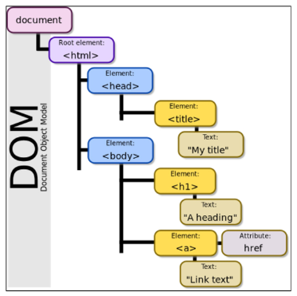
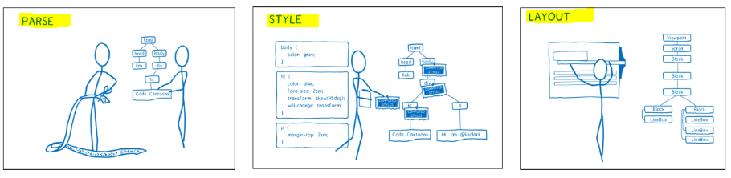

# DOM

> **브라우저에서의 JavaScript**

* 웹 페이지에서 복잡한 기능을 구현하는 스크립트 언어

* 정적인 정보만 보여주는 것이 아닌 **주기적으로 갱신되거나, 사용자와 상호 작용이 가능하거나, 애니메이션이 적용된 그래픽 등에 관여**

## ▶ Browser APIs

> **웹 브라우저에 내장된 API**로, 현재 컴퓨터 환경에 관한 데이터를 제공하거나 오디오를 재생하는 등 여러가지 유용하고 복잡한 일을 수행

* 종류
  
  * **DOM**
  
  * Geolocation API (지리정보)
  
  * WebGL (그래픽) 등

## ▶ DOM (Document Object Model)

> 문서의 구조화된 표현을 제공하며 **프로그래밍 언어(JavaScript)가 DOM 구조에 접근할 수 있는 방법을 제공**

* 문서 구조, 스타일, 내용 등을 변경할 수 있게 도움

* HTML 콘텐츠를 추가, 제거, 변경하고 동적으로 페이지에 스타일을 추가하는 등 HTML/CSS 를 조작할 수 있음

* **문서가 구조화되어 있으며 <mark>각 요소는 객체(object)로 취급</mark>**

* 단순한 속성 접근, 메서드 활용 뿐만 아니라 프로그래밍 언어적 특성을 활용한 조작 가능



* **DOM은 문서를 논리 트리로 표현**

* DOM 메서드를 사용하면 프로그래밍적으로 트리에 접근할 수 있고 이를 통해 문서의 구조, 스타일, 컨텐츠를 변경할 수 있음

* 웹 페이지는 일종의 문서
  
  * 이 문서는 웹 브라우저를 통해 그 내용이 해석되어 웹 브라우저 화면에 나타나거나 HTML 코드 자체로 나타나기도 함

* DOM은 동일한 문서를 표현하고, 저장하고, 조작하는 방법을 제공

* **DOM은 웹 페이지의 객체 지향 표현이며, JavaScript와 같은 스크립트 언어를 이용해 DOM을 수정할 수 있음**

## ▶ DOM에 접근하기

* 모든 웹 브라우저는 스크립트 언어가 접근할 수 있는 웹페이지를 만들기 위해 DOM을 항상 사용함

* **"<mark>DOM의 주요 객체</mark>"들을 활용하여 문서를 조작하거나 특정 요소들을 얻을 수 있음**

## ▶ DOM의 주요 객체

1️⃣ **<mark>window</mark>**

* DOM을 표현하는 창

* **가장 최상위 객체 (작성 시 생략 가능)**

* **탭 기능이 있는 브라우저에서는 <mark>각각의 탭(하나의 창)을 각각의 window 객체로 나타냄</mark>**

* window의 메서드 예시
  
  * 새 탭 열기
    
    ```javascript
    window.open()
    ```
  
  * 경고 대화 상자 표시
    
    ```javascript
    window.alert()
    ```
  
  * 인쇄 대화 상자 표시
    
    ```javascript
    window.print()
    ```

2️⃣ **<mark>document</mark>** object

* 브라우저가 불러온 웹 페이지 = 문서 전체를 의미

* **페이지 컨텐츠의 진입점 역할**을 하며, `<body>` 등과 같은 수많은 다른 요소들을 포함하고 있음

* document의 속성 예시
  
  * 현재 문서의 제목 (HTML 의 `<title>` 값)
    
    ```javascript
    document.title
    ```
  
  * 제목 수정하기
    
    ```javascript
    document.title = 'JavaScript'
    ```

* document는 window의 속성임 (`window.document`)

* 파싱(Parsing)
  
  * 구문 분석, 해석
  
  * 브라우저가 문자열을 해석하여 DOM Tree로 만드는 과정



3️⃣ **navigator, location, history, screen 등**

# DOM 조작

> Document가 제공하는 기능을 사용해 웹 페이지 문서 조작

* **DOM 조작 순서**
  
  1. **선택 (Select)**
  
  2. **조작 (Manipulation) - 생성, 추가, 삭제 등**

## ▶ 선택 관련 메서드

* **`document.querySelector(selector)`**
  
  * 제공한 선택자와 일치하는 element 한 개 선택
  
  * 제공한 CSS selector를 만족하는 **<mark>첫 번째 element 객체를 반환</mark>** (없다면 null 반환)

* **`document.querySelectorAll(selector)`**
  
  * **제공한 선택자와 일치하는 모든 element를 선택**
  
  * 매칭 할 하나 이상의 셀렉터를 포함하는 유효한 CSS selector를 인자(문자열)로 받음
  
  * 제공한 CSS selector를 만족하는 **NodeList를 반환**

```html
<body>
  <h1 id="title">DOM 조작</h1>
  <p class="text">querySelector</p>
  <p class="text">querySelectorAll</p>
  <ul>
    <li>Javascript</li>
    <li>Python</li>
  </ul>

  <script>
    console.log(document.querySelector('#title'))
    console.log(document.querySelectorAll('.text'))

    console.log(document.querySelector('.text'))
    console.log(document.querySelectorAll('body > ul > li'))

  </script>
</body>
</html>
```

### 📌 [참고] NodeList

* index로만 각 항목에 접근 가능

* **배열의 `forEach` 메서드 및 다양한 배열 메서드 사용 가능**
  
  ```javascript
  liTags = documnet.querySelectorAll('body > ul > li')
  liTags.forEach(element => {
    console.log(element)
  })
  ```

* **`querySelectorAll()`에 의해 반환되는 NodeList만 <mark>DOM의 변경사항을 실시간으로 반영하지 않음</mark>❗**
  
  * NodeList의 **항목을 순회하거나, 특히 리스트의 길이를 캐시해야 할 때**는 이 구분을 유지하는 것이 좋기 때문

## ▶ 조작 관련 메서드

* **`document.createElement(tagName)` = 생성**
  
  * 작성한 **tagName의 HTML 요소를 생성하여 반환**

* **`Node.innerText` = 입력**
  
  * Node 객체와 그 자손의 텍스트 컨텐츠(DOMString)를 표현 (해당 요소 내부의 raw text)
  
  * 사람이 읽을 수 있는 요소만 남김
  
  * 줄 바꿈을 인식하고 숨겨진 내용을 무시하는 등 최종적으로 스타일링이 적용된 모습으로 표현

* **`Node.appendChild()` = 추가**
  
  * **한 Node를 특정 부모 Node의 <mark>자식 NodeList 중 마지막 자식으로 삽입</mark>**
  
  * **한 번에 오직 하나의 Node만 추가할 수 있음**
  
  * 추가된 Node 객체를 반환
  
  * 만약 주어진 Node가 이미 문서에 존재하는 다른 Node를 참조한다면 현재 위치에서 새로운 위치로 이동

* **`Node.removeChild()` - 삭제**
  
  * DOM에서 자식 Node를 제거
  
  * 제거된 Node를 반환

```javascript
<body>
  <div></div>
  <script>
    // 태그 생성
    const h1Tag = document.createElement('h1')
    // 태그 안에 컨텐츠를 작성하고
    h1Tag.innerText = 'DOM'
    // 부모 div 태그를 가져와서
    const div = document.querySelector('div')
    // div 태그의 자식 요소로 추가
    div.appendChild(h1Tag)
    // div의 h1 요소 삭제
    div.removeChild(h1Tag)
  </script>
</body>
```

## ▶ 속성 조회 및 설정 (조작 관련 메서드)

* **`Element.getAttribute(attributeName)`**
  
  * 해당 요소의 지정된 값(문자열)을 반환
  
  * **인자는 <mark>값을 얻고자 하는 속성의 이름</mark>**

* **`Element.setAttribute(name, value)`**
  
  * 지정된 요소의 값을 설정
  
  * **속성이 <mark>이미 존재하면 값을 갱신</mark>, <mark>존재하지 않으면 지정된 이름과 값으로 새 속성</mark>을 추가**

```javascript
<script>
    const aTag = document.createElement('a')
    aTag.setAttribute('href', 'https://google.com')
    aTag.innerText = '구글'

    const divTag = document.querySelector('div')
    divTag.appendChild(aTag)

    const h1Tag = document.querySelector('h1')
    h1Tag.classList.toggle('blue')
</script>
```

# Event

> 프로그래밍하고 있는 시스템에서 일어나는 사건 혹은 발생인데, **각 이벤트에 대해 조작할 수 있도록 특정 시점을 시스템이 말해주는 것**

* 예
  
  * 사용자가 웹 페이지의 **버튼을 클릭한다면 클릭에 대해 이벤트가 발생**하고 우리는 이벤트를 통해 클릭이라는 사건에 대한 결과를 받거나, 조작할 수 있음

* **클릭 말고도 웹에서는 각양각색의 Event 존재**
  
  * 키보드 키 입력, 브라우저 닫기, 데이터 제출, 텍스트 복사 등

## ▶ Event object

* 네트워크 활동이나 사용자와의 상호작용 같은 사건의 발생을 알리기 위한 객체

* **Event 발생**
  
  * **마우스를 클릭하거나 키보드를 누르는 등 사용자 행동으로 발생**할 수 있음
  
  * **특정 메서드를 호출하여 프로그래밍적으로도 만들어 낼 수 있음**

* **① DOM 요소는 Event를 받고 (<mark>"수신"</mark>)**

* ② 받은 Event를 **<mark>"처리"</mark>할 수 있음**
  
  * Event 처리는 주로 **`addEventListener()`라는 Event 처리기(Event handler)를 사용해 다양한 html 요소에 <mark>"부착"</mark>하게 됨**

## ▶ Event handler - addEventListener()

* **<mark>대상</mark>에 <mark>특정 Event</mark>가 발생하면, <mark>할 일</mark>을 등록하자!**
  
  * **`EventTarget.addEventListener(type, listener[, options])`**
    
    * **지정한 Event가 대상에 전달될 때마다 호출할 함수를 설정**
    
    * Event를 지원하는 **모든 객체(Element, Document, Window 등)를 대상(EventTarget)으로 지정 가능**

* **`type`**
  
  * **반응할 Event 유형**을 나타내는 대소문자 구분 문자열
  
  * 대표 이벤트
    
    * **input, click, submit 등**

* **`listener`**
  
  * 지정된 타입의 Event를 수신할 객체
  
  * **JavaScript function 객체(<mark>콜백 함수</mark>)여야 함**
  
  * **콜백 함수는 발생한 Event의 데이터를 가진 Event 기반 객체를 유일한 매개변수로 받음**

* "~하면 ~한다."
  
  * 예) 클릭하면, 경고창을 띄운다.
  
  * **<mark>특정 Event가 발생하면, 할 일(콜백 함수)을 등록</mark>**

## ▶ Event 실습

* `button` : 버튼을 클릭하면 특정 변수 값 변경하기
  
  ```javascript
  <body>
    <button id="btn">버튼</button>
    <p id="counter">0</p>
  
    <script>
      const btn = document.querySelector('#btn')
      let countNum = 0
      // 타겟에 이벤트 핸들러 부착! (클릭이 일어나면 콜백 함수 호출!)
      btn.addEventListener('click', function (event) {
        // console.log(event)
        const pTag = document.querySelector('#counter')
        countNum += 1
        pTag.innerText = countNum
      })
    </script>
  </body>
  ```

* `input` : 입력 값을 실시간으로 출력하기
  
  ```javascript
  <body>
    <input type="text" id="text-input">
    <p></p>
    <script>
      // 1. input tag 선택
      const inputTag = document.querySelector('#text-input')
      // 2. event 핸들러 부착
      inputTag.addEventListener('input', function (event) {
        // console.log(event)
        // console.log(event.target.value)
        // p태그에다가 실시간으로 입력되는 값을 출력
        const pTag = document.querySelector('p')
        pTag.innerText = event.target.value
      })
    </script>
  </body>
  ```

* `button_input` : input에 입력하면 값을 실시간으로 출력하고 버튼을 클릭하면 출력된 값의 클래스를 토글하기

```javascript
<body>
  <h1></h1>
  <button id="btn">클릭</button>
  <input type="text">

  <script>
    const btn = document.querySelector('#btn')
    btn.addEventListener('click', function (event) {
      const h1Tag = document.querySelector('h1')
      h1Tag.classList.toggle('blue')
    })

    const inputTag = document.querySelector('input')
    // event 핸들러 부착
    inputTag.addEventListener('input', function (event) {
      // h1 태그에다가 실시간으로 입력되는 값을 출력
      const h1Tag = document.querySelector('h1')
      h1Tag.innerText = event.target.value
    })
  </script>
</body>
```

## ▶ Event 취소 - event.preventDefault()

> **현재 Event의 기본 동작을 중단**

* HTML 요소의 기본 동작을 작동하지 않게 막음

* HTML 요소의 기본 동작 예시
  
  * **a 태그: 클릭 시 특정 주소로 이동**
  
  * **form 태그: form 데이터 전송**

## ▶ Event 취소 실습

* **`event.preventDefault()`** - 복사를 시도하면 경고창 띄우기

```javascript
<body>
  <div>
    <h1>정말 중요한 내용</h1>
  </div>

  <script>
    const h1Tag = document.querySelector('h1')
    h1Tag.addEventListener('copy', function (event) {
      event.preventDefault()
      alert('복사할 수 없습니다!!!')
    })
  </script>
</body>
```

## ▶ Event 종합 실습

* 버튼을 클릭하면 랜덤 로또 번호 6개를 출력
  
  ```javascript
  <body>
    <h1>로또 추천 번호</h1>
    <button id="lotto-btn">행운 번호 받기</button>
    <div id="result"></div>
  
    <script src="https://cdn.jsdelivr.net/npm/lodash@4.17.21/lodash.min.js"></script>
    <script>
      const btn = document.querySelector('#lotto-btn')
      btn.addEventListener('click', function (event) {
        // 1. 공이 들어갈 컨테이너 생성
        const ballContainer = document.createElement('div')
        ballContainer.classList.add('ball-container')
  
        // 2. 랜덤한 숫자 6개 만들기 - lodash 라이브러리 활용
        const numbers = _.sampleSize(_.range(1, 46), 6)
        console.log(numbers)
  
        // 3. 공 만들기 - div 태그
        numbers.forEach((number) => {
          const ball = document.createElement('div')
          ball.innerText = number      // 숫자 넣기
          ball.classList.add('ball')   // 클래스 추가
          ball.style.backgroundColor = 'crimson'
          ballContainer.appendChild(ball)
        })
        // 공 컨테이너를 결과 영역의 자식으로 넣기
        const resultDiv = document.querySelector('#result')
        resultDiv.appendChild(ballContainer)
      })
    </script>
  </body>
  ```

* CREATE, READ 기능을 충족하는 todo app 만들기
  
  ```javascript
  <body>
    <form action="#">
      <input type="text" class="inputData">
      <input type="submit" value="Add">
    </form>
    <ul></ul>
  
    <script>
      const formTag = document.querySelector('form')
      // 콜백 함수 이름 지정하여 별도 관리 가능 - 다른 곳에서 사용 가능, 유지보수 용이
      const addTodo = function (event) {
        console.log(event)
        event.preventDefault()  // form 의 기본 기능을 막기 - 한 주소 내에서 계속 진행하기 위함
        // input 태그의 입력된 값을 가져오기
        const inputTag = document.querySelector('.inputData')
        const data = inputTag.value
        console.log(data)
  
        // 빈 공백은 막기
        if (data.trim()) {
          // 입력된 값을 ul 태그에 넣기
          const liTag = document.createElement('li')
          liTag.innerText = data
  
          const ulTag = document.querySelector('ul')
          ulTag.appendChild(liTag)
          // 버튼 클릭하면 input 의 데이터가 초기화
          event.target.reset()  
        } else {
          alert('내용을 입력하세요!')
        }
      }
      formTag.addEventListener('submit', addTodo)
    </script>
  </body>
  ```

### 📌 [참고] lodash

* 모듈성, 성능 및 추가 기능을 제공하는 JavaScript 유틸리티 라이브러리

* **array, object 등 자료구조를 다룰 때 사용하는 유용하고 간편한 유틸리티 함수들을 제공**

* 함수 예시
  
  * **`reverse`, `sortBy`, `range`, `random` 등**

# this

> **어떠한 object를 가리키는 키워드** *(java에서의 this와 python에서의 self는 인스턴스 자기 자신을 가리킴)*

* JavaScript의 **함수는 호출될 때 this를 암묵적으로 전달 받음**

* JavaScript에서의 this는 *일반적인 프로그래밍 언어에서의 this와 조금 다르게 동작*

* JavaScript는 **<mark>해당 함수 호출 방식에 따라</mark> this에 바인딩 되는 객체가 달라짐**
  
  * 같은 함수라도 어떻게 호출되느냐에 따라 this에 값이 바뀐다는 의미 (동적)

* 즉, 함수를 선언할 때 this에 객체가 결정되는 것이 아니고, 함수를 호출할 때 **<mark>함수가 어떻게 호출되었는지에 따라 동적으로 결정됨</mark>**

## ▶ this INDEX

1️⃣ **전역 문맥에서의 `this`**

* 브라우저의 전역 객체인 window를 가리킴
  
  * **전역 객체는 모든 객체의 유일한 최상위 객체를 의미**
    
    ```javascript
    console.log(this) // window
    ```

2️⃣ **함수 문맥에서의 `this`❗❗**

> 다른 언어와 조금 다르게 동작함 **(함수를 호출한 방법에 의해 결정)**

* 단순 호출
  
  * 전역 객체를 가리킴
  
  * 전역은 브라우저에서는 window, Node.js는 global을 의미
    
    ```javascript
    const myFunc = function() {
        cosole.log(this)
    }
    // 브라우저 
    myFunc() // window
    // Node.js
    myFunc() // global
    ```

* **Method (Funtion in Object, 객체의 메서드로서)**
  
  * **메서드로 선언하고 호출한다면, 객체의 메서드이므로 해당 객체가 바인딩**
    
    ```javascript
    const myObj = {
        data: 1,
        myFunc() {
            console.log(this) // myObj
            console.log(this.data) // 1
        }
    }
    
    myObj.myFunc() // myObj
    ```

* **Nested (Function 키워드)**
  
  * **forEach의 콜백 함수에서의 this가 메서드의 객체를 가리키지 못하고 <mark>전역 객체 window를 가리킴</mark>**
  
  * 함수 호출은 단순 호출 방식으로 사용되었기 때문
  
  * 이를 해결하기 위해 등장한 함수 표현식이 바로 "화살표 함수"
    
    ```javascript
    const myObj = {
        numbers: [1],
        myFunc() {
            console.log(this) // myObj
            this.numbers.forEach(function (number) {
                console.log(number) // 1
                console.log(this) // window
            })
        }
    }
    
    myObj.myFunc()
    ```

* **Nested (화살표 함수)**
  
  * 이전에 일반 function 키워드와 달리 **메서드의 객체를 잘 가리킴**
  
  * **<mark>화살표 함수에서 this는 자신을 감싼 정적 범위</mark>**
  
  * **<mark>자동으로 한 단계 상위의 scope의 context를 바인딩</mark>**
    
    ```javascript
    const myObj = {
        numbers: [1],
        myFunc() {
            console.log(this) // myObj
            this.numbers.forEach((number) => {
                console.log(number) // 1
                console.log(this) // myObj
            })
        }
    }
    
    myObj.myFunc()
    ```

## ▶ 화살표 함수

> **호출의 위치와 상관없이 상위 스코프를 가리킴 (Lexical scope this)**

* Lexical scope
  
  * 함수를 어디서 호출하는지가 아니라 **<mark>어디에 선언</mark>하였는지에 따라 결정**
  
  * Static scope 라고도 하며 대부분의 프로그래밍 언어에서 따르는 방식

* **따라서 함수 내의 함수 상황에서는 <mark>화살표 함수를 쓰는 것을 권장</mark>**

## ▶ this 와 addEventListener❗

* 하지만, `addEventListener`에서의 콜백 함수는 특별하게 **function 키워드의 경우 `addEventListener`를 호출한 대상을 (event.target) 뜻함**

* **반면 화살표 함수의 경우 상위 스코프를 지칭하기 때문에 window 객체(전역)가 바인딩 됨**

* 결론
  
  * **`addEventListener`의 콜백 함수는 <mark>function 키워드를 사용</mark>하기❗**

```javascript
<body>
  <button id="function">function</button>
  <button id="arrow">arrow function</button>

  <script>
    const functionButton = document.querySelector('#function')
    const arrowButton = document.querySelector('#arrow')

    functionButton.addEventListener('click', function(event) {
      console.log(this) // <button id='function'>function</button>
    }

    arrowButton.addEventListener('click', event => {
      console.log(this) // window
    })
  </script>
</body>
```

## ▶ this가 호출되는 순간에 결정되는 것 (런타임) 장/단점

* 장점
  
  * 함수(메서드)를 하나만 만들어서 여러 객체에서 재사용 가능

* 단점
  
  * 이러한 유연함이 실수로 이어질 수 있다는 것은 단점

* 결론
  
  * JS `this`가 좋은지 나쁜지는 우리가 판단하는 게 중요한 것이 아니다.
