# 동기와 비동기

## ▶ 동기 (Synchronous)

> **모든 일을 순서대로 하나씩 처리하는 것**

* 순서대로 처리 == 이전 작업이 끝나면 다음 작업을 시작

* Python 코드가 모두 동기식

* **요청과 응답을 동기식으로 처리한다면?**
  
  * **요청을 보내고 응답이 올 때까지 기다렸다가 다음 로직을 처리**

```javascript
<body>
  <button>버튼</button> 
  <script>
    const btn = document.querySelector('button')
    btn.addEventListener('click', () => {
      alert('you clicked me!')
      const pElem = document.createElement('p')
      pElem.innerText = 'p Element'
      document.body.appendChild(pElem)
  })
  </script>
</body>
```

## ▶ 비동기(Asynchronous)

> **작업을 시작한 후 결과를 기다리지 않고 다음 작업을 처리하는 것 (병렬적 수행)**

* 시간이 필요한 작업들은 요청을 보낸 뒤 응답이 빨리 오는 작업부터 처리
  
  * 예) Gmail에서 메일 전송을 누르면 목록 화면으로 전환되지만 실제로 메일을 보내는 작업은 병렬적으로 이후에 처리됨

```javascript
function slowRequest(callBack) {
  console.log('1. 오래 걸리는 작업 시작 ...')
  setTimeout(function () {  
    callBack()
  }, 3000)
}

function myCallBack() {
  console.log('2. 콜백함수 실행됨')
}

slowRequest(myCallBack)
console.log('3. 다른 작업 실행')
// 1 > 3 > 2 순으로 출력
```

* 3초를 기다리는 함수를 쓰지만 코드는 기다리지 않고 그 다음 작업을 실행함❗

## ▶ 비동기를 사용하는 이유

* 사용자 경험을 높이기 위함
  
  * 아주 큰 데이터를 불러오는 앱이 있을 때, 동기로 처리한다면 데이터를 모두 불러온 뒤에야 앱의 실행 로직이 수행되므로 사용자들은 마치 앱이 멈춘 것과 같은 경험을 겪게 됨
  
  * **비동기로 처리한다면 먼저 처리되는 부분부터 보여줄 수 있으므로,** 사용자 경험에 긍정적인 효과를 볼 수 있음

# JavaScript의 비동기 처리

> **JavaScript는 Single Thread 언어이므로 한 번에 하나의 일만 수행할 수 있음**

* 하나의 작업을 요청한 순서대로 처리할 수 밖에 없음

### 📌[참고] Thread란?

* 작업을 처리할 때 실제로 작업을 수행하는 주체로, multi-thread라면 업무를 수행할 수 있는 주체가 여러 개라는 의미

## ▶ JavaScript Runtime

> 비동기 처리를 할 수 있도록 도와주는 환경이 필요

* 특정 언어가 동작할 수 있는 환경을 런타임(Runtime)이라 함

* JavaScript에서 비동기와 관련한 작업은 브라우저 또는 Node 환경에서 처리

* 구성 요소
  
  * JavaScript Engine의 Call Stack
  
  * Web API
  
  * Task Queue
  
  * Event Loop

## ▶ 비동기 처리 동작 방식

1️⃣ **모든 작업은 Call Stack(LIFO)으로 들어간 후 처리된다.**

2️⃣ **오래 걸리는 작업이 Call Stack으로 들어오면 Web API로 보내 별도로 처리**

3️⃣ **Web API에서 처리가 끝난 작업들은 곧바로 Call Stack으로 들어가지 못하고 Task Queue(FIFO)에 순서대로 들어간다.**

4️⃣ **Event Loop가 Call Stack이 비어있는 것을 체크하고, Task Queue에서 가장 오래된 작업을 Call Stack 으로 보낸다.**

## ▶ 그림으로 보는 비동기 처리(Runtime)

```javascript
console.log('Hi')

setTimeout(function sf() {
    console.log('sf')
}, 3000) // 실제 실행되는 시간은 3초로 보장되는 것이 아니고 최소 지연 시간을 의미

console.log('bye')
```

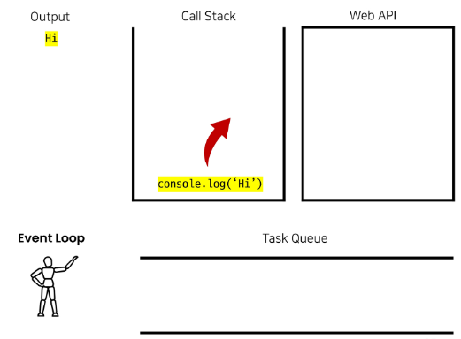

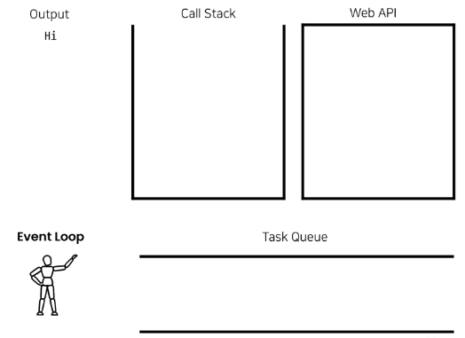

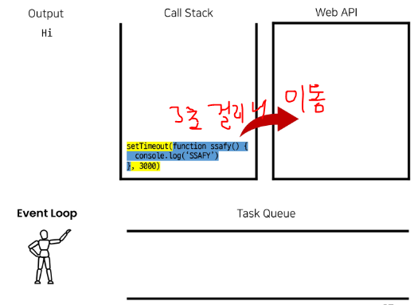

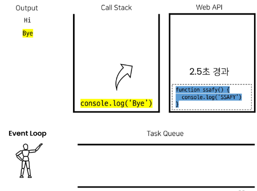

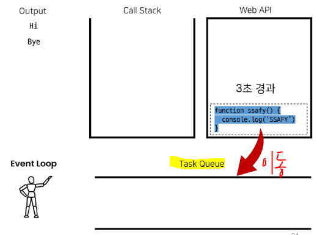

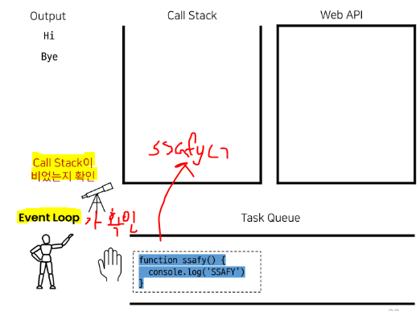

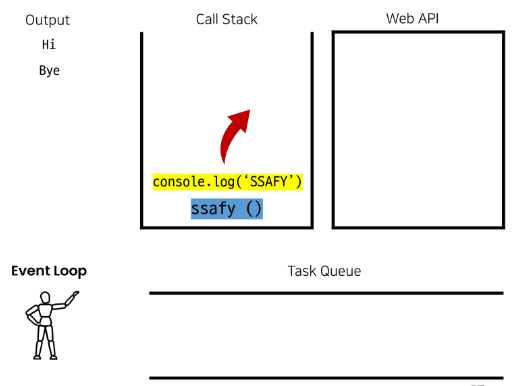

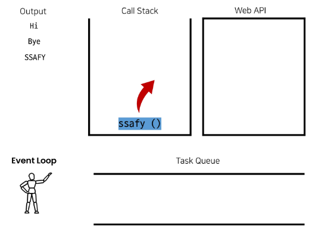

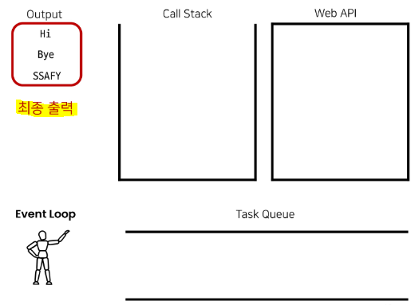

## ▶ 정리

* JavaScript는 한 번에 하나의 작업을 수행하는 Single Thread 언어로 동기적 처리를 하지만, 브라우저 환경(Node.js 등)에서는 Web API에서 처리된 작업이 지속적으로 Task Queue를 거쳐 Event Loop에 의해 Call Stack에 들어와 순차적으로 실행됨으로써 비동기 작업이 가능함

# Axios 라이브러리

> JavaScript의 HTTP 웹 통신을 위한 라이브러리

* node 환경은 npm을 이용해서 설치 후 사용

* browser 환경은 CDN을 이용해서 사용

* **Django REST API로 요청을 보내서 데이터를 받아온 후 처리할 수 있음!**

## ▶ Axios 기본 구조

```javascript
<script src="https://cdn..."></script>
<script>
  axios.get('')
    .then()
    .catch()
</script>
```

* `get`, `post` 등 여러 method 사용 가능

* **`.then`을 이용해서 성공하면 수행할 로직을 작성**

* **`.catch`를 이용해서 실패하면 수행할 로직을 작성**

## ▶ 고양이 사진 가져오기

```python
# python 으로 가져오기 = 1 > 2 > 3 순
import requests 

print('고양이는 야옹')

cat_image_search_url = 'https://api.thecatapi.com/v1/images/search'
response = requests.get(cat_image_search_url)

if response.status_code == 200:
    print(response.json())
else: 
    print('실패했다옹')

print('야옹야옹')
```

```javascript
// Axios로 요청(비동기) = 1 > 3 > 2 순
<body>
  <button>야옹아 이리온</button>

  <script src="https://cdn.jsdelivr.net/npm/axios/dist/axios.min.js"></script>
  <script>
    console.log('고양이는 야옹')
    const catImageSearchURL = 'https://api.thecatapi.com/v1/images/search'
    // const btn = document.querySelector('button')

    // btn.addEventListener('click', function () {
      axios.get(catImageSearchURL)
        .then((response) => {
          // imgElem = document.createElement('img')
          // imgElem.setAttribute('src', response.data[0].url)
          // document.body.appendChild(imgElem)
        })
        .catch((error) => { 
          console.log('실패했다옹')
        })
        console.log('야옹야옹') 
    // })
  </script>
</body>
```

## ▶ 결과 비교 (고양이 사진 가져오기)

* 동기식(python) 코드는 위에서부터 순서대로 처리가 되기 때문에 첫 번째 print가 출력되고 이미지를 가져오는 처리를 기다렸다가 다음 print가 출력

* 반면에 비동기식(JavaScript)는 바로 처리가 가능한 작업(console.log)은 바로 처리하고, 오래 걸리는 작업인 이미지를 요청하고 가져오는 일은 요청을 보내 놓고 기다리지 않고 다음 코드로 진행 후 완료가 된 시점에 결과 출력이 진행됨

# Callback

## ▶ 비동기 처리의 단점

* **비동기 처리의 핵심은 Web API로 들어오는 순서가 아니라 <mark>작업이 완료되는 순서에 따라 처리한다</mark>는 것❗**

* *그런데 이는 개발자 입장에서 코드의 실행 순서가 불명확하다는 단점이 존재*
  
  * **<mark>실행 결과를 예상하면서 코드를 작성할 수 없음</mark>**
  
  * **콜백함수를 사용하면 해결 가능❗**

## ▶ Callback Function

> **<mark>다른 함수의 인자로 전달</mark>되는 함수를 콜백 함수라고 함**

* 비동기에만 사용되는 함수가 아니며, 동기, 비동기 상관없이 사용 가능

* **시간이 걸리는 <mark>비동기 작업이 완료된 후 실행할 작업을 명시하는 데 사용</mark>되는 콜백 함수를 비동기 콜백(Asynchronous callback)이라 부름**
  
  * 발생하는 시점(조건)이 있는 함수

## ▶ 콜백 함수를 사용하는 이유

* 명시적인 호출이 아닌 **특정한 조건 혹은 행동에 의해 호출되도록 작성**할 수 있음

* "요청이 들어오면", "이벤트가 발생하면", "데이터를 받아오면" 등의 조건으로 이후 로직을 제어할 수 있음

* **<mark>비동기 처리를 순차적으로 동작할 수 있게 함</mark>❗**

* 비동기 처리를 위해서는 콜백 함수의 형태가 반드시 필요

## ▶ 콜백 지옥

* **콜백 함수는 연쇄적으로 발생하는 <mark>비동기 작업을 순차적으로 동작</mark>할 수 있게 함**

* 보통 어떤 기능의 실행 결과를 받아서 다른 기능을 수행하기 위해 많이 사용하는데, 이 과정을 작성하다 보면 비슷한 패턴이 계속 발생하게 됨
  
  * 예) A를 처리해서 결과 나오면 첫 번째 callback 함수 실행하고 첫 번째 callback 함수 종료되면, 두 번째 callback 함수를 실행...... (무한 루프)

* *코드의 가독성을 해치고 유지 보수가 어려워짐*

# Promise (프로미스)

> **Callback Hell 문제를 해결하기 위해 등장한 비동기 처리를 위한 객체**

* "앞에 작업이 끝나면 실행 시켜줄게" 라는 약속(promise) = 순서 보장

* **<mark>비동기 작업의 완료 또는 실패를 나타내는 객체</mark>**

* **Promise 기반의 클라이언트가 바로 이전에 사용한 `Axios` 라이브러리**❗
  
  * `console.log(axios.get(catImageSearchURL))` = Promise Object
    
    * `<Promise Object>.then(성공 시 실행).get(실패 시 실행)`
  
  * "Promise based HTTP client for the browser and node.js"
  
  * **성공에 대한 약속 `then(callback)`**
    
    * 요청한 작업이 성공하면 callback 실행
    
    * **<mark>callback은 이전 작업의 성공 결과를 인자로 전달 받음</mark>**
  
  * **실패에 대한 약속 `catch(callback)`**
    
    * **`then()`이 하나라도 실패하면 callback 실행**
    
    * **<mark>callback은 이전 작업의 실패 객체를 인자로 전달 받음</mark>**

* `then`과 `catch` 모두 항상 promise 객체를 반환 = <mark>**계속해서 chaining을 할 수 있음**</mark>❗

* **<mark>`axios`로 처리한 비동기 로직이 항상 promise 객체를 반환</mark>**
  
  * 그래서 then을 계속 이어 나가면서 작성 가능
  
  * `axios.get('요청할 URL').then(...).then(...).catch(...)`

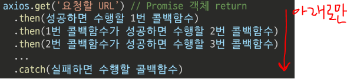

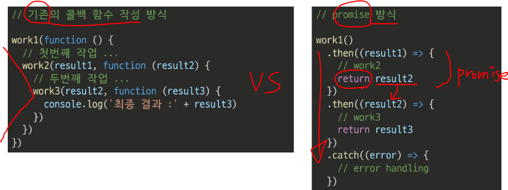

## ▶ Promise가 보장하는 것(vs 비동기 콜백)

> Promise가 보장하는 특징

* *① callback 함수는 JavaScritp의 Event Loop가 현재 실행 중인 Call Stack을 완료하기 이전에는 절대 호출되지 않음*
  
  * **<mark>Promise callback 함수는 Event Queue에 배치되는 엄격한 순서로 호출됨</mark>**

* ② 비동기 작업이 성공하거나 실패한 뒤에 `.then()` 메서드를 이용하여 추가한 경우에도 ① 과 똑같이 동작

* **③ `.then()`을 여러 번 사용하여 여러 개의 callback 함수를 추가할 수 있음 = Chaining❗**
  
  * 각각의 callback은 주어진 순서대로 하나하나 실행하게 됨
  
  * Chaning은 Promise의 가장 뛰어난 장점

# AJAX

> Asynchronous JavaScript And XML (비동기식 Javascript와 XML)

* 비동기 통신을 이용하면 **화면 전체를 새로고침 하지 않아도 서버로 요청을 보내고, 데이터를 받아 화면의 일부분만 업데이트 가능**

* 이러한 비동기 웹 통신을 위한 라이브러리 중 하나가 Axios

## ▶ AJAX 특징

* **페이지 전체를 reload(새로고침)없이 서버에 요청**

* **서버로부터 응답(데이터)을 받아 작업을 수행**

# 비동기(Async) 적용하기

> 팔로우 & 좋아요 기능을 비동기 적용

## ▶ 팔로우(follow)

* 각각의 템플릿에서 script 코드를 작성하기 위한 block tag 영역 작성 & axios CDN 작성

```html
<!-- base.html -->
<body>
  
    <script src="https://cdn.jsdelivr.net/npm/axios/dist/axios.min.js"></script>
    <script>
    </script>
  
</body>
</html>
```

* 기존의 form 요소를 선택하기 위해 id 속성 지정 및 선택

* **불필요해진 action과 method 속성은 삭제 (요청은 axios로 대체되기 때문!)**

```html
<!-- accounts/profile.html -->
<form id="follow-form">
...
</form>
```

```javascript
// accounts/profile.html
<script>
  const form = document.querySelector('#follow-form')
</script>
```

* **form 요소에 이벤트 핸들러 작성 및 submit 이벤트 취소**

```javascript
<script>
  const form = document.querySelector('#follow-form')
  form.addEventListener('submit', function (event) {
    event.preventDefault()
  }
</script>
```

* **axios 요청**
  
  * 1️⃣ **url에 작성할 user pk는 어떻게 가져올까?**
    
    * url에 작성할 user pk는 HTML 에서 JavaScript로 가져와야 함
    
    * **HTML에서 불러올 때 `event.target.dataset.<명칭>` 으로 작성**❗
      
      * 명칭에 `-` 있는 경우 자동으로 camelCase 로 작성됨

```html
<form id="follow-form" data-user-id="{{ person.pk }}">
...
</form>
```

```javascript
<script>
  const form = document.querySelector('#follow-form')
  form.addEventListener('submit', function (event) {
    event.preventDefault()

    const userId = event.target.dataset.userID

    axios({
      method: 'post',
      url: `/acoounts/${userId}/follow/`,
    })
  }
</script>
```

* 2️⃣ **csrftoken은 어떻게 보낼까?**
  * hidden 타입으로 숨겨져있는 csrf값을 가진 input 태그를 선택해야 함
  * Django 공식 문서에서 코드 확인 가능함

```javascript
<script>
  const form = document.querySelector('#follow-form')
  const csrftoken = document.querySelector('[name=csrfmiddlewaretoken]').value
</script>
```

```javascript
<script>
  const form = document.querySelector('#follow-form')
  form.addEventListener('submit', function (event) {
    event.preventDefault()

    const userId = event.target.dataset.userID

    axios({
      method: 'post',
      url: `/acoounts/${userId}/follow/`,
      headers: {'X-CSRFToken': csrftoken,}
    })
  }
</script>
```

* **팔로우 버튼을 토글하기 위해서는 현재 팔로우가 된 상태인지 여부 확인이 필요**

* **axios 요청을 통해 받는 response 객체를 활용해 view 함수를 통해서 팔로우 여부를 파악할 수 있는 변수를 담아 JSON 타입으로 응답하기**

```python
# accounts/views.py
from django.http import JsonResponse

@require_POST
def follow(request, user_pk):
    if request.user.is_authenticated:
    User = get_user_model()
    me = request.user
    you = User.objects.get(pk=user_pk)
    if me != you:
        if you.followers.filter(pk=me.pk).exists():
            you.followers.remove(me)
            is_followed = False
        else:
            you.followers.add(me)
            is_followed = True
        data = {
            'is_followed': is_followed,
        }
        return JsonResponse(data)
    return redirect('accounts:profile', you.username)
return redirect('accounts:login')
```

* view 함수에서 응답한 is_followed를 사용해 버튼 토글하기

```javascript
<script>
  const form = document.querySelector('#follow-form')
  form.addEventListener('submit', function (event) {
    event.preventDefault()

    const userId = event.target.dataset.userID

    axios({
      method: 'post',
      url: `/acoounts/${userId}/follow/`,
      headers: {'X-CSRFToken': csrftoken,}
    })
    .then(function (response) {
      const isFollowed = response.data.is_followed
      const followBtn = document.querySelector('#follow-form > input[type=submit]')
      if (isFollowed) {
        followBtn.value = '언팔로우'
      } else {
        followBtn.value = '팔로우'
      }
    })
</script>
```

## ▶ 팔로워 & 팔로잉 수 비동기 적용

* **해당 요소를 선택할 수 있도록 span 태그와 id 속성 작성**

```html

  <h1>{{ person.username }}님의 프로필</h1>
  <div>
    : <span id="followers-count">{{ person.followers.all|length }}</span> /
    : <span id="followings-count">{{ person.followings.all|length }}</span>
  </div>
```

```javascript
<script>
  const form = document.querySelector('#follow-form')
  form.addEventListener('submit', function (event) {
    event.preventDefault()

    const userId = event.target.dataset.userID

    axios({
      method: 'post',
      url: `/acoounts/${userId}/follow/`,
      headers: {'X-CSRFToken': csrftoken,}
    })
    .then(function (response) {
      const isFollowed = response.data.is_followed
      const followBtn = document.querySelector('#follow-form > input[type=submit]')
      if (isFollowed) {
        followBtn.value = '언팔로우'
      } else {
        followBtn.value = '팔로우'
      }
      const followersCountTag = document.querySelector('#followers-count')
      const followingsCountTag = document.querySelector('#followings-count')
    })
</script>
```

* **팔로워, 팔로잉 인원 수 연산은 view 함수에서 진행하여 결과를 응답으로 전달**

```python
# accounts/views.py
from django.http import JsonResponse

@require_POST
def follow(request, user_pk):
    if request.user.is_authenticated:
    User = get_user_model()
    me = request.user
    you = User.objects.get(pk=user_pk)
    if me != you:
        if you.followers.filter(pk=me.pk).exists():
            you.followers.remove(me)
            is_followed = False
        else:
            you.followers.add(me)
            is_followed = True
        data = {
            'is_followed': is_followed,
            'followers_count': you.followers.count(),
            'followings_count': you.followings.count(),
        }
        return JsonResponse(data)
    return redirect('accounts:profile', you.username)
return redirect('accounts:login')
```

* **view 함수에서 응답한 연산 결과를 사용해 각 태그의 인원 수 값 변경하기**

```javascript
<script>
  const form = document.querySelector('#follow-form')
  form.addEventListener('submit', function (event) {
    event.preventDefault()

    const userId = event.target.dataset.userID

    axios({
      method: 'post',
      url: `/acoounts/${userId}/follow/`,
      headers: {'X-CSRFToken': csrftoken,}
    })
    .then(function (response) {
      const isFollowed = response.data.is_followed
      const followBtn = document.querySelector('#follow-form > input[type=submit]')
      if (isFollowed) {
        followBtn.value = '언팔로우'
      } else {
        followBtn.value = '팔로우'
      }
      const followersCountTag = document.querySelector('#followers-count')
      const followingsCountTag = document.querySelector('#followings-count')
      followersCountTag.innerText = followersCount
      followingsCountTag.innerText = followingsCount
    })
</script>
```

### 📌 [참고] data attributes

> **사용자 지정 데이터 특성을 만들어 임의의 데이터를 HTML과 DOM 사이에서 교환할 수 있는 방법**

* `data-test-value`라는 이름의 특성을 지정했다면 JavaScript에서는 `element.dataset.testValue` 로 접근할 수 있음

## ▶ 좋아요(like)

> 좋아요 비동기 적용은 **<mark>"팔로우와 동일한 흐름 + forEach() + querSelectorAll()"</mark>**

* dataset
  
  * HTML 속성으로 특정값을 전달하고 싶을 때 사용
  
  * `.dataset.변수명`

* 정리
  
  1. 내가 누른 버튼의 DOM 조작
     
     form / addListener / dataset / id,
  
  2. axios 요청으로 좋아요 보내기
     
     url, method 설정 요청 -> 오류 발생(403 Forbidden Error)
     
     csrf_token을 얻기 위해 으로 생성된 값을 추출
     
     (속성 선택자=querySelector로 [name=csrfmiddlewaretoken] 요소를 선택해서 value 값을 추출) -> headers 라는 곳, X-CSRF Token 
     
     url + method + csrf_token 까지 같이 보내야 전달됨
  
  3. 응답받은 데이터를 통해 프론트를 수정

```html
<!-- articles/index.html -->

```

```python
# articles/views.py

```

```javascript
// articles/index.html

```
