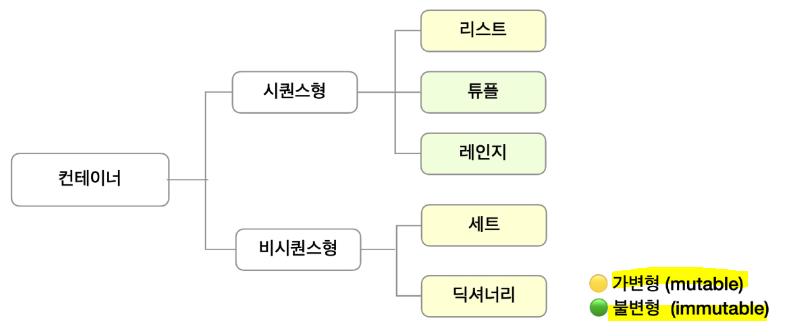

# ✅ 컨테이너

- 여러 개의 값(데이터)을 담을 수 있는 것(객체)으로, **서로 다른 자료형을 저장할 수 있음**
  - ex. list
- 분류 - Ordered vs Unordered **(순서가 있다 != 정렬되어 있다)**
  1. **시퀀스형 - 순서가 있는 데이터 : list(mutable), tuple(immutable), range(immutable), string(immuatble)**
  2. **비시퀀스형 - 순서가 없는 데이터 : set(mutable), dictionary(mutable)**



## 1️⃣ list (mutable)

- **여러 개의 값을 순서가 있는 구조로 저장하고 싶을 때 사용**
  
  | 순서  | 중복  | 수정  | 삭제  |
  |:---:|:---:|:---:|:---:|
  | O   | O   | O   | O   |

- 사용법 - **`[]` or `list()`**
  
  - **모든 자료형을 저장할 수 있으며, 리스트 안에 리스트**도 넣을 수 있음
  - **생성된 이후 내용 변경 가능**

- 인덱스를 통해 접근 가능 - **`list[i]`**

## 2️⃣ tuple (immutable)

- 여러 개의 값을 순서가 있는 구조로 저장하고 싶을 때 사용
  
  | 순서  | 중복  | 수정  | 삭제  |
  |:---:|:---:|:---:|:---:|
  | O   | O   | X   | X   |
  
  ### 📌 list 와 차이점?
  
  * **생성 후 담고 있는 값의 변경이 불가능**

- 사용법 - **`()` or `tuple()`**

- **인덱스를 통해 접근 가능** - `tuple[i]`

- **<u>원소가 하나인 경우, 쉼표를 꼭 붙여야 함!</u>** `tuple_a = (1,)`

- 튜플 대입
  
  - 우변의 값을 좌변의 변수에 한 번에 할당하는 과정
    
    ```python
    x, y = 1, 2
    print(x, y) # 1, 2
    
    # 위 내용도 실제로는 tuple로 처리
    x, y = (1, 2)
    print(x, y) # 1, 2
    ```

## 3️⃣ range (immutable)

- 숫자의 시퀀스를 나타내기 위해 사용 - **주로 반복문과 함께 사용**

- 사용법 - `range(n)` : 0부터 n-1까지의 숫자 시퀀스
  
  ```python
  range(n, m) : n부터 m-1까지의 숫자 시퀀스
  range(n, m, s) : n부터 m-1까지 s만큼 증가시키는 숫자 시퀀스
  ```

## 4️⃣ set (mutable)

- 중복되는 요소가 없이, 순서에 상관없는 데이터들의 묶음
  
  | 순서  | 중복  | 추가  | 삭제  |
  |:---:|:---:|:---:|:---:|
  | X   | X   | O   | O   |
  
  - 데이터의 중복을 허용 ❌ = **중복되는 원소가 있다면 하나만 저장**
  - **순서가 없기 때문에 인덱스를 이용한 접근 불가능**

- 수학에서의 집합을 의미하므로 <mark>**집합 연산이 가능**</mark>

- 사용법 - `{}` or `set()`
  
  - 빈 set을 만드려면 **반드시 set()을 사용**해야 함. `{}` 사용 시 dictionary 선언임

- set 연산자
  
  | 합집합  | 교집합 | 차집합 | 대칭차집합 |
  |:----:|:---:|:---:|:-----:|
  | `\|` | `&` | `-` | `^`   |

## 5️⃣ dictionary (mutable)

- key & value 쌍으로 이뤄진 자료형
  
  | 순서  | key 중복 | 수정  | 삭제  |
  |:---:|:------:|:---:|:---:|
  | X   | X      | O   | O   |

- **key는 변경 불가능한 데이터(immutable)만 활용** 
  
  - **`string, int, float, boolean, tuple, range`**

- value는 어떤 형태든 상관없음

- 사용법 - `{}` or `dict()`

- key를 통해 value에 접근

# ✔ 형 변환(Typecasting)

- 데이터 형태를 서로 변환하는 것
  
  1. 암시적 형 변환(implicit) - 파이썬 내부적으로 자료형을 표현 범위가 큰 형태로 변환
     
     ```python
     print(True + 3) # 4
     print(3 + 5.0) # 8.0
     ```
  
  2. 명시적 형 변환(explicit) - 사용자가 특정 함수를 활용하여 의도적으로 형 변환
     
     ```python
     print(int('3') + 4) # 7
     print(float('3')) # 3.0
     print(float('3/4') + 5.3) # ValueError (float 형식이 아니면 형 변환 불가)
     ```

- **컨테이너별 형 변환**
  
  |            | string | list    | tuple   | range | set     | dictionary |
  |:----------:|:------:|:-------:|:-------:|:-----:|:-------:|:----------:|
  | string     | -      | O       | O       | X     | O       | X          |
  | list       | O      | -       | O       | X     | O       | X          |
  | tuple      | O      | O       | -       | X     | O       | X          |
  | range      | O      | O       | O       | -     | O       | X          |
  | set        | O      | O       | O       | X     | -       | X          |
  | dictionary | O      | O(key만) | O(key만) | X     | O(key만) | -          |

# ✔ 슬라이싱

- **인덱스와 콜론(:)을 사용**하여 문자열의 특정 부분만 잘라낼 수 있다.

- 사용법 - `sequence[start:end[:step]]`

- **앞 인덱스에 해당하는 문자는 포함**되지만 **뒤 인덱스에 해당 문자는 미포함**❗
  
  ```python
  print([1,2,3,5][1:4]) # [2,3,5]
  print((1,2,3)[:2]) # (1,2)
  print(range(10)[5:8]) # range(5, 8)
  print('abcd'[2:4]) # cd
  ```

- 시퀀스를 k간격으로 슬라이싱
  
  ```python
  print([1,2,3,5][0:4:2]) # [1,3]
  print((1,2,3,5)[0:4:2]) # (1,3)
  print(range(10)[1:5:3]) # range(1, 5, 3)
  print('abcdefg'[1:3:2]) # b
  ```
