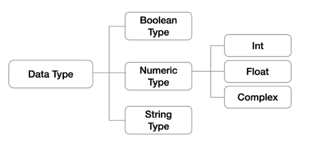

# 데이터와 자료형

## 파이썬을 배우는 이유

1. **코딩 테스트(알고리즘)에 유리** - 변칙적인 유형에 대응하기 쉽고, 문법도 쉬움
2. 구현 기반의 코딩 테스트에 유리 - **유용한 라이브러리 중 최소한만 사용**해 프로그램을 개발할 수 있음
3. 가장 인기 많은 언어 - AI 개발, 데이터 분석, 웹 프로그래밍 등 활용 분야가 급증

## 파이썬의 특징

1. 배우기 쉬움 - 다른 프로그래밍 언어보다 문법이 간결하고, 유연함 (변수에 별도의 타입 저장이 필요 없음)
2. 인터프리터 언어(Interpreter) - **코드를 기계어로 변환할 때 통역하듯이 1줄씩 변환**
3. 객체지향 언어(OOP) - 모든 것이 객체로 구현되어 있음

## IDE 기능

> Visual Studio Code, Pycharm 등

| 단축키                 | 기능                             |
|:-------------------:|:------------------------------:|
| `Alt + Ctrl + 화살표`  | 멀티 커서를 위/아래로 넓힌다.              |
| `Ctrl + D`          | 선택된 문자열을 선택에 추가(특정 단어 replace) |
| `Alt + 화살표`         | 줄 바꿈                           |
| `Alt + shift + 화살표` | 줄 복사                           |

## 기초 문법

* 들여쓰기 (`Tab키`)
  * 문장을 구분할 때 사용
  * 스페이스 키 4칸 or 1탭
* 주석 (`#`, `'''`, `"""`)
  * 코드를 이해하기 쉽게하여 분석 및 수정에 용이
  * 코드에 영향을 주지 않으며, 오로지 개발자를 위한 것
  * 주석을 다는 습관이 매우 중요!

# ✔ 변수(Variable)

* **데이터를 저장하기 위해서 사용**

* 변수를 사용하면 **복잡한 값들을 쉽게 사용할 수 있음**
  
  * **추상화(변수를 사용해야 하는 이유)** - 일일이 값을 넣는 것이 불편 & 코드를 알아보기 힘듦 & 수정하기도 어려움 => 코드 가독성 증가 & 의미 단위로 작성 가능 & 수정 용이

* 동일 변수에 다른 데이터를 언제든 할당(저장)할 수 있음

* **변수의 할당** (`=`)
  
  * 같은 값을 동시에 할당 가능 & 다른 값을 동시에 할당 가능
    
    ```python
    a = b = 2000
    print(a, b)
    
    c, d = 2000, 3000
    print(c, d)
    ```
  
  ## 📍 **object references - 변수 값이 할당되는 원리**
  
    ① type 에 맞는 object 생성 - 자료형
  
    ② 값(데이터) 생성
  
    ③ 콘솔을 출력 - print

* 같은 object 참조 - 최적화(효율, 속도, 생산성)를 위해!
    `m = 80, n = 80 # id 값은 둘 다 동일(1개)`

* **각 변수의 값을 바꿔서 저장하기**
  
  * 방법1) 임시 변수 활용
    
    ```python
    x, y = 10, 20
    temp = x
    x = y
    y = temp
    print(x, y)
    ```
  
  * 방법2) Pythonic!
    
    ```python
    x, y = 10, 20
    y, x = x, y
    print(x, y)
    ```
    
    ## 📌 식별자 - 변수 이름 규칙

* 변수의 이름은 **영문 알파벳, 언더스코어(_), 숫자**로만 구성

* **첫 글자에 숫자가 올 수 없음**

* 길이 제한이 없고, **대소문자를 구별**

* **예약어는 변수 이름으로 사용할 수 없음!**
  
  * 예약어 예시) `False, None, True, if, and, as, else, import, print 등...`

* **내장 함수나 모듈 등의 이름도 사용할 수 없다.**

# ✔ 자료형

* 자료형 분류 - 다양한 종류의 값(데이터)를 쓸 수 있음
  
  

* **문자열 1과 숫자 1은 다르다.**
  
  ## 1️⃣ 수치형
  
  > **사칙연산 가능, 여러 진수로 표현 가능**
  
  * `int`(정수), `float`(실수), `complex`(복소수)
    
    ### 📌 실수(float) 연산 시 주의할 점(**부동 소수점**)❗
    
    * 원인? 컴퓨터는 2진수를 사용하고 사람은 10진수를 사용하기 때문
    
    * **10진수 0.1은 2진수로 표현하면 무한대로 반복**
    
    * 사람이 사용하는 10진법의 근사값만 표시
    
    * 해결책 - 임의의 매우 작은 수보다 작은지를 확인 or <mark>**math 모듈 내 `isclose()` 함수를 활용**</mark>
      
      ```python
      a = 3.2 - 3.1
      b = 1.2 - 1.1
      
      # 1. 임의의 작은 수 활용
      print(abs(a - b) <= 1e-10
      # 2. python 3.5 이상 math 모듈 사용
      import math
      print(math.isclose(a,b))
      ```
    
    ## 2️⃣ 문자열
    
    > **모든 문자는 string 타입**
  
  * 문자열은 `''` or `""`를 활용하여 표기
  
  * 특징 - immutable & Iterable
    
    ### 📌 **Escape sequence (`\`)**
    
    >  **역슬래시 뒤에 특정 문자**가 와서 특수한 기능을 하는 문자 조합
    
    | 예약 문자 | 내용(의미) |
    |:-----:|:------:|
    | `\n`  | 줄 바꿈   |
    | `\t`  | 탭      |
    | `\0`  | Null   |
    | `\\`  | \      |
  
  * **문자열 연산**
    
    * 덧셈 - `print("Hello" + "World") # HelloWorld`
    
    * 곱셉 - `print("Python" * 3) # PythonPythonPython`
    
    ### 📌 String Interpolation(**문자열을 변수로 활용하는 법**)
    
    * **f-stings**
      
      ```python
      name = 'Kim'
      score = 4.5
      print(f'Hello, {name}! 성적은 {score}') # Hello, Kim! 성적은 4.5 
      ```
  
  ## 3️⃣ 불린형
  
  > **논리 자료형으로 참과 거짓을 표현하는 자료형**
  
  - **Ture or False** 를 값으로 가짐
  - 비교/논리 연산에서 활용됨

# ✔ 연산자

## 1️⃣ 산술 연산자

* 기본적인 사칙연산 및 수식 계산 가능
  
  | 연산자  | 내용   |
  |:----:|:----:|
  | `+`  | 덧셈   |
  | `-`  | 뺄셈   |
  | `*`  | 곱셈   |
  | `/`  | 나눗셈  |
  | `//` | 몫    |
  | `%`  | 나머지  |
  | `**` | 거듭제곱 |

* 연산자의 우선순위 - 기본적으로 수학에서의 우선순위와 똑같음

## 2️⃣ 비교 연산자

* 수학에서 등호, 부등호와 동일한 개념

* **주로 조건문에서 사용**되며 값을 비교할 때 사용 => **결과는 True or False 값을 리턴**
  
  | 연산자      | 내용              |
  |:--------:|:---------------:|
  | `==`     | 같음              |
  | `!=`     | 같지 않음           |
  | `is`     | 객체 아이덴티티(OPP)   |
  | `is not` | 객체 아이덴티티가 아닌 경우 |

## 3️⃣ 논리 연산자

* 여러 조건이 있을 때,
  
  * `and` - 모든 조건을 만족
  * `or` - 여러 조건 중 하나만 만족해도 가능

* 일반적으로 비교 연산자와 함께 사용
  
  | 연산자       | 내용                           |
  |:---------:| ---------------------------- |
  | `A and B` | A와 B 모두 True = True          |
  | `A or B`  | A와 B 모두 False = False        |
  | `Not`     | True => False, False => True |
  
  ### 📌 주의할 점
  
  * `0`, `0.0`, `()`, `[]`, `{}`, `None`, `''`, `""` => **False 로 취급**
  * 논리 연산자도 우선순위 존재
    * **not, and, or 순으로 우선순위가 높음**
  
  ### 📌 단축 평가
  
  > **결과가 확실한 경우 두 번째 값은 확인하지 않고 첫 번째 값을 반환**‼
  
  * `and` 연산 - <mark>**첫 번째 값이 False이면 무조건 False**</mark> => **첫 번째 값 반환**
  
  * `or` 연산 - <mark>**첫 번째 값이 True면 무조건 True**</mark> => **첫 번째 값 반환**
    
    => **조건문에서 뒷 부분을 판단하지 않아도 되기 때문에 속도가 향상**❗
    
    ```python
    print(3 and 5) # 5, print(3 and 0) # 0,
    print(0 and 3) # 0, print(0 and 0) # 0,
    print(5 or 3) # 5, print(3 or 0) # 3,
    print(0 or 3) # 3, print(0 or 0) # 0,
    
    a = 5 and 4
    print(a) # 4
    
    b = 5 or 3
    print(b) # 5
    
    c = 0 and 5
    print(c) # 0
    
    d = 5 or 0
    print(d) # 5
    ```

## 4️⃣ 연산자 우선순위

0. `()`을 통한 grouping

1. Slicing

2. Indexing

3. ** (제곱연산자)

4. `+`, `-` (부호)

5. `*`, `/`, `%`

6. `+`, `-` (산술연산자)

7. `in`, `is` (비교연산자)

8. `not`

9. `and`

10. `or`
