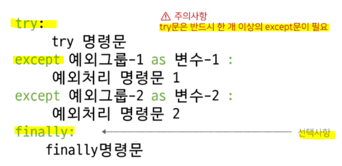

# 에러와 예외 처리

## 1️⃣ 디버깅

> 잘못된 프로그램을 수정하는 것을 디버깅(de + bugging)

* 에러 메시지가 발생하는 경우 - 해당하는 위치를 찾아 메시지를 해결

* **로직 에러가 발생하는 경우 - 명시적인 에러 메시지 없음**

## 2️⃣ 에러와 예외

**① 문법 에러(Syntax Error)**

* 파이썬은 위에서부터 한 줄씩 읽어나가기 때문에 먼저 에러가 발생한 곳에 `^` 표시

* **종류**
  
  * `Invalid syntax` - 문법 오류
  
  * `assign to literal` - 잘못된 할당
  
  * `EOL (End of Line)` - 괄호 안닫은 경우
  
  * `EOF (End of File)` - 괄호 안닫은 경우

**② 예외(Exception)**

* 실행 도중 예상치 못한 상황을 맞이하여 프로그램 실행을 멈춤 - 문법적으로 올바르더라도 발생하는 에러 = 실행 중에 감지되는 에러

* **사용자 정의 예외를 만들어 관리할 수 있음**

* **종류**
  
  * `ZeroDivisionError` - 0 으로 나누려고 할 때 발생
  
  * `NameError` - namespace 상에 이름이 없는 경우
  
  * `TypeError` - 서로 다른 자료형끼리 연산 및 형변환 등이 불가능한 경우
    
    * argument 누락 / argument 개수 초과 / argument type 불일치
  
  * `Value Error` -  타입은 올바르나 값이 적절하지 않거나 없는 경우
  
  * `IndexError` - 인덱스가 존재하지 않거나 범위를 벗어나는 경우
  
  * `KeyError` - 해당 키가 존재하지 않는 경우
  
  * `ModuleNotFoundError` - 사용하려는 모듈을 찾을 수 없는 경우
  
  * `importError` - Module은 있으나 존재하지 않는 클래스나 함수를 가져오는 경우
  
  * `Keyboardinterrupt` - 임의로 프로그램을 종료한 경우
  
  * `IndentationError` - Indentation(들여쓰기) 이 적절하지 않는 경우

## 3️⃣ 예외처리

* **try문**
  
  * 오류가 발생할 가능성이 있는 코드를 실행
  
  * **예외가 발생하지 않으면 except 없이 실행 종료**❗

* **except 문**
  
  * **예외가 발생하면 except 문 실행**❗
  
  * 예외 상황을 처리하는 코드를 받아서 적절한 조치를 취함

* **else 문**
  
  * **try 문에서 예외가 발생하지 않으면 실행**❗

* **finally 문**
  
  * **예외 발생 여부와 관계없이 무조건 실행**

* **순차적으로 수행**됨으로, 가장 작은 범주부터 예외 처리를 진행해야 한다❗
