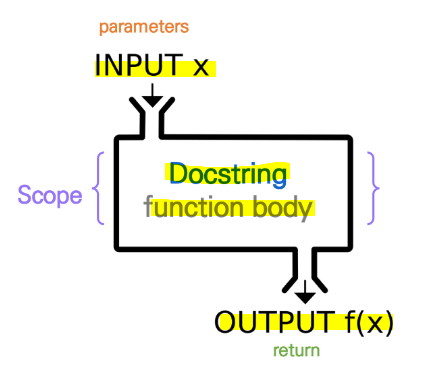
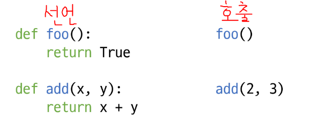
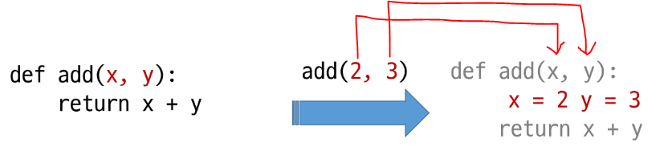
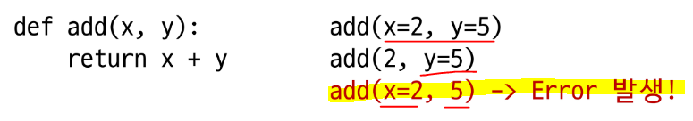
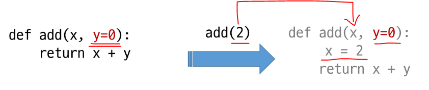
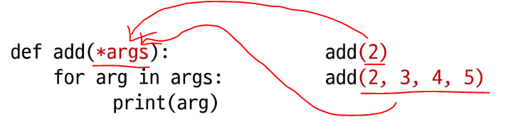

# 함수

> **특정한 기능을 하는 코드의 묶음**
> 
> 특정 코드를 매번 다시 작성하지 않고, **필요시에만 호출하여 사용!**

- **함수를 사용하는 이유**
  
  - **기능을 분해하고 재사용 가능하게 만든다**
    
    - **분해 (decomposition) - 간결하고, 이해하기 쉽다!**
    
    - **추상화 (Abstraction) - 복잡한 내용을 모르더라도 사용할 수 있다!**

- 종류
  
  1. **내장함수** - **파이썬에 기본적으로 포함된 함수**
  
  2. **외장함수** - import 문을 통해 사용하며, 외부 라이브러리에서 제공하는 함수
  
  3. **사용자 정의함수** - 사용자가 직접 만드는 함수

## 1️⃣ **기본 구조**



**① 선언과 호출(define & call)** - 생성과 사용

- `def <함수명()>` 으로 함수 선언

- `parameter`를 넘겨줄 수 있음

- **동작 후에 `return`을 통해 결과값을 반환하며 종료된다**❗



② 입력(input)

③ 문서화(docstring) - 함수에 대한 설명

**④ 범위(scope)**

⑤ 결과값(output)

* 값에 따른 함수의 종류
  
  * Void function
    
    * return 값이 없는 경우, None 을 반환하고 종료
    
    * ex. `print()` - 값을 출력은 하지만 반환하진 않는다.
  
  * Value returning function
    
    * 함수 실행 후 `return` 문을 통해 값을 반환
    
    * <mark>**return을 하게 되면 값을 반환 후 함수가 바로 종료**</mark>

## 2️⃣ **print vs return**❗❗

- **print - <mark>호출될 때마다 값을 출력!</mark> (<u>주로 테스트를 위해 사용</u>)**
  
  - 값을 반환하지 않으므로 함수 종료 시 변수에 담아 사용해도 None

- **return - <mark>데이터 처리를 위해 사용!</mark>** (변수에 넣어 출력하면 결과값이 나옴)
  
  - **return은 항상 하나의 값만을 반환!** => 값 반환 후 함수가 바로 종료
  
  - return이 없다면 None

- **두 개 이상의 값을 반환하려면**❓
  
  - <mark>**반환 값으로 튜플(tuple)을 사용**</mark>

```python
def minus_and_product(x, y):
    return x - y, x * y

y = minus_and_product(4, 5)
print(y)    # (-1, 20)
print(type(y))    # tuple
```

```python
word_list = ['우영우', '기러기', '별똥별', '파이썬']
def is_palindrome(word_list):
    palindrome_list = []
    for word in word_list:
        if word == word[::-1]:
            palindrome_list.append(word)
    return palindrome_list
print(is_palindrome(word_list))
# ['우영우', '기러기', '별똥별']
```

## 3️⃣ **parameter vs argument**

> **parameter** - **함수를 정의(선언)할 때, 함수 내부에서 사용되는 변수**
> 
> **argument** - **함수를 호출할 때, 넣어주는 값**

### ✅ **argument**

> 소괄호 안에 할당 **func_name(argument)**

* **필수 argument** - 반드시 전달되어야 하는 argument

* **선택 argument** - 값을 전달하지 않아도 되는 경우는 기본값이 전달

**① `positional arguments`** - **기본적으로 함수 호출 시 위치에 따라 함수 내에 전달**

 

**② `keyword arguments`** - **직접 변수의 이름으로 특정 argument를 전달**



* ❗ **`keyword argument` 다음에 `positional argument`를 활용할 수 없음** ❗

**③ `default arguments`** - 기본값을 지정하여 함수 호출 시 값을 설정하지 않도록 함!



## 4️⃣ **정해지지 않은 여러 개의 Arguments 처리(가변인자 `*args`)**

> **여러 개의 positional argument를 하나의 필수 parameter로 받아서 사용**

* **몇 개의 positional argument를 받을지 모르는 함수를 정의할 때 유용**



### ✅ **패킹 & 언패킹**

1. **패킹 - 여러 개의 데이터를 묶어서 변수에 할당**
   
   ```python
   numbers = (1, 2, 3, 4, 5)
   print(numbers) # (1, 2, 3, 4, 5)
   ```

2. **언패킹 - 시퀀스 속의 요소들을 여러 개의 변수에 나누어 할당**
   
   - **변수의 개수**와 할당하고자 하는 **요소의 개수가 동일**해야 함!
   
   ```python
   numbers = (1, 2, 3, 4, 5)
   a, b, c, d, e = numbers
   print(a, b, c, d, e) # 1 2 3 4 5
   ```
   
   ```python
   numbers = (1, 2, 3, 4, 5)
   a, b, *rest = numbers
   print(a, b, rest) # 1 2 [3, 4, 5]
   
   a, *rest, e = numbers
   print(rest) # [2, 3, 4]
   ```
   
   - **언패킹 시 왼쪽의 변수에 `*`를 붙이면** 할당하고 남은 요소를 리스트에 담을 수 있음
   
   - **주로 튜플이나 리스트를 언패킹**하는데 사용

```python
def sum_all(*numbers):
    reesult = 0
    for number in numbers:
        result += number
    return result

print(sum_all(1, 2, 3)) # 6
```

## 5️⃣ 가변 키워드 인자 (**kwargs)

> **몇 개의 키워드 인자를 받을지 모르는 함수를 정의할 때 유용**
> 
> `**kwargs`는 **dictionary로 묶여 처리**되며, parameter에 **를 붙여 사용

```python
def print_family_name(father, mother, **pets):
    print('아버지 :', father)
    print('어머니 :', father)
    if pets:
        print('반려동물들..')
        for species, name in pets.items():
            print(f'{species} : {name}')

print_family_name('아부지', '어무이', dog='멍멍이', cat='냥냥이')
```

* 가변 인자(`*args`)와 가변 키워드 인자(`**kwargs`) 동시 사용 가능

```python
def print_family_name(*parents, **pets):
    print('아버지 :', parents[0])
    print('어머니 :', parents[1])
    if pets:
        for title, name in pets.items():
            print(f'{title} : {name}')

print_family_name('아부지', '어무이', dog='멍멍이', cat='냥냥이')
```

# Python의 범위(scope)

> **함수는 코드 내부에 local scope를 생성**하며,
> 
> **그 외의 공간인 global scope**로 구분

1. **global scope**
   
   - **코드 어디에서든 참조**할 수 있는 공간
   
   - **모듈이 호출된 시점 이후 혹은 인터프리터가 끝날 때까지 유지**

2. **local scope**
   
   - 함수가 만든 scope = <mark>**함수 내부에서만 참조 가능**</mark>
   
   - **<u>함수가 호출될 때 생성되고, 함수가 종료될 때까지 유지</u>**

3. **global variable**- global scope에 정의된 변수

4. **local variable** - local scope에 정의된 변수

```python
def func():
    a = 20
    print('local', a) # local 20

func()
print('global', a) # NameError: 'a' is not defined
```

## 1️⃣ 이름 검색 규칙

> 파이썬에서 사용되는 **이름(식별자)들은 이름공간에 저장되어 있음**
> 
> **함수 내에서는 바깥 scope의 변수에 접근 가능하나 수정은 불가능**❗

- **LEGB Rule**
  
  - **L**ocal scope - 지역 범위(현재 작업 중인 범위)
  
  - **E**nclosed scope - 지역 범위 한 단계 위 범위
  
  - **G**lobal scope - 최상단에 위치한 범위
  
  - **B**uilt-in scope - 모든 것을 담고 있는 범위(정의하지 않고 사용 가능)

```python
a = 0
b = 1
def enclosed()
    a = 10
    c = 3
    def local(c):
        print(a, b, c) # 10 1 300
    local(300)
    print(a, b, c) # 10 1 3
enclosed()

print(a, b) # 0 1
```

- **global 문**
  
  - 현재 코드 블록 전체에 적용되며, 나열된 식별자(이름)이 global variable
  
  - **global에 나열된 이름은 같은 코드 블록에서 global 앞에 등장할 수 없음**
  
  - global에 나열된 이름은 parameter, for 루프 대상, 클래스/함수 정의 등으로 사용 ❌

```python
a = 10
def func1():
    global a
    a = 3

print(a) # 10
func1()
print(a) # 3
```

- **nonlocal**
  
  - global을 제외하고 **가장 가까이 둘러싸고 있는 scope의 변수를 연결함**
  
  - <mark>**global과 달리 이미 존재하는 이름과의 연결만 가능**</mark>

```python
x = 0
def func1():
    x = 1
    def func2():
        nonlocal x
        x = 2
    func2()
    print(x) # 2
func1()
print(x) # 0
```

### 📌 함수의 범위 주의❗

* 상위 scope에 있는 변수를 수정하고 싶다면 `global`, `nonlocal` 키워드 활용 가능
  
  * 단, 가급적 사용하지 않는 것을 권장
  
  * **함수로 값을 바꾸고자 한다면 항상 argument로 넘기고 리턴 값을 사용하자**❗

# 함수 응용

## 1️⃣ map

- **사용법 - `map(function, iterable)`**

- 순회 가능한 데이터구조의 **모든 요소에 함수를 적용하고, 그 결과를 map object로 반환**

- 활용 사례

```python
n, m = map(int, input().split())
print(n, m) # 3, 5
print(type(n), type(m)) # int
```

## 2️⃣ filter

- **사용법 - `filter(function, iterable)`**

- 순회 가능한 데이터구조의 **모든 요소에 함수를 적용하고, <mark>그 결과가 True인 것만</mark> filter object로 반환**

```python
def odd(n):
    return n % 2

numbers = [1, 2, 3]
result = filter(odd, numbers)
print(list(result), type(result)) # [1, 3], filter
```

## 3️⃣ zip

- **사용법 - `zip(*iterables)`**

- 복수의 iterable을 모아 **튜플을 원소로 하는 zip object를 반환**

```python
girls = ['jane', 'ashley']
boys = ['justin', 'eric']
pair = zip(girs, boys)

print(list(pair), type(pair)) # [('jane', 'justin), ('ashley', 'eric')]
```

## 4️⃣ lambda

- **사용법 - `lambda <parameter> : 표현식`**

- **return 문을 가질 수 없으며 간편 조건문 외 조건문이나 반복문을 가질 수 없음**

- **장점**
  
  - 함수를 정의해서 사용하는 것보다 **간결하게 사용 가능**
  
  - **`def` 사용할 수 없는 곳에서도 사용 가능**

```python
triangle_area = lambda b, h : 0.5 * b * h
print(triangle_area(5, 6)) # 15.0
```

## 5️⃣ 재귀 함수(recursive)

- **자기 자신을 호출하는 함수**

- 무한한 호출을 목표로 하는 것이 아니며, 알고리즘 설계 및 구현에서 유용하게 활용
  
  - 알고리즘 중 재귀 함수로 표현하기 쉬운 경우 = 점화식
  
  - 변수 사용이 줄어들어, 코드의 가독성이 높음

- <mark>**1개 이상의 기본 단계(종료를 위함)가 존재!**</mark>

```python
def factorial(n):
    if n == 0 or n == 1:
        return 1
    else:
        return n * factorial(n-1)
print(factorial(4)) # 24

# 반복문으로도 표현 가능
def fact(n):
    result = 1
    while n > 1:
        result *= n
        n -= 1
    return result

print(fact(4)) # 24
```

### 📌 재귀 함수 주의 사항❗

- **basce case(기본 단계)에 도달할 때까지 함수를 호출함**

- 메모리 스택이 넘치면 `stack overflow 오류` 로 프로그램이 동작하지 않음

- 파이썬에서는 최대 재귀 높이가 1,000번으로 이를 넘어가면 `Recursion Error` 발생

### 📌 반복문과 재귀 함수 비교❗

* 알고리즘 자체가 재귀적인 표현이 자연스러운 경우 재귀함수를 사용

* 재귀 호출은 변수 사용을 줄어줄 수 있음

* 재귀 호출은 입력 값이 커질수록 연산 속도 오래 걸림

# 📍 pip 명령어 모음

| 명령어                               | 기능                                               |
| --------------------------------- | ------------------------------------------------ |
| `pip install <패키지명>`              | 패키지 설치                                           |
| `pip uninstall <패키지명>`            | 패키지 삭제                                           |
| `pip list`                        | 패키지 목록                                           |
| `pip show <패키지명>`                 | 특정 패키지 정보                                        |
| `pip freeze > requirements.txt`   | 설치한 패키지의 버전 정보를 관리하기 위해 `requirements.txt` 파일 생성 |
| `pip install -r requirements.txt` | `requirements.txt` 파일 내 <br>패키지의 버전 정보를 그대로 설치   |
| `python -m venv <폴더명>`            | 가상환경 생성                                          |
| `source venv/Scripts/activate`    | 가상환경 실행                                          |
