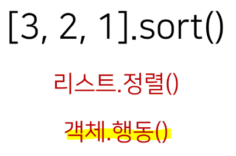

# OOP (객체지향 프로그래밍)

> Object-Oriented Programming (OOP)
> 
> 객체 지향 프로그래밍은 컴퓨터 프로그램을 *명령어의 목록으로 보는 시각에서 벗어나*  **여러 개의 독립된 단위, 즉 객체들의 모임으로 파악하는 것!**

* **각각의 객체는 메시지를 주고 받을 수 있으며, 데이터를 처리**할 수 있다. = 상호작용❗

* <u>**객체는 정보(변수)와 행동(함수)**</u>을 가지고 있음!

* 과거
  
  * 절차지향 프로그래밍 - 수정 사항이 생기면 바꿔야 할 부분이 너무 많았음

* 현재
  
  * 객체지향 프로그래밍 - **특정 기준에 따라 데이터와 메서드(기능)를 분리! = 추상화된 구조**

## ✔ 객체 지향의 장/단점

* **장점**
  
  * 클래스 단위로 모듈화시켜 개발할 수 있으므로 많은 인원이 참여하는 대규모 프로젝트 개발에 적합
  
  * **필요한 부분만 수정하기 쉽기 때문에 프로그램의 유지보수가 쉬움**

* **단점**
  
  * 설계 시 많은 노력과 시간이 필요 - 객체 간의 상호 작용 구조를 만들기 위해
  
  * 실행 속도가 상대적으로 느림 - 절차 지향 프로그래밍이 컴퓨터의 처리구조와 비슷

# OOP 기초 개념

## 1️⃣ 객체(object)

> **클래스에서 정의한 것을 토대로 메모리(실제 저장공간)에 할당된 것**으로 프로그램에서 사용되는 데이터 또는 식별자에 의해 참조되는 공간을 의미하며, 변수, 자료구조, 함수 또는 메서드가 될 수 있다.

* ex.
  
  * 가수 '000' = 속성(직업, 생년월일, 국적 등) + 행동(랩하기, 댄스 등)
  
  * **즉 변수(속성)와 메서드(행동)로 구성**
  
  #### 📍 객체와 인스턴스 차이❓
  
  * **클래스로 만든 객체를 인스턴스라고 부름** 
  
  * ex.
    
    * 가수 '000' 은 객체다 (O)
    
    * 가수 '000' 은 인스턴스다 (X)
    
    * '000'은 가수의 인스턴스다 (O) = **특정 클래스의 인스턴스**

* **<mark>객체(object)는 특정 타입(class)의 인스턴스다.</mark>**

* **파이썬은 모든 것이 객체(object)**
  
  * <mark>**파이썬의 모든 것엔 속성과 행동이 존재**</mark>❗




### ✔ 객체의 특징

* **타입(type) - 어떤 연산자(operator)와 조작(method)이 가능한가?**

* **속성(attribute) - 어떤 상태(데이터)를 가지는가?**

* **조작법(method) - 어떤 행위(함수)를 할 수 있는가?**


## 2️⃣ 객체와 클래스 문법

* 기본 문법 = 클래스 정의 + 인스턴스 생성 + 메서드 호출 + 속성
  
  ```python
  class MyClass: # 클래스 정의
  my_instance = MyClass() # 인스턴스 생성
  my_instance.my_method() # 메서드 호출
  my_instance.my_attribute # 속성
  ```
  
  #### 📌 객체 비교하기
  
  * **`==`**
    
    * **동등함(equal)**
    
    * 변수가 참조하는 객체가 동등한 경우 - True
    
    * <u>*실제로 동일한 대상을 가리키고 있다고 확인한 것은 아님*</u> (내용만 같음)
  
  * **`is`**
    
    * **동일함(identical)**
    
    * 두 변수가 동일한 객체(내용과 id값 같음)를 가리키는 경우 - True

```python
a = [1, 2, 3]
b = [1, 2, 3] # 새로운 리스트 생성
print(a == b, a is b) # True False

a = [1, 2, 3]
b = a # 얕은 복사여야 동일한 것!
print(a == b, a is b) # True True
```

## 3️⃣ OOP 속성

> 특정 데이터 타입/클래스의 **객체들이 가지게 될 상태/데이터를 의미**
> 
> **클래스 변수(같이 사용)/인스턴스 변수(각자 사용)가 존재**

**① 인스턴스 변수**

* 인스턴스가 개인적으로 가지고 있는 속성 = **각 인스턴스들의 고유한 변수**

* **생성자 메서드(`__init__`)에서 `self.<name>`으로 정의**

* **인스턴스가 생성된 이후 `<instance>.<name>`으로 접근 및 할당**

```python
class Person:

    def __init__(self, name): # 인스턴스 변수 정의 - 나만 사용!
        self.name = name

john = Person('john') # 인스턴스 변수 접근
print(john.name) # john # 인스턴스 변수 할당

john.name = 'John Kim' # 인스턴스명.name 으로 변수 접근
print(john.name) # John Kim

john.age = 20 # 인스턴스명.변수 로 새롭게 생성
print(john.age) # 20
```

**② 클래스 변수**

* **클래스 선언 내부에서 정의**

* 한 클래스의 모든 인스턴스가 공유하는 값을 의미

* 같은 클래스의 인스턴스들은 같은 값을 가짐

* **`<classname>.<name>` 으로 접근 및 할당**

```python
class Circle():
    pi = 3.14 # 클래스 변수

    def __init__(self, r):
        self.r = r # 인스턴스 변수

c1 = Circle(5)
c2 = Circle(10)
print(Circle.pi) # 3.14
print(c1.pi) # 3.14 # 인스턴스 변수가 없어 자동으로 클래스 변수를 찾음
print(c2.pi) # 3.14

Circle.pi = 5 # 클래스 변수 변경
print(Circle.pi) # 5
print(c1.pi) # 5
print(c2.pi) # 5

c2.pi = 5 # 인스턴스 변수 변
print(Circle.pi) # 3.14 (클래스 변수)
print(c1.pi) # 3.14 (클래스 변수)
print(c2.pi) # 5 (새로운 인스턴스 변수가 생성됨)
```

- **인스턴스가 생성될 때마다 클래스 변수의 값이 늘어나도록 설정 가능**

```python
class Person:
    count = 0 # 클래스 변수 생성
    def __init__(self, name):
        self.name = name
        Person.count += 1 # 클래스 변수이므로 클래스명을 통해 사용!

person1 = Person('아이유')
person2 = Person('이찬혁')

print(Person.count)
```

* **클래스 변수 변경법** = <mark>항상 **`<클래스>.<클래스변수>` 형식**으로 변경</mark>❗

## 4️⃣ OOP 메서드

> 특정 데이터 타입/클래스의 객체에 공통적으로 적용 가능한 행위(함수)
> 
> **클래스 안에 함수를 의미**❗


**① 인스턴스 메서드**  

* 인스턴스 변수를 사용하거나, 인스턴스 변수에 값을 설정하는 메서드

* 클래스 내부에 정의되는 메서드의 기본

* **호출 시, 첫 번째 인자로 인스턴스 자기자신(self)이 전달됨**

```python
class MyClass:

    def instance_method(self, arg1, ...):

my_instance = MyClass()
my_instance.instance_method(...)
```

* **`self`**
  
  * 인스턴스 자기자신
  
  * 파이썬에서 **인스턴스 메서드는 호출 시 첫 번째 인자로 반드시 인스턴스 자신이 전달**되게 설계

* **생성자(constructor) 메서드**
  
  * 인스턴스 객체가 생성될 때 자동으로 호출되는 메서드
  
  * 초기값 설정 - **인스턴스 생성 & `__init__` 메서드 자동 호출**

* **매직 메서드**
  
  * **Double Underscore(`__`) 가 있는 메서드**는 특수한 동작을 위해 만들어진 메서드!
  
  * 예시
    
    * `__str__` - 해당 객체의 출력 형태를 지정 (print 함수 호출 시 자동으로 호출)
    
    * `__gt__` - 부등호 연산자 (>, greater than)

* **소멸자(destructor) 메서드**
  
  * 인스턴스 객체가 소멸(파괴)되기 직전에 호출되는 메서드
  
  * 예시
    
    * `__del__`

**② 클래스 메서드**

* 클래스가 사용할 메서드

* **`@classmethod` 데코레이터를 사용하여 정의**

* **호출 시 첫 번째 인자로 `cls`가 전달** - 클래스 정보가 넘어가며 클래스 변수를 호출할 때 사용

* **데코레이터**
  
  * 함수를 어떤 함수로 꾸며서 새로운 기능을 부여 = 여러 함수를 원하는대로 변경 가능
  
  * **@데코레이터(함수명) 형태로 함수 위에 작성**
  
  * 순서대로 적용되기 때문에 작성 순서가 중요
  
  #### 📍 **클래스 메서드 vs 인스턴스 메서드**
  
  * 클래스 메서드 -> 클래스 변수 사용
  
  * 인스턴스 메서드 -> 인스턴스 변수 사용
  
  * **둘 다 사용하려면**❓
    
    * *클래스는 인스턴스 변수 사용이 불가능!*
    
    * **인스턴스 메서드는 클래스 변수, 인스턴스 변수 둘 다 사용 가능!**

**③ 스태틱 메서드**

> 인스턴스 변수, 클래스 변수를 전혀 다루지 않는 메서드
> 
> **속성을 다루지 않고 단지 기능(행동)만을 하는 메서드를 정의할 때 사용!**

* 객체 상태나 클래스 상태를 수정할 수 없음

* **`@staticmethod` 데코레이터를 사용하여 정의**

* 클래스의 이름공간에 귀속됨 - 주로 해당 클래스로 한정하는 용도로 사용
  
  #### 📌 **인스턴스와 클래스 간의 namespace(이름 공간)**
  
  * 클래스를 정의하면 클래스와 해당하는 이름 공간 생성
  
  * 인스턴스를 만들면 인스턴스 객체가 생성되고 이름 공간 생성
  
  * 인스턴스에서 특정 속성에 접근하면 **인스턴스 > 클래스 순으로 탐색**

```python
class MyClass:

    def method(self):
        return 'instance method', self

    @classmethod
    def classmethod(cls):
        return 'class method', cls

    @staticmethod
    def staticmethod():
        return 'static method'
```

```python
obj = MyClass()
print(obj.method()) # 권장
print(MyClass.method(obj)) # 권장 X
```

# 객체지향의 핵심 4가지

## 1️⃣ 추상화

> 현실 세계를 프로그램 설계에 반영 - **복잡한 것은 숨기고, 필요한 것만 사용!**

```python
User.login() # 어떻게 로그인하는지 몰라도 사용 가능
User.logout() # 로그아웃 기능이 어떻게 작동하는지 몰라도 사용 가능
```

## 2️⃣ 상속

> **두 클래스 사이 부모와 자식 관계를 정립**
> 
> 모든 파이썬 클래스는 object를 상속 받음

* **하위 클래스는 상위 클래스에 정의된 속성, 행동, 관계 및 제약 조건을 모두 상속 받음**

* 부모 클래스의 속성, 메서드가 자식 클래스에 상속되므로 **코드 재사용성이 높음**

* 상속 관련 함수와 메서드
  
  * `isinstance(object, classinfo)` - classinfo 의 instance or subclass 면 True 
  
  * `issubclass(class, classinfo)` - class가 classinfo의 subclass 면 True
  
  * `super()` - **자식클래스에서 부모클래스를 사용하고 싶은 경우**
  
  * `.mro()` - Method Resolution Order
    
    * 해당 인스턴스의 클래스가 어떤 부모 클래스를 가지는지 확인하는 메서드
    
    * **상속 관계에 있으면 인스턴스 > 자식 클래스 > 부모 클래스 순으로 확인 가능**

* **메서드 오버라이딩을 통해 자식 클래스에서 재정의 가능함!**

### ✔ 다중 상속

- 두 개 이상의 클래스를 상속 받는 경우

- **상속받은 모든 클래스의 요소를 활용 가능함**

- **중복된 속성이나 메서드가 있는 경우, 상속 순서에 의해 결정됨****

## 3️⃣ 다형성

> 동일한 메서드가 클래스에 따라 다르게 행동할 수 있음을 의미
> 
> 서로 다른 클래스에 속해있는 객체들이 **<u>동일한 메시지에 대해 다른 방식으로 응답 가능</u>**

### ✔ 메서드 오버라이딩

* 클래스 상속 시, **부모 클래스에서 정의한 메서드를 자식 클래스에서 변경**

* 부모 클래스의 메서드 이름과 기본 기능은 그대로 사용하지만, **특정 기능을 바꾸고 싶을 때 사용!**

## 4️⃣ 캡슐화

> 객체의 일부 구현 내용에 대해 **외부로부터의 직접적인 접근을 차단**
> 
> 예시 - 주민등록번호(민감성 정보)

* **접근제어자 종류**
  
  * **Public** Access Modifier
    
    * **<u>언더바 없이</u>** 시작하는 메서드나 속성
    
    * 어디서나 호출 가능하며 **하위 클래스 override 허용**
  
  * **Protected** Access Modifier
    
    * <u>**언더바 1개**</u>로 시작하는 메서드나 속성
    
    * 암묵적으로 **부모 클래스 내부와 자식 클래스에서만 호출 가능**
  
  * **Private** Access Modifier
    
    * <u>**언더바 2개**</u>로 시작하는 메서드나 속성
    
    * **본 클래스 내부에서만 사용 가능**
    
    * *<u>하위클래스 상속 및 호출 불가능</u>* - Error 발생
    
    * 외부 호출 불가능 - Error 발생

* **getter 메서드와 setter 메서드** - private 이용 시 반드시 정의해줘야 함❗
  
  * 변수에 우회 접근할 수 있는 메서드를 별도로 생성
    
    * getter 메서드 - 변수의 값을 읽는 메서드
      
      `@property` 데코레이터 사용
    
    * setter 메서드 - 변수의 값을 설정하는 메서드
      
      `@<변수>.setter` 사용

```python
class Person:

    def __init__(self, age):
        self._age = age 

    @property # 변수의 값을 읽는 메서드 = 조회
    def age(self):
        return self._age

    @age.setter # 변수의 값을 설정하는 메서드 = 변경
    def age(self, new_age):
        self._age = new_age
```
