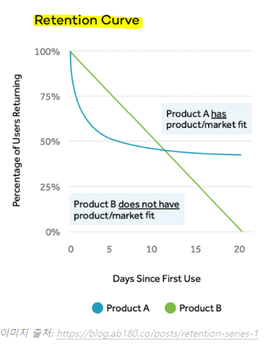
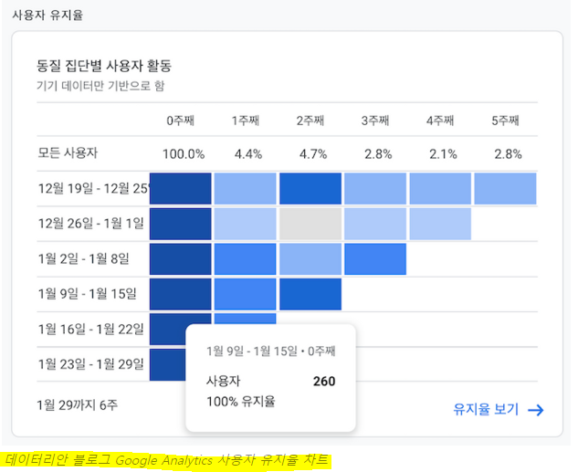
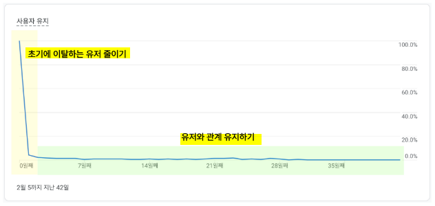

# 1️⃣ Classic Retention

> **N-Day Retention**
> 
> **AARRR = 그로스 해킹의 대표적인 분석 프레임워크**

① `Acquisition` : 사용자 획득
② `Activation` : 사용자 활성화 (신규 사용자가 서비스를 사용)
③ `Retention` : 사용자 유지 (지속적으로 서비스 사용)
④ `Revenue` : 매출 (구매)
⑤ `Referral` : 전파 (다른 사용자에게 추천)

## 리텐션이 중요한 이유

> **사용자 유지와 관련한 지표 계산**

- 다섯 가지 단계 중 가장 먼저 개선을 해야하는 단계
  - 사용자 유지가 되지 않는 서비스인데 광고를 늘려 사용자 획득과 사용자 활성화를 늘려봤자 곧 이탈함
- **`Retention`** : 새로운 사용자를 획득하는 것보다 **먼저 기존 사용자들이 서비스를 만족스럽게 사용하고 있는지, 지속적으로 사용하는지 보는 것**
  - **단, 가장 개선하기 어려운 지표 (사용자의 재방문은 돈을 주고 살 수 없음)**

* 서비스를 지속적으로 사용하는지, 핵심 가치를 꾸준히 경험하는지를 측정

## '지속적 사용'을 측정하는 방법

> **보통 방문(접속)을 기준으로 측정**

* 특정 페이지 방문

* 특정 페이지 N번 방문

* 결제 버튼 클릭 or 결제 완료

* 특정 기능 사용
  
  * **'기능의 반복 사용'을 보는 기능 리텐션(Feature Retention)을 측정**

## 클래식 리텐션 계산하기

* **방문 기준**
  
  * **특정 유저 중 방문한 유저의 비율을 계산**

## 클래식 리텐션의 한계

* *매일 매일 사용하는 것이 아니라, 사용주기가 길 경우 클래식 리텐션으로 사용자 유지 여부를 판단했을 때 실제보다 훨씬 과소 계산하게 됨*
  
  * **`롤링 리텐션(Rolling Retention)` : 서비스 사용 주기가 긴 서비스에 사용**
    
    * **`Unbounded Retention` 이라고도 함: 이탈에 초점을 맞춤**

* 클래식 리텐션은 사용자가 매일 접속해서 사용할 것으로 기대되는 서비스에 활용하기 적절한 지표
  
  * 예) 카카오톡, 트위터 등 SNS 서비스

# 2️⃣ Rolling Retention

> **Unbounded Retention**
> 
> **기준일을 포함하여 그 이후에 한 번이라도 재방문한 유저의 비율을 나타냄**

* 마지막 방문일 이전은 방문한 것으로 간주하다는 의미
  
  * 기준일 이후에 방문 기록이 있음 = 기준일 당시에는 이탈하지 않은 사용자로 계산

* **롤링 리텐션은 여행 서비스, 쇼핑몰, 부동산 서비스 등 사용 빈도가 높지 않은 서비스에서 유용하게 활용!**
  
  * 사용자가 니즈를 가진 시점에 방문하는 서비스
  
  * *오히려 클래식 리텐션으로 매일의 접속 여부를 확인하면서 이러한 지표를 높이기 위해 앱 푸시, 할인 등의 광고를 보내면 사용자에게 악영향을 미칠 수 있음*

## 보고용으로 사용 가능한가?

* *사용자들의 이후 접속에 따라 기존에 계산했던 리텐션 값이 얼마든지 달라진다는 특징*
  
  * 절대적인 수치보다는 지표가 어떻게 움직이는지 트렌드를 보는 정도로만 활용
  
  * 날짜나 기준에 따라 리텐션 값이 변하기 때문에 팀이나 조직의 이해도가 필요함

# 3️⃣ Range Retention

> **Bracket Retention**
> 
> **클래식 리텐션을 유연하게 확장한 개념**

* 클래식 리텐션 : 특정 일/주/월 단위로 한정지음

* **범위 리텐션 :  구간을 유연하게 나눈다는 점이 다름 (범위를 지정)**
  
  * **기간을 묶어서 계산하기 때문에 노이즈에 강함**
    
    * 우연히 하루정도 접속 안해도 리텐션에 영향을 주지 않음
    
    * 주로 서비스 사용주기가 긴 경우에 활용

## 리텐션 계산 방법에 따른 차이

* *같은 데이터라고 해도 계산 방법에 따라 리텐션의 값은 달라짐*

* *주의할 점*
  
  1. **비교를 하려면 제대로 해야 함 : 같은 리텐션으로 계산된 것과 비교**
  
  2. **서비스에 맞는 계산 방법을 사용 : 사용 주기에 적합한 리텐션 계산법 사용**
  
  3. **형식에 얽매이지 마라 : 정해진 공식은 없음 (담당자 마음대로!)**
  
  4. **하나만 볼 필요는 없음 : 우선 가장 쉬운 방법으로 계산하고 현상을 파악하라**

# 4️⃣ DAU, WAU, MAU 그리고 Stickiness

> **Stickiness (사용자 고착도) = DAU / MAU**
> 
> **Engagement 지표라고도 함**

## DAU, WAU, MAU

* 해당 기간 동안 활동한 사용자 수를 의미
  
  * Daily Active User, Weekly Active User, Monthly Active User
  
  * 일간/주간/월간 활성 사용자 수

* **매일매일 새로운 유저가 들어오고 기존 유저의 재방문이 없다면 DAU의 합산이 곧 WAU**
  
  * WAU와 DAU를 함께 본다면 고객들의 방문 패턴을 알 수 있음

* MAU 를 특정 유저 그룹별로 나누어서 분석하기도 함
  
  * GA의 경우 사용 디바이스별로 측정 가능

## Stickiness 계산하는 방법

* DAU와 MAU 또는 DAU와 WAU의 비율로 계산
  
  * **월간 순수 사용자 중 특정 일자에 접속한 사람의 비율**
  
  * **`Stickiness = DAU / MAU`**

* **유저가 더 자주 방문할수록 `Stickiness` 는 100% 에 가까워짐**

* **유저들이 더 자주 접속하고, 더 많이 접속하는 것이 중요한 SNS 광고 비즈니스 또는 생필품을 판매하는 온라인 쇼핑몰 비즈니스에서 `Stickiness` 지표를 중요하게 봄**

# 5️⃣ 리텐션 차트, 리텐션 커브

> **코호트(Cohort) 분석 : 전체 데이터를 쪼개어 특정 집단 안의 특징을 보고, 다른 집단과 비교하는 일**

* 리텐션 분석을 할 때에도 코호트를 잘 정의하는 것이 중요
  
  * 보통은 가입 시기별로 유저 그룹을 나누어 각 그룹별로 리텐션을 관찰
    
    * 시간 흐름에 따라 리텐션이 좋아지고 있는지 나빠지고 있는지 흐름을 판단 가능

## Retention Chart

* 보통 첫 방문 시기별로 나누어 삼각형 모약으로 그림

* 동질 집단별 = 유저를 첫 방문 시기별로 나누어서 표시

* 차트 해석
  
  * 1월 9일 ~ 1월 15일 사이에 이 사이트에 첫 방문한 사람은 260명
  
  * 주차별 방문한 사람이 260명 중 몇 명이고 비율은 어떤지 알 수 있음
  
  * 시간이 흐름에 따라 점점 리텐션이 높아지고 있는 그래프
    
    * 재방문율이 점점 높아지고 있음을 의미

## Retention Curve

* **리텐션을 높이는 방법 2가지**
  
  1. **초기에 이탈하는 유저 줄이기**
     
     Acquisition & Activation 단계라고 볼 수 있으며, 유저와 처음 만나는 모든 접점에 대해 다 그려놓고 '내가 유저라면 어떤 장면을 만나면 멋지다고 느낄지' 분석해야 함
     
     **주로 유저의 가입 동선, 처음 받아보는 이메일, 처음 보는 화면, 처음 경험하는 서비스의 핵심 가치 개선을 통해 초기 이탈을 막을 수 있음**
  
  2. **유저와 장기적인 관계 유지하기**
     
     

* 가파르게 리텐션이 떨어지는 구간을 지난 후 안정화 되는 단계에서는 사용자와의 관계를 유지하는 것이 중요
  
  * "유저가 계속 이 플랫폼에 재방문하느냐" 는 장기 리텐션과 관련된 이야기
  
  * **재방문 할 때마다 체류시간도 늘어나는지 확인**
    
    * 핵심 = 서비스의 핵심 가치를 고객들이 계속 경험하게 할 수 있느냐

### [참고] Smile Curve

> **에버노트의 Smile Curve**

* *보통 리텐션 커브는 우하향하는 곡선을 그림*
  
  * **에버노트와 같이 시간이 지날수록 유저에게 서비스의 가치가 높아지는 제품들은 스마일 커브 리텐션 곡선을 그릴 수 있음**