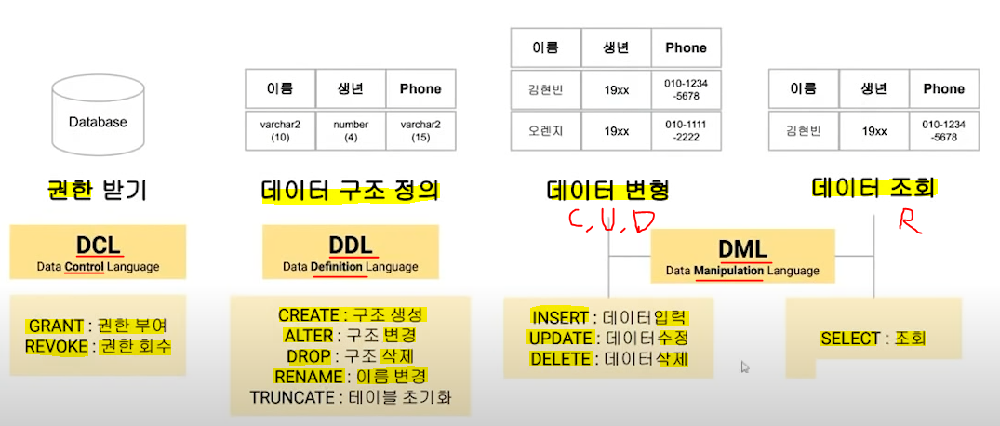
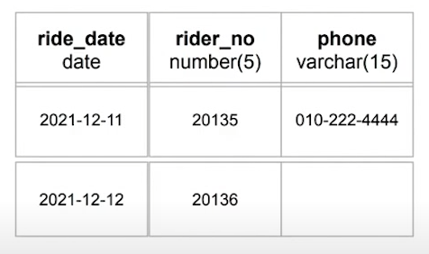
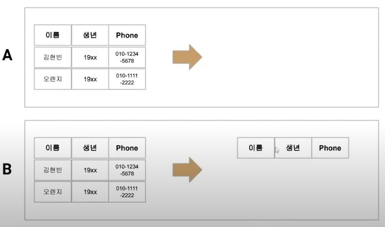

# SQL 언어 종류



# DCL (Data Control Language)

> **데이터베이스 사용자에게 권한을 부여/회수하는 언어**

* 기본 문법
  
  * **`GRANT 권한 ON 테이블 TO 유저;`**
  
  * **`REVOKE 권한 ON 테이블 FROM 유저;`**

* **권한의 종류**
  
  * `SELECT`, `INSERT`, `UPDATE`, `DELETE`
  
  * `REFERENCES`, `ALTER`, `INDEX`
  
  * `ALL`

* **`GRANT` 옵션**
  
  * **① `GRANT 권한 ON 테이블 TO 유저 WITH GRANT OPTION;`**
    
    * 특정 사용자에게 권한 부여가능한 권한을 부여함
    
    * 단, 부모가 회수될 때 자식도 회수됨 (B 회수 시 C도 회수)
      
      
  
  * **② `GRANT 권한 ON 테이블 TO 유저 WITH ADMIN OPTION;`**
    
    * 테이블에 대한 모든 권한 부여
    
    * 부모의 권한 회수는 나랑 상관없음
      
      

### 📍 문제

Q. 다음 코드를 수행하기 위해 권한을 부여하는 DCL을 작성하시오

`UPDATE hoho_qualification.data SET col2='합격' WHERE col1='SQLD';`

A. `GRANT SELECT, UPDATE ON hoho_qualification.list TO hoho;`

**why❓**

* WHERE 조건문을 사용 가능하기 위해 SELECT 권한도 부여

### 📍 문제2

Q. 데이터베이스상에서 많은 사용자들에게 개별적으로 권한을 부여하고 관리하는 어려움을 해소하고자 <mark>**다양한 권한을 하나의 그룹으로 묶어서 관리**</mark>할 수 있도록 하는 논리적인 권한의 그룹을 칭하는 말은?

A. ROLE

* **`GRANT 관리자권한 TO hoho`**

**why❓**

* **다양한 권한을 다양한 유저를 대상으로 관리하기 위한 명령어**

* 여러 사용자에게 동일한 ROLL 부여 가능

# DDL (Data Definition Language)

> 데이터를 보관하고 관리하기 위한 객체의 구조를 정의하기 위한 언어

## ▶ CREATE - 데이터베이스 상 테이블 구조 생성

* 기본 문법
  
  ```sql
  CREATE TABLE c_info (
      이름 varchar2(10),
      생년 number(4) default 9999,
      phone varchar2(15) not null,
      첫방문일 date,
      고객번호 varchar2(10) primary key
  )
  ```

* **구조**
  
  * **컬럼명 - 영문, 한글, 숫자 모두 가능 (단, 시작은 문자만❗)**
  
  * **데이터 타입**
    
    * `number` - 숫자형
    
    * `date` - 날짜형
    
    * `varchar2` - 가변길이 문자열
      
      * 예) '호호' != '호호     '
    
    * `char` - 고정된 크기 문자열 (할당된 길이만큼 문자 채움)
      
      * 예) '호호' = '호호     '

* **제약조건(CONSTRAINT)**
  
  * `default` - 기본값 지정
  
  * `not null` - null 입력 불가
  
  * `primary key` - 기본키 지정
    
    * PK 는 not null
    
    * PK 는 unique 값 = 테이블 내 중복 없음
  
  * `foreign key` - 외래키 지정
    
    * 테이블 당 여러개 가능

### 📍 문제

Q. 테이블 menu 를 생성한 후, 유효한 튜플 값 4개를 삽입했다. 이 경우, SQL-a와 SQL-b의 실행 결과를 각각 구하시오.

```sql
CREATE TABLE menu (
    메뉴명 varchar2(10) PRIMARY KEY,
    가격 number(10)
)
```

```sql
SELECT count(*) FROM menu;

SELECT count(메뉴명) FROM menu;

SELECT count(가격) FROM menu;
```

A. **둘 다 숫자 4가 출력된다.**

A2. **가격 컬럼의 경우 null 값의 개수에 따라 서로 다른 실행 결과가 나올 수 있다.**

**why❓**

* `count(*)` - **<mark>전체 행의 수 카운트 (NULL 포함)</mark>**

* `count(컬럼명)` - **<mark>NULL 제외한 행 수 카운트</mark>**

* **메뉴명 컬럼은 PK 이므로 NULL 값을 가질 수 없다.**

* **<mark>NULL</mark>**
  
  * **모르는 값을 상징하고, 값이 없음(부재)을 의미**
  
  * **NULL IS NULL = TRUE**
  
  * NULL 과의 모든 비교(예. NULL = 0)는 알 수 없음(NULL)을 반환
  
  * **NULL 은 숫자 0이나 공백문자(' ')와 동일하지 않다❗ (0이나 공백문자는 값이 있음)**

## ▶ ALTER - 테이블과 컬럼에 대해 이름 및 속성을 수정

> **테이블 + 세부 명령 + 대상 순으로 작성**

* **테이블명 변경법 - `ALTER TABLE menu RENAME TO uk_menu;`**
  
  * 다수 테이블명 동시에 변경 가능
    
    * `RENAME TABLE menu TO uk_menu;`

* **컬럼명 변경법 - `ALTER TABLE menu RENAME COLUMN phone TO 전화번호;`**
  
  * 컬럼 속성 변경 = `MODIFY`
    
    * **`ALTER TABLE menu MODIFY (이름 varchar(20) NOT NULL);`**
  
  * 컬럼 추가 = `ADD`
    
    * **`ALTER TABLE menu ADD (거주지역 varchar(10));`**
  
  * 컬럼 삭제 = `DROP`
    
    * **`ALTER TABLE menu DROP <column_name>;`**

* **제약조건 추가/삭제**
  
  * `ALTER TABLE menu ADD CONSTRAINT;`
  
  * `ALTER TABLE menu DROP CONSTRAINT;`

### 📍 문제

Q. **테이블 riding 에서 <mark>현재 null 값이 존재하는 컬럼</mark>에 대하여 null이 발생할 수 없도록 <mark>제약조건을 추가</mark>하고자 한다. 올바른 SQL 문장은?**



A. **`ALTER TABLE riding MODIFY (phone varchar(15) NOT NULL);`**

## ▶ DROP - 테이블 및 컬럼 삭제

* **컬럼 삭제 - `ALTER TABLE menu DROP column_name;`**

* **테이블 삭제 - `DROP TABLE menu`**
  
  * 유의 사항
    
    * **`DROP TABLE menu CASCADE CONSTRAINT;`**
    
    * 해당 테이블의 데이터를 외래 키(FK)로 참조한 제약사항도 모두 삭제❗
    
    * Oracle에만 있는 옵션 (SQL Server 에는 존재하지 않음)
    
    * FK 제약조건과 참조테이블 먼저 삭제하고, 해당 테이블을 삭제한다.

## ▶ DROP vs TRUNCATE

* **테이블 삭제 - `DROP TABLE menu`**
  
  * 테이블 관련해서 모두 삭제 = 구조 & 데이터 모두 삭제❗
  
  * 테이블 정의를 완전 삭제

* **테이블 초기화 - `TRUNCATE TABLE menu`**
  
  * 테이블 데이터만 삭제되고 구조는 살아있다❗
  
  * 테이블을 초기상태로 만듦

### 📍 문제

Q. f_info 테이블에 대해 DDL을 통해 삭제를 진행하고자 한다. 변경 후의 모습이 아래와 같도록 만들기 위해서 A와 B에 각각 알맞은 SQL을 작성하시오.



A. `DROP TABLE f_info`

B. `TRUNCATE TABLE f_info`

### 📍 문제

Q. 메뉴별 가격을 기록하기 위한 테이블을 추가로 제작하려고 한다. 물리적 테이블 명으로 가장 적절한 것은?

A. `MENU_20`

* 테이블명과 컬럼명은 반드시 문자로 시작❗

* **A-Z, a-z, 0-9, #, $, _ 만 사용가능**

* 다른 테이블명과 중복 X

* 칼럼 뒤 데이터유형은 꼭 지정되어야 함❗

### 📍 문제

Q. 비절차적 데이터 조작어(DML)는 사용자가 무슨 데이터를 원하며, 어떻게 그것을 접근해야 되는지를 명세하는 언어이다. = `X`

A. 비절차적 데이터 조작어(DML)는 사용자가 무슨 데이터를 원하는 지만을 명세한다. 어떻게 데이터를 접근해야 하는지 명세하는 것은 절차적 데이터 조작어(PL/SQL, T-SQL 등)

호스트 프로그램 속에 삽입되어 사용되는 DML 명령어들을 데이터 부속어(Data Sub Language)라고 한다. = `O`

### 📍 문제

Q. 테이블 및 PK 제약조건을 생성하는 DCL 문장은?

```sql
CREATE TABLE product (pro_id VARCHAR2(10) NOT NULL,
                      pro_nm VARCHAR2(100) NOT NULL,
                      reg_dt DATE NOT NULL,
                      regr_no NUMBER(10),
                      CONSTRAINGT product_pk PRIMARY KEY (pro_id)
);
```
