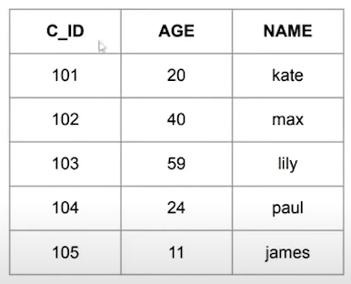

# WHERE 조건문

## ▶ 연산자 종류

> 조회할 때 원하는 값만 불러오기 위한 다양한 연산자

* **`IN(x, y, z, ...)`**
  
  * x, y, z, ... 등으로 구성된 목록들의 값 중 어느 하나라도 일치하면 된다.

* **`NOT IN(x, y, z, ...)`**
  
  * x, y, z, ... 등으로 구성된 목록들의 값 중 어느 하나라도 일치하면 안된다.

* **`IS NULL`**
  
  * NULL 인지 판단. NULL 일 경우 TRUE

* **`IS NOT NULL`**
  
  * NULL 이 아닌지 판단. NULL 이 아닐 경우 TRUE

* **`BETWEEN a AND b`**
  
  * a와 b 사이에 값이 있는지

* 기타
  
  * 비교연산자(`=`, `>`, `>=`, `<`, `<=`) 등

## ▶ 문자열 조건문 관련 연산자

* **`a LIKE b`**
  
  * a 에 대하여 b와 유사한 문자열을 찾아줌

* `%`
  
  * 문자 1개 이상이 존재한다는 의미
  
  * `ki%` = 'ki'로 시작하는 문자를 모두 찾음
  
  * `%ce` = 'ce'로 끝나는 문자를 모두 찾음

* `_`
  
  * 문자 1개를 의미
  
  * `ki__` = ki 뒤에 두 자리가 더 있는 문자를 출력
  
  * `____ce` = ce로 끝나는 6자리 문자를 출력

### 📍 문제

Q. 아래와 같이 테이블을 조회하기 위한 SQL문의 빈칸에 알맞은 말은?


A. **`SELECT * FROM wordlist WHERE 단어 LIKE 'ki%' ORDER BY 1`**

### 📍 문제

Q. c_info 테이블에서 이름에 a가 들어가는 사람들을 대상으로 임시테이블을 만들고 전체를 조회하는 쿼리를 작성하시오.



A. **`WITH TableName AS (SELECT * FROM c_info WHERE NAME LIKE '%a%')`**

A. **`SELECT * FROM (SELECT * FROM c_info WHERE name LIKE '%a%')`**

## ▶ WITH 구문

* **① 서브쿼리를 사용해서 임시테이블이나 뷰(view)처럼 사용 가능**

* ② 별칭 지정 가능

* ③ **인라인뷰**나 임시테이블로 판단
  
  * **서브쿼리와 인라인뷰**
    
    * 서브쿼리 - SELECT 문 내에 SELECT 문이 또 쓰여있는 쿼리
    
    * 인라인뷰 - 서브쿼리가 FORM 절 내에 쓰여진 것
      
      **`SELECT * FROM (SELECT * FROM c_info WHERE name LIKE '%a%')`**

## ▶ VIEW 테이블

> 일종의 가상 테이블로서 실제 데이터가 하드웨어에 저장되는 것은 아니다.
> 
> 실제 데이터를 가지고 있지 않으며 테이블 구조가 변경되더라도 독립적으로 존재

* 사용상의 편의를 위해 사용한다.

* 수행속도의 향상을 위해 사용한다.

* SQL의 성능을 향상시키기 위해 사용한다.

* 임시적인 작업을 위해 사용한다.

* 보안관리를 위해 사용한다.

# NULL 관련된 함수

> 데이터 분석에서는 전처리 및 결측치에 대한 처리가 중요

* **`NVL(col1, 대체값)`**
  
  * NULL 이면 대체값으로 바꿔주는 함수
  
  * **대체값은 기존 열의 데이터 타입이 같아야 한다.**
  
  * `NVL(col1, 100)` = col1 이 NULL 이면, 100으로 바꾼다.

* **`NVL2(col1, 결과1, 결과2)`**
  
  * col1 이 NULL 일 때 결과2 가 출력, NOT NULL일 때 결과1 이 출력
  
  * `NVL(col1, 'F', 'T')` = NULL 이면 'T' 출력, NOT NULL 이면 'F' 출력

* **`NULLIF(v1, v2)`**
  
  * v1 == v2 면 NULL이 출력되고 v1 != v2 면 v1을 출력

* **`COALESCE(v1, v2, v3, ..., vn)`**
  
  * NULL 이 아닌 최초의 값을 반환
  
  * v1 IS NOT NULL 이면 v1이 반환되고 v1 IS NULL 이면 v2도 NULL 값을 판단함

### 📍 문제

Q. c_info 테이블에서 생년이 NULL 이면 9999를 표시하고자 한다.

A. `SELECT 고객명, 고객번호, NVL(생년, 9999) AS 정답컬럼 FROM c_info`

# GROUP BY ~ HAVING ~

### 📍 문제

Q. 다음 SQL의 결과값은?


```sql
SELECT 성별, count(회원코드)
FROM c_info
GROUP BY 성별;
```

A.

| 성별  | count(회원코드) |
|:---:|:-----------:|
| F   | 2           |
| M   | 2           |
|     | 1           |

* [참고] Oracle은 NULL 을 포함하여 group by 진행
  
  SQL server는 NULL 을 제외하고 group by 진행
  
  * SQL server - GROUP BY 내에서 변경된 컬럼명 사용 불가
    
    ```sql
    SELECT NVL(성별, 'N') AS gender, COUNT(회원코드) AS cnt
    FROM c_info
    GROUP BY NVL(성별, 'N');
    ```

Q. 컬럼이 2개일 때는?


```sql
SELECT 성별, 연령대, count(회원코드)
FROM c_info
GROUP BY 성별, 연령대;
```

A.

| 성별  | 연령대 | count(회원코드) |
|:---:|:---:|:-----------:|
| F   | 20대 | 2           |
| M   | 30대 | 1           |
| M   | 40대 | 1           |
| F   | 10대 | 1           |

## ▶ 집계함수

> **NULL 값에 대한 연산의 결과는 모두 NULL 이며, 통계적 집계함수를 연산할 때 NULL 은 제외하고 계산한다**❗

* `COUNT(*)`,  `COUNT(exp)`
  
  * COUNT(*) - NULL 포함
  
  * COUNT(exp) - NULL 제외

* `SUM([DISTINCT|ALL] exp)` - 합계

* `AVG([DISTINCT|ALL] exp)` - 평균

* `MAX([DISTINCT|ALL] exp)` - 최대값

* `MIN([DISTINCT|ALL] exp)` - 최소값

* `STDDEV([DISTINCT|ALL] exp)` - 표준편차

* `VARIAN([DISTINCT|ALL] exp)` - 분산

### 📍 문제

Q. c_info 에서 평균 연령이 30대인 성별과 해당 성별의 평균 연령을 출력하는 SQL 작성


A. **`SELECT 성별, AVG(연령) FROM c_info GROUP BY 성별 HAVING AVG(연령) >= 30 AND AVG(연령) < 40`**

### 📍 문제

Q. SQL 문장에 대해서 실행 순서를 나열하시오

```sql
SELECT 지역명 AS area, COUNT(c_id)
FROM c_info
WHERE age BETWEEN 20 AND 39
GROUP BY 지역명
HAVING count(c_id) <= 10
ORDER BY 1;
```

A. SELECT ALIAS > FROM > WHERE > WHERE > GROUP BY > HAVING > SELECT > ORDER BY 실행 순서

## ▶ 조회되는 행 수를 제한할 때

> 테이블의 행을 제한해서 조회하고 싶을 때

* ORACLE 기준
  
  ```sql
  SELECT *
  FROM c_info
  WHERE ROWNUM = 1;
  ```
  
  * `ROWNUM` - 오라클에서 조회된 행이 몇 번째 행인지 부여해주는 것

* SQL Server 기준
  
  * `SELECT TOP(1) FROM c_info;`

* MySQL 기준
  
  * `SELECT * FROM c_info LIMIT 1;`

* `ROWID` 에 대한 설명은❓ - **데이터는 id(pk) 를 자동으로 저장한다.**
  
  * **해당 데이터가 어떤 데이터 파일 상에서 어느 블록에 저장되었는지 알려준다.**
  
  * **데이터베이스에 저장되어 있는 데이터를 구분할 수 있는 유일한 값이다.**
  
  * **ROWID의 번호는 데이터 블록에 데이터가 저장된 순서다.**
  
  * **테이블에 데이터를 입력하면 자동으로 생성된다.**
