# 그룹 함수

> 문제 출제 100% = Group 함수들

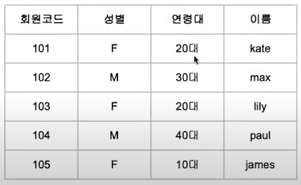

```sql
SELECT 성별, 연령대, count(회원코드)
FROM c_info
GROUP BY 성별, 연령대;
```

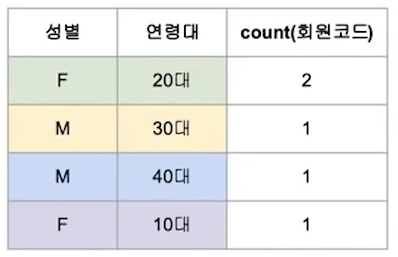

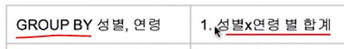

## ▶ ROLLUP()

* **부분합계와 전체합계 값을 보여준다.**

* **인수의 순서에 영향을 받는다.**

```sql
SELECT 성별, 연령, SUM(결제금액)
FROM 결제
GROUP BY ROLLUP(성별, 연령대)
ORDER BY 성별, 연령대;
```

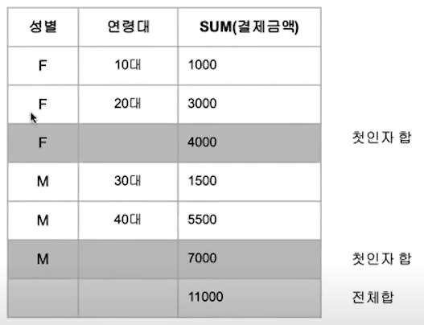


## ▶ CUBE()

* **그룹화될 수 있는 모든 경우에 대해 생성**

```sql
SELECT 성별, 연령, SUM(결제금액)
FROM 결제
GROUP BY CUBE(성별, 연령대);
```

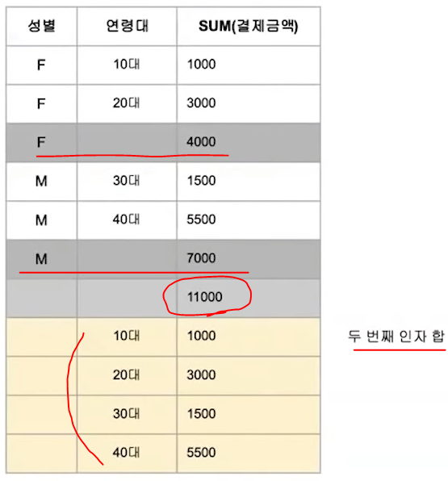

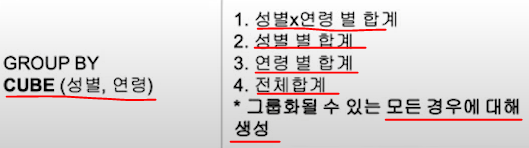

## ▶ GROUPING SETS()

```sql
SELECT 성별, 연령, SUM(결제금액)
FROM 결제
GROUP BY GROUPING SETS(성별, 연령대);
```

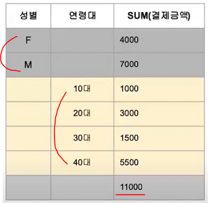

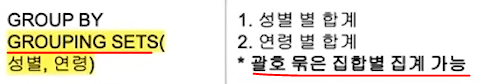

```sql
SELECT 성별, 연령, SUM(결제금액)
FROM 결제
GROUP BY GROUPING SETS((성별, 연령대), 거주지);
```

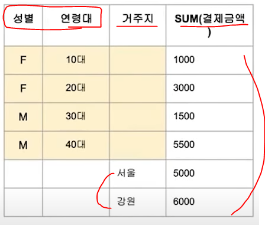

## ▶ GROUPING 함수

> **소계, 합계 등이 계산되면 1을 반환하고, 아니면 0을 반환한다.**

```sql
SELECT 성별, GROUPING(성별) g1, 연령대, GROUPING(연령대) g2, SUM(결제금액)
FROM 결제
GROUP BY ROLLUP(성별, 연령대)
ORDER BY 성별, 연령대;
```

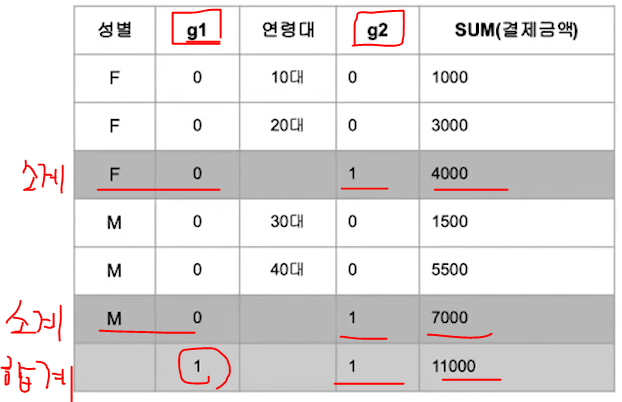

### 📍 문제

Q. 위 상태에서 CASE WHEN 을 활용하여 전체 합계를 구분하고 싶다면?

A.

```sql
SELECT 성별, CASE WHEN GROUPING(성별)=1 THEN '전체합계' END AS g1,
       연령대, GROUPING(연령대) g2, SUM(결제금액)
FROM 결제
GROUP BY ROLLUP(성별, 연령대)
ORDER BY 성별, 연령대;
```

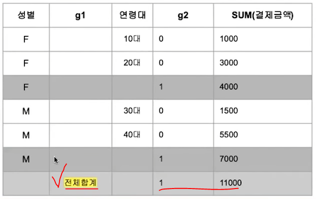

### 📍 문제

Q. 보기의 GROUP BY 구문과 동일한 SQL문을 고르시오

`GROUP BY CUBE(name, phone);`

1. `GROUP BY ROLLUP(name);`

2. `GROUP BY GROUPING SETS(name, phone, (name, phone), ());`

3. `GROUP BY name UNION ALL GROUP BY name UNION ALL GROUP BY (name, phone)`

A. **`2`**

* CUBE는 가능한 모든 조합을 의미
  
  * name 별, phone 별, name & phone 별, 전체 합계 (빈 튜플을 의미)

### 📍 문제

Q. 다음 중 가장 적절하지 않은 것을 고르시오

1. CUBE 함수의 경우에는 함수의 인자가 주어진 순서에 따라 결과가 달라지며, 계층 구조로 집계값을 반환한다.

2. ROLLUP, CUBE 등 그룹 함수에 의해 집계된 결과에서 그룹 대상 컬럼 값은 NULL로 출력된다.

3. ROLLUP, CUBE 등 그룹 함수에 의해 집계된 결과에서 집계 대상 컬럼 값은 NULL로 출력된다.

4. ROLLUP, CUBE, GROUPING SETS 모두 일반 그룹 함수로 동일한 결과를 추출할 수 있다.

5. ROLLUP 은 함수 내 인자의 순서에 따라 다른 결과를 반환하는 함수이다.
   
   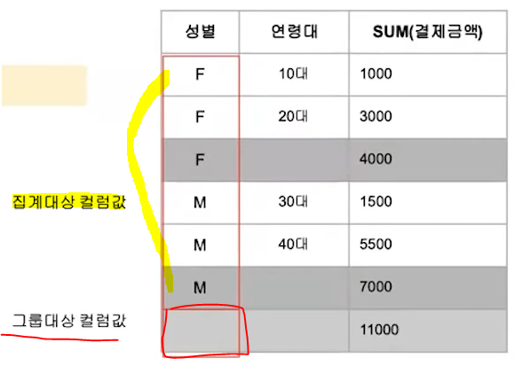

A. **`1, 3`**

* 1번은 ROLLUP의 설명이다.

* 3번 집계 대상 컬럼 값은 NULL로 출력되는 것이 아니다.

# JOIN

> 테이블 간의 결힙. 집합과 유사.

* 교집합

`INNER JOIN`, `LEFT JOIN`, `RIGHT JOIN`, `OUTER JOIN`

* 합집합

`UNION(ALL)`

* 차집합

`MINUS(oracle) = EXCEPT(SQL Server)`

* 결합되는 대상 간의 일치 정도

`EQUI 조인` <> `non-EQUI 조인`

* 조건구 없는 `CROSS JOIN`


1. 테이블간 결합의 key가 되는 컬럼 찾기


2. JOIN 방식에 따라 결과가 달라지기 때문에 key 컬럼값 간의 일치도 파악

3. `INNER JOIN`을 진행한 결과


```sql
SELECT A.*, B.연령
FROM GENDER AS A INNER JOIN AGE AS B
ON A.회원코드 = B.회원코드;
```

```sql
SELECT A.*, B.연령
FROM GENDER AS A, AGE AS B
WHERE A.회원코드 = B.회원코드;
```

* 위 2가지 모두, 동일한 결과가 나옴 = `,` 로 JOIN 대체 가능

## ▶️ INNER JOIN

> JOIN 후 특정 행만 호출할 때


```sql
SELECT A.*, B.연령
FROM GENDER AS A INNER JOIN AGE AS B
ON A.회원코드 = B.회원코드
WHERE A.성별 = 'F';
```

```sql
SELECT A.*, B.연령
FROM GENDER AS A, AGE AS B
WHERE A.회원코드 = B.회원코드
AND A.성별 = 'F';
```

* 3개 이상의 테이블을 JOIN 할 때


```sql
SELECT A.*, B.연령, C.생년
FROM GENDER AS A JOIN AGE AS B ON A.회원코드 = B.회원코드
JOIN BIRTH AS C ON B.연령 = C.생년;
```

```sql
SELECT A.*, B.연령, C.생년
FROM GENDER AS A, AGE AS B, BIRTH AS C,
WHERE A.회원코드 = B.회원코드 AND B.회원코드 = C.생년;
```

## ▶️ OUTER JOIN

> 중복 + 나머지 모두 다 가져올 때


```sql
SELECT A.*, B.연령
FROM GENDER AS A FULL OUTER JOIN AGE AS B
ON A.회원코드 = B.회원코드;
```


* `,` 를 활용한 `OUTER JOIN`은 불가능

## ▶️ LEFT JOIN

> 왼쪽 테이블 기준으로 데이터를 가져다 붙이는 것


```sql
SELECT A.*, B.연령
FROM GENDER AS A LEFT JOIN AGE AS B
ON A.회원코드 = B.회원코;
```

```sql
SELECT A.*, B.연령
FROM GENDER AS A, AGE AS B
WHERE A.회원코드(+) = B.회원코드;
```


## ▶️ RIGHT JOIN

> LEFT JOIN의 반대 - 반대이기에 보통 하나로만 사용

```sql
SELECT B.회원코드, 성별, 연령 
FROM GENDER AS A RIGHT JOIN AGE AS B
ON A.회원코드 = B.회원코드;
```

```sql
SELECT B.회원코드, 성별, 연
FROM GENDER AS A, AGE AS B
WHERE A.회원코드 = B.회원코드(+)
```

### 📍 문제

Q. 고객들의 이름과 전화번호를 함께 조회하려고 한다. 올바른 SQL문은?

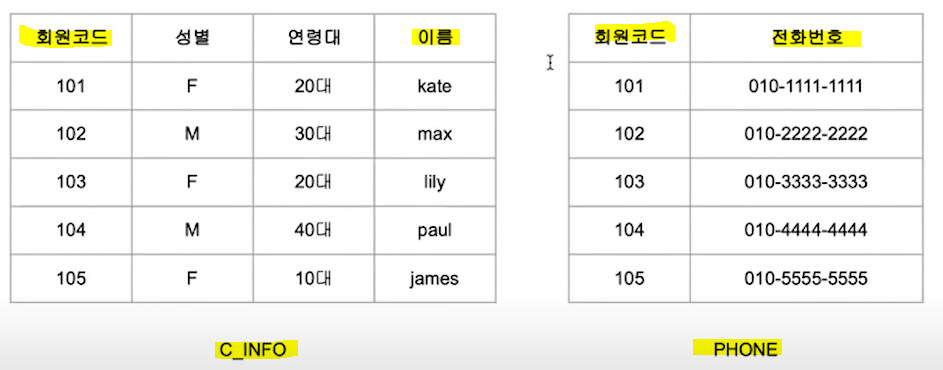

A. 

```sql
SELECT A.*, B.phone
FROM c_info AS A PHONE AS B ON A.회원코드 = B.회원코드;
```

1. 두 테이블에서 동일한 컬럼을 찾는다.

2. **원하는 정보가 도출될 수 있도록 레코드를 식별할 수 있는 컬럼으로 결정**

3. **PK 혹은 FK 기준으로 테이블들이 JOIN 될 수 있게끔 테이블이 설계되는 경우가 많음**

### 📍 문제

Q. SQL 을 통해 조회된 결과값이 아래와 같을 때, 빈칸에 알맞은 JOIN을 쓰시오


A.

```sql
SELECT * FROM T1 LEFT JOIN T2
ON T1.c2 = T2.c2;
```

## ▶️ UNION, UNION ALL

> 동일한 컬럼 개수와 데이터타입을 가진 두 테이블을 위아래로 합쳐줌


* `UNION`의 경우, 중복된 레코드가 제거됨


```sql
SELECT * FROM T1
UNION
SELECT * FROM T2;
```

* `UNION ALL` 의 경우, 중복된 레코드가 제거되지 않고 다 같이 나옴


```sql
SELECT * FROM T1
UNION ALL
SELECT * FROM T2;
```

### 📍 문제

Q. 다음의 보기가 설명하는 데이터 결합 방식이 무엇인지 기술하시오

1. 관련된 두 테이블에 적어도 하나의 공통 속성이 있을 때 적용할 수 있는 결합 방식
   
   `JOIN`

2. 조회 대상이 되는 컬럼 수가 같고 각 컬럼의 데이터타입 등 속성이 동일할 때 적용할 수 있는 결합 방식이다. 레코드 간의 중복이 제거된 결과가 반환된다.
   
   `UNION`

### 📍 문제

Q. 주어진 데이터에 대해 SQL 문을 실행한 결과를 구하시오.


```sql
SELECT * FROM T1
UNION
SELECT * FROM T2;
```

* 중복 레코드를 제거한 후 전체 테이블 합치기(위 아래로, 수직결합!)

```sql
SELECT count(T1.*) FROM T1, T2
WHERE T1.c3 = T2.c3;
```

* `INNER JOIN`이며 key가 c3이다. 두 테이블의 교집합을 찾자!

* 정답은 `3`

## ▶️ MINUS

> 차집합으로서 공통된거는 날리고 잔여 데이터만 보고 싶을 때 사용


```sql
SELECT * FROM A
MINUS
SELECT * FROM B;
```


