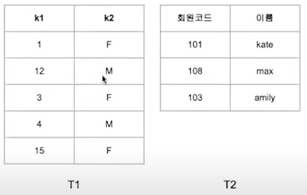
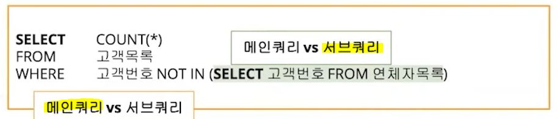
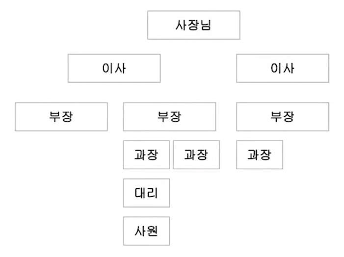
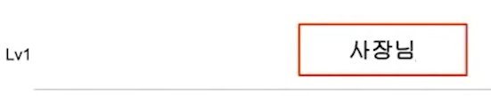
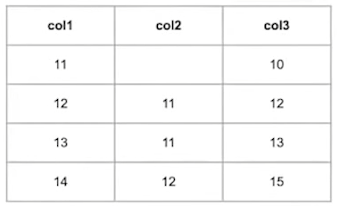

# JOIN

## ▶ EQUI JOIN

> **동일한 컬럼을 사용하여 두 릴레이션을 결합**

* 예) `A.key = B.key`

## ▶ non - EQUI JOIN

> **정확하게 일치하지 않는 컬럼들을 사용하여 두 릴레이션을 결합**

* `=` 을 사용하지 않음

* 예) `A.key <, >, <=, >= B.key`

## ▶ CROSS JOIN

> **key 없이 JOIN하면 2개의 테이블에 대해 카테시안 곱이 발생**



```sql
SELECT * FROM T1 CROSS JOIN T2;
```

* `5 * 3 = 15 개`의 행이 조회❗

# SubQuery

## ▶ 메인 쿼리 vs 서브 쿼리



* **이름이 있는 서브 쿼리**
  
  * **인라인뷰(Inline View) = FROM 구에 SELECT 문이 있음**
    
    ```sql
    FROM (SELECT * FROM 고객목록 WHERE 거주지='서울') A
    JOIN 연락처 B ON A.고객번호 = B.고객번호 
    ```
  
  * **스칼라 Subquery = SELECT 문에 들어가고, 한 행과 한 컬럼만 반환하는 서브 쿼리**
    
    ```sql
    SELECT (SELECT SUM(salary) FROM 급 WHERE EXTRACT(YEAR FROM 급여지급일) = 2021) ...
    ```

* **단일행 / 다중행 서브쿼리 (출력되는 행의 개수에 따라 정의)**

```sql
-- 여러 개 출력되면 다중행 서브쿼리 
SELECT COUNT(*) FROM 고객목록 
WHERE 고객번호 NOT IN (SELECT 고객번호 FROM 연체자목록)
```

```sql
-- 1개만 출력되면 단일행 서브쿼리
SELECT (SELECT SUM(salary) FROM 급 WHERE EXTRACT(YEAR FROM 급여지급일) = 2021) ...
```

Q. 다음 보기 중 서브쿼리에 대한 설명으로 옳은 것은?

1. *서브쿼리에서는 정렬을 수행하는 ORDER BY 를 사용할 수 있다.* = `X`

2. 여러 행을 반환하는 서브쿼리는 단일 행 연산자를 사용해야 한다. = `X`
   
   다중행 연산자 사용

3. 메인 쿼리에서 서브쿼리의 컬럼을 자유롭게 사용할 수 있다. = `X`
   
   서브쿼리 내부에서는 메인쿼리의 컬럼을 사용할 수 있음
   
   메인 쿼리에서는 SELECT 되지 않음. 서브쿼리의 컬럼을 사용할 수 없음.

4. EXIST가 반환하는 결과값은 True 혹은 False이다. = `O`
   
   ```sql
   WHERE EXISTS (SELECT 1 FROM 거주지='서울')
   ```

A. 4번 = 결과가 하나라도 존재하면 참

Q. **메인 쿼리의 결과와 서브 쿼리의 결과가 모두 동일할 때 참이되는 다중행 연산자는?**

A. **`ALL`**

```sql
50000 > ALL(20000, 30000)
-- TRUE

50000 > ANY(70000, 30000)
-- TRUE

50000 > ALL(70000, 30000)
-- FALSE
```

# 계층형 조회

> **트리형태의 데이터에 대해 조회를 수행하는 것**



* **`START WITH` = 계층 구조의 시작점을 설정**
  
  * 부모 데이터, ROOT 노드
  
  * 그 아래는 모두 자식 데이터
  
  * 자식 노드과 없는 데이터 = LEAF 노드



* **계층형 조회 문제는 조회를 통해 어떻게 레코드가 재배치 되는지 파악하는 것이 중요**❗
  
  * **<mark>동일한 값을 가진 컬럼끼리 연결되면 재배치</mark>**

## ▶ START WITH

> 계층구조가 시작되는 지점을 알려줌

* 여기에 적힌 조건에 맞는 레코드가 ROOT(부모)

## ▶ CONNECT BY

> 계층구조(트리)가 연결된 방향성을 알려줌

* 방향을 알면 a와 b 레코드가 있을 때 둘 중 무엇이 먼저 배치되는지 알 수 있고, 모든 레코드에 대하여 이런 관계성을 파악하면 재배치된 테이블에서 전체 레코드의 순서를 알 수 있음❗

* **`CONNECT BY PRIOR a=b`**
  
  * a컬럼과 b컬럼이 동일한 레코드들 간에 계층화가 발생
  
  * **<mark>b -> a 순으로 재배치 (a의 앞 = b이다.)</mark>**

Q. 계층형 조회 = 아래의 SQL을 수행한 결과 첫 번째 행의 값을 기입하시오.



```sql
SELECT col3 FROM 조직구조 
START WITH col2 IS NULL
CONNECT BY PRIOR col1 = col2
ORDER SIBLINGS BY col3;
```

A. 15

14 12 15

12 11 12

13 11 13

11 - 10
