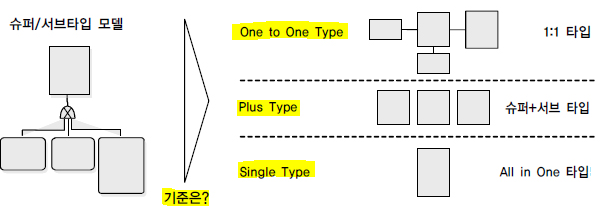

# 데이터 모델의 이해

## ▶ 모델링의 정의

> **모델링이란 현실세계를 추상화/단순화/명확화하기 위해 일정한 표기법으로 표현하는 기법**

* 모델링은 표기법에 의해 규칙을 가지고 표기하는 것

* 모델을 만들어가는 일 자체를 모델링으로 정의할 수 있다.

* 복잡한 '현실세계'를 단순화시켜 표현하는 것

* 모델이란 사물 또는 사건에 관한 양상이나 관점을 연관된 사람이나 그룹을 위하여 명확하게 하는 것

* 모델이란 현실 세계의 추상화된 반영

## ▶ 모델링의 특징

1. 추상화
   
   * 현실세계를 일정한 형식에 맞추어 표현을 한다는 의미

2. 단순화
   
   * 복잡한 현실세계를 약속된 규약에 의해 제한된 표기법이나 언어로 표현하여 쉽게 이해할 수 있도록 하는 개념

3. 명확화
   
   * 누구나 이해하기 쉽게 대상에 대한 애매모호함을 제거하고 정확하게 현상을 기술

## ▶ 모델링의 세 가지 관점

1. 데이터 관점 = What, Data
   
   * 업무가 어떤 데이터와 관련이 있는지 또는 데이터간의 관계는 무엇인지에 대해서 모델링하는 방법

2. 프로세스 관점 = How, Process
   
   * 업무가 실제하고 있는 일은 무엇인지 또는 무엇을 해야 하는지를 모델링하는 방법

3. 데이터와 프로세스의 상관관점 = Interaction
   
   * 처리하는 일의 방법에 따라 데이터는 어떻게 영향을 받고 있는지 모델링하는 방법

# 데이터 모델의 기본 개념의 이해

## ▶ 모델링의 정의

* 정보시스템을 구축하기 위해, 해당 업무에 어떤 데이터가 존재하는지 또는 업무가 필요로 하는 정보는 무엇인지를 분석하는 방법

* 기업 업무에 대한 종합적인 이해를 바탕으로 데이터에 존재하는 업무 규칙에 대하여 참/거짓을 판별할 수 있는 사실을 데이터에 접근하는 방법(How), 사람(Who), 전산화와는 별개의(독립적인) 관점에서 이를 명확하게 표현하는 추상화 기법

* **데이터 모델링을 하는 이유**❓
  
  * 업무정보를 구성하는 기초가 되는 정보들을 일정한 표기법에 의해 표현함으로써 **정보시스템 구축의 대상이 되는 업무 내용을 정확하게 분석하는 것**
  
  * 분석된 모델을 가지고 실제 데이터베이스를 생성하여 개발 및 데이터관리에 사용하기 위함

## ▶ 데이터 모델이 제공하는 기능

* 시스템을 현재 또는 원하는 모습으로 가시화하도록 도와줌

* 시스템의 구조와 행동을 명세화 할 수 있음

* 시스템을 구축하는 구조화된 틀을 제공

* 시스템을 구축하는 과정에서 결정한 것을 문서화

* 다양한 영역에 집중하기 위해 다른 영역의 세부 사항은 숨기는 다양한 관점을 제공

* 특정 목표에 따라 구체화된 상세 수준의 표현방법을 제공

# 데이터 모델링의 유의점

## ▶ 데이터 품질

1. 중복
   
   * 데이터 모델은 같은 데이터를 사용하는 사람, 시간, 그리고 장소를 파악하는데 도움을 준다. 이러한 지식 응용은 데이터베이스가 여러 장소에 같은 정보를 저장하는 잘못을 하지 않도록 함

2. 비유연성
   
   * 데이터의 정의를 데이터의 사용 프로세스와 분리함으로써 데이터 모델링은 데이터 혹은 프로세스의 작은 변화가 애플리케이션과 데이터베이스에 중대한 변화를 일으킬 수 있는 가능성을 줄인다.

3. 비일관성
   
   * 데이터의 중복이 없더라도 비일관성은 발생한다. 개발자가 다른 데이터와 모순된다는 고려없이 일련의 데이터를 수정할 수 있기 때문이다. 데이터와 데이터간 상호 연관 관계에 대한 명확한 정의는 이러한 위험을 사전에 예방할 수 있음
   
   * 예) 신용 상태에 대한 갱신 없이 고객의 납부 이력 정보를 갱신하는 것

# 데이터 모델링의 3단계

* **개념적 데이터 모델링**
  
  * 추상화 수준이 높고 업무중심적이고 포괄적인 수준의 모델링을 진행
  
  * 전사적 데이터 모델링, EA수립 시 많이 이용

* **논리적 데이터 모델링**
  
  * 시스템으로 구축하고자 하는 업무에 대해 Key, 속성, 관계 등을 정확하게 표현
  
  * 데이터 모델링 과정에서 가장 핵심이 되는 부분
  
  * 이 단계에서 정규화라는 활동이 일어난다. 정규화는 논리 데이터 모델 상세화 과정의 활동으로, 논리 데이터 모델의 일관성을 확보하고 중복을 제거하여 속성들이 적절한 엔터티에 배치되도록 함으로써 보다 신뢰성있는 데이터구조를 얻는데 목적
  
  * 재사용성이 높음

* **물리적 데이터 모델링**
  
  * 실제로 데이터베이스에 이식할 수 있도록 성능, 저장 등 물리적인 성격을 고려하여 설계

# 데이터독립성 요소

1. 외부스키마
   
   * View 단계 여러 개의 사용자 관점으로 구성, 즉 각 사용자의 단계로서 개개 사용자가 보는 개인적 DB 스키마
   
   * DB의 개개 사용자나 응용프로그래머가 접근하는 DB 정의

2. 개념스키마
   
   * 하나의 개념적 스키마로 구성 모든 사용자 관점을 통합한 조직 전체의 DB를 기술
   
   * 모든 응용시스템들이나 사용자들이 필요로 하는 데이터를 통합한 조직 전체의 DB를 기술한 것으로 DB에 저장되는 데이터와 그들 간의 관계를 표현하는 스키마

3. 내부스키마
   
   * 내부단계, 내부 스키마로 구성, DB가 물리적으로 저장된 형식
   
   * 물리적 장치에서 데이터가 실제적으로 저장되는 방법을 표현하는 스키마

## ▶ 두 영역의 데이터독립성

* 논리적 독립성
  
  * 개념 스키마가 변경되어도 외부 스키마에는 영향을 미치지 않도록 함
  
  * 논리적 구조가 변경되어도 응용 프로그램에 영향 없음
  
  * 사용자 특성에 맞는 변경 가능
  
  * 통합 구조 변경 가능

* 물리적 독립성
  
  * 내부스키마가 변경되어도 외부/개념 스키마는 영향을 받지 않도록 함
  
  * 저장장치의 구조변경은 응용프로그램과 개념스키마에 영향이 없음
  
  * 물리적 구조 영향 없이 개념구조 변경 가능 (반대도 가능)

## ▶ 데이터 모델링의 세 가지 요소

1. 어떤 것(Things) = 엔터티

2. 성격(Attributes)

3. 관계(Relationships)

# 데이터 모델의 표기법 = ERD

## ▶ ERD 를 작성하는 작업순서

① 엔터티를 그림 ② 엔터티를 적절하게 배치 ③ 엔터티간 관계를 설정 ④ 관계명을 기술 ⑤ 관계의 참여도를 기술 ⑥ 관계의 필수여부를 기술

# 성능 데이터 모델링

> 데이터의 용량이 커질수록 기업의 의사결정의 속도가 빨라질수록 데이터를 처리하는 속도는 빠르게 처리되어야 함

* 데이터베이스 성능향상을 목적으로 설계단계의 데이터 모델링 때부터 정규화, 반정규화, 테이블통합, 조인구조, PK, FK 등 여러 가지 성능과 관련된 사항이 데이터 모델링에 반영될 수 있도록 하는 것

## ▶ 성능 데이터 모델링 수행시점

> 사전에 할수록 비용이 들지 않는다.

* 특히, 분석/설계 단계가 데이터 모델에 성능을 고려한 데이터 모델링을 수행할 경우 성능저하에 따른 재업무 비용을 최소화 할 수 있는 기회

## ▶ 성능 데이터 모델링 고려사항 순서❗❗

1. 데이터 모델링을 할 때 정규화를 정확하게 수행

2. 데이터베이스 용량산정을 수행

3. 데이터베이스에 발생되는 트랜잭션의 유형을 파악

4. 용량과 트랜잭션의 유형에 따라 반정규화를 수행

5. 이력모델의 조정, PK/FK 조정, 슈퍼타입/서브타입 조정 등을 수행

6. 성능관점에서 데이터 모델을 검증

# 정규화와 성능❗

> 정규화 수행 = 데이터를 결정하는 결정자에 의해 함수적 종속을 가지고 있는 일반속성을 의존자로 하여 입력/수정/삭제 이상을 제거하는 것

* 반복적인 데이터를 분리하고 각 데이터가 종속된 테이블에 적절하게 배치되도록 하는 것

* 일반적으로 정규화가 잘 되어 있으면 입력/수정/삭제의 성능이 향상
  
  * 반정규화를 많이 하면 조회의 성능이 향상된다고 판단할 수 있음

1️⃣ **1차 정규화**

* **같은 성격, 내용 컬럼이 연속일 때 컬럼 제거, 테이블 생성**

2️⃣ **2차 정규화**

* **PK 복합키 구성일 때 부분적 함수 종속 관계 테이블 분리**

3️⃣ **3차 정규화**

* **PK가 아닌 일반 컬럼에 의존하는 컬럼 분리**

## ▶ 함수 종속성

> **데이터들이 어떤 기준값에 의해 종속되는 현상**

# 반정규화와 성능

> 정규화된 엔터티, 속성, 관계에 대해 시스템의 성능향상과 개발과 운영의 단순화를 위해 중복, 통합, 분리 등을 수행하는 데이터 모델링의 기법

* **조회 시 디스크 I/O가 많거나 경로가 멀어 조인에 의한 성능 저하를 막기 위해 수행**

* 일반적으로 반정규화 시 조인 성능이 향상

## ▶ 반정규화 적용 방법

1️⃣ **반정규화 대상조사: 범위처리빈도수, 대량의 범위 처리, 통계성 프로세스**

1. 자주 사용되는 테이블에 접근하는 프로세스의 수가 많고 항상 일정한 범위만을 조회하는 경우

2. 테이블에 대량의 데이터가 있고 대량의 데이터 범위를 자주 처리하는 경우에 처리범위를 일정하게 줄이지 않으면 성능을 보장할 수 없을 경우에 반정규화를 검토

3. 통계성 프로세스에 의해 통계 정보를 필요로 할 때 별도의 통계테이블(반정규화)을 생성

4. 테이블에 지나치게 많은 JOIN이 걸려 데이터를 조회하는 작업이 기술적으로 어려운 경우

2️⃣ **다른 방법유도 검토: 뷰 테이블, 클러스터링 적용, 인덱스 조정**

1. VIEW 사용
   
   * 지나치게 많은 조인이 걸려 테이터를 조회하는 작업이 기술적으로 어려울 경우
   
   * 단, VIEW가 조회의 성능을 향상시키지는 않는다.

2. 클러스터링 적용
   
   * 대량의 데이터처리나 부분처리에 의해 성능이 저하되는 경우 클러스터링을 적용하거나 인덱스를 조정함 (조회가 대부분일 때는 클러스터링을 적용하는 것을 고려)

3. 파티셔닝
   
   * 대량의 데이터는 PK의 성격에 따라 부분적인 테이블로 분리할 수 있다. 파티셔닝 키에 의해 물리적 저장공간이 분리될 수 있고 트랜잭션이 들어올 파티셔닝 테이블을 적용하여 조회의 성능을 향상

4. 캐시
   
   * 응용 애플리케이션에서 로직을 구사하는 방법을 변경함으로써 성능을 향상시킬 수 있다.

3️⃣ **반정규화 적용: 테이블 반정규화, 속성의 반정규화, 관계의 반정규화❗**

* 꼭 테이블과 속성, 관계에 대해 중복으로 가져가는 방법만이 반정규화가 아니고 테이블, 속성, 관계를 추가할 수도 있고 분할할 수도 있으며 제거할 수도 있다.
1. **테이블 반정규화**

2. **칼럼 반정규화**

3. **관계 반정규화 : 데이터 무결성 유지**

# 대량 데이터에 따른 성능

> **대량의 데이터가 하나의 테이블에 집약되어 있고 하나의 하드웨어 공간에 저장되어 있으면 성능저하가 일어남**

* **로우 체이닝(Row Chaining)❗**
  
  * 로우의 길이가 너무 길어서 데이터 블록 하나에 데이터가 모두 저장되지 않고 두 개 이상의 블록에 걸쳐 하나의 로우가 저장되어 있는 형태

* **로우 마이그레이션(Row Migration)❗**
  
  * 데이터 블록에서 수정이 발생하면 수정된 데이터를 해당 데이터 블록에서 저장하지 못하고 다른 블록의 빈 공간을 찾아 저장하는 방식

## ▶ 대량 데이터 저장 및 처리로 인한 성능 저하

> **테이블에 많은 양의 데이터가 예상될 경우 파티셔닝을 적용하거나 PK에 의해 테이블을 분할하는 방법을 적용 가능**

1️⃣ **RANGE PARTITION 적용**

* 대상 테이블이 날짜 또는 숫자값으로 분리가 가능하고 각 영역별로 트랜잭션이 분리되는 경우
  
  

2️⃣ **LIST PARTITION 적용**

* 지점, 사업소 등 핵심적인 코드값으로 PK가 구성되어 있고 대량의 데이터가 있는 테이블의 경우
  
  

3️⃣ **HASH PARTITION 적용**

* 지정된 HASH 조건에 따라 해시 알고리즘이 적용되어 테이블이 분리

## ▶ 테이블에 대한 수평/수직분할의 절차

1. 데이터 모델링을 완성한다.

2. DB 용량산정을 한다.

3. 대량 데이터가 처리되는 테이블에 대해 트랜잭션 처리 패턴을 분석한다.

4. 칼럼 단위로 집중화된 처리가 발생하는지, 로우 단위로 집중화된 처리가 발생하는지 분석하여 집중화된 단위로 테이블을 분리하는 것을 검토한다.
   
   * 컬럼이 많으면 1:1 형태로 테이블을 분리
   
   * 데이터용량이 많으면 테이블에 대한 파티셔닝 전략을 고려

# 데이터베이스 구조와 성능

## ▶ 슈퍼/서브 타입 모델의 개요

> 업무를 구성하는 데이터를 공통과 차이점의 특징을 고려하여 효과적으로 표현

* **논리적인 데이터 모델에서 이용되는 형태이고 분석 단계에서 많이 쓰이는 모델**
  
  * 슈퍼 타입: 공통 부분
  
  * 서브 타입: 공통으로부터 상속받아 다른 엔터티와 차이가 있는 속성

## ▶ 슈퍼/서브 타입 데이터 모델의 변환❗

1. 1:1 타입 (OneToOne Type)
   
   * 개별로 발생되는 트랜잭션에 대해서는 개별 테이블로 구성

2. 슈퍼+서브 타입 (Plus Type)
   
   * 트랜잭션에 대해 슈퍼+서브 타입 테이블로 구성

3. All in One 타입 (Single Type)
   
   * 전체를 하나로 묶어 트랜잭션이 발생할 때는 하나의 테이블로 구성

## ▶ 인덱스 특성을 고려한 PK/FK 데이터베이스 성능 향상

* 인덱스의 특징은 여러 개의 속성이 하나의 인덱스로 구성되어 있을 때 앞쪽에 위치한 속성의 값이 비교자로 있어야 좋은 효율을 나타냄

* **앞쪽에 위치한 속성의 값이 가급적 `=` 아니면 최소한 범위 `BETWEEN` `<>`가 들어와야 효율적인 인덱스를 이용할 수 있음**❗

# 분산 데이터베이스와 성능

## ▶ 분산 데이터베이스

> 여러 곳으로 분산되어 있는 데이터베이스를 하나의 가상 시스템으로 사용할 수 있도록 한 데이터베이스

* 논리적으로 동일한 시스템에 속하지만, 컴퓨터 네트워크를 통해 물리적으로 분산되어 있는 데이터집합

## ▶ 분산 데이터베이스를 만족하기 위한 6가지 투명성

1. **분할 투명성(단편화)**
   
   * 하나의 논리적 Relation이 여러 단편으로 분할되어 각 단편의 사본이 여러 site에 저장

2. **위치 투명성**
   
   * 사용하려는 데이터의 저장 장소 명시 불필요

3. **지역사상 투명성**
   
   * 지역 DBMS와 물리적 DB 사이의 Mapping 보장

4. **중복 투명성**
   
   * DB 객체가 여러 site에 중복되어 있는지 알 필요가 없는 성질

5. **장애 투명성**
   
   * 구성요소의 장애에 무관한 트랜잭션의 원자성 유지

6. **병행 투명성**
   
   * 다수 트랜잭션 동시 수행시 결과의 일관성 유지, TimeStamp, 분산 2단계 Locking 이용

## ▶ 분산 데이터베이스 장/단점

## ▶ 분산 데이터베이스의 적용 기법

1️⃣ **테이블 위치 분산**

* 테이블의 구조는 변하지 않고 다른 데이터베이스에 중복되어 생성되지 않음

* 설계된 테이블을 본사와 지사단위로 분산

* 위치별 DB 문서 필요

2️⃣ **테이블 분할 분산**

* 각각의 테이블을 쪼개어 분산

* 수평 분할
  
  * 로우 단위로 분리하며 칼럼은 분리되지 않는다.
  
  * 모든 데이터가 각 지사별로 분리되어 있는 형태 (각 지사별로 사용하는 로우가 다름)

* 수직 분할
  
  * 칼럼 단위로 분리하며 로우 단위로 분리되지 않음
  
  * 각 테이블에 동일한 PK가 있어야 함

3️⃣ **테이블 복제 분산**

* 동일한 테이블을 다른 지역이나 서버에서 동시에 생성하여 관리하는 유형

* 부분 복제
  
  * 마스터 DB에서 테이블의 일부의 내용만 다른 지역이나 서버에 위치

* 광역 복제
  
  * 마스터 DB 테이블의 내용을 각 지역이나 서버에 존재

4️⃣ **테이블 요약 분산**

* 지역 간에 또는 서버 간에 데이터가 비슷하지만 서로 다른 유형으로 존재

* 분석 요약
  
  * 동일한 테이블 구조를 가지고 있으면서 분산되어 있는 동일한 내용의 데이터를 이용하여 통합된 데이터를 산출하는 방식
  
  * 예) 판매실적 지사A, 지사B

* 통합 요약
  
  * 분산되어 있는 다른 내용의 데이터를 이용하여 통합된 데이터를 산출
  
  * 예) 판매실적 지사A: C제품, 지사B: D제품

## ▶ 분산 데이터베이스 설계를 고려해야 하는 경우❗

1. 성능이 중요한 사이트

2. 공통코드, 기준정보, 마스터 데이터 등의 성능 향상

3. 실시간 동기화가 요구되지 않는 경우
   
   * 거의 실시간(Near Real Time)의 업무적인 특징을 가지고 있을 때도 분산 환경을 구성할 수 있음

4. 특정 서버에 부하가 집중되어 부하를 분산할 때

5. 백업 사이트 구성하는 경우
