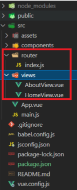
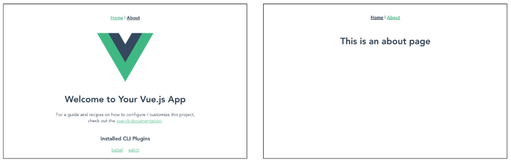
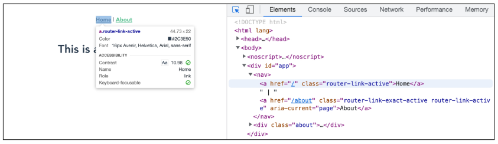
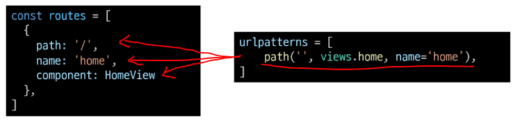
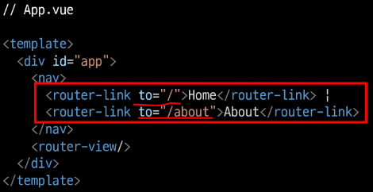
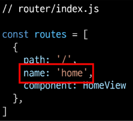
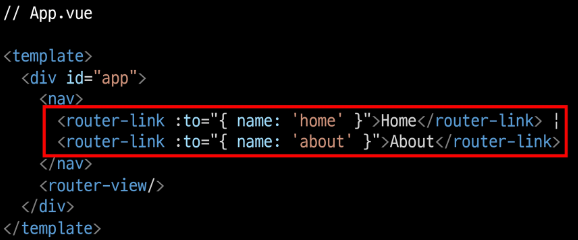
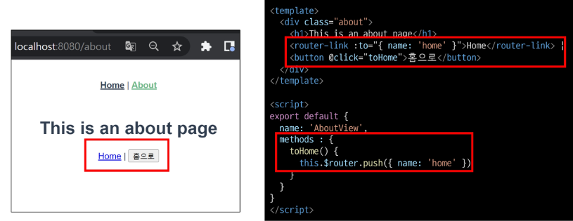
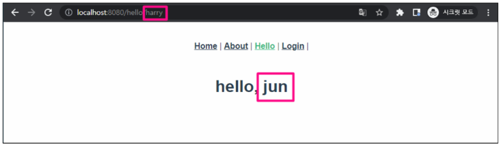
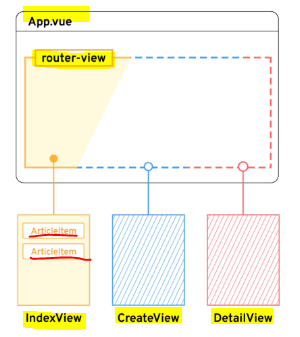

# UX & UI

* 사람은 비슷한 것끼리 묶거나 내용을 구성해서 인지하는 것이 편하다고 생각함

* 만약 그렇지 않은 경우 불편함을 느끼고 의사결정 하는데 많은 시간이 걸림

* 유저와 밀접한 부분이기에 매우 중요하며 모든 서비스에서 반드시 고려해야 함

* **단순한 느낌이나 심미적인 부분만을 고려하는 것이 아닌 <mark>체계적인 설계를 통해 기획</mark>해야 함**❗

## ▶ UX (User Experience)

> 유저가 느끼는 느낌, 태도 그리고 행동을 디자인

* 유저와 가장 가까이에 있는 분야, 데이터를 기반으로 유저를 조사하고 분석해서 개발자, 디자이너가 이해할 수 있게 소통

* 예) 데이터를 보니 사람들이 해당 메뉴바를 잘 사용하지 않음 => 크기를 줄이거나 위치 조정은 어떨까?

## ▶ 좋은 UX를 설계하기 위해서는❓

* 유저 리서치, 데이터 설계 및 정제, 유저 시나리오, 프로토타입 설계 등이 필요❗
  
  * 유저의 마음과 생각을 정리해서 제품에 녹여내는 과정이 필요

## ▶ UI (User Interface)

> 유저에게 보여지는 화면을 디자인

* UX를 고려한 디자인을 반영, 이 과정에서 기능 개선 혹은 추가가 필요한 경우 Front-end 개발자와 가장 많이 소통

* 예) 메뉴바의 위치는 다른 구성 요소 배치와 함께 생각할 때 여기가 좋겠어. 유저는 위에서부터 내려와서 여기에서 결정하는 시나리오를 따를 것 같아.

### 📌 [참고] Interface

* 서로 다른 두 개의 시스템, 장치 사이에서 정보나 신호를 주고받는 경우의 접점
  
  * 사용자가 기기를 쉽게 동작 시키는데 도움을 주는 시스템

* 예) CLI, GUI 를 사용해서 컴퓨터를 조작

## ▶ 좋은 UI를 설계하기 위해서는❓

* 사용자가 보다 쉽고 편리하게 사용할 수 있도록 하는 부분까지 고려해야 함

* 통일된 디자인을 위한 디자인 시스템, 소통을 위한 중간 산출물, 프로토타입 등이 필요

* **UI 디자인에 있어 가장 중요한 것은 협업**❗

## ▶ 디자이너와 기획자 그리고 개발자

* UI/UX 디자인을 함께하는 디자이너를 채용하거나 UX는 기획자, UI는 디자이너의 역할로 많이 구분함

* UX = 사용자의 경험을 이해하기 위한 통계 모델을 설계 / 리서치를 기획하고 사용자에 대한 지표를 정의 / 정성적인 방법과 정량적인 방법을 사용해서 사용자 조사를 실시

* UI = 다양한 디자인 프로토타이핑 툴을 사용해서 개발 가이드를 제공 / 시각 디자인을 고려해서 체계적인 디자인 컨셉을 보여줌 / 제품을 이해하고 더 나은 UI Flow와 사용자 경험을 디자인에 반영

* 개발자는 기능 개발만 하는 것이 아닌 **제품에 대해 고민하고 소통하는 능력이 반드시 필요**❗
  
  * 기본적인 UI/UX에 대한 이해가 있어야 함

# 생각하는 UX & UI 디자인

### 📍 [참고] Can't Unsee

* 더 나은 UX/UI를 고민해 볼 수 있는 웹사이트
  
  * https://www.cantunsee.space

## ▶ 학문으로서의 UX & UI

* 누군가의 직감에 의해서 결정되는 것이 아닌 하나의 학문으로 연구되고 있는 분야

* UX/UI 그리고 HCI
  
  * GUI = 유저가 보는 일반적인 시각적인 디자인
  
  * UI = 유저가 보거나 듣는 등 비시각적인 부분까지 포함한 디자인
  
  * UX = 유저가 겪는 모든 경험 (컴퓨터와 관련이 없는 부분까지도 포함)
  
  * HCI(Human Computer Interaction) = 인간과 컴퓨터 사이의 상호작용 대한 학문

* 점점 더 복잡해지는 기술과 반대로 점점 더 단순하고 대중화 되어야하는 유저에 대한 경험으로 인해 계속해서 연구되는 중요한 분야
  
  * 디자인에 대한 정답은 없지만 데이터에 기반해서 연구한 다양한 가이드는 존재

* 예) Apple의 UI 디자인 원칙 (https://developer.apple.com/kr/design/tips/)

# Prototyping

## ▶ Software Prototyping

* 애플리케이션의 프로토타입을 만드는 것
  
  * 즉 개발 중인 소프트웨어 프로그램의 완성되기 전 버전을 만드는 것

* 한 번에 완성 버전이 나올 수 없기에 중간마다 현재 상태를 체크하는 과정

## ▶ Prototyping Tool 시장

* UI/UX 디자인을 prototyping 하기 위한 도구는 굉장히 많고 빠른 패러다임의 변화로 인해 치열한 경쟁이 계속되는 중

* 이전에는 Sketch라는 툴이 많이 사용되었지만 현재는 Figma라는 툴이 약 70%의 시장 점유율을 보임

## ▶ Figma

> 인터페이스 디자인을 위한 협업 웹 애플리케이션

* **협업에 중점을 두면서 UI/UX 설계에 초점을 맞춤**

## ▶ Why Figma?

* 웹 기반 시스템을 가짐 (웹 환경에서 동작)
  
  * 매우 가벼운 환경에서 실행가능, 모든 작업 내역이 웹에 저장됨

* **<mark>실시간으로 팀원들이 협업할 수 있는 기능</mark>을 제공**

* 직관적이고 다양한 디자인 툴을 제공

* Figma 사용자들이 만든 다양한 플러그인이 존재 (VSCode의 확장 프로그램 등)

* **<mark>대부분의 기능을 무료로 사용</mark>할 수 있음**

## ▶ Figma 성공의 이유

* **성능의 희생일 일부 감소하고 웹 기반으로 원활한 협업이 이루어지도록 함**

* **기존 서비스들의 모든 불필요한 과정을 생략하고 <mark>디자인 그 자체에만 집중</mark>할 수 있게 함**

## ▶ 프로젝트를 시작하기 전에

> **개발부터 시작하지 말고 반드시 충분한 기획을 거쳐야 함❗**

* **우리가 완성하고자 하는 대략적인 모습을 그려보는 과정이 필요 (프로토타입)**

* 이러한 과정을 통해서 기획에서 빠진 화면이나 API 등을 확인할 수 있음

* 설계와 기획이 끝난 후 개발을 시작해야 체계적인 진행이 가능함

## ▶ 프로젝트와 협업

* 협업은 프로젝트와 팀이 성공하기 위한 토대

* 어떻게 효과적으로 잘 협업할 수 있는지 다양한 방법과 도구를 찾아보고 학습하며 여러 프로젝트를 경험하는 과정이 반드시 필요

# Routing

> **네트워크에서 <mark>경로를 선택</mark>하는 프로세스**

* 웹 서비스에서 라우팅
  
  * 유저가 방문한 URL에 대해 적절한 결과를 응답하는 것

* **예) `/articles/index/`에 <mark>접근하면 articles의 index에 대한 결과를 보내줌</mark>**

## ▶ Routing in SSR

> **기존에는 Server가 모든 라우팅을 통제**

* **URL로 요청이 들어오면 응답으로 완성된 HTML 제공**
  
  * Django로 보낸 요청의 응답 HTML은 완성본인 상태였음

* 결론적으로 Routing(URL)에 대한 결정권을 서버가 가짐

## ▶ Routing in SPA / CSR

* 서버는 하나의 HTML(index.html)만을 제공

* 이후에 모든 동작은 하나의 HTML 문서 위에 JavaScript 코드를 활용
  
  * DOM을 그리는데 필요한 추가적인 데이터가 있다면 axios와 같은 AJAX 요청을 보낼 수 있는 도구를 사용하여 데이터를 가져오고 처리

* **<mark>하나의 URL만 가질 수 있음</mark>**

## ▶ Why routing?

* 그럼 동작에 따라 URL이 반드시 바뀌어야 하나❓
  
  * 그렇지는 않다! 단, 유저의 사용자 관점에서는 필요함❗

* **Routing이 없다면,**
  
  * *유저가 URL을 통한 페이지의 변화를 감지할 수 없음*
  
  * *페이지가 무엇을 렌더링 중인지에 대한 상태를 알 수 없음*
    
    * *새로고침 시 처음 페이지로 돌아감*
    
    * *링크를 공유할 시 처음 페이지만 공유 가능*
  
  * *브라우저의 뒤로 가기 기능을 사용할 수 없음*

# Vue Router

> Vue의 공식 라우터

* SPA 상에서 라우팅을 쉽게 개발할 수 있는 기능을 제공

* **라우트(routes)에 컴포넌트를 매핑한 후, 어떤 URL에서 렌더링 할지 알려줌**
  
  * **즉, <mark>SPA를 MPA처럼 URL을 이동하면서 사용 가능</mark>**
  
  * **SPA의 단점 중 하나인 <mark>"URL이 변경되지 않는다"를 해결</mark>**

* [참고] MPA (Multiple Page Application)
  
  * 여러 개의 페이지로 구성된 애플리케이션
  
  * SSR 방식으로 렌더링

## ▶ Vue Router 시작하기

> 프로젝트 시작할 때 진행하는 것을 적극 권장

**`vue create vue-router-app`** = Vue 프로젝트 생성

**`cd vue-router-app`** = 디렉토리 이동

**`vue add router`** = Vue CLI를 통해 router plugin 적용

* (warning) `commit` 없는데 다음으로 넘어가면 변경사항이 생긴다. `commit` 권장하는데도 그냥 진행할래?
  
  * yes

* (warning) **`history mode` 사용여부** => Yes

* App.vue
  
  * **`router-link` 요소 및 `router-view`가 추가됨**

```html
<template>
  <div id="app">
    <nav>
      <router-link to="/">Home</router-link>
      <router-link to="/about">About</router-link>
    </nav>
    <router-view/>
  </div>
</template>
```

* **`router/index.js` 생성**

* **views 폴더 생성**
  
  * router에 등록되는 component를 위치시키는 곳



* 서버 실행하기



## ▶ History mode

> **브라우저의 History API를 활용한 방식**

* **<mark>새로고침 없이 URL 이동 기록을 남길 수 있음</mark>**
  
  * **즉, <mark>뒤로 가기 기능을 가능</mark>하게 함**❗

* **우리에게 익숙한 URL 구조로 사용 가능 (`/`)**
  
  * 예) http://localhost:8080/index

* [참고] History mode를 사용하지 않으면 **Default 값인 hash mode로 설정 (`#`)**
  
  * 예) http://localhost:8080#index 

## ▶ router-link

* **a 태그와 비슷한 기능 => <mark>URL을 이동시킴</mark>**
  
  * **routes에 등록된 컴포넌트와 매핑됨**
  
  * 히스토리 모드에서 **<mark>router-link는 클릭 이벤트를 차단</mark>하여 a 태그와 달리 <mark>브라우저가 페이지를 다시 로드(새로고침 ❌)하지 않도록 함</mark>**

* **<mark>목표 경로는 `to` 속성</mark>으로 지정**

* 기능에 맞게 HTML에서 a태그로 rendering 되지만, 필요에 따라 다른 태그로 변경 가능

* 개발자 도구 확인



## ▶ router-view

> **주어진 URL에 대해 일치하는 컴포넌트를 렌더링하는 컴포넌트**

* **<mark>실제 component가 DOM에 부착되어 보이는 자리를 의미</mark>**
  
  * 해당 위치에 지정된 컴포넌트가 보임

* **router-link를 클릭하면 routes에 매핑된 컴포넌트를 렌더링**

* Django에서의 `block tag`와 비슷함
  
  * App.vue는 base.html 의 역할
  
  * **router-view는 block 태그로 감싼 부분**

## ▶ src/router/index.js

> **라우터에 관련된 정보 및 설정이 작성되는 곳**

* Django에서의 `urls.py`에 해당

* **<mark>routes에 URL과 컴포넌트를 매핑</mark>**

* Django와의 비교



## ▶ src/Views

> router-view에 들어갈 component 작성 (규약은 아님)

* 기존에 컴포넌트를 작성하던 곳은 components 폴더 뿐이었지만 이제 두 폴더로 나뉨

* ***각 폴더 안의 .vue 파일들이 기능적으로 다른 것은 아님* = 경로만 달라진 것 뿐**

* **`views/`**
  
  * **routes에 매핑되는 컴포넌트,** 즉 `<router-view>`의 위치에 렌더링 되는 컴포넌트를 모아두는 폴더
  
  * **다른 컴포넌트와 구분하기 위해 <mark>이름 마지막에 View로 끝나도록 만드는 것을 권장</mark>**
    
    * 예) App 컴포넌트 내부의 `AboutView` & `HomeView` 컴포넌트

* **`components/`**
  
  * **<mark>routes에 매핑된 컴포넌트의 하위 컴포넌트를 모아두는 폴더</mark>**
    
    * 예) HomeView 컴포넌트 내부의 HelloWorld 컴포넌트

# Vue Router 실습

## ▶ 주소를 이동하는 2가지 방법

### 1️⃣ **선언적 방식 네비게이션**

* **`router-link`의 `to` <mark>속성으로 주소 전달</mark>**
  
  * routes에 등록된 주소와 매핑된 컴포넌트로 이동



* **Named Routes**
  
  * 이름을 가지는 routes
  
  * **Django에서 path 함수의 name 인자의 활용과 같은 방식**



* **<mark>동적인 값을 사용하기 때문에 `v-bind`(`:`)를 사용</mark>해야 정상적으로 작동**



### 2️⃣ **프로그래밍 방식 네비게이션❗**

> JavaScript 코드로 이동

* **Vue 인스턴스 내부에서 <mark>라우터 인스턴스에 `$router`로 접근할 수 있음</mark>**

* **<mark>다른 URL로 이동하려면 `this.$router.push({ 경로 정보 })`를 사용</mark>**
  
  * **<mark>history stack에 이동할 URL을 넣는(push) 방식</mark>**
  
  * **history stack에 <mark>기록이 남기 때문에 사용자가 브라우저의 뒤로 가기 버튼</mark>을 클릭하면 이전 URL로 이동할 수 있음**

* **결국 `<router-link :to="...">` 를 클릭하는 것과 `$router.push(...)`를 호출하는 것은 같은 동작**
  
  * 동작 원리는 선언적 방식과 같음



## ▶ Dynamic Route Matching

> **동적 인자 전달**

* URL의 특정값을 변수처럼 사용할 수 있음
  
  * 예) Django에서의 variable routing

* `HelloView.vue` 작성 및 route 추가
  
  * route를 추가할 때 동적 인자를 명시

```javascript
// index.js
import HelloView from '@/views/HelloView'

const routes = [
  ...
  {
    path: '/hello/:userName',
    name: 'hello',
    component: HelloView
  }
]
```

```html
<!-- HelloView.vue -->
<template>
  <div>
    <h1>hello, {{ userName }}</h1>
  </div>
</template>

<script>
export default {
  name: 'HelloView',
  data() {
    return {
      userName: this.$route.params.userName
    }
  }
}
</script>
```

* **<mark>`$route.params`로 변수에 접근 가능</mark>**
  
  * **단, HTML에서 직접 사용하기 보다는 data에 넣어서 사용하는 것을 권장**

## ▶ Dynamic Route Matching = 선언적 방식 네비게이션

- App.vue에서 harry에게 인사하는 페이지로 이동해보기

- **params를 이용하여 동적 인자 전달 가능**

```html
<!-- App.vue -->
<template>
  <div id="app">
    <nav>
      <router-link :to="{ name: 'home' }">Home</router-link> |
      <router-link :to="{ name: 'about' }">About</router-link> |
      <router-link :to="{ name: 'hello', params: {userName: 'harry'}}">Hello</router-link>
    </nav>
    <router-view/>
  </div>
</template>
```

## ▶ Dynamic Route Matching = 프로그래밍 방식 네비게이션

* **<mark>AboutView에서 데이터를 입력 받아 HelloView로 이동하여 입력받은 데이터에게 인사</mark>**
  * 흐름 = `input tag => data => 프로그래밍 방식 네비게이션`

```javascript
// AboutView.vue
<template>
  <div class="about">
    <h1>This is an about page</h1>
    <router-link :to="{ name: 'home' }">홈으로!</router-link>
    <button @click="toHome">홈으로!</button>
    <input 
      type="text"
      v-model="inputData"
      @keyup.enter="goToHello"
    >
  </div>
</template>

<script>
export default {
  name: 'AboutView',
  data() {
    return {
      inputData: null,
    }
  },
  methods: {
    ...
    // hello로 이동하기
    goToHello() {
      this.$router.push({ name: 'hello', params: { userName: this.inputData }})
    },
  }
}
</script>
```

## ▶ route에 컴포넌트를 등록하는 또 다른 방법

* `router/index.js`에 컴포넌트를 등록하는 또 다른 방식 = `about` page

```javascript
// router/index.js (origin)
import HomeView from '...'

const routes = [
  {
    path: '/',
    name: 'home',
    component: HomeView  
  },
]
```

```javascript
// router/index.js (Lazy-loading)

const routes = [
  {
    path: '/about',
    name: 'about',
    // 동작할 때 로드하겠다는 의미 
    component: () => import('../views/AboutView.vue'),  
  }
]
```

## ▶ lazy-loading

> **= 지연 로딩**

* *모든 파일을 한 번에 로드하려고 하면 모든 걸 다 읽는 시간이 매우 오래 걸림*

* 첫 로딩에 렌더링 하지않고 해당 라우터가 동작할 때 컴포넌트를 렌더링 함

* **미리 로드 하지 않고 <mark>특정 라우트에 방문할 때 매핑된 컴포넌트의 코드를 로드</mark>하는 방식**
  
  * **모든 파일을 한 번에 로드하지 않아도 되기 때문에 <mark>최초에 로드하는 시간이 빨라짐</mark>**
  
  * **<mark>당장 사용하지 않을 컴포넌트는 먼저 로드하지 않는 것이 핵심</mark>❗**
    
    * import 시점을 필요할 때 로딩하도록 유도

# Navigation Guard

> **예) 사용자의 인증 정보가 없으면 특정 페이지에 접근하지 못하게 함**

* **Vue router를 통해 특정 URL에 접근할 때 <mark>다른 url로 redirect</mark>를 하거나 <mark>해당 URL로의 접근을 막는</mark> 방법**

## ▶ 네비게이션 가드의 종류

* 1️⃣ **전역 가드** = 애플리케이션 전역에서 동작

* 2️⃣ **라우터 가드** = 특정 URL에서만 동작

* 3️⃣ **컴포넌트 가드** = 라우터 컴포넌트 안(특정 공간)에 정의

# 전역 가드

## ▶ Global Before Guard

> **<mark>다른 url 주소로 이동할 때 항상 실행</mark>**

* **`router/index.js`** 에 **<mark>`router.beforeEach()` 를 사용</mark>하여 설정**

* **콜백 함수의 값으로 다음과 같이 3개의 인자를 받음**
  
  * **`to`**: **<mark>이동할 URL 정보</mark>가 담긴 Route 객체**
  
  * **`from`**: **<mark>현재 URL 정보</mark>가 담긴 Route 객체**
  
  * **`next`**: **<mark>지정한 URL로 이동하기 위해 호출하는 함수</mark>**
    
    * 콜백 함수 내부에서 **반드시 한 번만 호출되어야 함❗**
    
    * **기본적으로 `to`에 해당하는 URL로 이동**

* **URL이 변경되어 화면이 전환되기 전 `router.beforeEach()`가 호출됨**
  
  * *`next()`가 없다면 화면이 전환되지 않고 대기 상태가 됨*

* **변경된 URL로 라우팅하기 위해서는 `next()`를 호출해줘야 함**
  
  * **<mark>`next()`가 호출되기 전까지 화면이 전환되지 않음❗</mark>**

## ▶ 실습

* `/home`으로 이동하더라도 라우팅이 되지 않고 로그만 출력됨

* *`next()`가 호출되지 않으면 화면이 전환되지 않음*

```javascript
// router/index.js
router.beforeEach((to, from, next) => {
  console.log('to', to)
  console.log('from', from)
  console.log('next', next)
  next()
})
```

* **`next()`가 호출되어야 화면이 전환됨❗**

* About으로 이동하면,
  
  * `to`에는 이동할 url인 about에 대한 정보
  
  * `from`에는 현재 url인 home에 대한 정보

## ▶ Login 여부에 따른 라우팅 처리

* **로그인이 되어있지 않다면 Login 페이지로 이동하는 기능 추가**

```javascript
// views/LoginView.vue
<template>
  <div>
    <h1>This is Login Page</h1>
  </div>
</template>

<script>
export default {
  name: 'LoginView'
}
</script>
```

```javascript
import LoginView from '@/views/LoginView'

const routes = [
  ...
  {
    path: '/login',
    name: 'login',
    component: LoginView 
  }
]
```

* **LoginView에 대한 라우터 링크 추가**

```html
<!-- App.vue -->
<template>
  <div id="app">
    <nav>
      ...
      <router-link :to="{ name: 'login' }">Login</router_link> |
    </nav>
```

* HelloView에 로그인을 해야만 접근할 수 있도록 만들기
  
  * 로그인 여부에 대한 임시 변수 생성 => 실제로는 서버(Django)에서 토큰 데이터를 받은 후 사용
  
  * **`const isLoggedIn = true/false`**

* 로그인이 필요한 페이지를 저장
  
  * **`const authPages = ['hello']`**
  
  * **로그인이 필요한 페이지들의 이름(라우터에 등록한 name)을 작성**

* 앞으로 이동할 페이지(`to`)가 로그인이 필요한 사이트인지 확인
  
  * **`const isAuthRequired = !authPages.includes(to.name)`**

* 로그인을 해야만 들어갈 수 있는 페이지이면서 유저가 로그인 되어있지 않으면 Login 페이지로 이동
  
  * **`if (isAuthRequired && !isLoggedIn)`**

* next() 인자가 없을 경우 `to`로 이동

```javascript
// router/index.js
router.beforeEach((to, from, next) => {
  // 로그인이 필요한 페이지 && 로그인이 되어있지 않다면 
  if (isAuthRequired && !isLoggedIn) {
      console.log('Login으로 이동!')
      next({ name: 'login' })
    } else {
      console.log('to로 이동!')
      next()
    }
})
```

* **isLoggedIn이 true인 경우** (로그인 상태에서 로그인이 필요한 페이지로 접속)
  
  * **`/hello/harry`에 해당하는 컴포넌트가 정상적으로 렌더링**

* **isLoggedIn이 false인 경우** (비로그인 상태에서 로그인이 필요한 페이지 접속)
  
  * **`/hello/harry`을 렌더링하지 않고 Login 페이지로 이동됨**

* 비로그인 상태에서 Home => Login으로 이동했는데 console창에 log가 2개가 찍힌 이유
  
  * **첫 번째 출력은 `/hello/harry/`로 접속 시도 후 (전역 가드에 막힘) 전역 가드에서 login으로 이동 요청할 때 출력**
  
  * **두 번째 출력은 `/login`으로 이동 요청할 때 출력**

* **`/hello/:userName` 페이지를 제외하고는** 전역 가드에서 기존 주소로 이동하기 때문에 정상적으로 작동

* *로그인이 필요한 페이지에 추가하면 비로그인 시 해당 페이지에 접근 불가*

```javascript
// router/index.js
router.beforeEach((to, from, next) => {
  ...
  // 로그인이 필요한 페이지
  const authPages = ['hello', 'home', 'about']
}
```

* *만약 view들이 여러 개라면 모두 추가해줘야 할까❓*
  
  * 반대로 Login하지 않아도 되는 페이지들을 모아 둘 수도 있음

```javascript
// router/index.js
router.beforeEach((to, from, next) => {
  ...
  // const authPages = ['hello', 'home', 'about']
  // 로그인 하지 않아도 되는 페이지 
  const allowAllpages = ['login']

  // const isAuthRequired = authPages.includes(to.name)
  const isAuthRequired = !allowAllPages.includes(to.name)
}
```

# 라우터 가드

> 전체 route가 아닌 **<mark>특정 route에 대해서만 가드를 설정하고 싶을 때 사용</mark>**

* <mark>**`beforeEnter()`**</mark>
  
  * **route에 진입했을 때 실행**
  
  * **<mark>라우터를 등록한 위치에 추가</mark>**
  
  * *단 매개변수, 쿼리, 해시 값이 변경될 때는 실행되지 않고 다른 경로에서 탐색할 때만 실행됨*
  
  * 콜백 함수는 `to, from, next`를 인자로 받음

## ▶ Login 여부에 따른 라우팅 처리

> **<mark>이미 로그인 되어있는 경우 HomeView로 이동</mark>하기**

* 로그인 여부에 대한 임시 변수 생성

* 로그인이 되어있는 경우 home으로 이동

* 로그인이 되어있지 않은 경우 login으로 이동

```javascript
// router/index.js
const isLoggeIn = true

const routes = [
  ...
  {
    pathe: '/login',
    name: 'login',
    component: LoginView,
    beforeEnter(to, from, next) {
      if (isLoggedIn === true) {
        console.log('이미 로그인함')
        next({ name: 'home' })
      } else {
        next()
      }
    }
  },
]
```

* isLoggedIn = true 인 경우 (로그인 상태)
  
  * **`/login`으로 접속을 시도하면 Home으로 이동**

* *Login을 제외한 다른 페이지로 이동하면 라우터 가드를 따로 설정해주지 않았기 때문에 라우터 가드가 동작하지 않음*

* **<mark>특정 라우터만 따로 가드를 하고 싶은 경우에는 라우터 가드를 사용</mark>**

* **isLoggedIn = false로 변경하면 Login 페이지로 정상 이동 가능**

# 컴포넌트 가드

> **특정 컴포넌트 내에서 가드를 지정하고 싶을 때 사용**

* <mark>**`beforeRouteUpdate()`**</mark>
  
  * **해당 컴포넌트를 <mark>렌더링하는 경로가 변경될 때 실행</mark>**

## ▶Params 변화 감지

* about에서 jun에게 인사하는 페이지로 이동

* **navbar에 있는 Hello를 눌러 harry에게 인사하는 페이지로 이동**
  
  * 예) *Hello page에서 Hello 를 클릭하면 URL은 변했지만 페이지는 변하지 않음❗*



* *변하지 않는 이유❗*
  
  * **컴포넌트가 재사용되었기 때문**
  
  * 기존 컴포넌트를 지우고 새로 만드는 것보다 효율적
    
    * 단, lifecycle hook이 호출되지 않음
    
    * **따라서 `$route.params`에 있는 데이터를 새로 가져오지 않음**

* **`beforeRouteUpdate()`를 사용해서 처리**
  
  * **userName을 이동할 params에 있는 userName으로 재할당**

```javascript
// HelloView.vue
<script>
export default {
  name: 'HelloView',
  data() {
    return {
      userName: this.$route.params.userName
    }
  },
  beforeRouteUpdate(to, from, next) {
    // 재사용하더라도 새로운 유저명을 넣어줌 = params의 변화를 감지
    this.userName = to.params.userName
    next()  
  }
}
</script>
```

# 404 Not Found

* **사용자가 요청한 리소스가 존재하지 않을 때 응답**

```javascript
// views/NotFound404.vue
<template>
  <div>
    <h1>404 Not Found</h1>
  </div>
</template>

<script>
export default {
  name: 'NotFound404'
}
</script>
```

```javascript
// router/index.js
import NotFound404 from '@/views/NotFound404'

const routes = [
  ...
  {
    path: '/404',
    name: 'NotFound404',
    component: NotFound404
  }
]
```

* **이렇게 직접 요청하는 방식이 아닌, 요청한 리소스가 존재하지 않을 때 404로 이동하도록 하려면 어떻게 해야 할까**❓

## ▶ 요청한 리소스가 존재하지 않는 경우

* 존재하지 않는 모든 경로에 대해서 404 page로 redirect 시키기
  
  * 기존에 명시한 경로가 아닌 모든 경로가 404 page로 redirect 됨
  
  * **이 때, <mark>routes에 최하단부에 작성</mark>해야 함❗**

```javascript
// router/index.js

const routes = [
  ...
  {
    path: '*',
    redirect: '/404'
  }
]
```

## ▶ 형식은 유효하지만 특정 리소스를 찾을 수 없는 경우

> = 주소형식은 틀리지 않았지만 리소스가 없는 경우

* 예) Django에게 articles/1/로 요청을 보냈지만, 1번 게시글이 삭제된 상태
  
  * 이 때는 `path: '*' 를 만나 404 page가 렌더링 되는 것이 아니라` **기존에 명시한 `articles/:id/` 에 대한 components가 렌더링됨**
  
  * *하지만 데이터가 존재하지 않기 때문에 정상적으로 렌더링이 되지 않음*

* **해결책**
  
  * **데이터가 없음을 명시하고 404 page로 이동해야 함**

* axios 설치 = `npm i axios`
  
  * DogView 컴포넌트 작성
  
  * routes에 등록 = '*'보다 상단에 등록

```html
<!-- DogView.vue -->
<template>
  <div>
    
  </div>
</template>
```

```javascript
<script>
import axios from 'axios'

export default {
  name: 'DogView',
  data() {
    return {
      imgSrc: null,
    }
  },
  methods: {
    getDogImg() {
      const breed = this.$route.params.breed
      const dogImgUrl = `https://dog.ceo/api/breed/${breed}/images/random`
      axios({
        method: 'get',
        url: dogImgUrl,
      })
        .then((response) => {
          const imgSrc = response.data.message
          this.imgSrc = imgSrc
        })
        .catch((error) => {
          console.log(error)
        })
    }
  },
  created() {
    this.getDogImg()
  }
}
</script>
```

* /dog/hound에 접속하면 hound 품종에 대한 랜덤 사진이 출력

* **axios 요청이 오는 중 동작하고 있음을 표현하기 위한 로딩 메시지 정의**

```javascript
// DogView.vue
<template>
  <div>
    <p v-if="!imgSrc">{{ message }}</p>
    
  </div>
</template>

<script>
import axios from 'axios'

export default {
  name: 'DogView',
  data() {
    return {
      imgSrc: null,
      message: '로딩중...',
    }
  },}
  },
```

* axios 요청이 실패할 경우 자료가 없음을 표현 가능

* 404 Not Found (대부분은 이 에러 표시를 사용)
  
  * axios 요청이 실패할 경우 404 페이지로 이동시킬 수도 있음

```javascript
// DogView.vue
methods: {
    getDogImg() {
      const breed = this.$route.params.breed
      const dogImgUrl = `https://dog.ceo/api/breed/${breed}/images/random`
      axios({
        method: 'get',
        url: dogImgUrl,
      })
        .then((response) => {
          console.log(response)
          const imgSrc = response.data.message
          this.imgSrc = imgSrc
        })
        .catch((error) => {
          // this.message = `${this.$route.params.breed}는 없는 품종입니다.`
          this.$router.push('/404')
          console.log(error)
        })
    }
  },
```

# Articles with Vue

> 지금까지 배운 내용들을 종합하여 Django에서 만들었던 게시판 만들기

* 구현 기능 = index, create, detail, delete, 404 page

* 컴포넌트 구성



## ▶ Index

> articles의 목록을 보여주는 index 페이지 작성

* state
  
  * 게시글의 필드는 id, 제목, 내용, 생성일자
  
  * DB의 AUTO INCREMENT를 표현하기 위해 `article_id`를 추가로 정의해줌 (article의 다음 id로 사용할 예정)

```javascript
// store/index.js
export default new Vuex.Store({
  state: {
    article_id: 3,
    articles: [
      {
        id: 1,
        title: 'title',
        content: 'content',
        createdAt: new Date().getTime(),
      },
      {
        id: 2,
        title: 'title2',
        content: 'content2',
        createdAt: new Date().getTime(),
      }
    ]
  },
```

* indexView 컴포넌트 및 라우터 작성

* ArticleItem 컴포넌트 작성
- IndexView 컴포넌트에서 ArticleItem 컴포넌트 등록 및 props 데이터 전달

```javascript
// views/IndexView.vue
<template>
  <div>
    <h1>Articles</h1>
    <ArticleItem
      v-for="article in articles"
      :key="article.id"
      :article=article
    />
  </div>
</template>

<script>
import ArticleItem from '@/components/ArticleItem'

export default {
  name: 'IndexView',
  component: {
    ArticleItem,
  },
  computed: {
    articles() {
      return this.$store.state.articles
    }
  }
}
</script>
```

* prop 데이터 선언 및 게시글 출력

```javascript
// components/ArticleItem.vue
<template>
  <div>
    <p>글 번호: {{ article.id }}</p>
    <p>글 제목: {{ article.title }}</p>
    <hr>
  </div>
</template>

<script>
export default {
  name: 'ArticleItem',
  props: {
    article: Object,
  }
}
</script>
```

## ▶ Create

* CreateView 컴포넌트 및 라우터 작성

* Form 생성 및 데이터 정의

* **`v-on:{event}.prevent` 를 활용하여 `submit` 이벤트 동작을 취소하기**

* actions에 여러 개의 데이터를 넘길 때 하나의 object로 만들어서 전달
  
  * `v-model.trim`을 활용하여 입력 값의 공백을 제거
  
  * 데이터가 없는 경우 alert & 데이터가 있는 경우 actions로 전달

```javascript
// views/CreateView.vue
<template>
  <div>
    <h1>게시글 작성</h1>
    <form @submit.prevent="createArticle">
      <input type="text" v-model.trim="title"><br>
      <textarea v-model.trim="content"></textarea>
      <input type="submit">
    </form>
  </div>
</template>

<script>
export default {
  name: 'CreateView',
  data() {
    return {
      title: null,
      content: null,
    }
  },
  methods: {
    createArticle() {
      const title = this.title
      const content = this.content
      // 데이터를 객체로 만들어서 전달
      const payload = {
        title, content
      }
      this.$store.dispatch('createArticle', payload)
    }
  }
}
</script>
```

- actions에서는 넘어온 데이터를 활용하여 article 생성 후 mutations 호출
  
  - 이 때 id로 article_id 활용
  
  ```javascript
  actions: {
      createArticle(context, payload) {
        const article = {
          id: context.state.article_id,
          title: payload.title,
          content: payload.content,
          createdAt: new Date().getTime()
        }
        context.commit('CREATE_ARTICLE', article)
      }
    },
  ```

- mutations에서는 전달된 article 객체를 사용해 게시글 작성
  
  - 다음 게시글을 위해 article_id 값 1 증가

```javascript
mutations: {
    CREATE_ARTICLE(state, article) {
      state.articles.push(article)
      state.article_id = state.article_id + 1
    },
```

* CreateView 컴포넌트에 Index 페이지로 이동하는 뒤로가기 링크 추가

```html
<!-- views/CreateView.vue -->
<template>
  <div>
    <h1>...</h1>
    ...
    <router-link :to="{ name: 'index' }">...</router-link>
  </div>
</template>
```

* 게시글 생성 후 index 페이지로 이동하도록 네비게이터 작성

```javascript
// views/CreateView.vue
methods: {
    createArticle() {
      const title = this.title
      const content = this.content
      // 데이터를 객체로 만들어서 전달
      const payload = {
        title, content
      }
      this.$store.dispatch('createArticle', payload)
      this.$router.push({ name: 'index' })
    }
  }
```

* IndexView 컴포넌트에 게시글 작성 페이지로 이동하는 링크 추가

```javascript
// views/IndexView.vue
<template>
  <div>
    <h1>Articles</h1>
    <router-link :to="{ name: 'create' }">게시글 작성</router-link>
    <ArticleItem
      v-for="article in articles"
      :key="article.id"
      :article=article
    />
  </div>
</template>
```

# Detail

* DetailView 컴포넌트 및 라우터 작성

* id를 동적인자로 전달

* article 정의 및 state에서 articles 가져오기

```javascript
// DetailView.vue
<script>
export default {
  name: 'DetailView',
  data() {
    return {
      article: null,
    }
  },
  computed: {
    articles() {
      return this.$store.state.articles
    },
  },
}
</script>
```

* articles에서 동적인자를 통해 받은 id에 해당하는 article 가져오기

* 이 때 동적 인자를 통해 받은 id는 str형이므로 형변환을 해서 비교

* created lifecycle hook을 통해 인스턴스가 생성되었을 때 article을 가져오는 함수 호출

```javascript
// DetailView.vue
methods: {
    getArticleById(id) {
      // 문자열로 받아오기 때문에 number로 형변환 후 비교 진행
      // const id = this.$route.params.id
      for (const article of this.articles) {
        if (article.id === Number(id)) {
          this.article = article
          break
        }
      }
   }
},
created() {
      this.getArticleById(this.$route.params.id)
}
```

* article 출력

```html
<template>
  <div>
    <h1>Detail</h1>
    <p>글 번호 : {{ article?.id }}</p>
    <p>글 제목 : {{ article?.title }}</p>
    <p>글 내용 : {{ article?.content }}</p>
    <!-- <p>글 작성시간 : {{ article?.createdAt }}</p> -->
    <p>작성시간 : {{ articleCreatedAt }}</p>
    <button @click="deleteArticle">삭제</button>
    <router-link :to="{ name: 'index' }">뒤로가기</router-link>
  </div>
</template>
```

## ▶ 만약 서버에서 데이터를 가져왔다면❓

> 실제로는 서버로부터 가져옴

* 데이터를 가져오는데 시간이 걸림

* optional chaining(`?.`)을 통해 article 객체가 있을 때만 출력되도록 수정
  
  * optional chaining(`?.`) 앞의 평가 대상이 undefined나 null 이면 에러가 발생하지 않고 undefined 를 반환

## ▶ Date in JavaScript

> JavaScript 에서 시간을 나타내는 Date객체는 1970년 1월 1일 UTC 자정과의 시간 차이를 밀리초로 나타내는 정수값을 담음

* `Date().toLocaleString()`을 사용하여 변환

* 로컬 시간으로 변환해주는 computed 값 작성 및 출력

```javascript
<script>
export default {
  ...
  computed: {
    ...
    articleCreatedAt() {
      const article = this.article
      const createdAt = new Date(article?.createdAt).tolocaleSting()
      return createdAt
    }
  },
</script>
```

```html
<template>
  <div>
    ...
    <!-- <p>글 작성시간 : {{ article?.createdAt }}</p> -->
    <p>작성시간 : {{ articleCreatedAt }}</p>
  </div>
</template>
```

* 각 게시글을 클릭하면 detail 페이지로 이동하도록 ArticleItem에 이벤트 추가

* v-on 이벤트 핸들러에도 인자 전달 가능

```javascript
// ArticleItem.vue
<template>
  <div @click="goDetail(article.id)">
    <p>글 번호: {{ article.id }}</p>
    <p>글 제목: {{ article.title }}</p>
    <hr>
  </div>
</template>

<script>
export default {
  name: 'ArticleItem',
  props: {
    article: Object,
  },
  methods: {
    goDetail(id) {
      this.$router.push({ name: 'detail', params: {id}})
      // this.$router.push({ name: 'detail', params: `${this.article.id}`})
    }
  }
}
</script>
```

# Delete

* DetailView 컴포넌트에 삭제 버튼을 만들고, mutations를 호출
  
  * 삭제 후 index 페이지로 이동하도록 네비게이션 작성

```javascript
<template>
  <div>
    ...
    <button @click="deleteArticle">삭제</button>
    <router-link :to="{ name: 'index' }">뒤로가기</router-link>
  </div>
</template>

<script>
export default {
  ...
  methods: {
    ...
    // actions에 할 일이 없기 때문에 바로 mutations로 보내자
    deleteArticle() {
      this.$store.commit('DELETE_ARTICLE', this.article.id)
      this.$router.push({ name: 'index'})
    },
  }
}
</script>
```

* mutations에서 id에 해당하는 게시글을 지움

```javascript
// store/index.js
mutations: {
    DELETE_ARTICLE(state, article_id) {
      state.articles = state.articles.filter((article) => {
        // 일치하는 애들 빼고 새로운 배열 반환
        return !(article.id === article_id)
      })
    }
  },
```

# 404 Not Found

* NotFound404 컴포넌트 및 라우터 작성

* Detail에 대한 route보다 먼저 등록해줘야 함
  
  * Why❓ /404로 등록하면 404번째 게시글과 혼동할 수 있음

* DetailView 컴포넌트에 id에 해당하는 article이 없으면 404 페이지로 이동

```javascript
// DetailView.vue
methods: {
    getArticleById(id) {
      // 문자열로 받아오기 때문에 number로 형변환 후 비교 진행
      // const id = this.$route.params.id
      for (const article of this.articles) {
        if (article.id === Number(id)) {
          this.article = article
          break
        }
      }
      // 없는 게시글이라면 404 에러 
      if (this.article === null) {
        this.$router.push({ name: 'NotFound404' })
      }
    },
    ...
  }
```

* 요청한 리소스가 존재하지 않는 경우 없는 id가 아닌 전혀 다른 요청에도 대비하여 404 page로 redirect 시키기
  
  * `$router.push`와 마찬가지로 name을 이용하여 이동할 수 있음

```javascript
// router/index.js
const routes = [
  ...
  {
    path: '*',
    redirect: { name: 'NotFound404' }
  }
]
```
