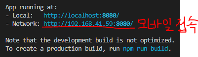
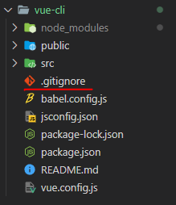
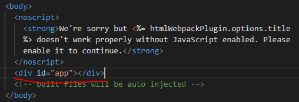
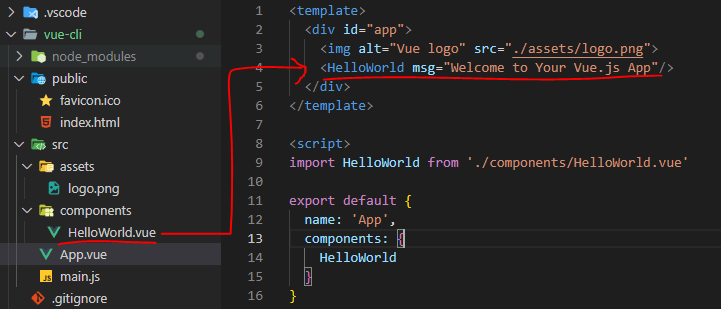

# Node.js

* 자바스크립트는 브라우저를 조작하는 유일한 언어
  
  * 하지만 브라우저 밖에서는 구동할 수 없었음

* **자바스크립트를 구동하기 위한 런타임 환경인 `Node.js`로 인해 브라우저가 아닌 환경에서도 구동할 수 있게 됨**
  
  * Browser만 조작 가능했으나, Server-Side-Programming 또한 가능

## ▶ NPM (Node Package Manage)

> 자바스크립트 패키지 관리자

* Python에 pip처럼 Node.js에는 npm

* pip와 마찬가지로 다양한 의존성 패키지를 관리

* Node.js의 기본 패키지 관리자 = 별도 설치 X

# Vue CLI

> **Vue 개발을 위한 표준 도구 (프로젝트의 구성을 도와주는 역할)**

* 확장 플러그인, GUI, Babel 등 다양한 tool 제공

## ▶ Vue CLI Quick Start

- **설치** = global 환경에서 진행
  
  - **`npm install -g @vue/cli`**

- **프로젝트 생성**
  
  - **vscode terminal에서 진행**
  
  - **`vue create vue-cli(프로젝트명)`**

- Vue 버전 선택 (Vue 2)
  
  - *git bash에서 진행하면 버전 선택이 어려움*

- 프로젝트 생성 성공 = **설치된 폴더로 이동 후 서버 켜기**
  
  - **`cd vue-cli`**
  
  - **`npm run serve`**



## ▶ Vue CLI 프로젝트 구조



* `git init`이 실행된 상태로 설치됨

## ▶ node_modules

> node.js 환경의 여러 의존성 모듈

* python의 venv와 비슷한 역할
  
  * **`.gitignore`에 넣어주어야 하며,** Vue 프로젝트를 생성하면 자동으로 추가됨

## ▶ Babel (node_modules)

> JavaScript compiler

* **<mark>자바스크립트의 ES6+ 코드를 구버전으로 번역/변환 해주는 도구</mark>**

* *자바스크립트의 파편화, 표준화의 영향으로 작성된 코드의 스펙트럼이 매우 다양*
  
  * *최신 문법을 사용해도 브라우저의 버전 별로 동작하지 않는 상황이 발생*
  
  * <mark>**버전에 따른 같은 의미의 다른 코드를 작성하는 등의 대응이 필요**</mark>해졌고, 이러한 문제를 해결하기 위한 도구
  
  * 최신 버전(원시 코드)을 구 버전(목적 코드)으로 옮기는 번역기가 등장하면서 코드가 특정 브라우저에서 동작하지 않는 상황에 대해 크게 고민하지 않게 됨

* 동작 예시

```javascript
// 원시 코드
[1, 2, 3].map((n) => n + 1);

// 목적 코드 = compile 이후 
[1, 2, 3].map(function(n) {
  return n + 1;  
});
```

## ▶ Webpack (node_modules)

> Static module bundler

* **<mark>모듈 간의 의존성 문제를 해결하기 위한 도구</mark>**

* 프로젝트에 필요한 모든 모듈을 매핑하고 내부적으로 종속성 그래프를 빌드함

## ▶ Module

* *개발하는 애플리케이션의 크기가 커지고 복잡해지면 파일 하나에 모든 기능을 담기가 어려워짐*

* 자연스럽게 파일을 여러 개로 분리하여 관리를 하게 되었고, 이때 분리된 파일 각각이 모듈 **즉, js 파일 하나가 하나의 모듈**

* **<mark>모듈은 대개 기능 단위로 분리</mark>하며, 클래스 하나 혹은 특정한 목적을 가진 복수의 함수로 구성된 라이브러리 하나로 구성됨**

* 여러 모듈 시스템
  
  * ESM (ECMA Script Module), AMD, CommonJS, UMD

* **Module 의존성 문제**
  
  * *모듈의 수가 많아지고 라이브러리 혹은 모듈 간의 의존성(연결성)이 깊어지면서 특정한 곳에서 발생한 문제가 어떤 모듈 간의 문제인지 파악하기 어려움*
    
    * **Webpack은 이 모듈 간의 의존성 문제를 해결하기 위해 등장**

## ▶ Bundler

> 모듈 의존성 문제를 해결해주는 작업이 Bundling

* **이러한 일을 해주는 도구가 Bundler, Webpack은 다양한 Bundler 중 하나**

* 모듈들을 하나로 묶어주고 묶인 파일은 하나(혹은 여러개)로 만들어짐

* **<mark>Vue CLI는 이러한 Babel, Webpack에 대한 초기 설정이 자동으로 되어 있음</mark>**

## ▶ Webpack - static module bundler

image

* 의존성을 Webpack이 담당해 주므로 개발자는 npm install을 사용해 다양한 모듈을 한 번에 설치하고 각 모듈을 사용해 개발에 집중할 수 있음 But, 무겁다

## ▶ package.json

* **프로젝트의 종속성 목록과 지원되는 브라우저에 대한 구성 옵션을 포함**

* django에서 `manage.py`와 유사

## ▶ package-lock.json

* **node_modules에 설치되는 모듈과 관련된 모든 의존성을 설정 및 관리**

* 협업 및 배포 환경에서 정확히 동일한 종속성을 설치하도록 보장하는 표현
  
  * **<mark>사용할 패키지의 버전 고정</mark> = 개발 과정 간의 의존성 패키지 충돌 방지**

* python의 `requirements.txt` 역할

* `npm install` = node_modules 가 생성됨 (git pull 이후 해야 할 작업)

## ▶ public/index.html

* Vue 앱의 뼈대가 되는 html 파일

* Vue 앱과 연결될 요소가 있음



## ▶ src

* **`src/assets`**
  
  * **정적 파일을 저장하는 디렉토리**

* **`src/components`**
  
  * 하위 컴포넌트들이 위치

* **`src/App.vue`**
  
  * **최상위 컴포넌트**
  
  * **`public/index.html`과 연결됨**

* **`src/main.js`**
  
  * webpack이 빌드를 시작할 때 가장 먼저 불러오는 entry point
  
  * **`public/index.html`과 `src/App.vue`를 연결시키는 작업이 이루어지는 곳**

# Component

> **UI를 독립적이고 재사용 가능한 조각들로 나눈 것 = 기능별로 분화한 코드 조각**

* CS에서는 다시 사용할 수 있는 범용성을 위해 개발된 소프트웨어 구성 요소를 의미

* 하나의 app을 구성할 때 중첩된 컴포넌트들의 tree로 구성하는 것이 보편적
  
  * Web 시간에 배운 HTML 요소들의 중첩을 떠올려 보자
    
    * body tag를 root node로 하는 tree의 구조
    
    * **Vue에서는 `src/App.vue`를 root node로 하는 tree의 구조를 생성**

* **컴포넌트는 유지보수를 쉽게 하고 재사용성을 높임**

* 우리가 사용하는 웹 서비스는 여러 개의 컴포넌트로 이루어져 있음
  
  * 하나의 컴포넌트를 만들어주면 반복되는 UI를 쉽게 처리할 수 있음

image

## ▶ Django에서의 예시

* base.html과 index.html을 분리하여 작성했지만, 하나의 화면으로 볼 수 있음
  
  * 즉, 한 화면은 여러 개의 컴포넌트로 이루어질 수 있음

image

* base.html을 변경하면 이를 extends하는 모든 화면에 영향을 미침
  
  * 유지보수가 쉬움

image

### 📌 [참고] component based architecture 특징

* **관리가 용이 = 유지/보수 비용 감소**

* **재사용성**

* 확장 가능

* 캡슐화

* 독립적

# SFC

## ▶ component in Vue

* **이름이 있는 재사용 가능한 Vue instance**

* Vue instance란?
  
  * **`new Vue()` 로 만든 인스턴스를 의미**❗

## ▶ SFC (Single File Component)

* **하나의 `.vue` 파일이 하나의 `Vue instance`이고, 하나의 컴포넌트**
  
  * 즉, Singli File Component

* Vue instance에서는 HTML, CSS, JavaScript 코드를 한 번에 관리
  
  * **이 Vue instance를 기능 단위로 작성하는 것이 핵심**❗

* 컴포넌튼 기반 개발의 핵심 기능

* HTML, CSS, 그리고 JavaScript를 .vue라는 확장자를 가진 파일 안에서 관리하면 개발

* Vue CLI가 Vue를 Component based하게 사용하도록 도와줌



# Vue component

## ▶ Vue component 구조

* **템플릿(HTML)**
  
  * HTML의 body 부분
  
  * 눈으로 보여지는 요소 작성
  
  * 

* **스크립트(JavaScript)**
  
  * JavaScript 코드가 작성되는 곳
  
  * 컴포넌트 정보, 데이터, 메서드 등 vue 인스턴스를 구성하는 대부분이 작성됨

* **스타일(CSS)**
  
  * CSS가 작성되며 컴포넌트의 스타일을 담당

## ▶ 구조 정리

* 컴포넌트들이 tree 구조를 이루어 하나의 페이지를 만듦

* root에 해당하는 최상단의 component가 App.vue

* App.vue를 index.html과 연결

* <mark>**결국 index.html 파일 하나만을 rendering = SPA 방식**</mark>❗

# Vue component 실습

## ▶ 현재 구조

* Vue CLI 를 실행하면 이미 `HelloWorld.vue`라는 컴포넌트가 생성되어 있고 `App.vue`에 등록되어 사용되고 있음
  
  * npm run serve 명령어를 진행했을 때 나온 화면의 대부분이 `HelloWorld.vue`

img & code

## ▶ MyComponent.vue 생성 3단계

1️⃣ **`src/components/` 안에 생성**

2️⃣ **script에 이름 등록**

3️⃣ **template에 요소(태그 1개) 추가**

📍 <mark>**주의) template 안에는 반드시 하나의 요소만 추가 가능**</mark>❗

* **비어 있어도 안됨**

* **해당 요소 안에 추가 요소를 작성해야 함**

## ▶ component 등록 3단계❗

1️⃣ **불러오기**

* **`import {instance name} from {위치}`**

* instance name은 instance 생성 시 작성한 name

* **`@`는 src의 shortcut**

* **`.vue` <mark>생략 가능</mark>**

2️⃣ **등록하기**

* `components` 속성에 등록

3️⃣ **보여주기**

* 닫는 태그만 있는 요소처럼 사용 = `<import name/>`

* PasacalCase로 작성

## ▶ 자식 컴포넌트 작성

> MyComponent의 자식(하위) 컴포넌트를 만들기

* `src/compnents/` 안에 `MyChild.vue` 생성
  
  * 3단계 진행

* `MyComponent`에 MyChild 등록
  
  * 3단계 진행

* component의 재사용 가능

* 

# Pass Props & Emit Event

## ▶ Data in components

* 우리는 정적 웹페이지가 아닌, 동적 웹페이지를 원함
  
  * 웹페이지에서 다뤄야 할 데이터가 필요
  
  * User data, 게시글 data 등

* 한 페이지 내에서 같은 데이터를 공유해야 함
  
  * 하지만 페이지들은 component로 구분되어 있음

* MyComponent에 정의된 data를 MyChild에서 사용하려면 어떻게?

* MyChild에도 똑같은 data를 정의
  
  * MyComponent의 data와 MyChild의 데이터는 독립적이므로 서로 다른 data

* 완전히 동일한 data를 서로 다른 component에서 어떻게 

* *필요한 컴포넌트들끼리 데이터를 주고받으면 될까?*
  
  * *데이터의 흐름을 파악하기 힘듦*
  
  * *개발 속도 저하*
  
  * *유지보수 난이도 증가*

* <mark>**컴퍼넌트는 부모-자식 관계를 가지고 있으므로 부모-자식 관계만 데이터를 주고받음**❗</mark>
  
  * **데이터의 흐름을 파악하기 용이**
  
  * **유지 보수하기 쉬움**

img

## ▶ pass props & emit event

* 부모 => 자식으로의 데이터 흐름
  
  * **pass props 방식 (데이터)**

* 자식 => 부모로의 데이터 흐름
  
  * **emit event 방식 (이벤트)**

## ▶ Pass Props

> **<mark>부모 컴포넌트는 요소의 속성(property)을 사용하여 데이터를 전달</mark>**

* **`props` 는 부모(상위) 컴포넌트의 정보를 전달하기 위한 사용자 지정 특성**

* **<mark>자식(하위) 컴포넌트는 `props` 옵션을 사용하여 수신</mark>하는 props를 명시적으로 선언해야 함**

* 요소에 속성을 작성하듯이 사용 가능하여, **`prop-data-name="value"`의 형태로 데이터를 전달**
  
  * 이 때 속성의 값은 kebab-case를 사용
    
    * 보낼 때는 `html` 에 작성 => `kebab-case`
    
    * 받을 때는 `JS`로 작성 => `CamelCase`

```html
<!-- MyComponent.vue -->
<template>
  <!-- 반드시 최상위 태그 하나가 있어야 함-->
  <div class="border">
    <h1>싸피, 이거는 내가 만든 새로운 컴포넌트!</h1>
    <!-- 3. 보여주기 -->
    <MyComponentItem static-props="MyComponent에서 보낸 데이터"/>
  </div>
</template>
```

```javascript
// MyChild.vue
<template>
  <div>
    <h3>나는 MyComponent의 하위 컴포넌트</h3>
    <p>{{ staticProps }}</p>
  </div>
</template>

<script>
export default {
  name: 'MyComponentItem',
  props: {
    staticProps: String,
  }
}
</script>
```

## ▶ Pass Props convention

* 부모에서 넘겨주는 props
  
  * **`kebab-case`** = HTML 속성명은 대소문자를 구분하지 않기 때문

* 자식에서 받는 props
  
  * **`camelCase`**

* 부모 템플릿(html)에서 ~~

## ▶ Dynamic props

> **변수를 props로 전달할 수 있음**

* **`v-bind` directive를 사용해 <mark>데이터를 동적으로 바인딩</mark>**
  
  ```javascript
  <template>
    <div class="border"
      <MyComponentItem static-props="MyComponent에서 보낸 데이터"/>
      <!-- 문자열 -->
      <a href="url"></a>
      <!-- v-bind를 통해 JS 표현식을 사용할 수 있음 -->
      <a :href="url"></a>
    </div>
  </template>
  
  <script>
  // 1. 불러오기
  import MyComponentItem from '@/components/MyComponentItem'
  
  export default {
    // 이름을 지어주어야 상위 폴더에서 쉽게 사용 가능!
    name: 'MyComponent',
    data: {
      url: 'https://www.naver.com'
    },
    // 2. 등록하기
    components: {
      MyComponentItem,
    }
  }
  </script>
  ```

* **부모 컴퍼넌트의 데이터가 업데이트 되면 자식 컴포넌트로 전달되는 데이터 또한 업데이트 됨**

* 실습

```javascript
// MyComponent.vue
<template>
  <div class="border">
    <h1>싸피, 이거는 내가 만든 새로운 컴포넌트!</h1>
    <!-- dynamic props -->
    <MyComponentItem static-props="MyComponent에서 보낸 데이터" :dynamic-props="dynamicProps"/>
  </div>
</template>

<script>
import MyComponentItem from '@/components/MyComponentItem'

export default {
  name: 'MyComponent',
  // dynamic props 실습
  data: function () {
    return {
      dynamicProps: "It's in data"
    }
  },

  // 2. 등록하기
  components: {
    MyComponentItem,
  }
}
</script>
```

```javascript
// MyChild.vue
<template>
  <div>
    <h3>나는 MyComponent의 하위 컴포넌트</h3>
    <p>{{ staticProps }}</p>
    <p>{{ dynamicProps }}</p>
  </div>
</template>

<script>
export default {
  name: 'MyComponentItem',
  props: {
    staticProps: String,
    ㅡProps: String,
  }
}
</script>
```

## ▶ 컴포넌트의 data 함수

* **<mark>각 vue 인스턴스는 같은 data 객체를 공유</mark>하므로 새로운 data 객체를 반환(return)하여 사용해야 함**

```javascript
data: function() {
  return {
    // component's data in here
  }
}
```

## ▶ Pass Props

* `:dynamic-props="dynamicProps"` 는 앞의 key값이란 이름으로 뒤의 " " 안에 오는 데이터를 전달하겠다는 뜻

* 즉 `:my-props="dynamicProps"` 로 데이터를 넘긴다면, 자식 컴포넌트에서 `myProps`로 데이터를 받아야함

* v-bind로 묶여있는 " "안의 구문은 javascript의 구문으로 볼 수 있음
  
  * 따라서 dynamicProps라고 하는 변수에 대한 data를 전달할 수 있는 것

* 숫자를 props로 전달하기 위해서 `<SomeComponent :num-props="1"/>` 으로 작성❗
  
  * `<SomeComponent num-props="1"/>` 방식은 static props로 "1"(문자열)을 전달

## ▶ 단방향 데이터 흐름

> **모든 props는 부모에서 자식으로 즉 아래로 단방향 바인딩을 형성**

* 부모 속성이 업데이트 되면 자식으로 흐르지만 반대 방향은 아님
  
  * **부모 컴포넌트가 업데이트될 때마다 자식 컴포넌트의 모든 prop들이 최신 값으로 새로고침 됨**

* **목적**
  
  * **하위 컴포넌트가 실수로 상위 컴포넌트 상태를 변경하여 <mark>앱의 데이터 흐름을 이해하기 힘들게 만드는 것을 방지</mark> = 데이터 추적 편리**

* *하위 컴포넌트에서 prop를 변경하려고 시도해서는 안되며 그럴 경우 Vue는 콘솔에서 경고를 출력함*

# Emit Event

> **자식 컴포넌트에서 부모 컴포넌트로 데이터를 전달할 때는 이벤트를 발생시킴**

## ▶ 이벤트 발생 방법

1️⃣ **데이터를 이벤트 리스너의 <mark>콜백함수의 인자로 전달</mark>**

2️⃣ **상위 컴포넌트는 해당 <mark>이벤트를 통해 데이터를 받음</mark>**

## ▶ $emit

* **`$emit` 메서드를 통해 부모 컴포넌트에 이벤트를 발생**
  
  * **`$emit('event-name')` 형식**으로 사용하며 부모 컴포넌트에 `event-name`이라는 이벤트가 발생했다는 것을 알림
  
  * 마치 사용자가 마우스 클릭을 하면 click 이벤트가 발생하는 것처럼 **`$emit('event-name)` 가 실행되면 `event-name` 이벤트가 발생**❗

### 📌 [참고] $

* JavaScript는 변수에 `_`, `$` 두개의 특수문자를 사용 가능함

* 이 때, 기존에 사용하던 변수, 메서드들과 겹치지 않게 하기 위해서 vue는 `$emit`를 이벤트 전달을 위한 방식으로 선택함

## ▶ Emit Event 순서

① 자식 컴포넌트에 버튼을 만들고 클릭 이벤트를 추가

② **`$emit`을 통해 <mark>부모 컴포넌트에게 child-to-parent 이벤트를 트리거</mark>**

③ **emit된 이벤트를 <mark>상위 컴포넌트에서 청취 후 핸들러 함수 실행</mark>**

```javascript
// MyChild.vue
<template>
  <div>
    <!-- 부모 컴포넌트에게 이벤트 발생시키자 -->
    <button @click="childToParent">클릭!</button>
  </div>
</template>

<script>
export default {
  name: 'MyComponentItem',
  // 부모 컴포넌트의 데이터를 사용하기 위해 선언
  props: {
    staticProps: String,
    dynamicProps: String,
  },
  methods: {
    childToParent: function () {
      // 이벤트명, 데이터 
      this.$emit('child-to-parent', '나는 자식이 보낸 데이터')
    }
  },
}
</script>
```

```javascript
// MyComponent.vue
<template>
  <div class="border">
    <MyComponentItem static-props="MyComponent에서 보낸 데이터" :dynamic-props="dynamicProps"
    @child-to-parent="parentGetEvent"/>
  </div>
</template>

<script>
// 1. 불러오기
import MyComponentItem from '@/components/MyComponentItem'

export default {
  // 이름을 지어주어야 상위 폴더에서 쉽게 사용 가능!
  name: 'MyComponent',
  // dynamic props 실습
  data: function () {
    return {
      dynamicProps: "이건 동적인 데이터!",
    }
  },

  methods: {
    parentGetEvent: function (childData) {
      console.log('자식 컴포넌트에서 발생한 emit 이벤트를 들었다!!')
      console.log(`child component로부터 ${childData}를 받음!`)
    }
  },
}
</script>
```

## ▶ Emit Event 흐름 정리

① 자식 컴포넌트에 있는 버튼 클릭 이벤트를 청취하여 연결된 **핸들러 함수(`childToParent`) 호출**

② 호출된 함수에서 **`$emit` 을 통해 상위 컴포넌트에 이벤트(`child-to-parent`) 발생**

③ **상위 컴포넌트는 자식 컴포넌트가 발생시킨 이벤트(`child-to-parent`)를 청취하여 연결된 핸들러 함수(`parentGetEvent`) 호출**

## ▶ emit with data

* 이벤트를 발생(emit)시킬 때 인자로 데이터를 전달 가능

* **이렇게 전달한 데이터는 이벤트와 연결된 부모 컴포넌트의 핸들러 함수의 인자로 사용 가능**

## ▶ emit with data 흐름 정리

① 자식 컴포넌트에 있는 버튼 클릭 이벤트를 청취하여 연결된 **핸들러 함수(`childToParent`) 호출**

② 호출된 함수에서 **`$emit` 을 통해 상위 컴포넌트에 이벤트(`child-to-parent`) 발생**

* 이벤트에 데이터(child data)를 함께 전달

③ **부모 컴포넌트는 자식 컴포넌트가 발생시킨 이벤트(`child-to-parent`)를 청취하여 연결된 핸들러 함수(`parentGetEvent`) 호출, 함수의 인자로 전달된 데이터(child data)가 포함되어 있음**

④ 호출된 함수에서 console.log('~child data~') 실행

## ▶ emit with dynamic data

* pass props와 마찬가지로 **동적인 데이터도 전달 가능**

```javascript
// MyComponent.vue
<template>
  <div class="border">
    <MyComponentItem @child-input="getDynamicData"/>
  </div>
</template>

<script>
import MyComponentItem from '@/components/MyComponentItem'

export default {
  name: 'MyComponent',
  // dynamic props 실습
  data: function () {
    return {
      dynamicProps: "이건 동적인 데이터!",
    }
  },

  methods: {
    getDynamicData: function (childInputData) {
      console.log(`사용자가 입력한 값은 ${childInputData}입니다.`)
    }
  },
}
</script>
```

```javascript
// MyChild.vue
<template>
  <div>
    <input type="text" v-model="childInputData" @keyup.enter="childInput">
  </div>
</template>

<script>
export default {
  name: 'MyComponentItem',
  data: function () {
    return {
      childInputData: null,
    }
  },

  methods: {
    childInput: function () {
      this.$emit('child-input', this.childInputData)
      this.childInputData = ""
    }
  },
}
</script>
```

## ▶ emit with dynamic data 흐름 정리

① 자식 컴포넌트에 있는 `keyup.enter` 이벤트를 청취하여 연결된 **핸들러 함수(`childInput`) 호출**

② 호출된 함수에서 **`$emit` 을 통해 상위 컴포넌트에 이벤트(`child-input`)를 발생**

- **이벤트에 v-model로 바인딩 된 입력받은 데이터를 전달**

③ **상위 컴포넌트는 자식 컴포넌트가 발생시킨 이벤트(`child-input`)를 청취하여 연결된 핸들러 함수(`getDynamicData`) 호출, 함수의 인자로 전달된 데이터가 포함되어 있음**

④ 호출된 함수에서 console.log('~입력받은 데이터~') 실행

## ▶ pass props / emit event convention

* **HTML 요소에서 사용할 때는 `kebab-case`, JavaScript에서 사용할 때는 `camelCase`**

* **props**
  
  * 상위 => 하위 흐름에서 HTML 요소로 내려줌 = `kebab-case`
  
  * 하위에서 받을 때 JavaScript에서 받음 = `camleCase`

* **emit**
  
  * emit 이벤트를 발생시키면 HTML 요소가 이벤트를 청취함 = `kebab-case`
  
  * 메서드, 변수명 등은 JavaScript에서 사용함 = `camelCase`


