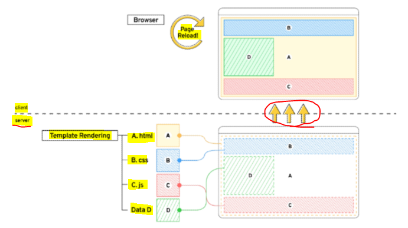

# Front-end Development

> Vue.js === JavaScript Front-end Framework

* Front-end(FE) 개발이란?
  
  * 사용자에게 보여주는 화면 만들기

* **<mark>Web App(SPA)</mark>을** 만들 때 사용하는 도구
  
  * **SPA = Single Page Application**

## ▶ Web App 이란?

> 웹 브라우저에서 실행되는 어플리케이션 소프트웨어

* 예) VIBE 웹 사이트

* 개발자 도구 > 디바이스 모드
  
  * **웹 페이지가 그대로 보이는 것이 아닌 <mark>디바이스에 설치된 App</mark>처럼 보이는 것**
  
  * 웹 페이지가 디바이스에 맞는 적절한 UI/UX로 표현되는 형태

## ▶ SPA (Single Page Application)

* 이전까지는 사용자의 요청에 적절한 페이지 별 template를 반환

* **<mark>SPA는 서버에서 최초 1장의 HTML만 전달받아 모든 요청에 대응</mark>하는 방식을 의미**
  
  * 어떻게 한 페이지로 모든 요청에 대응 할 수 있을까?
  
  * **<mark>CSR (Client Side Rendering)</mark> 방식**으로 요청을 처리하기 때문

### 📌 [참고] SSR (Server Side Rendering) 이란?

> **기존의 요청 처리 방식**

* **Server가 사용자의 요청에 적합한 HTML을 렌더링하여 제공하는 방식**

* *단점 = 전달 받은 새 문서를 보여주기 위해 브라우저는 새로고침을 진행*



## ▶ CSR (Client Side Rendering) 이란?

> **최초 한 장의 HTML을 받아오는 것은 동일**

* **단, server로부터 <mark>최초로 받아오는 문서는 빈 html 문서</mark>**

```html
<body>
  <noscript>
    <strong>We're sorry but ...
    </strong>
  </noscript>
  <div id="app"></div>
  <!-- built files will be auto injected -->
</body>
```

* **각 요청에 대한 대응을 JavaScript를 사용하여 필요한 부분만 다시 렌더링**
  
  ① **<mark>새로운 페이지를 서버에 AJAX로 요청</mark>**
  
  ② **서버는 화면을 그리기 위해 <mark>필요한 데이터를 JSON 방식으로 전달</mark>**
  
  ③ **<mark>JSON 데이터를 JavaScript로 처리, DOM 트리에 반영(렌더링)</mark>**

```javascript
axios.get(
    HOST_URL,
    {
      headers:{
        Authorization: `Token ${key}`
      }
    }
  )
  .then(res => {
    this.todos = res.data
    })
  .catch(err => console.log(err))
```


## ▶ 왜 CSR 방식을 사용? (장점)

1️⃣ 모든 HTML 페이지를 서버로부터 받는 것이 아니기 때문

* **클라이언트와 서버간 통신(트래픽)이 감소**

* **<mark>트래픽이 감소한다 = 응답 속도가 빨라진다</mark>**

2️⃣ 매번 새 문서를 받아 새로고침하는 것이 아니라 **필요한 부분만 고쳐 나가므로 각 요청이 끊김없이 진행**

* *SNS에서 좋아요를 누를 때마다 첫 페이지로 돌아간다면 최악의 UX*

* 요청이 자연스럽게 진행된다 = UX 향상

3️⃣ Back End와 Front End의 작업 영역을 명확히 분리할 수 있음

* **각자 맡은 역할을 명확히 분리 = 협업에 용이**

## ▶ CSR은 만능? (단점)

* *첫 구동 시 필요한 데이터가 많으면 많을수록 최초 작동 시작까지 오랜 시간이 소요*

* Naver, Netflix, Disney+ 등 모바일에 설치된 Web-App을 실행하게 되면 잠깐의 로딩 시간이 필요함

* **<mark>검색 엔진 최적화(SEO</mark>, Search Engine Optimization)가 어려움❗**
  
  * *서버가 제공하는 것은 텅빈 HTML*
  
  * *내용을 채우는 것은 AJAX 요청을 얻은 JSON 데이터로 클라이언트(브라우저)가 진행*

* 대체적으로 HTML에 작성된 내용을 기반으로 하는 검색 엔진에 빈 HTML을 공유하는 SPA 서비스가 노출되기는 어려움

### 📌 [참고] SEO (Search Engine Optimization)

* **google, bing과 같은 검색 엔진 등에 내 서비스나 제품 등이 효율적으로 검색 엔진에 노출되록 개선하는 과정**

* **검색** = 각 사이트가 운용하는 검색 엔진에 의해 이루어지는 작업

* **검색 엔진** = 웹 상에 존재하는 가능한 모든 정보들을 긁어 모으는 방식으로 동작
  
  * 정보의 대상은 주로 HTML에 작성된 내용
  
  * JavaScript가 실행된 이후의 결과를 확인하는 과정이 없음

* **최근에는 SPA, 즉 CSR로 구성된 서비스의 비중이 증가**
  
  * **<mark>SPA 서비스도 검색 대상으로 넓히기 위해 JS를 지원하는 방식으로 발전</mark>**

* *단, 단순 HTML만을 분석하는 것보다 몇 배의 리소스가 필요한 작업이기에 여전히 CSR의 검색 엔진 최적화 문제가 모두 해결된 것은 아님❗*

## ▶ CSR vs SSR

> **내 서비스에 적합한 렌더링 방식을 적절하게 활용할 수 있어야 함**

* **SPA 서비스에서도 SSR을 지원하는 Framework도 발전하고 있음**
  
  * Vue의 Nuxt.js
  
  * React의 Next.js
  
  * Angular Universal 등

# Why Vue?

* 타 Framework에 비해 입문자가 시작하기 좋으며 쉽다.
  
  * 구조가 매우 직관적
  
  * FE Framework를 빠르고 쉽게 학습하고 활용 가능

* **Angular보다 가볍고, 간편하게 사용할 수 있는 Framework**

* 국내/외 실용 사례 = programmers, Google Careers, VIBE, GitLab 등


## ▶ Vue 없이 코드 작성하기

> 입력 받은 값을 name 뒤에 출력하기

```html
<!DOCTYPE html>
<html lang="en">
  ...
  <body>
    <div id="app">
      <p id="name">name : </p>
      <input id="inputName" type="text">
    </div>

    <script>
      const name = document.querySelector('#name')
      const input = document.querySelector('#inputName')
      input.addEventListener('input', function (e) {
      ...   
      })
    </script>
  </body>
</html>
```

* input tag, p tag 선택 후 addEventListener 추가

* **입력 받은 데이터를 p tag에 추가하려면?**
  
  * **기존에 가지고 있었던 text도 신경 써야함**
  
  * **data를 관리하기 위한 추가 작업이 필요**

```html
<script>
  input.addEventListner('input', function (e) {
    name.innerText = name.innerText + e.target.value
  })
</script>
```

## ▶ Vue CDN

* Vue 로 작업을 시작하기 위하여 CDN을 가져와야 함

* Django == Python Web Framework
  
  * pip install

* Vue === JS Front-end Framework
  
  * Bootstrap에서 사용했던 CDN 방식을 제공

* Vue2 공식 문서(https://v2.vuejs.org/) 에서 Development version CDN 복사

## ▶ Vue 코드로 작성하기

> 입력 받은 값을 name 뒤에 출력하기

① Vue CDN 가져오기

② Vue instance 생성

* Vue instance = 1개의 Object

* 정해진 속성명을 가진 Object

**③ el, data 설정**

* data에 관리할 속성 정의

**④ 선언적 렌더링 `{{ }}`**

* Vue data를 화면에 렌더링

**⑤ input tag에 v-model 작성**

* input에 값 입력 `->` Vue data 반영

* Vue data `->` DOM 반영

```html
<body>
  <div id="app">
    <p id="name">name : {{ message }}</p>
    <input type="text" v-model="message">
  </div>
  <script>
    const app = new Vue({
      el: '#app',
      data: {
        message: '',
      },
  })
  </script>
</body>
```

### 📌  [참고] Dev Tools 확인

* Vue devtools에서 data 변경 `->` DOM 반영

* **눈에 보이는 화면을 조작하는 것이 아닌 Vue가 가진 data를 조작**


## ▶ Facebook 예시

* *한 명의 유저가 이름을 변경한다면 화면에서 조작해야 할 영역이 매우 많음*


* Vanilla JS만으로 모든 데이터를 조작한다면? *불필요한 코드 반복*


* **Vue 를 통해 데이터를 관리한다면? 변경 사항도 <mark>하나의 Data로 관리</mark>하여 한 번에 반영**


# Vue 2 vs Vue 3

## ▶ Vue3

> 2022년 02월부터 Vue 프레임워크의 기본 버전이 3버전으로 전환

* 대부분의 설정들이 Vue3을 기본으로 적용되어 있음
  
  * 예) 공식문서, CDN, npm 등

## ▶ Vue2

> **여전히 Vue2 가 많이 사용됨(legacy code)**

* 사용된 기간이 긴 만큼 상대적으로 많은 문서의 양, 참고자료, 질문/답변

* 안정적인 측면에서 우세

# Vue instance

## ▶ MVVM Pattern

> 소프트웨어 아키텍처 패턴의 일종

* 마크업 언어로 구현하는 **<mark>그래픽 사용자 인터페이스(view)의 개발을 Back-end(model)로부터 분리</mark>시켜 view가 어느 특정한 모델 플랫폼에 종속되지 않도록 함**


* **<mark>View</mark>**
  
  * 우리 눈에 보이는 부분 = DOM

* **<mark>Model</mark>**
  
  * 실제 데이터 = JSON

* **<mark>View Model(Vue)</mark>**
  
  * View를 위한 Model
  
  * **<mark>View와 연결(binding)되어 Action을 주고 받음</mark>**
  
  * **<mark>Model이 변경되면 View Model도 변경되고 바인딩된 View도 변경됨</mark>**
  
  * **View에서 사용자가 데이터를 변경하면 View Model의 데이터가 변경되고 바인딩된 다른 View도 변경됨**

* 서로의 독립성(Vue를 통해 연결되어 있기 때문)이 높으므로 의존성이 낮다.


## ▶ Vue instance

① Vue CDN 가져오기

② **`new` 연산자를 사용한 생성자 함수 호출**

* **Vue instance 생성** 

③ 인스턴스 출력 및 확인

```html
<!-- Vue CDN -->
  <script src="https://cdn.jsdelivr.net/npm/vue@2/dist/vue.js"></script>
  <script>
    // CODE HERE
    // 1. Vue instance constructor
    const vm = new Vue()
    console.log(vm)
  </script>
```

* Vue instance === 1개의 객체

* 아주 많은 속성과 메서드를 이미 가지고 있고, 이러한 기능들을 사용하는 것

### 📌 [참고] 생성자 함수

* **JS에서 객체를 하나 생성한다고 한다면?**
  
  * 하나의 객체를 선언하여 생성
    
    ```javascript
    const member = {
      name: 'aiden',
      age: 22,
      sId: 2022311491,
    }
    ```

* **동일한 형태의 객체를 또 만든다면?**
  
  * 또 다른 객체를 선언하여 생성
    
    ```javascript
    const member2 = {
      name: 'haley',
      age: 20,
      sId: 2022311492,
    }
    ```

* **동일한 구조의 객체를 여러 개 만들고 싶다면?**
  
  * 생성자 함수는 특별한 함수를 의미하는 것이 아님
  
  * **`new` 연산자로 사용하는 함수**
    
    ```javascript
    function Member(name, age, sId) {
      this.name = name
      this.age = age
      this.sId = sId
    }
    
    const member3 = new Member('issac', 21, 2022654321)
    ```

* 함수 이름은 반드시 대문자로 시작

* **생성자 함수를 사용할 때는 반드시 `new` 연산자를 사용**

## ▶ el (element)

* **<mark>Vue instance와 DOM을 mount(연결)하는 옵션</mark>**
  
  * **View와 Model을 연결하는 역할**
  
  * **<mark>HTML id</mark> 혹은 class와 마운트(연결) 가능**

* **<mark>Vue instance 와 연결되지 않은 DOM 외부는 Vue의 영향을 받지 않음</mark>**
  
  * *Vue 속성 및 메서드 사용 불가*

① 새로운 Vue instance 생성

**② 생성자 함수 첫 번째 인자로 <mark>Object 작성</mark>**

* **el 옵션에 `#app` 작성 = DOM 연결**

③ instance 출력

```html
<div id="app">
</div>
...
<script>
  const app = new Vue({
    el: '#app'
  })
  console.log(app)
</script>
```

* Vue와 연결되지 않은 div 생성
  
  * 두 div 모두에 {{ message }} 작성
  
  * 결과 확인

* **message 속성이 정의되지 않았다는 경고와 {{ message }}가 그대로 출력되는 차이**

```html
<div id="app">
  {{ message }}
</div>
<div>
  {{ message }}
</div>
<script>
  const app = new Vue({
    el: '#app'
  })
  console.log(app)
</script>
```

## ▶ data

> **Vue instance에서 사용하는 변수들을 모아둔 곳**

* **Vue instance의 <mark>데이터 객체</mark> 혹은 <mark>인스턴스 속성</mark>**

* **데이터 객체는 <mark>반드시 기본 객체</mark> `{}`(Object)여야 함**

* **<mark>객체 내부의 아이템들은 value로 모든 타입의 객체를 가질 수 있음</mark>**

* **정의된 속성은 <mark>interpolation {{}} 을 통해 view에 렌더링 가능</mark>함**

```html
<div id="app">
  {{ message }}
</div>
<script>
  const app = new Vue({
    el: '#app',
    data: {
      message: 'Hello, Vue!'
    },
  })
  console.log(app)
</script>
```

* Vue instance에 **`data`** 객체 추가

* data 객체에 **`message`** 값 추가

* **<mark>추가된 객체의 각 값들은 `this.message` 형태로 접근 가능</mark>**

## ▶ methods

> Vue instance의 method들을 정의하는 곳

* methods 객체 정의
  
  * **객체 내 print method 정의**
  
  * **<mark>print method 실행 시 Vue instance의 data 내 message 출력</mark>**

* **콘솔창에서 app.print() 실행**
  
  * **`this` 가 가리키는 것은 `new Vue` 객체** 

```javascript
<script>
  const app = new Vue({
    el: '#app',
    data: {
      message: 'Hello, Vue!'
    },
    methods: {
      print: function () {
        console.log(this.message)
      },
      bye: function () {
        this.message = 'Bye, Vue!'
      },
    }
  })
</script>
```

* **<mark>method 를 호출하여 data 변경 가능</mark>**
  
  * 객체 내 bye method 정의
  
  * **print method 실행 시 Vue instance의 data 내 message 변경**

* **콘솔창에서 app.bye() 실행**
  
  * DOM에 바로 변경된 결과 반영
  
  * Vue의 강력한 반응성(reactivity)

### 📍 [주의] methods with Arrow Function

* <mark>**메서드를 정의할 때, Arrow Function 을 사용하면 안됨**</mark>❗❗

* *Arrow Function의 this 는 함수가 선언될 때 상위 스코프를 가리킴*
  
  * *즉, this가 상위 객체 window를 가리킴*
  
  * **호출은 문제없이 가능하나 this로 Vue의 data를 변경하지 못함**

# Basic of Syntax

> Vue2 guide > template syntax 참고

* **<mark>렌더링 된 DOM</mark>을 기본 Vue instance의 data에 <mark>선언적으로 바인딩</mark>할 수 있는 <mark>HTML 기반 template syntax를 사용</mark>**
  
  * 렌더링 된 DOM = 브라우저에 의해 보기 좋게 그려질 HTML 코드
  
  * HTML 기반 templates syntax = HTML 코드에 직접 작성할 수 있는 문법 제공
  
  * **<mark>선언적으로 바인딩 = Vue instance와 DOM을 연결</mark>**

```html
<script>
    // 1. Text interpolation
    const app = new Vue({
      el: '#app',
      data: {
        msg: 'Text interpolation',
      }
    })
</script>
```

* 가장 기본적인 바인딩(연결) 방법
  
  * **중괄호 2개로 표기**
  
  * DTL과 동일한 형태로 작성

* Template interpolation 방법은 HTML을 일반 텍스트로 표현

```html
<body>
  <!-- 1. Text interpolation -->
  <div id="app">
    <p>메시지: {{ msg }}</p>   
    <p>HTML 메시지 : {{ rawHTML }}</p>
    <p>HTML 메시지 : <span v-html="rawHTML"></span></p>
```

- **v-html** directive을 사용하여 data와 바인딩

### 📌 [참고] JS 표현식

* 표현식 형태로도 작성 가능

```javascript
<body>
  <div id="app">
    <p>{{ msg.split('').reverse().join('') }}</p>
  </div>
```

# Directives

## ▶ 기본 구성

* v-접두사가 있는 특수 속성에는 값을 할당할 수 있음
  
  * **값에는 JS 표현식을 작성할 수 있음**

* **directive의 역할은 <mark>표현식의 값이 변경될 때 반응적으로 DOM에 적용</mark>하는 것**


* **`:` 을 통해 전달인자를 받을 수 있음**

* **`.` 으로 표시되는 특수 접미사 -directive를 특별한 방법으로 바인딩 해야 함**

## ▶ 새로운 Vue instance 생성

* 각각의 instance들은 연결된 DOM element에만 영향을 미침

* 연결되지 않은 DOM이 Vue의 영향을 받지 않았던 것과 동일한 상황

```html
<!-- 2. v-text & v-html -->
  <div id="app2">
    <!-- 2-1. v-text & {{}} -->
    <p v-text="message"></p>
    <!-- 같음 -->
    <p>{{ message }}</p>

  <script src="https://cdn.jsdelivr.net/npm/vue@2/dist/vue.js"></script>
  <script>
    // 2. v-text && v-html
    const app2 = new Vue({
      el: '#app2',
      data: {
        message: 'Hello!',
        html: '<a href="https://www.google.com">GOOGLE</a>'
      }
    })
  </script>
```

## ▶ v-text

* Template Interpolation 과 함께 가장 기본적인 바인딩 방법

* `{{ }}`와 동일한 역할
  
  * 정확히 동일한 역할인 것은 아님

```html
<!-- 2. v-text & v-html -->
  <div id="app2">
    <!-- 2-1. v-text & {{}} -->
    <p v-text="message"></p>
    <!-- 같음 -->
    <p>{{ message }}</p>
  </div>
```

## ▶ v-html

- RAW HTML을 표현할 수 있는 방법
  
  - <mark>**단, 사용자가 입력하거나 제공하는 컨텐츠에는 절대 사용 금지**</mark>❗❗

```html
<div id="app2">
    <!-- 2-2. v-html -->
    <p v-html="html"></p>
</div>
<script>
    // 2. v-text && v-html
    const app2 = new Vue({ 
      el: '#app2',
      data: {
        message: 'Hello!',
        html: '<a href="https://www.google.com">GOOGLE</a>'
      }
    })
  </script>
```

## ▶ v-show❗

* **표현식에 작성된 값에 따라 element를 보여줄 것인지 결정**
  
  * boolean 값이 변경될 때 마다 반응

* **<mark>대상 element의 display 속성을 기본 속성과 none으로 toggle</mark>**

* 요소 자체는 항상 DOM에 랜더링 됨

```html
<!-- 3. v-show && v-if -->
  <div id="app3">
    <p v-show="isActive">보이니? 안보이니?</p>
  </div>

<!-- 3. v-show && v-if -->
<script>
    const app3 = new Vue({
      el: '#app3',
      data: {
        isActive: false
      }
    })
</script>
```

* **<mark>바인딩 된 is Active의 값이 false이므로 첫 방문 시 p tag는 보이지 않음</mark>**
  
  * vue dev tools에서 isActive 변경 시 화면에 출력
  
  * 값을 false로 변경 시 다시 사라짐

* **<mark>화면에서만 사라졌을 뿐, DOM에는 존재</mark>**
  
  * display 속성이 변경되었을 뿐

## ▶ v-if❗

* v-show 와 사용방법은 동일

* **isActive의 값이 변경될 때 반응**
  
  * **<mark>단, 값이 false인 경우 DOM에서 사라짐</mark>**

* **`v-if`, `v-else-if`, `v-else` 형태로 사용**

```html
<!-- 3. v-show && v-if -->
  <div id="app3">
    <p v-if="isActive">안보이니? 보이니?</p>
  </div>

<!-- 3. v-show && v-if -->
<script>
    const app3 = new Vue({
      el: '#app3',
      data: {
        isActive: false
      }
    })
</script>
```

## ▶ v-show VS v-if❗

* **v-show (Expensive initial load, cheap toggle)** = 만들어 놓고 on / off
  
  * 표현식 결과와 관계없이 렌더링 되므로 *초기 렌더링에 필요한 비용은 v-if보다 높을 수 있음*
  
  * **<mark>display 속성 변경으로 표현 여부를 판단하므로 렌더링 후 toggle 비용은 적음</mark>**

* **v-if (Cheap initial load, expensive toggle)** = 그렸다 / 지웠다
  
  * **표현식 결과가 false인 경우 렌더링조차 되지 않으므로 <mark>초기 렌더링 비용은 v-show보다 낮을 수 있음</mark>**
    
    * *단, 표현식 값이 자주 변경되는 경우 잦은 재 렌더링으로 비용이 증가할 수 있음* = toggle 비용은 비쌈

## ▶ v-for

* **`for ... in ...` 형식으로 작성**

* 반복한 데이터 타입에 모두 사용 가능

* **index를 함께 출력하고자 한다면 `(char, index)` 형태로 사용 가능**

```html
<!-- 3. v-for -->
  <div id="app">
    <h2>String</h2>
    <div v-for="char in myStr">
      {{ char }}
    </div>
    <div v-for="(char, index) in myStr" :key="index">
      <p>{{ index }}번째 문자열 {{ char }}</p>
    </div>

<script>
    const app = new Vue({
      el: '#app',
      data: {
        // 1. String
        myStr: 'Hello, World!',
      }
    })
</script>
```

* **배열 역시 문자열과 동일하게 사용 가능**

* **<mark>각 요소가 객체라면 `.` (dot notation)으로 접근</mark>할 수 있음**

```html
<h2>Array</h2>
    <div v-for="(item, index) in myArr" :key="index">
      <p>{{ index }}번째 아이템 {{ item }}</p>
    </div>

    <div v-for="(item, index) in myArr2" :key="`arry-${index}`">
      <p>{{ index }}번째 아이템</p>
          <p>{{ item.name }}</p>
    </div>

<script>
    const app = new Vue({
      el: '#app',
      data: {
        // 2-1. Array
        myArr: ['python', 'django', 'vue.js'],

        // 2-2. Array with Object
        myArr2: [
          { id: 1, name: 'python', completed: true},
          { id: 2, name: 'django', completed: true},
          { id: 3, name: 'vue.js', completed: false},
        ],
      }
    })
  </script>
```

* **객체 순회 시 value가 할당되어 출력**

* **<mark>2번째 변수 할당 시 key 출력 가능</mark>**

```html
<h2>Object</h2>
    <div v-for="value in myObj">
      <p>{{ value }}</p>
    </div>

    <div v-for="(value, key) in myObj"  :key="key">
      <p>{{ key }} : {{ value }}</p>
    </div>

<script>
    const app = new Vue({
      el: '#app',
      data: {
        // 3. Object
        myObj: {
          name: 'harry',
          age: 27
        },
      }
    })
  </script>
```

### 📌 [참고] 특수 속성 key

* **<mark>v-for 사용 시 반드시 key 속성을 각 요소에 작성</mark>❗**

* **주로 v-for directive 작성 시 사용**

* vue 화면 구성 시 이전과 달라진 점을 확인하는 용도로 활용
  
  * *따라서 key가 중복되어서는 안됨*

* 각 요소가 고유한 값을 가지고 있다면 생략 가능

```html
<div v-for="(char, index) in myStr" :key="index">
      <p>{{ index }}번째 문자열 {{ char }}</p>
    </div>

    <h2>Array</h2>
    <div v-for="(item, index) in myArr" :key="`sfy-${index}`">
      <p>{{ index }}번째 아이템 {{ item }}</p>
    </div>

    <div v-for="(item, index) in myArr2" :key="`arry-${index}`">
      <p>{{ index }}번째 아이템</p>
          <p>{{ item.name }}</p>
    </div>
```

## ▶ v-on = EventListner

* **`:` 을 통해 전달받은 인자를 확인**

* 값으로 JS 표현식 작성

* **`addEventListener`의 첫 번째 인자와 동일한 값들로 구성**

* 대기하고 있던 이벤트가 발생하면 할당된 표현식 실행

```html
<div id="app">
    <button v-on:click="number++">increase Number</button>
    <p>{{ number }}</p>
</div>

<script>
    const app = new Vue({
      el: '#app',
      data: {
        number: 0,
        isActive: false,
      },
    })
</script>
```

* **method를 통한 data 조작도 가능**

* method에 인자를 넘기는 방법은 일반 함수를 호출할 때와 동일한 방식
  
  ```html
  <div id="app">
      <button v-on:click="number++">increase Number</button>
      <p>{{ number }}</p>
  
      <button v-on:click="toggleActive">toggle isActive</button>
      <p>{{ isActive }}</p>
  </div>
  
  <script>
      const app = new Vue({
        el: '#app',
        data: {
          number: 0,
          isActive: false,
        },
        methods: {
          toggleActive: function () {
            this.isActive = !this.isActive
          },
  
          checkActive: function (check) {
            console.log(check)
          }
        }
      })
  </script> 
  ```

* **`:` 을 통해 전달된 인자에 따라 특별한 modifiers(수식어)가 있을 수 있음**
  
  * 예) `v-on:keyup.enter` 등
    
    * 엔터키를 눌렀을 때

* **`@` <mark>shortcut 제공</mark>**
  
  * 예) `@keyup.click`

```html
<div id="app">
    <button @click="checkActive(isActive)">check isActive</button>
</div>
```

## ▶ v-bind

> **HTML 기본 속성에 Vue data를 연결**

* class의 경우 다양한 형태로 연결 가능
  
  * **조건부 바인딩**
    
    * {'class Name': '조건 표현식'}
    
    * 삼항 연산자도 가능
  
  * **다중 바인딩**
    
    * **['JS 표현식', 'JS 표현식', ...]**
    
    * 문자열이 아님❗ 변수를 사용❗

```html
<div id="app2">
  <a v-bind:href="url">Go To GOOGLE</a>

  <p v-bind:class="redTextClass">빨간 글씨</p>
  <p v-bind:class="{ 'red-text': true }">빨간 글씨</p>
  <p v-bind:class="[redTextClass, borderBlack]">빨간 글씨, 검은 테두리</p>

  <p :class="theme">상황에 따른 활성화</p>
  <button @click="darkModeToggle">dark Mode {{ isActive }}</button>  
</div>

<script>
    const app2 = new Vue({
      el: '#app2',
      data: {
        url: 'https://www.google.com/',
        redTextClass: 'red-text',
        borderBlack: 'border-black',
        isActive: true,
        theme: 'dark-mode'
      },
      methods: {
        darkModeToggle() {
          this.isActive = !this.isActive
          if (this.isActive) {
            this.theme = 'dark-mode'
          } else {
            this.theme = 'white-mode'
          }
        }
      }
    })
</script>
```

* Vue data의 변화에 반응하여 DOM에 반영하므로 상황에 따라 유동적 할당 가능

* **`:` <mark>shortcut 제공</mark>**
  
  * 예) `:class` 등
  
  * v-for에서 사용했던 `:key`는 v-bind의 shortcut을 활용한 것

```html
<div>
    <p :class="theme">상황에 따른 활성화</p>
    <button @click="darkModeToggle">dark Mode {{ isActive }}</button>
</div>
```

## ▶ v-model

* **<mark>Vue instance와 DOM의 양방향 바인딩</mark>**
  
  * **<mark>사용자로부터 입력을 받는 Tag에 주로 사용 (input, textarea, select 등)</mark>**

* Vue data 변경 시 v-model로 연결된 사용자 입력 element에도 적용

```html
<div id="app">
    <h2>1. Input -> Data</h2>
    <h3>{{ myMessage }}</h3>
    <input @input="onInputChange" type="text">
    <hr>
</div>

<script>
    const app = new Vue({
      el: '#app',
      data: {
        myMessage: '',
      },
      methods: {
        onInputChange: function (event) {
          this.myMessage = event.target.value
        },
      }
    })
</script>
```

* **한 번에 연결하는 방법 = 양방향 바인딩**

```html
<div id="app">
    <h2>2. Input <-> Data</h2>
    <h3>{{ myMessage2 }}</h3>
    <input v-model="myMessage2" type="text">
    <hr>
</div>

<script>
    const app = new Vue({
      el: '#app',
      data: {
        myMessage2: '',
      },
      methods: {
        onInputChange: function (event) {
          this.myMessage = event.target.value
        },
      }
    })
</script>
```

# Vue advanced

## ▶ computed

> Vue instance 가 가진 options 중 하나

* computed 객체에 정의한 함수를 페이지가 최초로 렌더링 될 때 호출하여 계산
  
  * **계산 결과가 변하기 전까지 함수를 재호출하는 것이 아닌 <mark>계산된 값을 반환</mark>**

## ▶ method VS computed❗

* **`method()`**
  
  * **호출될 때마다 함수를 실행**
    
    * 보통 호출될 때마다 동작을 실행함
  
  * **<mark>같은 결과여도 매번 새롭게 계산</mark>**

* **`computed`**
  
  * **<mark>함수의 종속 대상의 변화</mark>에 따라 계산 여부가 결정됨**
    
    * 함수 내부에서 사용하는 변수가 변하면 계산을 새로 한다
    
    * 계산한 값을 메모리에 저장
  
  * **<mark>종속 대상이 변하지 않으면 항상 저장(캐싱)된 값을 반환</mark>**

## ▶ watch

* **특정 데이터의 변화를 감지하는 기능** = 감지한 후 특정 동작을 실행
  
  ① watch 객체를 정의
  
  ② 감시할 대상 data를 지정
  
  ③ data가 변할 시 실행할 함수를 정의

* **첫 번째 인자는 변동 전 data = 현재**

* **두 번째 인자는 변동 후 data = 과거**

```html
<div id="app">
    <h3>Increase number</h3>
    <p>{{ number }}</p>
    <button @click="number++">+</button>
    <hr>
</div>

<script>
    const app = new Vue({
      el: '#app',
      data: {
        number: 0,
      },
      methods: {},
      watch: {
        number: function (val, oldVal) {
          console.log(val, oldVal)
        },
      }
    })
</script>
```

* **실행 함수를 Vue method로 대체 가능**
  
  1️⃣ 감시 대상 data의 이름으로 객체 생성
  
  2️⃣ **실행하고자 하는 method를 `handler`에 문자열 형태로 할당**
  
  ```html
  <body>
    <div id="app">
      <h3>Change name</h3>
      <p>{{ name }}</p>
      <input type="text" v-model="name">
      <hr>
    </div>
  
    <script src="https://cdn.jsdelivr.net/npm/vue@2/dist/vue.js"></script>
    <script>
      const app = new Vue({
        el: '#app',
        data: {
          number: 0,
          name: '',
          myObj: {completed: true}
        },
        methods: {
          nameChange: function () {
            console.log('name is changed')
          },
  
          itemChange: function () {
            this.myObj.completed = !this.myObj.completed
          }
        },
        watch: {
          number: function (val, oldVal) {
            console.log(val, oldVal)
          },
  
          name: {
            handler: 'nameChange'
          },
  
          myObj: {
            handler: function (val) {
              console.log(val)
            },
            deep: true
          },
        }
      })
    </script>
  </body>
  ```

* **Array, Object의 내부 요소 변경을 감지를 위해서는 `deep` 속성 추가 필요**

```html
<body>
  <div id="app">
    <h3>push myObj</h3>
    <p>{{ myObj }}</p>
    <button @click="itemChange">change Item</button>
  </div>

  <script src="https://cdn.jsdelivr.net/npm/vue@2/dist/vue.js"></script>
  <script>
    const app = new Vue({
      el: '#app',
      data: {
        number: 0,
        name: '',
        myObj: {completed: true}
      },
      methods: {
        nameChange: function () {
          console.log('name is changed')
        },

        itemChange: function () {
          this.myObj.completed = !this.myObj.completed
        }
      },
      watch: {
        number: function (val, oldVal) {
          console.log(val, oldVal)
        },

        name: {
          handler: 'nameChange'
        },

        myObj: {
          handler: function (val) {
            console.log(val)
          },
          deep: true
        },
      }
    })
  </script>
</body>
```

## ▶ filters

> 텍스트 형식화를 적용할 수 있는 필터

* interpolation 혹은 v-bind를 이용할 때 사용 가능

* return 작성이 필요

* **필터는 <mark>자바스크립트 표현식 마지막에 `|`와 함께 추가</mark>되어야 함**

* **<mark>이어서 사용(chaining) 가능</mark>**

```html
<body>
  <div id="app">
    <p>{{ numbers | getOddNums | getUnderTenNums }}</p>
  </div>

  <script src="https://cdn.jsdelivr.net/npm/vue@2/dist/vue.js"></script>
  <script>
    const app = new Vue({
      el: '#app',
      data: {
        numbers: [1, 2, 3, 4, 5, 6, 7, 8, 9, 10, 11, 12, 13, 14, 15],
      },
      filters: {
        getOddNums: function (nums) {
          const oddNums = nums.filter((num) => {
            return num % 2
          })
          return oddNums
        },

        getUnderTenNums: function (nums) {
          const underTen = nums.filter((num) => {
            return num < 10
          })
          return underTen
        }
      }
    })
  </script>
</body>
```

# Style Guide

> Vue.js 스타일 가이드 준수

* 우선순위
  
  * 필수 = 오류를 방지하는데 도움이되므로 준수
  
  * 적극 권장 = 규칙을 어겨도 코드 실행은 되지만, 규칙 위반은 드물어야 함
  
  * 권장
  
  * 주의 필요 = 잠재적 위험 특성을 고려

## 1️⃣ v-for 는 항상 key와 함께 사용하기

* 데이터의 예측 가능한 행동을 유지 시키기 위해 key를 사용 (객체 불변성)

## 2️⃣ v-for를 쓴 엘리먼트에 절대 v-if 를 사용하지 않기

1️⃣ **목록의 항목을 필터링할 때**

* `v-if` 가 먼저 계산되고, 해당 처리 시점에 반복 변수인 user가 존재하지 않기 때문에 에러 발생
  
  * 해결법
    
    * 1. `computed` 속성을 대신 반복하여 해결할 수 있음
    
    * 2. `v-for` 가 있는 `<template>` 태그로 `<li>` 감싸서 분리 시켜주기

* `v-if` 가 `v-for` 보다 높은 우선 순위를 가짐

2️⃣ **숨김 목록의 렌더링을 피할 때**

* `v-if` 와 `v-for` 구문은 같이 쓰지 않고 분리 시킨다.
