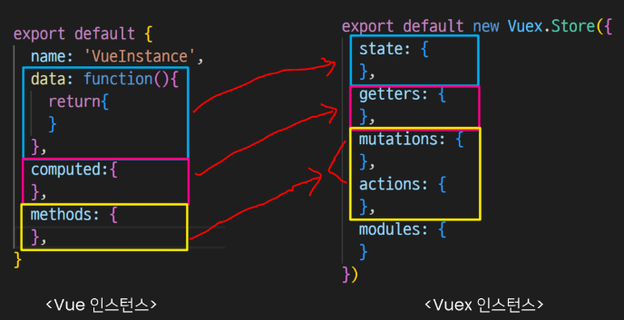

# State Management

> 상태 관리

* 상태(state)란?
  
  * 현재에 대한 정보(data)

* **State Management**
  
  * 그럼 Web Application에서의 상태는 어떻게 표현할 수 있을까?
    
    * **<mark>현재 App이 가지고 있는 Data로 표현할 수 있음!</mark>**

* **각 component는 독립적이기 때문에 각각의 상태(data)를 가짐**

* 하지만 결국 이러한 component들이 모여서 하나의 App을 구성할 예정
  
  * **<mark>즉, 여러 개의 component가 같은 상태(data)를 유지할 필요가 있음</mark>**
    
    * **상태 관리(State Management) 필요❗**

## ▶ Pass Props & Emit Event

> 지금까지는 props와 event를 이용해서 상태 관리를 진행했음


* 각 컴포넌트는 독립적으로 데이터를 관리

* **<mark>같은 데이터를 공유하고 있으므로,</mark> 각 컴포넌트가 동일한 상태를 유지하고 있음**

* 데이터의 흐름을 직관적으로 파악 가능

* *그러나 component의 중첩이 깊어지면 데이터 전달이 쉽지 않음*
  
  * *공통의 상태를 유지해야 하는 component가 많아지면 데이터 전달 구조가 복잡해짐*
  
  * 어떻게 하면 쉽게 해결할 수 있을까❓

## ▶ Centralized Store

> **<mark>중앙 저장소(store)에 데이터를 모아서 상태 관리</mark>**


* 각 component는 중앙 저장소의 데이터를 사용

* **<mark>component의 계층에 상관없이</mark> 중앙 저장소에 접근해서 데이터를 얻거나 변경 가능❗**

* 중앙 저장소의 데이터가 변경되면 각각의 component는 해당 데이터의 변화에 반응하여 새로 변경된 데이터를 반영함

* **규모가 크거나 컴포넌트 중첩이 깊은 프로젝트의 관리가 매우 편리**

## ▶ Vuex

> **state management pattern + Library (상태 관리 패턴+라이브러리)**

* 중앙 저장소를 통해 상태 관리를 할 수 있도록 하는 라이브러리

* **데이터가 예측 가능한 방식으로만 변경될 수 있도록 하는 <mark>규칙을 설정하며, Vue의 반응성을 효율적으로 사용하는 상태 관리 기능</mark>을 제공**

# Vuex 시작하기

## ▶ 프로젝트 with vuex

**`vue create vuex-app`** = Vue 프로젝트 생성

**`cd vuex-app`** = 디렉토리 이동

**`vue add vuex`** = Vue CLI를 통해 vuex plugin 적용

* `src / store / index.js` 가 생성됨

* **vuex의 핵심 컨셉 4가지**❗
  
  1️⃣ **state**
  
  2️⃣ **getters**
  
  3️⃣ **mutations**
  
  4️⃣ **actions**

```javascript
// index.js
import Vue from 'vue'
import Vuex from 'vuex'

Vue.use(Vuex)

export default new Vuex.Store({
  state: {
  },
  getters: {
  },
  mutations: {
  },
  actions: {
  },
  modules: {
  }
})
```

## ▶ Vue 와 Vuex 인스턴스 비교



## ▶ 1️⃣ state

> **vue 인스턴스의 data에 해당** (readonly)

* **<mark>중앙에서 관리하는 모든 상태 정보</mark>**

* 개별 component는 state에서 데이터를 가져와서 사용
  
  * 개별 component가 관리하던 data를 중앙 저장소(Vuex Store의 state)에서 관리

* state의 데이터가 변화하면 해당 데이터를 사용(공유)하는 component도 자동으로 다시 렌더링

* **<mark>`$store.state`로 state 데이터에 접근</mark>**

## ▶ 2️⃣ Mutations

> **<mark>실제로 state를 변경하는 유일한 방법❗</mark>**

* **vue 인스턴스의 methods에 해당하지만 Mutations에서 호출되는 핸들러 함수는 <mark>반드시 동기적</mark>이어야 함**❗
  
  * *비동기 로직으로 mutations를 사용해서 state를 변경하는 경우, state의 변화의 시기를 특정할 수 없기 때문*
  
  * mutation, action에서 호출되는 함수를 handler 함수라고 함

* **<mark>첫 번째 인자로 state를</mark> 받으며, component 혹은 Actions에서 `commit()` 메서드로 호출됨❗**

## ▶ 3️⃣ Actions

* **mutations와 비슷하지만 <mark>비동기 작업을 포함</mark>할 수 있다는 차이가 있음**
  
  * **mutations가 하지 못하는 작업 모두를 Actions가 담당**❗

* **<mark>state를 직접 변경하지 않고 commit() 메서드로 mutations를 호출해서 state를 변경❗</mark>**

* **`context`** 객체를 인자로 받으며, 이 객체를 통해 store.js의 모든 요소와 메서드에 접근할 수 있음 **(== 즉, <mark>state를 직접 변경할 수 있지만 하지 않아야 함</mark>❗)**

* **component에서 `dispatch()` 메서드에 의해 호출됨❗**

## ▶ Mutations & Actions


* `Mutations` = state를 변경

* `Actions` = state 변경을 제외한 나머지 로직을 담당

## ▶ 4️⃣ Getters

> Vue 인스턴스의 computed에 해당

* **<mark>state를 활용하여 계산된 값을 얻고자 할 때 사용❗</mark>**
  
  * state의 원본데이터를 건들지 않고 계산된 값을 얻을 수 있음

* computed와 마찬가지로 **getters의 결과는 캐시되며, <mark>종속된 값이 변경된 경우에만 재계산됨</mark>**

* **getters에서 계산된 값은 state에 영향을 미치지 않음**

* **<mark>첫 번째 인자로 `state`</mark>, 두 번째 인자로 `getter`를 받음❗**

## ▶ 모든 데이터를 Vuex에서 관리해야 하나❓

> **3단계 이상 데이터를 이동시켜야 하는 경우에는 적극 권장**

* 모든 데이터를 state에 넣어야 하는 것은 아님

* **Vuex에서도 여전히 pass props, emit event를 사용하여 상태를 관리할 수 있음**

## ▶ 정리

* **state = 중앙에서 관리하는 <mark>모든 상태 정보</mark>** = data

* **mutations = <mark>state를 변경하기 위한 methods</mark>**

* **actions**
  
  * **<mark>비동기 작업이 포함할 수 있는(외부 API와의 소통 등) methods</mark>**
  
  * state를 변경하는 것 외의 모든 로직 진행

* **getters = <mark>state를 활용해 계산한 새로운 변수 값</mark>**

* component에서 데이터를 **조작하기 위한 데이터의 흐름**
  
  * **`component => (actions) => mutations => state`**

* component에서 데이터를 **사용하기 위한 데이터의 흐름**
  
  * **`state => (getters) => component`**

# Vuex 실습

## ▶ Object method shorthand

> 이제부터는 객체 메서드 축약형을 사용

```javascript
const obj1 = {
  addValue: function (value) {
    return value
  }
}

// 축약형 
const obj2 = {
  addValue(value) {
    return value  
  }
}
```

## ▶ state

* 중앙에서 관리하는 모든 상태 정보

* **`$store.state`로 접근 가능**

* store의 state에 message 데이터 정의

```javascript
export default new Vuex.Store({
  state: {
    message: 'message in store'
  }
})
```

* **$store.state**로 바로 접근하기 보다 **`computed`에 정의 후 접근하는 것을 권장**

```javascript
<template>
  <div id="app">
    <h1>{{ message }}</h1>
  </div>
</template>

<script>
export default {
  name: 'App',
  computed: {
    // 축약형 형태
    message() {
      return this.$store.state.message
    }
  },
```

## ▶ actions

* state를 변경할 수 있는 **<mark>mutations 호출</mark>**

* component에서 **<mark>`dispatch()`에 의해 호출됨</mark>**

* **`dispatch(A, B)`**
  
  * **A = 호출하고자 하는 actions 함수**
  
  * **B = 넘겨주는 데이터(payload) = 저장하고자 하는 data**
  
  ```html
  <template>
    <div id="app">
      <h1>{{ message }}</h1>
      <h2>입력된 문자의 길이는 {{ messageLength }}</h2>
      <input 
        type="text"
        @keyup.enter="changeMessage"
        v-model="inputData"
      >
    </div>
  </template>
  ```

* actions에 정의된 changeMessage 함수에 데이터 전달하기

* component에서 actions는 **`dispatch()`에 의해 호출됨**

```javascript
<script>
export default {
  name: 'App',

  data() {
    return {
      inputData: null,
    }
  },

  methods: {
    changeMessage() {
      const newMessage = this.inputData
      this.$store.dispatch('changeMessage', newMessage)
    }
  }
}
</script>
```

* **actions의 <mark>첫 번째 인자는 context</mark>**
  
  * context는 store의 전반적인 속성을 모두 가지고 있어 `context.state`와 `context.getters`를 통해 mutations를 호출하는 것이 모두 가능
  
  * dispatch()를 사용해 다른 actions도 호출할 수 있음
    
    * *단, actions에서 state를 직접 조작하는 것은 삼가야 함*

* **actions의 <mark>두 번째 인자는 payload</mark>** = 넘겨준 데이터를 받아서 사용

```javascript
export default new Vuex.Store({
  state: {
    message: 'message in store',
  },

  actions: {
    changeMessage(context, newMessage) {
      // console.log(context)
      // console.log(newMessage)
      context.commit('CHANGE_MESSAGE', newMessage)
    }
  },
})
```

## ▶ mutations

> actions에서 commit()를 통해 mutations 호출하기

* state를 변경하는 유일한 방법

* **<mark>component 또는 actions에서 commit()에 의해 호출됨</mark>**

* **`commit(A, B)`**
  
  * A = 호출하고자 하는 mutations 함수
  
  * B = payload(전달된 데이터)

```javascript
export default new Vuex.Store({
  state: {
    message: 'message in store',
  },
  mutations: {
    CHANGE_MESSAGE(state, newMessage) {
      // console.log(state)
      // console.log(newMessage)
      state.message = newMessage
    }
  },
})
```

## ▶ getters

* **<mark>getters는 state를 활용한 새로운 변수</mark>**

* getters 함수의
  
  * **첫 번째 인자는 `state`**
  
  * **두 번째 (선택)인자는 `getters`**

```javascript
export default new Vuex.Store({
  state: {
    message: 'message in store',
  },
  getters: {
    messageLength(state) {
      return state.message.length
    }
  },
})
```

* getters 역시 state와 마찬가지로 **computed에 정의해서 사용하는 것을 권장**

# Lifecycle Hooks

> 각 Vue 인스턴스는 생성과 소멸의 과정 중 단계별 초기화 과정을 거침

* **Vue 인스턴스가 생성된 경우, 인스턴스를 DOM에 마운트하는 경우, 데이터가 변경되어 DOM을 업데이트하는 경우 등**

* Lifecycle Hooks = **<mark>각 단계가 트리거가 되어 특정 로직을 실행할 수 있음</mark>**


## ▶ created()

> **Vue instance가 생성된 후 호출됨**

* **data, computed 등의 설정이 완료된 상태**

* **서버에서 받은 데이터를 vue instance의 data에 할당하는 로직을 구현하기 적합**
  
  * 서버의 값을 받아서 초기화 시키고 싶을 때 사용
  
  * *단, mount되지 않아 요소에 접근할 수 없음 = DOM(HTML)과 연결되지 않았기 때문*

* 버튼을 누르지 않아도 첫 실행 시 기본 사진이 출력되록 하고 싶다면❓
  
  * 해결방법 = **created 함수에 강아지 사진을 가져오는 함수를 추가**

```javascript
export default {
  ...
  created() {
    this.getDogImage()  
  }
},
```

## ▶ mounted()

> **Vue instance가 요소에 mount된 후 호출됨**

* **mount된 요소를 조작할 수 있음 = HTML에 대한 조작 가능❗**

```javascript
export default {
  ...
  mounted() {
    const btn = document.querySelector('button')
    btn.innerText = '멍멍'  
  },
}
```

* *created의 경우, mount 되기 전이기 때문에 DOM에 접근할 수 없으므로 동작하지 않음❗*

```javascript
export default {
  ...
  created() {
    this.getDogImage()
    const btn = document.querySelector('button')
    btn.innerText = '멍멍!'  // 바뀌지 않음! 
  },
}
```

## ▶ updated

* **데이터가 변경되어 DOM에 변화를 줄 때 호출됨**❗
  * (주의) 무한 루프에 빠질 위험이 있음

```javascript
export default {
  ...
  updated() {
    console.log('새로운 멍멍!')  
  },
}
```

## ▶ Lifecycle Hooks 특징

* **instance 마다 각각의 Lifecycle을 가지고 있음**

```javascript
// App.vue
export default {
  ...
  created() {
    console.log('App created!')
  },
  mounted() {
    console.log('App mounted!')
  },
}
```

```javascript
// DogComponent.vue
export default {
  ...,
  created() {
    this.getDogImage()
    console.log('Child created!')
  },
  mounted() {
    const btn = document.querySelector('button')
    btn.innerText = '멍멍!'
    console.log('Child mounted!')
  },
  updated() {
    console.log('새로운 멍멍!')
    console.log('Child updated!')
  },
}
```

* **LifeCycle Hooks는 컴포넌트별로 정의할 수 있음**

* 현재 해당 프로젝트는
  
  **App.vue 생성 => ChildComponent 생성 => ChildComponent 부착 => App.vue 부착 => ChildComponent 업데이트 순으로 동작한 것**

* 부모 컴포넌트의 mounted hook이 실행되었다고 해서 자식이 mounted 된 것이 아니고, 부모 컴포넌트가 updated hook이 실행되었다고 해서 자식이 updated 된 것이 아님❗
  
  * <mark>**부착 여부가 부모-자식 관계에 따라 순서를 가지고 있지 않은 것**❗</mark>

* **<mark>instance마다 각각의 Lifecycle을 가지고 있기 때문</mark>**

# Todo with Vuex

> Vuex를 사용한 Todo 프로젝트 만들기

* **구현 기능**
  
  * Todo CRUD
  
  * Todo 개수 계산
    
    * 전체 Todo
    
    * 완료된 Todo
    
    * 미완료된 Todo

* **컴포넌트 구성**


* 완성 화면


# 사전 준비

## ▶ Init Project

1️⃣ 프로젝트 생성 및 vuex 플러그인 추가

`vue create todo-vuex-app`

`cd todo-vuex-app`

`vue add vuex`

2️⃣ HelloWorld 컴포넌트 및 관련 코드 삭제

* App.vue 의 CSS 코드는 남김

## ▶ 컴포넌트 작성

* TodoListItem.vue

```javascript
<template>
  <div>Todo</div>
</template>

<script>
export default {
  name: 'TodoListItem',
}
</script>
```

* TodoList.vue

```javascript
<template>
  <div>Todo</div>
</template>

<script>
import TodoListItem from '@/components/TodoListItem'

export default {
  name: 'TodoList',
  components: {
    TodoListItem,
  }
}
</script>
```

* TodoForm.vue

```javascript
<template>
  <div>Todo Form</div>
</template>

<script>
export default {
  name: 'TodoForm',
}
</script>
```

* App.vue

```javascript
<template>
  <div id="app">
    <h1>Todo List</h1>
    <TodoList/>
    <TodoForm/>
  </div>
</template>

<script>
import TodoList from '@/components/TodoList'
import TodoForm from '@/components/TodoForm'

export default {
  name: 'App',
  components: {
    TodoList,
    TodoForm,
  }
}
</script>
```

# Read Todo

## ▶ state 세팅

* **출력을 위한 기본 todo 작성**

```javascript
// index.js
import Vue from 'vue'
import Vuex from 'vuex'

Vue.use(Vuex)

export default new Vuex.Store({
  state: {
    todos: [
      {
        title: '할 일 1',
        isCompleted: false,
      }
    ]  
  },
})
```

## ▶ state 데이터 가져오기

* 컴포넌트에서 Vuex Store의 state에 접근(`$store.state`)

* **computed로 계산된 todo 목록을 가져올 수 있도록 설정**

```javascript
// components/TodoList.vue
<template>
  <div>
    <TodoListItem
    v-for="(todo, index) in todos"
    :key="index"
    >
  </div>
</template>

<script>
import TodoListItem from '@/components/TodoListItem'

export default {
  name: 'TodoList',
  components: {
    TodoListItem,
  },
  computed: {
    todos() {
      return this.$store.state.todos
    }  
  },
}
</script>
```

* **`v-for`의 <mark>key는 배열의 각 요소 간의 유일한 식별자 값(예. 생성일자 등)을 사용</mark>해야 하지만 vuex 흐름에 집중하기 위해 index를 key로 사용하도록 함❗**

## ▶ pass props

* TodoList.vue => TodoListItem.vue

```html
<!-- components/TodoList.vue -->
<template>
  <div>
    <TodoListItem
      v-for="(todo, index) in todos"
      :key="index"
      :todo="todo"
    />
  </div>
</template>
```

* **부모에게 받은 todo 데이터 내려받기**

```javascript
// components/TodoListItem.vue
<template>
  <div>{{ todo.title }}</div>
</template>

<script>
export default {
  name: 'TodoListItem',
  props: {
    todo: Object,
  },
}
</script>
```

# Create Todo

## ▶ TodoForm

* todoTitle을 입력 받을 input 태그 생성

* **todoTitle을 저장하기 위해 data를 정의하고 input과 v-model을 이용해 양방향 바인딩**

* enter 이벤트를 사용해 createTodo 메서드 출력 확인

```javascript
// components/TodoForm.vue
<template>
  <div>
    <input
      type="text"
      v-model="todoTitle"
      @keyup.enter="createTodo"
    >
  </div>
</template>

<script>
export default {
  name: 'TodoForm',
  data() {
    return {
      todoTitle: null,
    }  
  },
  methods: {
    createTodo() {
      console.log(this.todoTitle)
    }  
  },
}
</script>
```

## ▶ Actions

* **createTodo 메서드에서 actions을 호출(`dispatch`)**

* todoTitle까지 함께 전달하기

```javascript
// components/TodoForm.vue
<script>
export default {
  name: 'TodoForm',
  data() {
    return {
      todoTitle: null,
    }  
  },
  methods: {
    createTodo() {
      // console.log(this.todoTitle)
      // 문자가 입력되었을 때만 action 호출!
      if (this.todoTitle) {
        // action 호출
        this.$store.dispatch('createTodo', this.todoTitle)
      }
      // 입력한 다음 초기화
      this.todoTitle = null
    }
  },
}
</script>
```

* **actions에는 보통 비동기 관련 작업이 진행되지만 현재 별도의 비동기 관련 작업이 불필요하기 때문에 입력 받은 todo 제목(todoTitle)을 todo 객체(todoItem)로 만드는 과정을 Actions에서 작성할 예정**

* createTodo에서 보낸 데이터를 수신 후 todoItem object를 생성

```javascript
// index.js
export default new Vuex.Store({
  ...
  actions: {
    createTodo(context, todoTitle) {
      const todoItem = {
        title: todoTitle,
        isCompleted: false,
      }
      console.log(todoItem)
    }
  },
})
```

## ▶ Mutations

* **CREATE_TODO mutations 메서드에 todoItem을 전달하며 호출(`commit`)**

* mutations에서 state의 todos에 접근해 배열에 요소를 추가

* Todos의 기존 dummy 데이터를 삭제
  
  * 빈 배열로 수정

```javascript
// index.js
export default new Vuex.Store({
  state: {
    todos: [],
  },
  actions: {
    createTodo(context, todoTitle) {
      const todoItem = {
        title: todoTitle,
        isCompleted: false,
      }
      // console.log(todoItem)
      context.commit('CREATE_TODO', todoItem)
    }
  },
  mutations: {
    CREATE_TODO(state, todoItem) {
      state.todos.push(todoItem)
    }
  },
  modules: { 
  }
})
```

## ▶ 공백 문자가 입력되지 않도록 처리

* **`v-model.trim` & `if (this.todoTitle)`**
  
  * 좌우 공백 삭제
  
  * 빈 문자열이 아닐 경우만 작성

```html
<!-- components/TodoForm.vue -->
<template>
  <div>
    <input
      type="text"
      v-model.trim="todoTitle"
      @keyup.enter="createTodo"
    >
  </div>
</template>
```

```javascript
<script>
export default {
  ...
  methods: {
    createTodo() {
      // console.log(this.todoTitle)
      if (this.todoTitle) {
        this.$store.dispatch('createTodo', this.todoTitle)
      }
      this.todoTitle = null
    }
  }
}
```

## ▶ 중간 정리

* Vue 컴포넌트의 method에서 **`dispatch()`를 사용해 actions 메서드를 호출**

* Actions에 정의된 함수는 **`commit()`을 사용해 mutations를 호출**

* Mutations에 정의된 함수가 최종적으로 state를 변경

# Delete Todo

> 개별 요소에 delete 버튼이 있어야 하므로 TodoListItem.vue 에서 작성해야 함

* TodoListItem 컴포넌트에 삭제 버튼 및 deleteTodo 메서드 작성

```javascript
<template>
  <div>{{ todo.title }}
    <button @click="deleteTodo">Delete</button>
  </div>
</template>

<script>
export default {
  name: 'TodoListItem',
  props: {
    todo: Object,
  },
  methods: {
    deleteTodo() {
      this.$store.dispatch('deleteTodo', this.todo)
    }
  },
}
</script>
```

## ▶ Actions

* deleteTodo 메서드에서 deleteTodo actions 메서드 호출 (`dispatch`)

* 삭제되는 todo를 함께 전달

```javascript
// components/TodoListItem.vue
<script>
export default {
  name: 'TodoListItem',
  props: {
    todo: Object,
  },

  methods: {
    deleteTodo() {
      // console.log('Todo 삭제')
      this.$store.dispatch('deleteTodo', this.todo)
    },
  },
}
</script>
```

## ▶ Mutations

* DELETE_TODO 메서드 작성

* 전달된 todoItem에 해당하는 todo 삭제

```javascript
// index.js
export default new Vuex.Store({
  ...
  mutations: {
    CREATE_TODO(state, todoItem) {
      state.todos.push(todoItem)
    },
    DELETE_TODO(state, todoItem) {
      // console.log(todoItem)
      const index = state.todos.indexOf(todoItem)
      state.todos.splice(index, 1)
    },
  },
})
```

# Update Todo

> is_completed 변수값을 toggle 하는 것을 의미

* **todo를 클릭하면 완료 표시의 의미로 취소선 스타일을 적용하는 기능 구현**
  
  * 즉, todo의 isCompleted 값을 토글하기

* TodoListItem 컴포넌트에 클릭 이벤트를 추가 후 관련 actions 메서드 호출

```javascript
// components/TodoListItem.vue
<template>
  <div>
    <span @click="updateTodoStatus">{{ todo.title }}</span>
    <button @click="deleteTodo">Delete</button>
  </div>
</template>

<script>
export default {
  name: 'TodoListItem',
  props: {
    todo: Object,
  },
  methods: {
    ...
    updateTodoStatus() {
      this.$store.dispatch('updateTodoStatus', this.todo)
    },
  },
}
```

## ▶ Actions

* **updateTodoStatus 메서드 작성**

* 관련 mutations 메서드 호출

```javascript
// index.js
export default new Vuex.Store({
  ...
  actions: {
    ...
    updateTodoStatus(context, todoItem) {
      context.commit('UPDATE_TODO_STATUS', todoItem)
    },
  },
})
```

## ▶ Mutations

* UPDATE_TODO_STATUS 메서드 작성

* **map 메서드를 활용해 선택된 todo의 isCompleted를 반대로 변경 후 기존 배열 업데이트**

```javascript
// index.js
export default new Vuex.Store({
  ...
  mutations: {
    ...
    UPDATE_TODO_STATUS(state, todoItem) {
      // console.log(todoItem)
      state.todos = state.todos.map((todo) => {
        if (todo === todoItem) {
          todo.isCompleted = !todo.isCompleted
        }
        return todo
      })
    },
  },
})
```

* 취소선 스타일링 = CSS 작성

```css
<style>
  .is-completed {
    text-decoration: line-through;
}
</style>
```

* **v-bind 를 활용해 isCompleted 값에 따라 CSS 클래스가 토글 방식으로 적용되도록 작성**

```html
<!-- components/TodoListItem.vue -->
<template>
  <div>
    <span
      @click="updateTodoStatus"
      :class="{ 'is-completed' : todo.isCompleted }"
    >
      {{ todo.title }}
    </span>
    <button @click="deleteTodo">Delete</button>
  </div>
</template>
```

# 상태별 todo 개수 계산

> getters 사용

## ▶ 전체 todo의 개수

* allTodosCount getters 작성

* **state에 있는 todos 배열의 길이 계산**

```javascript
// index.js
export default new Vuex.Store({
  state: {
    todos: [],
  },
  getters: {
    allTodosCount(state) {
      return state.todos.length
    },
  },
})
```

* getters에 계산된 값을 각 컴포넌트의 computed에서 사용하기

```javascript
// App.vue
<template>
  <div id="app">
    <h1>Todo List</h1>
    <h2>All Todos: {{ allTodosCount }}</h2>
    <TodoList/>
    <TodoForm/>
  </div>
</template>

<script>
export default {
  ...
  computed: {
    appTodosCount() {
      return this.$store.getters.allTodosCount
    },
  }
}
</script>
```

## ▶ 완료된 todo의 개수

* completedTodosCount getters 작성

* **isCompleted가 true인 todo들만 필터링한 배열을 만들고 길이 계산**

* **`filter`를 활용하여 완료 여부에 따른 새로운 객체 목록을 작성 후 길이 반환**

```javascript
// index.js
export default new Vuex.Store({
  ...
  getters: {
    allTodosCount(state) {
      return state.todos.length
    },
    completedTodosCount(state) {
      const completedTodos = state.todos.filter((todo) => {
        return todo.isCompleted == true
      })
      return completedTodos.length
    },
  },
})
```

* getters에 계산된 값을 각 컴포넌트의 computed에서 사용

```html
<template>
  <div id="app">
    <h1>Todo List</h1>
    <h2>All Todos: {{ allTodosCount }}</h2>
    <h2>Completed Todo: {{ completedTodosCount }}</h2>
    <TodoList/>
    <TodoForm/>
  </div>
</template>
```

```javascript
<script>
export default {
  ...
  computed: {
    completedTodosCount() {
      return this.$store.getters.completedTodosCount
    },
  },
}
```

## ▶ 미완료된 todo 개수

* 미완료된 todo 개수 === 전체 개수 - 완료된 개수

* getters 가 두 번째 인자로 getters를 받는 것으로 활용!

* unCompletedTodosCount getters 작성

```javascript
// index.js
export default new Vuex.Store({
  state: {
    todos: [],
  },
  getters: {
    ...
    unCompletedTodosCount(state, getters) {
      return getters.allTodosCount - getters.completedTodosCount
    },
  },
})
```

* getters에 계산된 값을 각 컴포넌트의 computed에서 사용하기

```javascript
// App.vue
<template>
  <div id="app">
    ...
    <h2>unCompleted Tod: {{ unCompletedTodosCount }}</h2>
    <TodoList/>
    <TodoForm/>
  </div>
</template>

<script>
export default {
  ...
  computed: {
    ...
    unCompletedTodosCount() {
      return this.$store.getters.unCompletedTodosCount
    },
  },
}
</script>
```

# Local Storage

> 브라우저의 **Local Storage**에 todo 데이터를 저장하여 브라우저를 종료하고 다시 실행해도 데이터가 보존될 수 있도록 하기

## ▶ window.localStorage

* 브라우저에서 제공하는 저장공간 중 하나인 Local Storage에 관련된 속성

* 만료되지 않고 브라우저를 종료하고 다시 실행해도 데이터가 보존됨

* 데이터가 문자열 형태로 저장됨

* 관련 메서드
  
  * `setItem(key, value)` = key, value 형태로 데이터 저장
  
  * `getItem(key)` = key에 해당하는 데이터 조회

## ▶ Local Storage 실습

> todos 배열을 Local Storage에 저장하기

* **데이터가 문자열 형태로 저장되어야 하기 때문에 `JSON.stringify`를 사용해 문자열로 변환해주는 과정 필요**

* state를 변경하는 작업이 아니기 때문에 mutations가 아닌 actions에 작성

```javascript

```

* todo 생성, 삭제, 수정 시에 모두 `saveTodosLocalStorage` action 메서드가 실행되도록 함

```javascript

```

d

d

d

d

d

## ▶ Vuex-persistedstate

> Vuex state를 자동으로 브라우저의 Local Storage에 저장해주는 라이브러리 중 하나

* 페이지가 새로고침 되어도 Vuex state를 유지시킴

* Local Storage에 저장된 data를 자동으로 state로 불러옴

* `npm i vuex-persistedstate` = 설치

```javascript
// index.js
import createPersistedState from 'vuex-persistedstate'

Vue.use(Vuex)

export default new Vuex.Store({
  plugins: [
    createPersistedState(),  
  ],
  ...
})
```

* 이전에 작성한 localStorage 관련 코드를 모두 주석 처리하기
  
  * App.vue
    
    * 불러오기 버튼
    
    * loadTodos 메서드
  
  * index.js
    
    * LOAD_TODOS mutation 메서드
    
    * saveTodosToLocalStorage action 메서드
    
    * loadTodos action 메서드
    
    * context.dispatch('saveTodosLocalStorage') 코드 3줄

* 이제는 불러오기 버튼없이 자동으로 데이터를 불러올 수 있음

# 마무리

## ▶ mutations로만 state를 변경하면 안될까?

* 가능하다.

* 단, 저장소의 각 컨셉(state, getters, mutations, actions)은 각자의 역할이 존재하도록 설계되어 있음

* 물론 우리가 작성한 todo app처럼 actions의 로직이 특별한 작업없이 단순히 mutations만을 호출하는 경우도 있으나, 이 경우는 Vuex 도입의 적절성을 판단해 볼 필요가 있음

## ▶ Vuex, 그럼 언제 사용해야 하나?

* Vuex는 공유된 상태 관리를 처리하는 데 유용하지만, 개념에 대한 이해와 시작하는 비용이 큼

* 애플리케이션이 단순하다면 Vuex가 없는 것이 더 효율적일 수 있음

* 그러나 중대형 규모의 SPA를 구축하는 경우 Vuex는 자연스럽게 선택할 수 있는 단계가 오게 됨

* 결과적으로 역할에 적절한 상황에서 활용했을 때 Vuex 라이브러리 효용을 극대화할 수 있음
  
  * 필요한 순간이 왔을 때 사용하는 것을 권장
