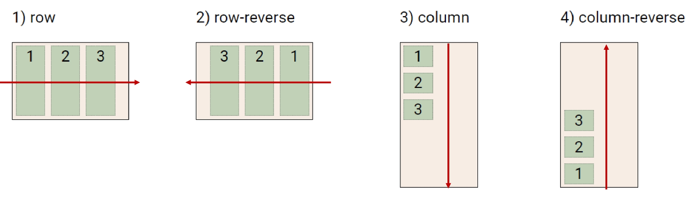
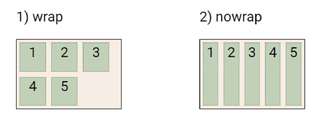
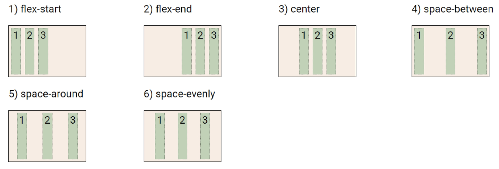
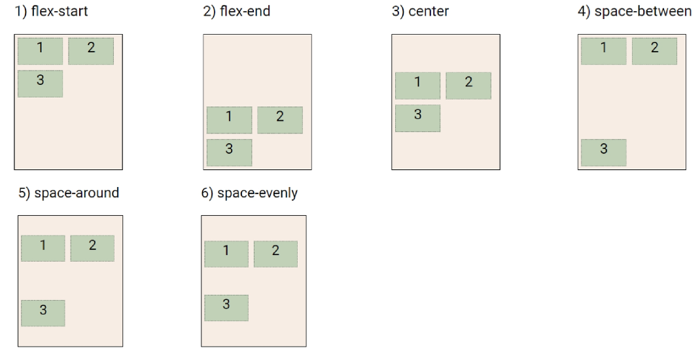
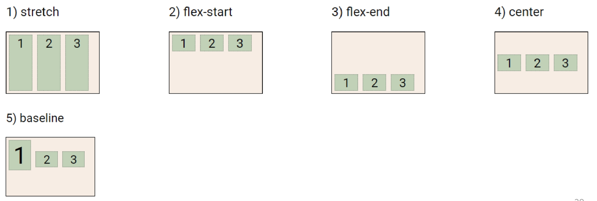
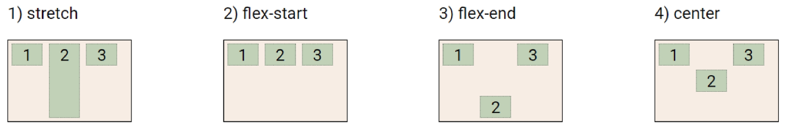

# ✅ CSS layout

>  **Display, Position, Float, Flexbox, Grid, Responsive Web Design, Media Queries 등**

## ▶ Float

* **CSS 원칙**
  
  * Normal Flow - Inline(왼쪽에서 오른쪽으로, 글자) + block(위에서부터 아래로, 박스)

* 정의
  
  * 박스를 왼쪽/오른쪽으로 이동시켜 **텍스트를 포함 인라인 요소들이 주변을 wrapping 함**
  
  * **요소가 Normal flow를 벗어나도록 해준다.**

* 속성
  
  * none - 기본값
  
  * **left - 요소를 왼쪽으로 띄움**
  
  * **right - 요소를 오른쪽으로 띄움**

* 활용 사례
  
  * NAVER - 상위 메뉴 네비게이터

## ▶ Flexbox

* 행과 열 형태로 아이템들을 배치하는 1차원 레이아이웃 모델

* **축**
  
  * **main axis (메인 축) - 예) 꼬지**
  
  * **cross axis (교차 축) - 예) 먹는 방향**

* **구성 요소**
  
  * **Flex Container (부모 요소) - 부모 요소에 Flex를 적용시켜야 item에 적용된다.**
  
  * **Flex Item (자식 요소)**

* 속성
  
  * **배치 설정 - flex-direction, flex-wrap**
  
  * **공간 나누기 - justify-content (main axis), align-content (cross axis)**
  
  * **정렬 - align-items(모든 아이템을 cross axis 기준으로), align-self(개별 아이템)**

**✔ flex-direction**

* **main axis 기준 방향 설정**

* 역방향의 경우 HTML 태그 선언 순서와 시각적으로 다르다.
  
  * row / row-reverse / column
    
    

**✔ flex-wrap**

* 아이템이 컨테이너를 벗어나는 경우 해당 영역 내에 배치되도록 설정
  
  * **nowrap(기본값) - 한 줄에 모두 배치**
  
  * wrap - 넘치면 그 다음 줄로 배치
    
    

**✔ justify-content**

* **main axis를 기준으로 공간 배분**
  
  * flex-start / flex-end / center / **space-between / space-around / space-evenly**
    
    

**✔ align-content**

* **cross axis를 기준으로 공간 배분** - 아이템이 한 줄로 배치되는 경우 확인 불가
  
  * flex-start / flex-end / center / **space-between / space-around / space-evenly**
    
    

**✔ align-items**

* **모든 아이템을 cross axis 기준으로 정렬**
  
  * **stretch** / flex-start / flex-end / center / **baseline**
    
    

**✔ align-self**

* 개별 아이템을 cross axis 기준으로 정렬
  
  * **stretch** / flex-start / flex-end / center
    
    

# ✅ Bootstrap

## ▶ CDN 사용법

> CSS, JS, Image, Text 등을 효율적으로 전달하기 위해 여러 노드에 가진 네트워크에 데이터를 제공하는 시스템

* 외부 서버를 활용함으로써 본인 서버의 부하가 적어짐

```html
<link href="https://cdn.jsdelivr.net/npm/bootstrap@5.2.0/dist/css/bootstrap.min.css" rel="stylesheet" integrity="sha384-gH2yIJqKdNHPEq0n4Mqa/HGKIhSkIHeL5AyhkYV8i59U5AR6csBvApHHNl/vI1Bx" crossorigin="anonymous">
<script src="https://cdn.jsdelivr.net/npm/bootstrap@5.2.0/dist/js/bootstrap.bundle.min.js" integrity="sha384-A3rJD856KowSb7dwlZdYEkO39Gagi7vIsF0jrRAoQmDKKtQBHUuLZ9AsSv4jD4Xa" crossorigin="anonymous"></script>
```

* **`link` 태그 는 title 태그 위에 복사! `script` 태그는 닫는 `body` 태그 위에 복사!**

* CDN 을 연결해주기만 해도 bootstrap의 기능을 사용할 수 있다.

## ▶ Spacing (margin & padding)

* 사용법
  
  **`{property}{sides}-{size}`**
  
  | property | 의미      |
  |:--------:|:-------:|
  | `m`      | margin  |
  | `p`      | padding |
  
  | sides | 의미           |
  |:-----:|:------------:|
  | `t`   | top          |
  | `b`   | bottom       |
  | `s`   | start = left |
  | `e`   | end = right  |
  | `x`   | left & right |
  | `y`   | top & bottom |
  
  | size   | 의미       | px   |
  |:------:|:--------:|:----:|
  | `0`    | 0        | 0    |
  | `1`    | rem 0.25 | 4px  |
  | `2`    | rem 0.5  | 8px  |
  | `3`    | rem 1    | 16px |
  | `4`    | rem 1.5  | 24px |
  | `5`    | rem 3    | 48px |
  | `auto` | auto     | auto |

* 예시
  
  * `.mx-auto` - 수평 중앙 정렬 (가로 가운데 정렬!)
  
  * `.py-0` - 위 아래 padding 0

### ✔ Responsive Web Design

* 다양한 화면 크기를 가진 디바이스들로 인해 responsive web design 개념이 등장

* 별도의 기술 이름이 아닌 웹 디자인에 대한 접근 방식

* 예시 - Media Queries, Flexbox, Bootstrap Grid System 등

## ▶ Grid system (web design)

* 요소들의 디자인과 배치에 도움을 주는 시스템

* 기본 요소
  
  * column - 실제 컨텐츠를 포함하는 부분
  
  * gutter - 칼럼과 칼럼 사이의 공간 (사이 간격)
  
  * container - column 들을 담고 있는 공간

* **Bootstrap 은 flexbox로 제작됨!**
  
  * **12개의 column**
  
  * **6개의 grid breakpoints**
    
    |                       | xs < 576px | sm >= 576px | md >= 768px | lg >= 992px | xl >= 1200px | xxl >= 1400px |
    |:---------------------:|:----------:|:-----------:|:-----------:|:-----------:|:------------:|:-------------:|
    | container (max-width) | None       | 540px       | 720px       | 960px       | 1140px       | 1320px        |
    | class prefix          | .col-      | .col-sm-    | .col-md-    | .col-lg-    | .col-xl-     | .col-xxl-     |
    | # of columns          | 12         |             |             |             |              |               |
